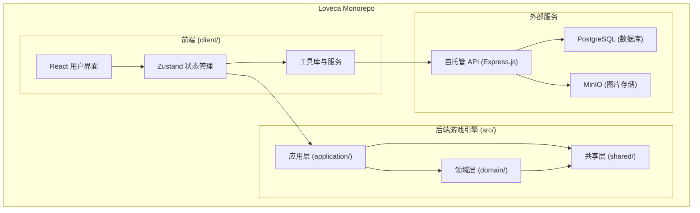
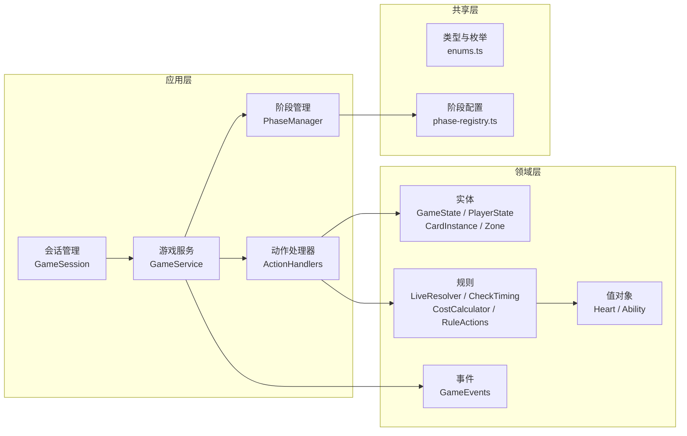
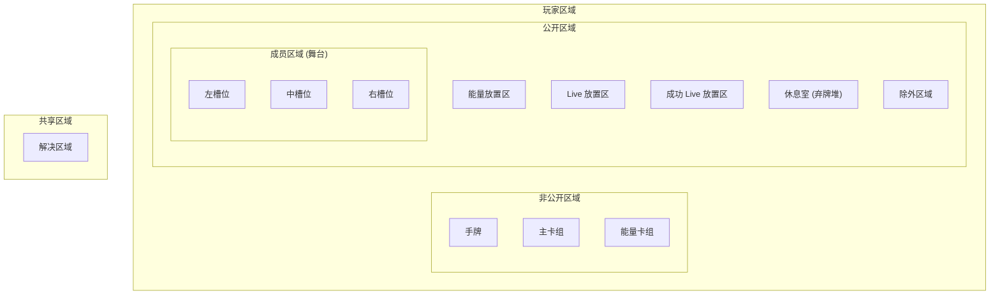
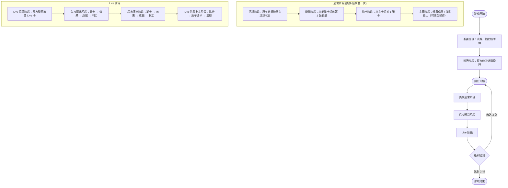
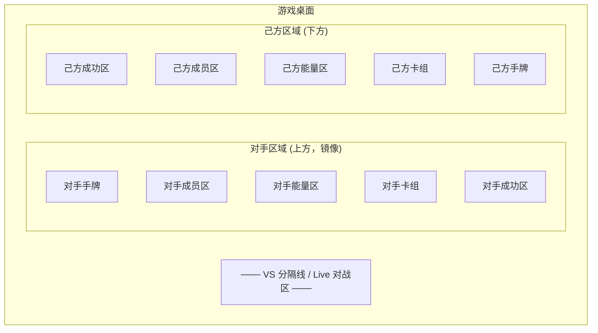

# Loveca 项目总体需求文档

> 本文档描述 Loveca 项目的整体需求与业务逻辑，基于 [detail_rules.md](../detail_rules.md)（综合规则 ver. 1.03）和现有代码提炼而成。

---

## 1. 项目概述

Loveca 是 **Love Live! series official card game** 的数字化实现，是一款 **2 人对战** 的偶像 Live 表演竞技卡牌游戏。玩家各自组建卡组，通过部署成员卡、管理能量资源、发动能力，最终在 Live 表演中获胜。

**核心胜利条件**：率先使「成功 Live 放置区」中的卡牌达到 **3 张**的玩家获胜。若双方同时达到 3 张，则判定为平局。玩家可在任意时点宣言投降。

---

## 2. 整体架构概览

项目采用 **Monorepo** 结构，包含后端游戏引擎、前端用户界面和共享类型定义三个核心部分。

### 技术栈

| 层次 | 技术选型 |
|------|----------|
| 语言 | TypeScript (前后端共享) |
| 后端 | Node.js 20+, 纯游戏引擎逻辑 |
| 前端 | React 19, Vite, Tailwind CSS, Framer Motion |
| 状态管理 | Zustand |
| 拖拽交互 | @dnd-kit |
| 数据库 | PostgreSQL 16 (自托管) |
| 认证 | Express.js + JWT (自托管) |
| 文件存储 | MinIO (自托管 S3 兼容) |
| 测试 | Vitest |
| 包管理 | pnpm |

### 领域驱动设计分层

后端采用 DDD（领域驱动设计）分层架构，将游戏逻辑按职责清晰划分：

**关键代码路径**：
- 后端领域逻辑：[src/domain/](src/domain/)
- 应用编排层：[src/application/](src/application/)
- 共享类型定义：[src/shared/](src/shared/)
- 前端组件：[client/src/components/](client/src/components/)
- 前端状态管理：[client/src/store/](client/src/store/)

---

## 3. 卡牌系统

### 3.1 卡牌类型

游戏中有三种基本卡牌类型，各司其职：

| 卡牌类型 | 功能 | 关键属性 |
|----------|------|----------|
| **成员卡** | 部署至舞台，提供 Heart 资源 | 费用 (Cost)、Heart、Blade、Blade Heart |
| **Live 卡** | 设定为 Live 目标，判定成功后计分 | 分数 (Score)、所需 Heart (Requirements) |
| **能量卡** | 资源卡，用于支付成员出场费用 | 无特殊属性 |

每张卡牌拥有唯一的 **卡牌编号 (cardCode)**，用于卡组构筑时识别同名卡；在游戏中，每张实体卡牌还会被分配唯一的 **实例 ID (instanceId)**，用于追踪卡牌在各区域间的移动。

### 3.2 Heart 系统

Heart 是 Live 成功判定的核心资源，分为以下类别：

- **六色 Heart**：粉 (PINK)、红 (RED)、黄 (YELLOW)、绿 (GREEN)、蓝 (BLUE)、紫 (PURPLE)
- **万能 Heart (RAINBOW)**：可在 Live 判定时动态指派为任意颜色

成员卡提供固定颜色和数量的 Heart；Live 卡则声明所需 Heart 的颜色和数量作为成功条件。

### 3.3 Blade 与 Cheer（应援）机制

- **Blade（光棒）**：成员卡上的数值，决定在应援阶段从卡组顶端公开多少张卡牌
- **Blade Heart（光棒心）**：公开卡牌上的特殊图标，可提供额外 Heart 资源或触发抽卡效果（[卡牌+1] 图标表示额外抽 1 张卡）

应援是 Live 表演阶段的关键环节，活跃状态的成员卡的 Blade 值之和决定了公开卡牌的数量，公开卡牌上的 Blade Heart 为 Live 判定提供额外资源。

### 3.4 卡牌数据管理

系统需要支持完整的卡牌数据生命周期管理：

- **数据存储**：所有卡牌数据存储在 PostgreSQL 数据库中，前端通过 REST API 访问
- **数据查询**：支持按卡牌类型、团体、小组、费用范围、名称等多维度筛选
- **数据缓存**：前端对卡牌数据进行缓存以优化性能，减少重复请求
- **管理员编辑**：管理员可创建、修改、删除卡牌数据，支持批量导入
- **图片管理**：卡牌图片需压缩为多种尺寸（缩略图、中图、大图），通过 CDN 分发，支持离线缓存降级

---

## 4. 区域系统

每位玩家拥有 **10 个功能区域**，卡牌在这些区域间流转构成游戏的核心交互。

### 区域说明

| 区域 | 可见性 | 说明 |
|------|--------|------|
| **手牌** | 仅自己可见 | 玩家持有的卡牌，从卡组抽取 |
| **主卡组** | 非公开 | 成员卡与 Live 卡的抽卡堆，有序 |
| **能量卡组** | 非公开 | 能量卡的补充堆 |
| **成员区域（舞台）** | 公开 | 3 个槽位（左/中/右），放置出战成员 |
| **能量放置区** | 公开 | 能量卡资源池，卡牌有活跃 (ACTIVE) / 待机 (WAITING) 两种状态 |
| **Live 放置区** | 公开/隐藏 | 本回合正在进行判定的 Live 卡，设置阶段为里侧（隐藏） |
| **成功 Live 放置区** | 公开 | 成功的 Live 卡记录堆，达到 3 张即获胜 |
| **休息室** | 公开 | 弃牌堆，被消耗或失败的卡牌归此 |
| **除外区域** | 公开 | 被永久移除的卡牌 |
| **解决区域** | 公开（共享） | 临时区域，用于应援结算和能力解决 |

### 成员槽位能量卡叠放

成员区域的每个槽位支持在成员卡下方附加能量卡（规则 4.5.5）。当成员卡在槽位间移动时，其下方的能量卡跟随转移。当槽位上的成员卡被移除后，孤立的能量卡会被规则处理自动清理回能量卡组。

---

## 5. 游戏流程

### 5.1 游戏准备

游戏开始时，系统自动完成以下准备工作：
1. 双方各自洗混主卡组和能量卡组
2. 各抽取 6 张初始手牌
3. 进入换牌阶段

### 5.2 换牌阶段 (Mulligan)

游戏正式开始前，双方玩家依次获得一次换牌机会：先攻玩家先选择 0~6 张手牌换掉（选中的牌洗入卡组，重新抽取相同数量的新牌），然后后攻玩家进行同样操作。

### 5.3 回合结构

每个回合由先攻通常阶段、后攻通常阶段和共享的 Live 阶段三部分组成，循环往复直至一方获胜。

### 5.4 通常阶段详述

通常阶段是玩家进行资源管理和战术部署的核心环节：

1. **活跃阶段**：系统自动将该玩家所有处于待机状态的能量卡恢复为活跃状态
2. **能量阶段**：系统自动从能量卡组顶部放置 1 张能量卡到能量放置区
3. **抽卡阶段**：系统自动从主卡组抽取 1 张卡到手牌
4. **主要阶段**：玩家可自由执行以下操作（可多次、任意顺序）：
   - 从手牌部署成员卡到舞台空槽位（需支付能量费用）
   - 接力传递：将新成员替换舞台上的旧成员，获得费用减免
   - 发动触发能力（满足条件时）

### 5.5 Live 阶段详述

Live 阶段是决定胜负的关键环节，分为四个子阶段：

**Live 设置阶段**：先攻玩家从手牌中选择 0~3 张 Live 卡里侧放置到 Live 放置区，然后从主卡组抽取与放置数量相同的卡牌；后攻玩家随后进行同样操作。

**演出阶段**（先攻后攻各一次）：
1. 翻开 Live 卡（里侧变表侧），非 Live 类型的卡牌移到休息室
2. 若 Live 区无卡牌则跳过
3. 效果发动窗口：提示可发动的「Live 开始时」能力
4. 应援 (Cheer)：根据活跃成员的 Blade 总数从卡组公开卡牌，处理 Blade Heart 效果
5. Live 判定：汇总所有 Heart 资源，逐张检查 Live 卡是否满足所需 Heart 条件

**Live 胜败判定阶段**：
1. 双方依次发动「Live 成功时」效果
2. 计算双方 Live 分数
3. 确定胜者（比较分数，分数高者获胜）
4. 胜者从 Live 区选择 1 张卡移入成功 Live 放置区
5. 清理结算：Live 区和解决区域的剩余卡牌移到各自休息室
6. 更新先攻玩家（仅一方将卡牌移到成功区时，该玩家成为下回合先攻）

---

## 6. 核心规则

### 6.1 Live 判定逻辑

Live 判定是游戏的核心机制，决定 Live 卡是否成功：

1. **Heart 汇总**：将舞台上活跃成员卡提供的 Heart 与应援阶段获得的 Blade Heart 加总
2. **逐张判定**：按顺序检查每张 Live 卡的所需 Heart 条件：
   - 对于每个颜色的 Heart 需求，检查对应颜色的 Heart 数量是否充足
   - 检查 Heart 总数是否满足需求总量
   - Rainbow Heart 可在此过程中动态指派为任意颜色以弥补不足
3. **分数计算**：成功 Live 卡的分数之和加上应援加成构成该玩家的 Live 分数

### 6.2 检查时机系统

检查时机是游戏状态自动修正的核心机制（规则 9.5），在游戏的关键时点自动触发：

1. **规则处理**（按优先级依次执行）：
   - 刷新处理：当主卡组为空时，将休息室的卡牌洗混后放回卡组
   - 胜利检测：检查任一方成功 Live 放置区是否达到 3 张
   - 重复成员处理：同一槽位出现多张成员卡时自动清理
   - 非法卡牌处理：错误区域的卡牌类型自动归位
2. **自动能力解决**：主动玩家的自动能力优先处理
3. 以上过程循环执行，直到没有新的规则处理或自动能力需要解决

### 6.3 费用与资源系统

- **能量支付**：部署成员卡需要将指定数量的活跃状态能量卡转为待机状态
- **接力传递**：用新成员替换舞台上同槽位的旧成员时，新成员的费用可获得减免（减免值等于被替换成员的费用）
- **能量恢复**：每回合活跃阶段自动恢复所有能量为活跃状态

### 6.4 卡组构筑规则

卡组由两部分组成：

| 部分 | 数量 | 构成 |
|------|------|------|
| **主卡组** | 60 张 | 48 张成员卡 + 12 张 Live 卡 |
| **能量卡组** | 12 张 | 12 张能量卡 |

限制条件：同一卡牌编号的卡牌在主卡组中最多 4 张。

---

## 7. 能力与效果系统

### 7.1 "信任玩家"设计理念

系统采用「信任玩家」的设计哲学：**系统负责规则处理（第 10 章规则），玩家通过拖拽手动执行卡牌效果**。这一设计的核心考量是：

- 卡牌效果种类繁多且不断扩展，自动化执行会导致系统复杂度爆炸
- 玩家手动操作更贴近实体卡牌游戏的体验
- UI 提供效果发动窗口作为**提示**，而非强制执行的流程
- 系统通过检查时机自动纠正不合法的游戏状态，确保规则正确性

### 7.2 三种能力类型

| 能力类型 | 触发方式 | 说明 |
|----------|----------|------|
| **触发能力** | 玩家主动支付成本发动 | 如「[支付 1]：抽 1 张卡」 |
| **自动能力** | 满足条件时自动进入待命 | 如「【登场】当该卡进入舞台时...」 |
| **常驻能力** | 持续生效，无需发动 | 如「你的其他成员 Blade +1」 |

### 7.3 效果发动窗口

在 Live 阶段的特定时点（如 Live 开始时、Live 成功时），系统会弹出效果发动窗口，列出当前可发动的能力。玩家可以：
- 选择发动能力，通过拖拽卡牌完成效果执行
- 跳过效果发动
- 撤销已执行的操作

---

## 8. 用户系统

### 8.1 用户认证

系统基于自托管 Express.js + JWT 实现用户认证：

- 支持**邮箱 + 密码**注册与登录
- 支持**用户名 + 密码**登录
- 新用户注册后需验证邮箱
- 支持忘记密码与重置密码流程
- 会话自动恢复（刷新页面后保持登录状态）
- JWT Token 认证，支持自动刷新

### 8.2 离线模式

系统支持完整的离线模式，用户无需登录即可：
- 使用本地模式进行游戏（单机双人对战）
- 管理本地卡组

在线状态下额外提供云端数据同步功能。

### 8.3 用户数据

每位注册用户拥有以下数据：
- 用户档案（用户名、头像等基本信息）
- 云端卡组（与 PostgreSQL 数据库通过 REST API 同步）

---

## 9. 卡组管理

### 9.1 卡组构筑

玩家需要按照构筑规则组建卡组：
- 主卡组 60 张（48 张成员卡 + 12 张 Live 卡）
- 能量卡组 12 张
- 同一编号的卡牌最多 4 张
- 系统提供实时的合法性验证与错误提示

### 9.2 卡组管理功能

- **创建/编辑/删除**：完整的卡组 CRUD 操作
- **云端同步**：登录用户的卡组自动同步到 PostgreSQL 云端
- **导入/导出**：支持 YAML 格式的卡组导入与导出，方便分享
- **卡牌筛选**：支持按卡牌类型、稀有度、团体、小组、费用范围、名称文本等多维度筛选
- **双人卡组选择**：对战开始前，需要为先攻和后攻玩家各选择一副卡组

---

## 10. 前端交互

### 10.1 游戏桌面布局

游戏桌面采用对称的上下布局，对手区域在上方，己方区域在下方，中间为 Live 对战区：

### 10.2 拖拽交互

游戏的核心交互方式是**拖拽**，采用「自由拖拽 + 规则自动纠正」的设计理念：

- 玩家可以在允许的区域间自由拖拽卡牌
- 系统仅阻止明确违反规则的操作（如非己方操作）
- 对于可能不合法但需要卡牌效果才能判断的操作，系统允许执行，通过检查时机自动纠正
- 拖拽目标区域会高亮提示，引导玩家操作

### 10.3 阶段控制

- 阶段指示器实时显示当前游戏阶段和子阶段
- 阶段切换时展示过渡动画
- 根据当前阶段动态显示可用的操作按钮（如「结束主要阶段」「完成 Live 设置」等）
- 支持撤销操作 (Ctrl+Z)

### 10.4 面板与弹窗

系统在特定阶段自动弹出对应面板：
- **换牌面板**：换牌阶段显示，允许玩家选择要更换的手牌
- **效果发动窗口**：Live 阶段特定时点弹出，展示可发动能力列表
- **判定面板**：Live 判定时展示 Heart 汇总和每张 Live 卡的判定结果
- **分数面板**：Live 胜败判定时展示双方分数对比和胜者
- **应援预览**：展示从卡组公开的卡牌及 Blade Heart 效果

### 10.5 调试工具

开发阶段提供调试控制面板：
- 切换玩家视角
- 调试模式下可操作任意玩家
- 调试模式下忽略阶段限制
- 游戏日志面板记录所有操作历史

---

## 11. 待实现需求

以下需求为项目规划中尚未实现的部分：

### 11.1 网络对战
- WebSocket / Socket.io 实时通信
- 房间管理（创建/加入/匹配）
- 游戏状态同步（服务端权威状态模型）
- 断线重连机制

### 11.2 持久化与回放
- 游戏状态序列化/反序列化
- 对局记录存储
- 游戏回放功能

### 11.3 部署与运维
- Docker 容器化
- CI/CD 流水线
- 测试环境部署

### 11.4 动画与音效
- 卡牌移动动画（抽卡、出牌、入休息室等）
- 状态变化动画（活跃/待机切换、翻面等）
- Live 胜利/失败特效
- 音效系统（可选）

### 11.5 测试完善
- 完整单元测试覆盖（目标 > 90%）
- UI 端到端测试
- 压力测试
- 无限循环检测测试

---

## 12. 项目当前进展

| 模块 | 状态 | 说明 |
|------|------|------|
| 项目基础设施 | 已完成 | TypeScript 配置、ESLint、Vitest、类型定义 |
| 核心规则逻辑 | 已完成 | Heart 系统、Live 判定、费用计算、检查时机 |
| 能力系统 | 已完成 | 事件系统、"信任玩家"方案 |
| 游戏流程引擎 | 已完成 | 阶段状态机、动作处理器、游戏服务层 |
| 卡牌数据与工具 | 已完成 | 数据加载、AI 识图脚本、调试可视化 |
| 前端 UI | 已完成 | 游戏桌面、卡牌组件、拖拽交互、状态管理 |
| 用户认证与同步 | 已完成 | 自托管认证、登录注册、云端卡组 |
| Live 阶段流程完善 | 进行中 (75%) | 通常阶段和 Live 阶段细节优化 |
| 网络与基础设施 | 未开始 | WebSocket、房间管理、部署 |
| 测试与优化 | 未开始 | 全面测试、性能优化 |
