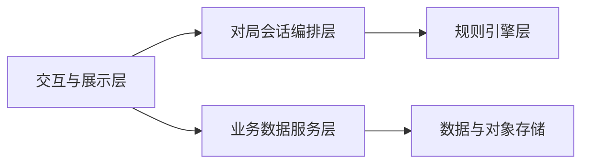
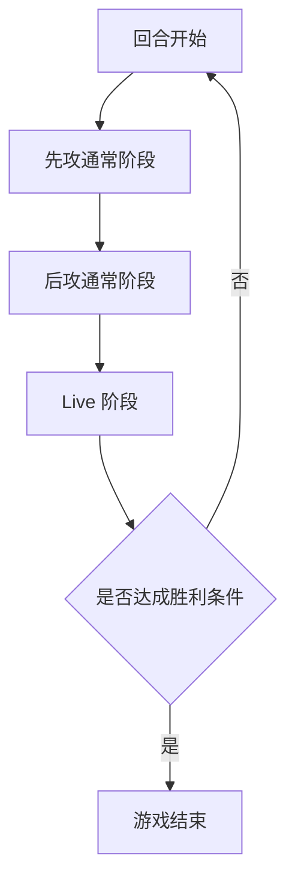

# Loveca 项目总体需求文档

> 文档类型：需求文档  
> 适用范围：Loveca 项目整体产品与规则需求（不包含具体实现细节）
> 当前状态：总体产品需求；当前实现边界以专题文档和 `src/`、`client/src/` 代码为准

---

## 1. 项目目标

Loveca 是 **Love Live! series official card game** 的数字化对战产品，目标是提供可在线上进行的双人卡牌对战体验，并支持卡组管理与卡牌数据维护。

### 1.1 胜负目标

- 任一玩家「成功 Live 放置区」达到 **3 张**时获胜
- 若双方在同一结算时点同时达到 3 张，判定为平局

---

## 2. 产品范围与角色

### 2.1 使用角色

- 普通玩家：进行本地或联机对局、管理卡组
- 管理员：维护卡牌数据与卡图资源，观测线上房间与对局运行状态

### 2.2 产品范围

- 对局系统（阶段推进、拖拽操作、规则校验）
- 联机系统（房间创建与加入、玩家准备、对局同步、断线恢复）
- 卡组系统（构筑校验、导入导出、对局前选组）
- 账号系统（注册登录、会话恢复、离线模式）
- 卡牌数据系统（查询、编辑、发布状态管理、图片管理）
- 管理后台（卡牌数据维护、活跃房间监控）

---

## 3. 业务架构需求（逻辑分层）

系统需满足以下逻辑分层，保证规则与界面解耦：

### 3.1 分层职责

- 交互与展示层：负责桌面布局、拖拽交互、阶段提示、结果展示
- 对局会话编排层：负责回合推进、动作分发、操作历史与撤销
- 规则引擎层：负责合法性校验、自动规则处理、胜负判定
- 业务数据服务层：负责用户、卡组、卡牌、图片等业务数据接口
- 数据与对象存储：持久化结构化数据与静态资源

---

## 4. 核心规则需求

### 4.1 卡牌体系

- 卡牌类型包含：成员卡、Live 卡、能量卡
- 每张卡牌需有唯一卡牌编号（用于构筑同名判断）
- 每张对局中的实体卡需有唯一实例标识（用于区域流转追踪）

### 4.2 Heart 与应援

- Heart 包含六色与 Rainbow
- Rainbow 在判定时可用于补足颜色缺口
- 演出判定需综合成员提供的 Heart 与应援提供的额外 Heart
- 应援相关额外得分需纳入 Live 分数结算

### 4.3 区域体系

每位玩家需具备以下核心区域：

- 手牌、主卡组、能量卡组
- 成员区（左/中/右槽位）
- 能量放置区、Live 放置区、成功 Live 放置区
- 休息室、除外区
- 共享解决区

成员槽位应支持与其绑定能量的联动移动与清理规则。部分特殊成员卡支持在下方堆叠成员卡（`memberBelow`），其联动移动与清理规则与能量卡类似；堆叠成员卡可拖回手牌（信任玩家原则）。

### 4.4 对局流程

#### 4.4.1 开局准备

- 双方洗混卡组
- 双方抽取初始手牌
- 双方放置初始能量
- 进入换牌阶段

#### 4.4.2 换牌阶段

- 双方依次可选择任意数量手牌换入牌库再补抽同数

#### 4.4.3 回合结构

通常阶段至少包含：

- 活跃恢复
- 能量补充
- 抽卡
- 主要操作（出成员、接力、能力相关操作）

Live 阶段至少包含：

- 双方设置 Live
- 双方演出与判定
- 胜败结算与成功区处理
- 先攻更新（当且仅当结算结果满足更新条件时）

### 4.5 检查时机与自动规则处理

系统需支持检查时机循环，自动执行规则纠偏，包括但不限于：

- 牌库刷新处理
- 胜利条件检测
- 非法区域卡牌纠正
- 槽位异常状态清理

### 4.6 费用与构筑

- 成员登场需支付能量费用
- 接力需支持费用减免逻辑
- 主卡组与能量卡组需满足固定数量约束
- 主卡组同基础编号卡牌数量需受上限约束

---

## 5. 功能需求

### 5.1 对局交互

- 提供桌面区块化展示（双方区域与中间对战信息）
- 支持拖拽作为核心操作方式
- 提供阶段指示、关键步骤确认、结果展示
- 支持在关键窗口中进行撤销操作
- 提供调试与观测能力（如视角切换、日志查看、联机状态查看）

### 5.2 用户与会话

- 支持账号注册、登录、登出、会话恢复
- 支持用户名或邮箱登录
- 支持邮箱验证与找回密码流程（可按部署配置启用）
- 支持离线模式与在线模式的会话边界
- 在线模式下需支持房间状态恢复与对局中玩家重连

### 5.3 卡组管理

- 支持卡组创建、编辑、删除
- 支持构筑合法性校验
- 支持导入/导出
- 支持本地对局前双人选组
- 在线模式下支持云端卡组管理
- 联机对局开始前需支持玩家锁定云端卡组

### 5.4 卡牌数据管理

- 支持卡牌查询与多维筛选
- 支持管理员对卡牌进行新增、修改、删除
- 支持卡牌发布状态管理（如草稿/发布）
- 支持卡图多尺寸资源管理

### 5.5 联机房间与对局

- 支持玩家通过房间号创建或加入双人房间
- 支持房间内双方玩家选择并锁定合法卡组
- 支持双方准备开始后进入开局猜拳，猜拳胜者决定自己先手或后手后开始对局
- 支持联机对局状态同步、命令校验与玩家视角隔离
- 支持玩家短暂断线后的房间恢复与对局继续
- 支持进行中的联机对局由双方确认后重新开始
- 支持对无人活跃的房间与对局进行生命周期清理
- 支持玩家查看自己的历史对局记录，并按玩家视角读取只读回放节点

### 5.6 管理员观测

- 管理员应可查看当前活跃房间列表
- 房间监控信息应包含房间号、房间状态、双方玩家信息、在线状态与卡组锁定状态
- 对已开始的联机对局，应展示开始时间、已持续时间、最近活动时间、当前阶段与回合信息
- 管理员观测页面仅提供运行状态查看，不应暴露玩家手牌、牌库内容或私有事件

---

## 6. 非功能需求

- 规则一致性：对局状态应可被规则层持续校正
- 联机一致性：联机对局应以服务端权威状态为准，并按玩家视角脱敏展示
- 可维护性：规则层、会话层、展示层职责清晰
- 可扩展性：可新增卡牌效果、子阶段和新模式
- 可部署性：支持自托管部署与环境配置
- 可测试性：核心规则、流程与关键交互需具备自动化测试覆盖

---

## 7. 已规划但未纳入当前交付范围

- 自动匹配队列与排位体系
- 完整确定性重演、公开分享回放与自动复盘分析
- 完整动画与音效体系
- 更高强度压测与专项性能治理
