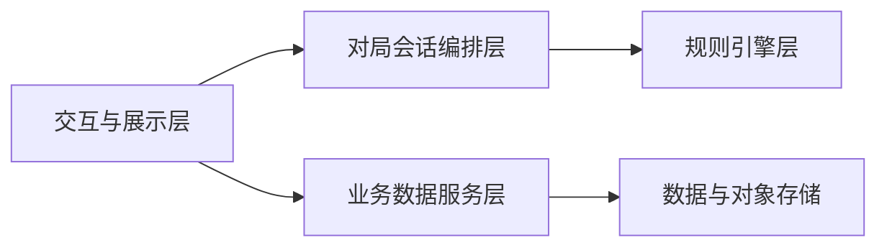
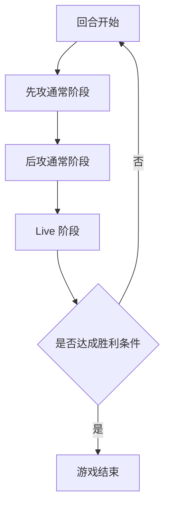

# Loveca 项目总体需求文档

> 文档类型：需求文档  
> 适用范围：Loveca 项目整体产品与规则需求（不包含具体实现细节）
> 当前状态：总体产品需求；当前实现边界以专题文档和 `src/`、`client/src/` 代码为准

---

## 1. 项目目标

Loveca 是 **Love Live! series official card game** 的数字化对战产品，目标是提供可在线上进行的双人卡牌对战体验，并支持卡组管理与卡牌数据维护。

### 1.1 胜负目标

- 任一玩家「成功 Live 放置区」达到 **3 张**时获胜
- 若双方在同一结算时点同时达到 3 张，判定为平局

---

## 2. 产品范围与角色

### 2.1 使用角色

- 普通玩家：进行本地或联机对局、管理卡组
- 赛季管理员：管理赛季排位、轮换主题牌桌及两个赛季入口显示，不获得平台维护、卡牌、构筑规则或用户权限管理能力
- 平台管理员：维护卡牌数据与卡图资源，管理 PT 限制表、平台维护/公告、回放保留、用户角色、排位赛季与轮换主题牌桌，观测线上房间、对局和异常结算状态

### 2.2 产品范围

- 对局系统（阶段推进、拖拽操作、规则校验）
- 联机系统（房间创建与加入、玩家准备、对局同步、断线恢复）
- 赛季排位系统（固定时段候场、积分结算、排行榜和赛季运营）
- 轮换主题牌桌（固定时段活动、服务端预组、组合分配和非计分赛季战绩）
- 卡组系统（构筑校验、导入导出、对局前选组）
- 账号系统（注册登录、会话恢复、离线模式）
- 卡牌数据系统（查询、编辑、发布状态管理、图片管理）
- 管理后台（卡牌数据维护、平台维护与公告配置、回放保留与赛季原始分析数据导出、活跃房间监控）

---

## 3. 业务架构需求（逻辑分层）

系统需满足以下逻辑分层，保证规则与界面解耦：

```mermaid
graph LR
    UI[交互与展示层] --> Session[对局会话编排层]
    Session --> Rules[规则引擎层]
    UI --> DataAPI[业务数据服务层]
    DataAPI --> Storage[数据与对象存储]
```

### 3.1 分层职责

- 交互与展示层：负责桌面布局、拖拽交互、阶段提示、结果展示
- 对局会话编排层：负责回合推进、动作分发、操作历史与撤销
- 规则引擎层：负责合法性校验、自动规则处理、胜负判定
- 业务数据服务层：负责用户、卡组、卡牌、图片等业务数据接口
- 数据与对象存储：持久化结构化数据与静态资源

---

## 4. 核心规则需求

### 4.1 卡牌体系

- 卡牌类型包含：成员卡、Live 卡、能量卡
- 每张卡牌需有唯一卡牌编号（用于构筑同名判断）
- 每张对局中的实体卡需有唯一实例标识（用于区域流转追踪）

### 4.2 Heart 与应援

- Heart 包含粉、红、黄、绿、蓝、紫、橙七种指定颜色，以及无色/Gray 与 Rainbow/All
- 无色/Gray Heart 只计入判定所需 Heart 总数，不能补足指定颜色缺口
- Rainbow/All Heart 在判定时可用于补足任意指定颜色缺口
- 演出判定需综合成员提供的 Heart 与应援提供的额外 Heart
- 应援相关额外得分需纳入 Live 分数结算

### 4.3 区域体系

每位玩家需具备以下核心区域：

- 手牌、主卡组、能量卡组
- 成员区（左/中/右槽位）
- 能量放置区、Live 放置区、成功 Live 放置区
- 休息室、除外区
- 共享解决区

成员槽位应支持与其绑定能量的联动移动与清理规则。已登记卡牌效果可在舞台主成员下方堆叠成员卡（`memberBelow`），其联动移动与清理规则与能量卡类似；玩家手动命令不得创建堆叠，既有公开桌面拖出行为保留。

### 4.4 对局流程

#### 4.4.1 开局准备

- 双方洗混卡组
- 双方抽取初始手牌
- 双方放置初始能量
- 进入换牌阶段

#### 4.4.2 换牌阶段

- 双方依次可选择任意数量手牌；选中牌先暂时离开手牌，从原主卡组顶抽取相同数量，再将换掉的牌放回主卡组并洗牌

#### 4.4.3 回合结构

```mermaid
flowchart TD
    A[回合开始] --> B[先攻通常阶段]
    B --> C[后攻通常阶段]
    C --> D[Live 阶段]
    D --> E{是否达成胜利条件}
    E -- 否 --> A
    E -- 是 --> F[游戏结束]
```

通常阶段至少包含：

- 活跃恢复
- 能量补充
- 抽卡
- 主要操作（出成员、接力、能力相关操作）

Live 阶段至少包含：

- 双方设置 Live
- 双方演出与判定
- 胜败结算与成功区处理
- 先攻更新（当且仅当结算结果满足更新条件时）

### 4.5 检查时机与自动规则处理

系统需支持检查时机循环，自动执行规则纠偏，包括但不限于：

- 牌库刷新处理
- 胜利条件检测
- 非法区域卡牌纠正
- 槽位异常状态清理

### 4.6 费用与构筑

- 成员登场需支付能量费用
- 接力需支持费用减免逻辑
- 主卡组与能量卡组需满足固定数量约束
- 主卡组同基础编号卡牌数量需受上限约束
- PT 限制按基础编号计算，不得以罕贵度后缀绕过；卡组总 PT 不得超过当前生效表的上限

---

## 5. 功能需求

### 5.1 对局交互

- 提供桌面区块化展示（双方区域与中间对战信息）
- 支持拖拽作为核心操作方式
- 提供阶段指示、关键步骤确认、结果展示
- 支持在关键窗口中进行撤销操作
- 提供调试与观测能力（如视角切换、日志查看、联机状态查看）

#### 5.1.1 规则模式与自由模式

- 新对局默认使用规则模式（`RULES`）。规则模式只允许当前阶段、待处理流程或已实现卡牌效果明确开放的语义操作；手动移动公开区域卡牌、调整能量、交换舞台成员、伪造判定或改分等桌面整理操作不得绕过规则校验。
- 自由模式（`FREE`）用于对墙打、调试与尚未自动化卡牌效果的人工处理，保留兼容桌面操作；自由模式不改变服务端权威状态与玩家视角隔离原则。
- 操作模式可在对局中的安全结算点切换，不在进入对局时永久锁定。本地调试和对墙打可直接开启；正式联机由一方请求、对方同意后开启，任意一方均可单方面恢复规则模式。
- 正式联机以服务端保存的权威模式为准，客户端声明不得自行放宽命令。模式必须随玩家视图明确投影；观战与历史回放只读展示当时模式，不提供切换或对局命令能力。

### 5.2 用户与会话

- 支持账号注册、登录、登出、会话恢复
- 支持用户名或邮箱登录
- 支持邮箱验证与找回密码流程（可按部署配置启用）
- 已登录用户可维护用户名、显示名称和密码；启用邮件服务时，可在验证当前密码后申请邮箱换绑，并以新邮箱收到的一次性链接确认生效
- 已登录用户可设置只影响当前观看者的游戏桌壁纸；该偏好不得进入对局状态、玩家投影、历史或回放，也不得向对手和观战者传播
- 修改密码或确认邮箱换绑后，应撤销账号的可续期会话并要求重新登录
- 支持离线模式与在线模式的会话边界
- 在线模式下需支持房间状态恢复与对局中玩家重连

### 5.3 卡组管理

- 支持卡组创建、编辑、删除
- 创建空白卡组时默认加入 12 张 `LL-E-001-SD` 能量卡，玩家仍可在编辑器中替换
- 支持将自己的云端卡组复制为独立的新版本，用于在保留原构筑的前提下继续微调
- 支持构筑合法性校验
- 支持导入/导出
- 支持本地对局前双人选组
- 离线访客可从空白、YAML 或内置示例创建卡组，并在当前浏览器持久化、编辑、删除和选用；本地卡组不作为账号同步或服务端对局准入依据
- 在线模式下支持云端卡组管理
- 联机对局开始前需支持玩家锁定云端卡组
- 服务端保存与对局准入必须使用当前生效 PT 表重新校验，不信任客户端或卡组记录中的派生合法性
- 卡组保存、候场锁定与对局卡组快照应保留 PT 表版本；对局快照另保留总 PT 与上限作为审计事实

### 5.4 卡牌数据管理

- 支持卡牌查询与多维筛选
- 支持管理员对卡牌进行新增、修改、删除
- 支持卡牌发布状态管理（如草稿/发布）
- 支持卡图多尺寸资源管理

### 5.5 联机房间与对局

- 支持玩家通过房间号创建或加入双人房间
- 支持未指定对手的登录玩家选择一副合法云端卡组进入公共候场；候场可跨站内页面持续，并可主动取消
- 公共候场按先来后到配对；匹配后双方必须在有限时间内确认，确认成功后进入封闭的双人开局流程，不向对手公开可用于挑选的个人或卡组信息
- 公共候场对局复用正式联机的猜拳、先后手、服务端权威对局、玩家视角隔离、房间号观战和历史记录；公共牌桌为休闲模式，不提供段位、积分或匹配处罚
- 支持房间内双方玩家选择并锁定合法卡组
- 支持双方准备开始后进入开局猜拳，猜拳胜者决定自己先手或后手后开始对局
- 支持联机对局状态同步、命令校验与玩家视角隔离
- 支持玩家短暂断线后的房间恢复与对局继续
- 支持当前联机对局双方发送简短纯文字消息或服务端当前启用目录中的快捷表情，并在刷新或短暂断线后按本局消息游标恢复；文字与表情共用单局有序通信流、未读、静音和综合限频，快捷表情另有独立冷却
- 快捷表情只能表达礼貌用语或当前交流状态，不得改变权威对局状态，也不能代替撤销、重开、认输、操作模式切换等语义化确认，或暂停对局及延长排位断线期限
- 已获授权的联机观战者可以只读查看当前绑定单局的文字和快捷表情，但不能发送；局内通信不进入历史记录或回放，也不跨重开后的新对局延续
- 支持进行中的联机对局由参与者主动认输；认输须由服务端权威结束对局，并向双方展示一致的公开结果
- 支持进行中的联机对局由双方确认后重新开始
- 支持参赛玩家把房间号告知观战者，由观战者从统一房间号入口只读观看进行中的联机对局与公共日志；不提供普通玩家专用观战链接
- 支持观战者输入房间号后选择已开放的玩家视角只读观战，并在双方视角均开放时于同一会话切换；玩家的房间号观战入口默认开启，并可在对局中关闭或重新开启自己的视角
- 双方确认重开后，已有房间号观战会话应进入正常的“等待下一局”状态并继续占用原房间名额；新局创建后按原目标玩家身份重新解析先后攻席位并自动恢复观战，不要求重新输入房间号
- 局间等待不得继续同步或展示为当前局的旧快照、公共日志和交互状态；房间关闭、参赛成员变化、会话过期或全部授权关闭时，应以稳定终止原因结束旧观战资格，同房间号后续复用不得继承旧资格
- 同一房间最多允许 10 个活跃普通观战会话；管理员观战不占普通观战名额，观战请求限流不得影响正式玩家命令
- 观战者已进入桌面后遇到频率保护或短暂网络中断时，应保留最后一份有效桌面并自动恢复同步；新会话因容量达到上限而无法进入时，仍应明确阻断入口并提示稍后再进入
- 支持对无人活跃的房间与对局进行生命周期清理
- 支持玩家查看最近 10 天的历史对局记录，并按玩家视角读取只读回放节点；超过保留期后，完整回放负载及原始卡组快照明细应被清理，只保留对局、参与者、卡组来源等元信息供管理与审计。排位精简卡组观察属于下节定义的独立长期统计事实，不属于可回放的卡组快照明细

### 5.6 赛季排位

- 登录玩家可在独立赛季入口查看当前及历史赛季、个人积分、参榜进度、最近对局和排行榜
- 排位使用独立候场票据，在同一赛季与竞技环境内按稳定 FIFO 配对；休闲公共牌桌与房间号对局不计入排位
- 赛季必须冻结内部规则、卡池政策和评分算法环境；卡牌目录保存为创建/激活时的审计快照，活动赛季期间发布卡池变化不得阻塞新候场。带官方生效日的全局 PT 限制表是外部构筑合法性边界，不纳入赛季 `deckPolicyVersion` 冻结；生效后的新候场与新开局统一按当前 PT 表重验，对局快照保留实际使用的 PT 版本
- 排位积分必须根据完整封存的服务端权威结果结算，不接受客户端自报胜负
- 同一局双方积分变化必须原子落地，重复结算不得重复计分；迟到结算与结果更正必须能够确定性重建当前积分
- 结果作废或改判必须保留追加式审计流水，不得删除或覆写既有评分事件
- 排位对局形成配对后可跨开放窗口继续确认和完成；正式开局后不得整局重开
- 新赛季回归玩家默认重置为该赛季初始积分和初始 RD；如采用其他软重置公式，管理员
  必须能在草稿赛季配置公式模式及参数，配置随竞技环境冻结且首场结算前不向玩家展示
  种子积分
- 单方超过重连期限时可按权威弃权结算；双方同时失联且无法可靠判断责任时不得随机判负
- 排位对局明确只等待一名玩家推进时，该责任玩家超过平台全局操作时限仍没有成功游戏操作，应按权威操作超时判负；默认时限为 3 分钟，轮询、被拒命令、聊天、观战和对手操作不得延长时限，双方同时可操作或系统自动推进时不得错误归责
- 玩家操作超时与断线重连期限必须使用同一组平台级单例配置，不得在不同赛季或活动中重复定义；新对局在开局时冻结配置快照，运营调整不得改变进行中对局的裁定期限
- 管理员可管理赛季生命周期、开放时段、参榜门槛和候场开关；可分页查看全部赛季的排位对局、核对胜负并按用户搜索，并可预览后执行异常结算更正
- 管理员可按赛季搜索已有有效计分记录的单个玩家，只读查看当前评分、RD、已计分场数、定级与参榜进度，以及符合公开参榜资格时目标上下各最多 3 名；排名上下文表中的目标及每一名相邻玩家都应展示胜场、负场，并在存在唯一 `ACTIVE` 卡组分类发布版本时展示当前发布口径下最常用的已识别卡组分类名称。胜负必须只聚合当前有效的 `SETTLED` 结果，`VOID` 不计入，`REPLACEMENT` 使用更正后的胜方；分类名称必须来自当前发布快照，并列、未分类或历史观察缺失必须明确表达，不得伪造或回退为玩家自定义卡组名。排名口径必须与玩家端榜单一致，不得借此直接覆写评分、场次或名次，也不提供全体账号批量导出
- 登录玩家可在当前或历史公开赛季的卡牌使用率板块中按运营开关查看“使用占比”“胜者构成”“高排名玩家”三个 TAB；使用占比和胜者构成可选玩家等权、对局等权或两者均展示，高排名玩家固定先对每名有效玩家的赛季卡组归一化后再玩家等权。各口径必须独立排序并仅公开自己的 Top 30，同时展示参赛玩家数、有效样本场数和数据覆盖率。胜者构成表示胜方卡组使用了哪些卡，不是卡牌胜率
- 登录玩家可查看已发布卡组分类的使用占比、胜者构成与高排名玩家构成；使用占比和胜者构成可选择玩家等权、对局等权或两者均展示，高排名玩家构成固定使用玩家等权。胜者构成与胜率必须分开表达，未识别和分类冲突保留独立统计扇区，人工排除不进入玩家统计
- 运营必须分别配置“赛季卡组环境”和“赛季卡牌使用率”的展示内容与基础计权，修改其中一个板块不得连带改变另一个板块；两个板块只共享高排名玩家人数 N。卡牌统计只依赖排位长期卡组观察与评分投影，不得因为没有 `ACTIVE` 卡组分类发布版本而不可用；任一板块全部取消展示内容时，只隐藏自身并在对应统计聚合前返回
- 赛季管理员和平台管理员均可维护卡组分类名称、样板、受限识别规则、人工复核与发布版本；草稿变更不得直接影响玩家，只有全量分类成功的新版本才能原子替换旧版本
- 每场排位在注册时应从双方锁定快照生成两席独立的长期精简观察。每席的存储边界仅为 `season_id / match_id / seat / user_id / observed_at / deck_fingerprint / main_deck_cards`；其中主卡组按基础卡号聚合为 `{ baseCardCode, cardCode, name, cardType, count, imageFilename? }`，`cardCode` 仅是该基础编号的稳定代表印刷编号，不展开逐张实例，构筑指纹也不包含玩家自定义名称。不保留能量卡、卡文、卡组名或来源卡组 ID
- 排位精简观察只用于赛季卡牌环境、覆盖率、可重建卡组分类、管理员玩家最常用分类与历史主卡组核查，不能用于还原初始牌序、隐藏信息、对局时间线或完整回放。它独立于 10 天完整回放保留期，在排位对局及跨赛季统计仍需保留期间长期保存；常规回放清理不得删除，未来如需清理必须建立单独的排位统计保留政策

### 5.7 轮换主题牌桌（玩家侧“娱乐模式”）

- 网站统一以“娱乐模式”呈现该玩法，不使用容易与积分、段位和排行榜混淆的“主题赛季”；内部 `THEME` 队列、数据库和代码命名可继续保留主题牌桌技术概念
- 登录玩家可在独立入口查看当前公开活动、开放时段、全部候选预组、真实玩法标签与完整卡表；预组池以卡组选择栏和当前卡组卡册呈现，卡牌按成员、LIVE、能量分区，以卡图、名称和同卡数量代替纯编号列表，每张可解析卡图都可打开可关闭的只读卡牌详情；后台难度枚举不作为玩家标签展示
- 玩家页按当前卡组版本展示本期权威终局聚合的两两对阵关系图，节点代表预组，连线中显示双方胜局比；自组对局不绘制为自环，退休卡组版本、中断、损坏或没有形成正式终局的对局不得混入当前图
- 主题牌桌使用独立候场环境，不上传或锁定玩家个人卡组，也不计入赛季排位
- 每一期自动按服务端权威终局记录玩家本人的完成局数、胜、负、平与胜率；中断、损坏或没有形成正式终局的对局不得计入。主题战绩不产生积分、段位、名次或公开排行榜，管理员不需要配置开关
- 主题房间赛后不得复用公共牌桌的原房再战；玩家返回主题入口重新候场，每一局都必须形成新的卡组分配与对局关联
- 双方确认后，服务端必须从当前活动冻结的已批准组合中选择一组预组，再以相同概率交换双方位置；客户端不得决定权威分配结果
- 活动版本必须冻结规则环境、卡牌目录、分配算法、预组快照、组合矩阵与评估口径；已发布事实不得原地改写
- 分配记录、最终锁定卡组与正式联机房间必须可审计关联；分配未完整冻结时不得创建缺少权威卡组的房间
- 开局前责任方离场或未到场时，无过错方应在活动仍开放时保留原候场顺序回队；正式开局后继续复用联机对局的既有生命周期
- 管理员在“娱乐模式管理”中复用排位赛季的周期、开放时段和生命周期控件；草稿期可从合法云端卡组加入或直接导入 YAML，也可删除误加卡组及其未发布组合；服务端为每副预组自动生成同卡组内战，并生成与其他预组的等权组合，逐组停用只作为异常处理；停用不得改写既有分配和对局
- 首期活动不得在真实预组试打、关键指标与告警、跨进程恢复和双浏览器验收完成前开放生产候场

### 5.8 运营角色与平台运维

- 运营授权必须使用服务端显式允许列表；前端菜单和页面隐藏只负责体验，不构成安全边界
- 平台管理员从统一运营管理中心进入内容与平台、卡牌与规则、用户与权限、对局与赛季能力；赛季管理员只进入赛季运营中心，管理排位、娱乐模式和玩家对战入口
- 平台管理员拥有赛季管理员的全部赛季能力；赛季管理员不得读取或修改维护配置、公告、卡牌草稿、卡图、AI 私密配置、PT 规则、全局联机观测、其他玩家私有卡组或用户角色
- 平台管理员和赛季管理员均可分别控制“赛季排位”和“娱乐模式”是否出现在玩家大厅与对局准备页；入口显示不代替活动生命周期、开放时段或候场开关，也不得终止既有候场、房间和进行中对局
- 平台管理员可分页检索账号，并通过角色下拉菜单直接授予或撤销固定平台角色；角色变更不要求原因或持久审计，但必须阻止最后一个平台管理员被降级，并撤销目标账号可续期会话
- 特权接口必须校验账号当前角色；账号被降权后，旧访问令牌不得继续完成管理写操作，权限提升后也必须重新登录或刷新为新授权会话
- 对局准备页以公共牌桌作为快速匹配入口，将当前可见的排位与主题模式归入赛季活动，并将房间联机、对墙打和双人调试归入其他对战；被管理员关闭的赛季入口应直接隐藏，不显示不可用占位
- 卡牌效果 AI 提取必须由服务端读取可信卡图并调用部署允许的 OpenAI-compatible 上游；管理员可测试和保存私密运行时配置，既有 Key 不回传浏览器，结果只回填待确认文本
- 管理员应可在前台管理任意状态的 PT 限制表，预览与当前表的差异，并选择立即或按北京时间精确到秒发布；废弃当前生效表时必须原子切换替代表
- 管理员可修改已发布 PT 表的版本、名称、上限、条目和生效时间；任何成功操作后必须有且仅有一张当前表，并最多一张待生效表。取消排期、版本替换、手动废弃与操作人应留下可追溯审计记录
- 管理员应可独立配置平台三态运行状态与公开公告：`NORMAL` 正常开放，`RESTRICTING_NEW_GAMES` 限制新对局并允许存量对局收尾，`MAINTENANCE` 让普通用户统一进入整站维护页；计划、延期、取消和完成由公告表达
- 整站维护必须使用独立于 API、数据库和前端版本目录的公开快照；API 停止后刷新任意普通路径仍应显示维护页，快照或 API 任一明确维护时均不得提前开放
- API 不可达且公开快照不能证明处于计划维护时，应显示普通服务不可用提示；维护与故障页面不得暴露内部接口、主机或数据库错误
- 解除整站维护前必须验证 API、数据库连接与当前版本必要数据结构就绪；平台状态保留最后修改人/时间，状态切换与公开快照同步结果写入结构化服务日志
- 平台管理员应可预览并经显式确认清理超过 10 天、已封存且仍含回放数据的对局；清理只移除回放子记录与卡组明细，保留元数据，并在任一候选排位对局缺少双方长期卡组观察时整体拒绝执行
- 平台管理员应通过赛季下拉框选择排位赛季，并以只读一致性事务导出匿名化原始分析 ZIP；数据包应包含排位结果事实、积分事件与步骤、玩家种子与当前投影，以及不依赖回放保留期的长期主卡组观察，不得读取或导出 checkpoint、完整 `match_records`、原始对局卡组快照、timeline、游戏事件、聊天或回放；结果直接返回浏览器下载，不在 API 容器持久落盘
- 管理员应可查看当前活跃房间列表
- 房间监控信息应包含房间号、房间状态、双方玩家信息、在线状态与卡组锁定状态
- 对已开始的联机对局，应展示开始时间、已持续时间、最近活动时间、当前阶段与回合信息
- 管理员可从联机房间监控按先攻/后攻快捷打开玩家视角只读观战页；该入口不计入公开观战人数
- 管理员观测页面仅提供运行状态查看或指定玩家视角只读观战，不应暴露玩家手牌、牌库内容或私有事件
- 管理员不得直接覆写玩家积分、场次或名次；排位异常处理必须通过带原因和幂等边界的结算更正流程

---

## 6. 非功能需求

- 规则一致性：对局状态应可被规则层持续校正
- 联机一致性：联机对局应以服务端权威状态为准，并按玩家视角脱敏展示
- 可维护性：规则层、会话层、展示层职责清晰
- 可扩展性：可新增卡牌效果、子阶段和新模式
- 可部署性：支持自托管部署与环境配置
- 可测试性：核心规则、流程与关键交互需具备自动化测试覆盖
- 任务连续性：应用发现新版本时不得自动刷新或清除业务缓存；进行中的对局和未保存操作必须继续可用，只有玩家在安全页面明确确认后才能切换版本
- 返回体验：页面重新挂载时应优先复用当前登录用户已有的服务端数据快照；后台刷新不得清空仍可使用的卡组列表或把页面重新降级为冷加载

---

## 7. 已规划但未纳入当前交付范围

- 公开段位、排位奖励、按积分或其他偏好的匹配，以及多排位池
- 完整确定性重演、公开分享回放与自动复盘分析
- 完整动画与音效体系
- 更高强度压测与专项性能治理
