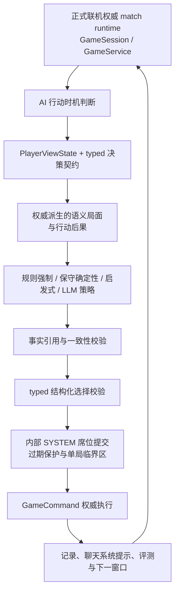
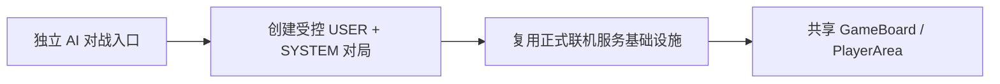

# Loveca AI 对战基础设施设计与实施草稿

> 文档类型：设计/计划文档
>
> 适用范围：受控卡组 AI 对战的目标架构、职责边界、实施阶段、验收门槛和风险控制
>
> 当前状态：Phase 0～4 已完成；Phase 4.5“语义决策上下文与事实自检”提升为当前最高优先级，完成后再进入 Phase 5
>
> 日期：2026-07-31
>
> 上游分析：[AI 对战基础设施可行性分析](feasibility-analysis.md)
>
> 文档范围：描述 AI 对战基础设施的目标架构、职责边界、核心概念、实施阶段、验收门槛和风险控制。不展开具体接口字段、数据库表结构、代码文件拆分、模型供应商选择、Prompt 正文、部署拓扑或工期估算。当前实现事实仍以 [`PROJECT_PROGRESS_TODO.md`](../../PROJECT_PROGRESS_TODO.md)、[`docs/current-limitations.md`](../current-limitations.md) 和对应专题文档为准。

## 1. 文档目的

本文件把 AI 对战的可行性判断整理为一套可执行但不绑定具体实现的设计与实施框架。

目标不是让 LLM 直接操作牌桌，而是在现有权威对局之上增加一种受规则、玩家视角和生命周期约束的服务端参赛者。它应当：

- 与真人使用同一套规则、状态和语义化命令。
- 只能读取对应座位正常可见的信息。
- 只在服务端提供的合法决策范围内选择策略。
- 把权威局面与合法动作转换为模型可以直接比较的语言化事实和行动后果，让 LLM 主要依靠卡文理解、局势比较与规划作出判断。
- 能在没有 LLM 的情况下完成机器参赛者基础设施验证。
- 在 LLM 超时、返回非法结果或服务不可用时安全降级。
- 从固定卡组和受控对局范围开始，逐步扩展规则覆盖与产品入口。

本文不替代卡牌规则、联机、回放、公共牌桌或卡效登记文档。各领域的现有权威来源继续有效。

## 2. 目标与非目标

### 2.1 首版产品目标

首版产品最终交付一套“受控范围内可完整对局的服务端 AI 参赛者”。这里描述的是阶段 0～4 收束后的产品范围，不等同于后文任一单独实施阶段：

- 使用固定、已认证的 AI 身份和卡组版本。
- 玩家和 AI 只使用 [`assets/decks/缪预组.yaml`](../../assets/decks/缪预组.yaml) 与 [`assets/decks/绿莲-6弹ver.yaml`](../../assets/decks/绿莲-6弹ver.yaml) 的已认证精确内容版本。
- 全程运行在 `RULES` 模式，不依赖人工切换 `FREE`。
- 能完成换牌、主要阶段、LIVE 设置、卡效输入、判定与结算等必要决策。
- 机械决策由确定性策略处理，真实战术分支才交给 LLM。
- 战术上下文明确呈现每个合法动作会保留、支付、替换、移动或触发什么；模型不需要跨多段原始 JSON 自行拼接同一动作的语义。
- 模型的最终理由必须能引用上下文中的权威事实，不能把其他卡牌的能力、已经离场的成员或不存在的槽位状态当作选择依据。
- 模型失败时通过局内聊天显示由服务端追加、带独立消息类型且去重的系统提示，并将本局切换到保守确定性策略；该策略必须具备有界活性政策，不能产生非法状态、重复行动、隐藏信息泄漏或永久卡局。
- 产品上提供独立 AI 对战入口，实现上复用正式联机的权威 match runtime、投影、命令、记录、聊天和共享桌面。
- 每局使用的身份、卡组、策略、Prompt 和模型版本可追溯。

首版产品不要求 AI 具备高水平竞技能力。基础体验标准是规则正确、行为可理解、能稳定完成整局，并能体现固定卡组的基本玩法。

### 2.2 非目标

以下内容不作为基础 AI 对战的前置条件：

- 全卡池完整自动裁判。
- 任意玩家卡组都可进入 AI 对战。
- 排位、奖励、任务或胜率体系。
- 多难度、多模型和动态思考预算。
- 自动构筑、自动训练或长期对手建模。
- 依赖模型阅读卡文并临时裁定尚未实现的效果。
- 让 AI 使用自由拖拽补做规则。
- 保存或恢复模型的私有推理过程。
- 建设通用后悔值、期望收益、局面估值、搜索树或蒙特卡洛策略引擎。
- 用服务端卡牌特例、复杂评分公式或“最优动作”否决器替代 LLM 的语言理解与战术判断。
- 建设完整的多 AI 管理后台。

## 3. 总体设计原则

### 3.1 权威规则唯一

`GameSession` / `GameService` 继续是对局状态和规则结果的唯一权威来源。

AI 不能：

- 直接修改 `GameState`。
- 自行计算并写入费用、分数、Heart、胜负或卡牌移动。
- 因 Prompt 中的规则说明而绕过现有命令校验。
- 用模型判断代替卡效触发、目标合法性和结算顺序。

所有 AI 行动最终都必须转换为现有语义化 `GameCommand`，并经过与真人相同的权威校验、执行和记录。

### 3.2 玩家视角唯一

AI 策略层的当前局面必须从对应座位的 `PlayerViewState` 派生。

可信服务端协调层可以读取权威状态，用于：

- 判断当前是否轮到 AI。
- 复用规则查询生成合法决策契约。
- 校验 authority revision、窗口和 lease。
- 将策略选择转换为命令。

但模型上下文、启发式策略和第三方模型调用不得直接接收完整 `PlayerViewState`。`PlayerViewState` 是前端视图投影，不是模型出站协议；其中为了渲染里侧对象、维持区域顺序或前端交互而保留的占位对象 ID、对象类型等字段，即使不包含正面卡牌身份，也不自动属于模型可见信息。

模型调用必须经过单一、版本化且采用字段 allowlist 的 `AiObservation` 出站适配器。该适配器只从对应座位的 `PlayerViewState` 和脱敏决策契约复制明确允许的事实，不回读 `GameState`；隐藏区域只提供规则允许的数量或摘要，只有 `FRONT` 或该座位依法可见的对象才提供卡牌身份。传给模型的对象 ID 使用本次决策内稳定的临时 ID，不能暴露服务端实体 ID、隐藏区域顺序或可跨视图关联隐藏对象的标识。

模型上下文、启发式策略和第三方模型调用不得接收：

- 对手隐藏手牌。
- 未公开的牌库顺序。
- 里侧卡牌真实身份。
- 对手 private events。
- sealed audit。
- 完整权威状态或可反推出隐藏信息的调试字段。

防泄漏测试以“实际发送给模型的完整请求 envelope”为对象，覆盖 system/developer/user prompt、结构化输入、工具参数、重试修复提示、日志与错误摘要；不能只快照中间的局面摘要。

### 3.3 策略与裁判分离

规则层回答：

- 现在是否需要该 AI 行动。
- 当前有哪些合法决策。
- 每个决策需要什么结构化输入。
- 选择提交后实际发生什么。

策略层只回答：

- 在当前合法决策中选择哪一个。
- 对多选、排序、数字或站位约束提交什么合法选择。
- 可选时是否发动。

策略层不能扩展合法决策范围，也不能生成原始任意命令。

规则/投影层还应把已经确定的动作后果表达清楚，例如实际支付、目标槽位、被替换成员、动作后的公开区域与会进入的已知卡效窗口。这里表达的是权威规则已经能够确定的事实，不是策略层自行估值，也不是提前执行命令。

### 3.4 机器参赛者先于 LLM

AI 对战基础设施必须先证明机器能够可靠参与对局，再证明 LLM 能做出较好的策略选择。

实施顺序应保持：

1. 认证卡组实际可达窗口的 typed 决策契约。
2. authority revision、单局调度、服务端 deadline、确定性推进和完整保守策略。
3. 可复现随机合法机器人与有界整局 headless playout。
4. 启发式策略与模型上下文。
5. SYSTEM 席位与正式联机 runtime 的内部受控接入。
6. LLM 决策。
7. 玩家可见的独立 AI 对战入口。
8. 语义决策上下文、事实自检与语言推理质量回归。
9. 公共牌桌 AI 补位和生产治理。

### 3.5 固定范围先闭环

基础阶段采用“认证范围”而不是“默认全卡池可用”：

- 固定 AI 卡组必须经过完整规则与机器决策验证。
- 首版玩家侧和 AI 侧都只允许 μ's 预组与绿莲 6 弹两个规范化内容哈希。
- 卡组准入由精确内容哈希白名单决定；同名文件内容变化后旧认证失效。
- 规范化内容哈希必须绑定版本化 canonical schema；文件字段顺序、展示元数据和列表书写方式不能形成未定义的认证差异。
- 扩展卡组范围时重新验证双方交互，而不只检查 AI 自身卡牌。

### 3.6 失败必须安全

任何模型、网络、调度或恢复故障都不得：

- 绕过权威规则。
- 让旧决策在新局面执行。
- 重复支付或重复行动。
- 泄漏隐藏信息。
- 无限重试并占用 worker。
- 让对局永久停留在无人处理的 AI 窗口。

合法不等于适合自动降级。随机合法策略主要用于 headless 验收；生产降级使用单独的保守确定性策略：跳过低价值可选动作，按审查过的最小推进规则处理主要阶段和 LIVE 设置，并在强制窗口使用经过审查的合法 witness。

供应商故障不得立即把对局标记为基础设施失败。系统应先切换到保守策略，并持续记录连续无进展回合、降级持续时间或等价活性指标；达到冻结的阈值后，按开局前已确定且可审计的政策由 SYSTEM 认输或进入明确异常终局。认证不能只证明单个窗口合法，还必须证明降级策略能够在有界时间内继续产生规则进展或安全结束对局。

### 3.7 随机事实必须可复现

机器策略选择和规则引擎随机事实必须分别治理。

- 测试 playout 使用可注入的 seeded RNG。
- 生产继续使用安全随机源，但记录重放所需的随机结果或随机事件带。
- 初始洗牌、换牌后洗牌、牌库刷新和卡效洗切等规则随机过程使用统一随机源边界。
- 失败用例不能只依赖机器人选择种子；还必须能够恢复相同的规则随机事实。

### 3.8 语言推理优先

Loveca 的卡文、时点、站位、资源、换手和后续展开高度组合化。首版策略质量建设不尝试在服务端复刻一套“更简单的 Loveca”：

- 费用、分数、Heart、数量、槽位和立即移动结果继续作为权威事实精确计算。
- 是否值得换手、保留哪个展开点、当前应追求哪张 LIVE、资源应留给哪个后续窗口，主要交给 LLM 结合卡文、playbook 和局面用语言推理判断。
- 服务端不为每个动作计算通用收益值、后悔值或最优分数，也不按卡牌编号增加战术否决特例。
- 确定性策略只负责机械窗口和模型故障后的安全推进；它不是与 LLM 并行竞争的第二套完整战术引擎。
- 服务端可以拒绝事实依据与权威上下文矛盾的模型结果，但不能因为自己的启发式排序不同就否决一个事实一致且合法的战术选择。

模型不需要向系统输出私有思维链。可审计输出只保留选择、引用的事实依据、简短取舍和下一步计划。

## 4. 目标架构与职责边界

AI 对战可以抽象为以下职责链：

“权威派生”不表示语义层可以读取并泄漏完整 `GameState`。它仍然只能组合对应席位的 allowlist `AiObservation`、typed 决策契约、依法可见的卡牌数据和规则层已经提供的结果预览；不得为了让语言更完整而补入隐藏事实。

产品入口与实现复用关系为：

### 4.1 权威对局层

职责：

- 维护对局状态。
- 校验并执行命令。
- 触发卡效和自动流程。
- 生成玩家视角投影。
- 记录公共、私密和审计事实。

AI 基础设施不复制这一层的规则。

### 4.2 机器决策契约层

职责：

- 描述当前 AI 需要处理的单个决策窗口。
- 提供当前合法动作、候选对象和输入约束。
- 绑定当前对局 authority revision、席位、语义窗口签名和稳定决策身份。
- 为策略层提供不含隐藏信息的机器可判定输入。
- 将选择空间限制在服务端允许的范围内。
- 为每个选择提供与最终命令校验共源的选择校验能力。
- 为强制窗口提供至少一个已验证的合法样例选择（witness），并为随机策略提供使用同一校验语义的合法选择生成器（sampler）。

它不是第二套规则引擎，也不是 UI 权限提示的简单重命名。契约只覆盖认证卡组实际可达的 typed 交互面；复杂规则仍由现有 workflow、费用计算、候选查询和命令校验拥有，不建立任意卡效 AST、通用步骤解释器或 AI 专用 resolver DSL。

### 4.3 AI 调度层

职责：

- 判断 AI 是否正在等待行动。
- 在服务端登记、取消和恢复公开展示等权威 deadline；到期任务必须主动进入单局串行执行器，不能依赖浏览器在线或客户端定时器触发。
- 为一个决策窗口创建唯一有效的 decision lease。
- 保证同一 AI 席位同一时刻最多只有一个有效决策。
- 在状态变化、超时、重启或人工终局后取消旧决策。
- 在一次命令后重新读取最新局面，不预生成整回合脚本。
- 选择确定性、启发式或 LLM 策略层级。
- 通过内部机器决策提交临界区原子完成 lease、authority revision、窗口、选择和命令执行校验。

### 4.4 策略层

策略按成本与不确定性分层：

1. **规则强制层**
   - 唯一合法动作。
   - 纯确认。
   - 强制单选。
   - 规则确定的自动输入。

2. **确定性默认层**
   - 明确配置为默认不发动的低价值可选步骤。
   - 无战术意义的公开展示确认。
   - 可以安全编码的固定行为。
   - 模型故障后使用的保守策略：不换牌，按审查过的确定性优先级执行最小推进动作，在没有可用推进动作时结束阶段，尽可能设置合法 LIVE，并在强制窗口使用稳定 witness。
   - 跟踪降级后的无进展回合或等价活性指标，达到阈值后执行冻结的 SYSTEM 认输或异常终局政策。

3. **启发式策略层**
   - Phase 2 已有的可解释基线与离线比较工具。
   - 只保留少量低成本、容易解释的默认选择，不继续扩张为复杂局面估值器。
   - 正常模型路径中，存在真实卡文、站位、资源或后续展开取舍的窗口应优先交给 LLM；启发式排序不能以“安全护栏”名义静默覆盖模型。

4. **LLM 策略层**
   - 换牌取舍。
   - 主要阶段展开。
   - LIVE 设置。
   - 多个卡效或目标之间的战术选择。
   - 需要结合固定卡组 playbook 的局势判断。

所有策略层消费同一决策契约，并输出同一类结构化选择。

### 4.5 模型上下文层

职责：

- 通过字段 allowlist 将玩家视角转换为紧凑、稳定、版本化的 `AiObservation`；不得直接序列化完整 `PlayerViewState`。
- 组合压缩规则、固定卡组 playbook、当前局面、合法决策和精选历史。
- 只为当前决策公开合法候选保留决策内稳定的临时对象标识，同时提供依法可见的卡名、费用/分数和战术说明。
- 为每个战术动作生成可直接比较的语义预览：动作来源、目标、实际支付、被替换/保留对象、动作后公开场面、已知触发与明确不会触发的能力。
- 严格区分状态真值、策略知识和历史辅助信息。
- 严格区分权威事实与模型自己生成的计划；模型摘要不得在下一窗口被重新包装成已经发生的事实。
- 对用户可控文本做边界标识，避免其被解释为系统指令。
- 对最终模型请求、重试提示、日志和错误摘要执行同一脱敏政策，并用精确出站快照验证。

### 4.6 LLM 服务边界

职责：

- 只在服务端发起模型调用。
- 固定允许的输入与结构化输出能力。
- 控制超时、有限重试、取消、并发、预算和熔断。
- 要求战术输出引用当前语义上下文中的事实标识，并提供简短的取舍与下一步计划，不请求私有思维链。
- 在选择提交前检查事实引用、卡牌能力归属、槽位/替换关系和资源后果是否与当前语义上下文一致。
- 校验模型输出是否满足当前决策契约。
- 记录版本、延迟、token、错误和降级结果。
- 一次模型调用经过有限修复/重试后仍确认失败时，通过服务端专用追加入口向局内聊天发布一次去重的结构化系统提示，并立即将本局剩余时间固定为保守策略。

模型调用边界不负责游戏规则、状态写入或“这个动作是否最优”的价值判断。事实自检失败可以在同一有效 lease 内触发有限修复；事实一致但策略风格不同不能成为拒绝理由。

首版局内聊天是玩家沟通和系统状态展示通道，不是 AI 策略输入。玩家消息不得进入模型上下文；玩家显示名称等确需呈现的用户可控文本必须作为明确标记的数据字段处理，不能拼入规则 Prompt、卡组 playbook 或其他指令段。

### 4.7 AI 身份与卡组治理

职责：

- 提供不可登录的稳定系统参赛者身份。
- 绑定公开名称、头像、简介和风格。
- 绑定固定卡组版本、规则 Prompt、卡组 playbook 和策略参数。
- 在开局时冻结本局使用的版本快照。
- 支持后续替换、评测和回滚。

AI 身份不应获得普通账号的登录、卡组管理、奖励或历史授权能力。

### 4.8 审计与评测层

职责：

- 关联决策窗口、authority revision、候选、规范化模型输入 envelope 哈希、选择和执行结果。
- 受限 SYSTEM/private 审计按保留策略保存实际结构化输入和输出；普通审计不保存隐藏信息。
- 记录策略层级、模型/Prompt/卡组版本和降级原因。
- 支持判断问题属于规则覆盖、契约生成、调度、模型还是产品流程。
- 不保存模型私有思维链。

## 5. 核心概念

### 5.1 决策窗口

决策窗口表示当前只需要一个玩家完成的一次规则输入，例如：

- 换牌。
- 主要阶段选择下一动作。
- 选择要设置的 LIVE。
- 选择待处理能力顺序。
- 支付可选费用。
- 选择卡牌、槽位、数字或排序。
- 确认结算。

一次命令执行后，无论是否仍由同一 AI 行动，都必须重新识别新的决策窗口。

换牌、LIVE 设置和分数确认等双方可并行提交的阶段，可以同时存在两个按席位隔离的决策窗口。首版采用安全优先的失效语义：任何权威状态变化都会关闭旧契约和旧 lease；即使另一席位的提交不改变当前 AI 的可选项，也重新从最新玩家投影生成契约。

### 5.2 决策契约

决策契约至少表达以下语义：

- 当前决策是什么。
- 谁需要处理。
- 是否必须处理。
- 是否允许跳过。
- 当前有哪些动作。
- 每个动作有哪些候选和结构化约束。
- 哪些字段由规则层确定，哪些字段由策略选择。
- 契约对应的 authority revision、席位、语义窗口签名和决策身份。
- 如何使用共源校验器验证结构化选择。
- 强制窗口的合法 witness，或能够生成合法选择的契约 sampler。

候选表达应遵循：

- 无参数动作直接列为选择。
- 单选提供合法候选。
- 多选提供候选集合和数量上下限。
- 排序提供参与对象和顺序约束。
- 数字输入提供范围与整数约束。
- 站位编排提供可用对象、位置和移动规则。
- 组合动作使用结构化约束，不展开全部笛卡尔积。

结构化约束不是只供模型阅读的自然语言说明。约束必须能被服务端程序校验；随机机器人不得自行解释“总费用不超过 N”“每组各选一张”“必须包含目标槽位”等关系，也不得通过反复试提交 `GameCommand` 寻找合法组合。

决策契约采用按真实交互面区分的 typed union，从认证卡组实际可达的确认、单选、多选、效果选项、数字、槽位、排序和站位开始。约束和 witness 由现有领域查询、active effect / pending runtime 或 workflow 提供；AI 契约层不拥有卡效规则，不追求一次覆盖全卡池。

### 5.3 Authority revision

`authorityRevision` 是当前权威局面的单调版本语义，不是 Git revision，也不只是 HTTP 客户端使用的同步序号。

第一版应提升现有联机 `remoteRevision` 的职责，使其成为 match runtime 内唯一的权威 revision 所有者；这项提升必须与所有权威写入进入同一个单局串行执行器一并落地，不能先宣布唯一权威语义、后补并发边界。如果后续改名或移动存储位置，应通过一次停机迁移替换，不保留 `remoteRevision` / `authorityRevision` 双计数、dual-read 或相互同步分支。公开 transport 可以继续把该值投影为 `seq`，但领域语义由 match runtime 拥有。

AI 在 revision 42 开始思考后，若真人命令、AI 命令、自动规则推进、撤销、deadline、对局生命周期变化或恢复接管使权威状态进入 revision 43，则基于 42 返回的选择已经过期。实现时必须列出所有会改变 AI 决策事实的权威写入，并保证这些写入与 revision 增长共用同一个单局串行提交边界；不能只在 AI 专用路径增长 revision。

每次异步机器决策至少绑定：

- `matchId`。
- AI 席位。
- `authorityRevision`。
- 语义窗口签名。
- decision lease。

语义窗口签名由窗口种类、等待席位、pending / active effect 身份和生命周期代际等稳定字段组成；不得把当前时间、剩余倒计时或对象遍历偶然顺序直接作为身份。

### 5.4 Decision lease

Decision lease 表示某次异步决策在有限时间内对特定局面有效。

它用于防止：

- 模型思考期间局面已经变化。
- 重试请求重复提交。
- 多实例同时驱动同一 AI 席位。
- 旧模型回调在服务重启后继续执行。
- 玩家和 AI 在并行窗口中产生竞态。

命令提交前必须原子确认：

- authority revision 未变化。
- 窗口签名仍一致。
- lease 仍有效且属于当前执行者。
- 决策结果匹配当前契约。

任一条件不满足时，旧结果作废并从最新局面重新决策。

单实例阶段由可信服务端内部的机器决策提交入口完成这一原子操作。该入口必须与真人命令、撤销、deadline 和恢复接管共享同一个单局串行执行器，并在同一临界区内依次完成：

1. 确认 lease 仍属于当前执行者且未过期。
2. 比较 authority revision、窗口签名和决策身份。
3. 通过契约校验器验证并物化结构化选择。
4. 生成现有 `GameCommand` 并执行权威校验。
5. 成功后增长 authority revision、消耗 lease 并记录结果。

lease 不需要成为真人公开 `GameCommand` 协议的通用业务字段。多实例阶段再以数据库锁、持久租约或带 fencing token 的单局 owner 实现同一原子语义。实现中不得另设只供 AI 使用、可能与 match runtime revision 漂移的第二版本号。

### 5.5 策略选择

策略选择只引用决策契约中的稳定决策 ID、投影对象标识、盲选 token 或满足约束的结构化选择。

策略选择不包含：

- 任意 `GameCommand` payload。
- 由策略层直接读取或构造的权威卡牌实例 ID。
- 自定义区域移动。
- 自定义费用或分数结果。
- 切换 `FREE` 的请求。

### 5.6 AI 配置版本

一套可参与对局的 AI 配置由以下版本共同构成：

- 公开身份版本。
- 固定卡组版本。
- 压缩规则 Prompt 版本。
- 卡组 playbook 版本。
- 策略配置版本。
- 模型与调用参数版本。
- 对应的规则和卡牌数据版本。
- 决策契约 schema 与适配器版本。

一局开始后，这些版本保持稳定。

### 5.7 卡组规则认证

首版卡组候选固定为：

- [`assets/decks/缪预组.yaml`](../../assets/decks/缪预组.yaml)。
- [`assets/decks/绿莲-6弹ver.yaml`](../../assets/decks/绿莲-6弹ver.yaml)。

卡组规则认证表示某个规范化内容哈希已经满足：

- 所有实际卡牌能力均已由规则引擎处理。
- 费用、触发、目标与输入窗口存在机器可消费入口。
- 卡组自身不会依赖人工 `FREE` 操作。
- 与指定测试对手卡组的关键交互已验证。
- 可以通过有界整局 playout。

基础阶段使用人工维护的精确哈希白名单；不能只依赖文件名或“卡牌编号出现在 definition 中”作为完整证明。同名 YAML 内容变化后旧认证自动失效。

规范化内容哈希必须由单一、版本化的 canonical schema 生成。该契约至少明确：

- 精确卡牌编号与罕度是否保留；首版保留精确印刷编号，不按基础编号合并。
- 主卡组和能量卡组分别参与哈希，不能跨区合并。
- 相同卡牌条目先按编号合并数量，再按不依赖系统 locale 的字符串 code-unit 升序序列化；YAML 列表顺序和字段顺序不影响结果。
- `player_name`、`description`、图片路径等展示或来源元数据不参与内容哈希。
- canonical schema 版本与哈希算法进入认证版本键；规则或卡牌数据版本继续作为独立认证维度记录。

哈希生成和验证只能调用这一公共契约，入口准入、对局快照、认证清单和测试夹具不得各自实现不同的规范化逻辑。

卡效完成状态继续以 [`existing_module_map.md`](../card-effect-reuse-audit/existing_module_map.md) 为唯一主登记册。AI 卡组认证只引用其基础编号与能力段状态并补充组合测试证据，不独立维护第二份“卡牌是否完整实现”的真值。

认证不是永久布尔值。每条认证至少绑定：

- 双方卡组规范化内容哈希和席位组合。
- 准入对手卡组版本或明确的对手集合版本。
- 规则引擎版本。
- 卡牌数据版本。
- 决策契约与命令适配器版本。
- 场景矩阵和验证配置版本。

任一输入发生影响规则或选择语义的变化时，旧认证必须失效并重新验证。认证证据分为静态能力/窗口覆盖、聚焦交互测试和有界随机 playout；playout 是回归证据，不能单独证明所有可达交互完整。

## 6. 机器决策契约设计

### 6.1 权威来源

决策契约应尽量复用现有：

- 命令政策。
- 命令合法性查询。
- 费用计算。
- 卡效候选生成。
- active effect / pending 状态。
- 玩家视角投影。

现有只能在提交后给出拒绝原因的规则，应逐步提升为可查询的合法性结果。查询和最终命令校验必须共源，避免长期漂移。

“统一”指所有机器策略消费同一种决策入口，不表示建设可以描述任意卡效的通用语言。契约 adapter 应贴近现有权威查询和窗口 runtime；出现新交互形状时按真实卡效扩展 typed variant，而不是在 AI 层增加自然语言规则、任意表达式 AST 或卡牌编号分支。

不得通过以下方式生成候选：

- 对权威会话反复试提交命令。
- 克隆状态后穷举所有 payload 并观察成功与否。
- 在 AI 模块中复制费用、站位或卡效规则。
- 直接把前端交互逻辑当作权威合法性。

### 6.2 信息集一致性

即使契约由可信服务端从权威状态生成，提供给策略层的结果仍必须符合玩家视角。

两个对该座位完全不可区分的权威状态，不应仅因隐藏信息不同而向策略层暴露不同的：

- 动作名称。
- 候选身份。
- 候选排序。
- 隐藏卡牌含义。
- 结果预览。
- 非规则允许公开的候选数量。

盲选应继续使用匿名、不可反查的选择位置或 token。

### 6.3 生命周期

每次会增长 authority revision 的状态变化后：

1. 关闭旧决策契约。
2. 重新投影玩家视角。
3. 判断新的等待席位。
4. 生成新的决策契约。
5. 由调度器决定是否以及如何处理。

不允许模型一次输出整回合动作序列。

### 6.4 权威结果预览与语义后果

决策契约可以提供由权威规则确定的必要预览，例如：

- 当前登场费用。
- 换手减免。
- 可支付资源数量。
- 当前效果选择数量要求。
- 当前 LIVE 需求和公开修正。
- 登场目标当前是空槽还是已被成员占用。
- 换手会将哪名公开成员移出舞台，以及动作后哪些成员仍留在舞台。
- 当前动作会支付多少能量、保留多少活跃能量，以及是否存在换手减免。
- 该动作依法已知会建立哪个卡效来源；没有能力的卡牌必须明确表示“无卡文能力”，不能借用被替换成员或相邻候选的能力。

预览必须明确是当前 authority revision 下的派生值，并在提交时重新校验。它不能成为绕过命令执行的写入结果。

面向模型的语义层应把这些分散事实组合成逐动作的自然语言/结构化双表示。例如，同一张成员卡既可以支付费用登场到空槽，也可以通过换手免费登场到已占用槽位时，两个动作必须分别说明：

- 保留了谁、失去了谁。
- 支付了多少、节省了多少。
- 动作后的舞台占位与剩余资源。
- 新登场成员自己的卡文，以及被替换成员的卡文不会转移给新成员。

语义层只组合现有投影、卡牌公开数据、费用计划和契约预览，不预测未知抽牌、不臆测未结算效果结果，也不重新实现费用、换手或卡效规则。

### 6.5 契约完备性与可满足性

每次生成决策契约时必须满足：

- 契约中的每个动作都能由服务端适配为现有语义化命令。
- 每个候选和结构化约束都符合当前座位的信息集。
- 选择校验器与最终命令校验共享规则查询或同一领域函数。
- 强制窗口至少存在一个通过选择校验器和命令适配器验证的合法 witness。
- 可选窗口明确区分合法跳过、默认不发动和必须作出非空选择。
- sampler 只从契约能力生成输入，不复制卡效或费用规则。

若强制窗口无法生成合法 witness，应立即报告为规则/契约基础设施缺口，不调用 LLM，也不把失败伪装成模型策略问题。

## 7. AI 调度与故障处理设计

### 7.1 调度触发

调度器在以下事件后重新检查：

- 对局创建或恢复。
- 玩家命令成功执行。
- AI 命令成功执行。
- 自动规则推进完成。
- pending / active effect 变化。
- 公开展示 deadline 到期。
- 模型调用返回、超时或取消。
- 房间或对局生命周期变化。

调度器不依赖前端持续在线触发 AI 行动。

当前由客户端定时请求推进的公开选卡、公开效果选项等 deadline，在 AI 基础设施中必须增加服务端 owner：

- 权威状态写入 deadline 时，同时在对应 match runtime 登记到期任务。
- deadline 被确认、撤销、回滚、窗口替换或对局结束时取消旧任务。
- 到期任务通过与真人命令、AI 命令相同的单局串行执行器提交，并在执行前重验 deadline、窗口签名和 authority revision。
- 客户端仍可发送同一幂等推进请求以改善体验，但客户端请求不是唯一触发源。
- 进程恢复后从最新权威状态重新扫描未完成 deadline；旧进程定时器和旧回调不得继续提交。

### 7.2 单局串行原则

同一对局的权威写入应保持串行。

AI 思考可以异步进行，但返回结果只能通过当前有效 lease 提交。不同对局可以并行；同一对局的真人命令、AI 命令、撤销、deadline 和恢复接管不能绕过统一串行执行器并发写入。

同一对局的所有权威写入必须经过统一临界区，机器提交在其中额外校验 lease。单实例可以使用单局队列或互斥执行器；多实例必须使用能够拒绝旧 owner 的持久锁或 fencing token。仅先读取 authority revision、随后普通调用命令入口，不满足原子提交要求。

### 7.3 超时与降级

模型失败时按以下顺序处理：

1. 格式可修复且仍在当前 lease 内时，允许有限重试。
2. 一次调用在有限修复/重试后仍确认供应商超时、拒答、结构化输出持续非法或熔断时，通过局内聊天 UI 发布一次去重的结构化 `SYSTEM_NOTICE`，说明 AI 将采用保守策略继续本局。
3. 立即使用保守确定性策略处理当前窗口，并将本局剩余时间固定使用该策略，不再逐窗口试探模型是否恢复。

保守策略的基本规则是：

- 可选卡效和可选费用默认不发动。
- 换牌默认不换。
- 主阶段按 `PLAY_AFFORDABLE_MEMBER -> END_MAIN_PHASE` 推进；成员候选按“可支付费用升序、投影手牌位置升序、lease 内候选 ID 升序”，槽位按左/中/右。起动能力属于可选项，基础保守策略默认不发动。
- LIVE 设置存在合法候选时按“投影手牌位置升序、lease 内候选 ID 升序”设置；只有没有可用候选且规则允许时才确认空设置。
- 纯确认、规则分数确认和结算继续推进。
- 成功 LIVE 选择按“投影 LIVE 区位置升序、lease 内候选 ID 升序”处理。
- 强制单选、多选、排序、数字和站位输入使用契约提供的稳定合法 witness。

“保守”表示不做未经审查的高风险战术动作，不表示永久跳过所有能够推进胜负的动作。不能无限等待模型，也不能在模型失败后切换到 `FREE`。随机合法选择不属于生产降级；若认证范围内存在保守策略无法处理的强制窗口，说明认证或决策契约尚未闭环，不能开放该卡组组合。

保守策略还必须执行独立的活性政策：

- 定义并记录两层进展：连续决策 watchdog 使用排除 revision/日志/时间噪音但包含窗口与 active step 变化的 `authorityStateProgress`；降级回合活性使用只统计区域、卡牌状态、资源、LIVE/成功区、牌库/休息室、分数或终局变化的 `strategicRuleProgress`。单纯回合切换、纯确认、空换牌/空 LIVE 设置和 revision 增长不构成战略进展。
- 设置最大连续无进展回合数、最大降级持续时间或其他等价的有界阈值。
- 达到阈值后停止继续空过，按本局冻结政策由 SYSTEM 认输，或进入明确、可审计且玩家可见的异常终局。
- 阈值、终局语义和展示文案必须在开放玩家入口前确定；不能在故障发生后临时选择。
- 聚焦测试和 headless playout 必须分别验证“模型从首个决策起完全不可用”和“中局切换降级”两种路径能继续产生规则进展或在边界内安全结束。

Phase 1B 已将 `SYSTEM_NOTICE` 落为独立聊天 schema 能力，而不是当前玩家文本消息的特殊文案。当前边界包括：

- `PLAYER` / `SYSTEM_NOTICE` 等明确消息类型。
- 只能由服务端内部调用的追加入口。
- 独立于玩家身份、屏蔽词和玩家发送限流的系统消息政策。
- 稳定的本局去重键。
- 前端独立样式与无 `senderSeat` 的系统来源语义。

聊天提示由服务端生成，不伪装成 AI 玩家发言，不展示供应商名称、密钥、内部错误堆栈或重试细节。恢复后是否重新启用模型按本局策略版本决定；首版固定为本局继续使用保守策略，避免行为反复切换。

### 7.4 恢复

headless 和受控入口阶段至少保证：

- 重启后旧 lease 全部失效。
- 旧模型回调不能提交。
- 旧服务端 deadline 定时器全部失效，并从恢复后的最新权威状态重新登记仍有效的 deadline。
- 若对局权威运行态仍存在，能从最新权威状态、玩家投影和固定版本配置重新构造决策。
- 无法恢复时可以明确、安全地终止对局。

这一阶段不承诺正式联机进程重启后的无损续局。生产阶段再以持久 authority checkpoint、随机事件带、固定配置版本和多实例互斥扩展为完整进行中恢复或可审计的安全终止。

## 8. 模型上下文设计

### 8.1 稳定规则层

提供适合决策的压缩规则，说明：

- 回合、阶段与行动顺序。
- 成员登场、费用、换手和能量。
- LIVE 设置、判定、成功与胜负。
- 主要能力时点。
- pending 和 active effect 的优先处理。
- 隐藏信息边界。
- 只能选择决策契约，不得自行裁定规则。

### 8.2 固定卡组 playbook

每套 AI 卡组维护：

- 核心获胜思路。
- 换牌保留。
- 理想展开。
- 关键成员与 LIVE 组合。
- 资源规划。
- 登场、起动能力和 LIVE 设置优先级。
- 可选费用使用时机。
- 断轴后的替代路线。

Playbook 是策略知识，不是规则真值。

### 8.3 当前局面

当前局面由单一 allowlist 适配器从最新 `PlayerViewState` 派生为 `AiObservation`，不得直接序列化完整视图。重点表达：

- 当前回合、阶段、行动席位和正在处理的效果。
- 双方公开分数、成功 LIVE 和资源。
- 自己的手牌、舞台、能量、LIVE、休息室和牌库数量。
- 对方公开区域和方向状态。
- 与当前窗口有关的持续修正、次数限制和资源。
- 重要卡牌的名称、费用/分数、公开卡文与战术含义。

隐藏区域只表达该座位依法知道的数量或摘要；里侧对象、未公开牌库顺序和可关联隐藏实体的真实对象 ID 不进入 `AiObservation`。当前合法候选需要对象引用时，使用本次决策内稳定、lease 失效即作废的临时 ID。

> 当前进展（2026-07-30）：Phase 2 上下文与 Phase 4 模型调用边界均已完成。
> `src/server/ai-battle/ai-observation.ts` 的 `ai-battle.observation/v1`。适配器的公开输入只有
> 对应席位的 `PlayerViewState` 与 Phase 1A typed decision contract，并强制绑定 viewer seat、
> authority revision 和 `RULES` 模式。输出按字段 allowlist 重建回合/窗口、双方区域数量、依法
> 可见的正面卡牌、LIVE 公开修正以及 contract-local candidate/action/option 与输入约束；不会
> 复制 match/player/authority object ID、玩家显示名、权限提示、聊天、private event 或 sealed
> audit。代表性换牌局面和盲选 active-effect 候选已用 inline snapshot 与禁止字段断言锁定。
> `strategy-context/v1` 已在该观察之上组合 `compact-rules/v1` 与两个绑定认证内容哈希的固定卡组
> playbook；`selected-history/v2` 只从已脱敏观察与权威接受后的结构化策略决策增量生成，保存最近
> 12 条关键登场、LIVE、能力、费用、效果选择和公开区域变化。它不读取权威状态、事件日志、
> 聊天或玩家显示文本，也不保留 lease 失效即作废的 candidate/action 临时 ID。完整
> provider-neutral model request envelope、严格输出 schema 和有限 repair envelope 已由 Phase 4
> 落地，并已接入固定的服务端 DashScope/Qwen provider、调用事实审计与整局故障处理。模型仍只
> 接收该脱敏上下文；凭据、原始错误、原始无效输出和玩家聊天都不会写入请求或策略记录。
>
> Phase 4 的现场验证随后暴露出一个独立于合法性的语义问题：原始 observation 与 contract 虽然
> 含有正确的卡牌、槽位、费用计划和 `replacementCount`，但同一动作的“保留谁、替换谁、动作后
> 场面、能力属于谁”仍分散在不同对象中。Phase 4.5 将在不扩大可见信息的前提下补齐逐动作语义
> 后果；Phase 4 的现有 v1 协议保持为已完成历史基线，不用 dual-read 或运行时 fallback 延长旧格式。

### 8.4 当前合法决策

合法决策在上下文中单独、显著呈现：

- 决策 ID。
- 动作含义。
- 候选。
- 费用与规则预览。
- 动作来源和目标槽位。
- 目标槽位当前对象，以及会被替换、保留或移动的对象。
- 动作执行后的公开场面和剩余资源摘要。
- 新动作实际使用的卡牌文本、明确触发的能力来源，以及该动作不具备的常见误归属能力。
- 数量、顺序或站位约束。
- 是否可跳过。

模型不需要从整份状态 JSON 中自行推断可操作内容。

语义表达应同时保留稳定事实标识和适合阅读的短句。事实标识用于模型输出引用与服务端一致性校验，短句用于让模型比较动作；两者必须由同一份投影事实产生，不能分别维护两套内容。

### 8.5 事实、策略知识与模型结论分层

模型上下文至少明确区分：

1. **权威局面事实**：来自当前 `AiObservation`，描述依法可见的当前状态。
2. **权威行动事实**：来自 typed contract、费用计划和结果预览，描述合法动作及已确定后果。
3. **卡牌与规则事实**：公开卡文、压缩规则和已实现能力归属。
4. **策略知识**：固定卡组 playbook，属于建议而不是真值。
5. **模型结论**：本次选择、简短取舍和下一步计划，不得反向覆盖前四层。

自由文本不能从较低可信层晋升为较高可信层。尤其是模型生成的“某成员具有检索能力”“舞台已满”等摘要，不得因为被写入历史，就在后续窗口成为新的状态事实。

### 8.6 精选历史

只保留仍影响策略的可见事实：

- 最近关键登场、LIVE、卡效和资源支付。
- 对手公开过的重要卡牌。
- 已消耗的核心组件。
- 每回合能力使用情况。
- 由权威接受结果和相邻可见投影能够证明的动作后果。

历史只辅助策略，不覆盖最新玩家投影。

当前 `selected-history/v2` 使用按席位隔离的定长窗口，只在命令被权威层接受后记录策略选择，并从
相邻脱敏 observation 的公开区域差异补充可见状态变化。明确的策略决策记录行动席位；纯视图差异
只记录受影响席位与“新近可见”事实，不推断相邻 observation 无法证明的行动者、登场或移动原因。
纯确认、deadline 推进和无战术意义的阶段确认不会进入历史。Phase 2 的 64 局专用回归中，14,975
次决策有 14,847 次上下文携带非空精选历史，覆盖率为 99.15%。

Phase 4.5 必须停止把模型生成的 `summary` 作为后续事实历史的正文来源。若未来需要跨窗口保留计划，只允许保存单独标记为 `MODEL_PLAN_NOTE` 的结构化意图，并且引用当前可见对象/目标；它不能声明卡牌能力、区域状态或已经发生的结果。第一版可以完全不回灌模型计划，优先保证事实链不被模型自己的叙述污染。

### 8.7 不可信文本边界

首版模型上下文不包含局内聊天消息。玩家昵称、房间展示文本或未来其他用户可控字符串即使对该座位可见，也必须作为带明确字段边界的数据传入，不得与规则 Prompt、卡组 playbook、输出 schema 说明或其他系统指令拼接。

如果未来要让 AI 理解玩家聊天，应作为独立产品能力重新设计权限、提示注入防护、滥用治理和审计范围，不在基础 AI 对战中顺带开启。

## 9. 可复现随机合法机器人与 playout

### 9.1 目的

随机合法机器人不是战术 AI，而是基础设施验收工具，不作为生产降级策略。生产故障只使用第 7.3 节定义的保守确定性策略。

它用于证明：

- 所有必要窗口都有机器可消费入口。
- 决策契约能够生成合法选择。
- 调度器会逐窗口继续推进。
- 固定卡组范围可以完成整局。
- 卡死问题能够被定位为规则、契约、调度或状态生命周期问题。

### 9.2 可复现要求

测试 playout 必须能够记录或固定：

- 机器人选择随机种子。
- 引擎使用的规则随机源种子，或完整的洗牌和其他随机事件带。
- 卡组与规则版本。
- 决策契约和命令适配器版本。
- 每一步决策契约和选择。

同一失败用例应能够重放或至少稳定恢复到失败附近。

规则引擎不得在 playout 路径中绕过统一随机源直接读取系统随机数。生产随机源可以保持不可预测，但必须把重放所需结果作为权威审计事实记录；测试随机源必须可注入和固定。

生产随机事实的权威记录边界必须在正式 SYSTEM 席位和玩家入口之前落地；阶段 5 只扩展其持久恢复、多实例接管和运营治理，不再补建首局已经缺失的随机事实。

### 9.3 有界执行

每局测试应设置：

- 最大回合数。
- 最大决策步数。
- 单窗口最大重试次数。
- 无状态进展 watchdog。
- 整局最大运行时间。

超过边界应判定为明确失败，输出最后局面、窗口、契约和随机事实，不允许测试无限运行。

### 9.4 覆盖场景

至少覆盖：

- 换牌。
- 普通与换手登场。
- 起动能力。
- LIVE 设置和撤回。
- 同时点能力顺序。
- 卡牌、选项、槽位、数字、排序和站位输入。
- 可选费用和强制费用。
- 判定、分数确认与成功 LIVE 选择。
- 多步卡效连续产生新窗口。
- 双方并行提交窗口。
- 牌库刷新和随机事件。
- 服务端 deadline 在无人保持浏览器在线时仍能推进，旧 deadline 在撤销、恢复和窗口替换后不能执行。
- 模型从开局或中局完全不可用时，保守策略能继续产生规则进展或在冻结阈值内安全终局。
- 对局正常结束。

## 10. AI 身份与正式联机接入

AI 对战在产品层使用独立入口，在实现层复用正式联机基础设施：

- 独立入口只允许已认证卡组哈希，并明确展示 AI 身份。
- 服务端创建 USER + SYSTEM 的权威对局，不另建 AI 专用 `GameSession` 或规则状态机。
- 真人继续使用正式联机 snapshot、command、public events 和聊天链路。
- SYSTEM 席位不模拟浏览器轮询，由内部调度器直接消费最新玩家投影和决策契约。
- 前端继续使用共享 `GameBoard` / `PlayerArea`，仅在入口、身份展示、故障系统提示和策略状态上增加 AI 语义。
- `GameMode.SOLITAIRE` 只保留单人测试自动化职责；AI 对局使用完整双人规则流程。

### 10.1 系统参赛者边界

AI 使用不可登录的系统参赛者身份。

服务端需要区分：

- 真人通过认证用户提交命令。
- AI 由可信内部调度器代表系统席位提交命令。

两者在身份授权上不同，但进入 `GameSession` 后使用相同的命令校验和记录边界。

### 10.2 赛前流程

AI 需要能够完成：

- 绑定固定卡组。
- 锁定本局配置版本。
- 自动准备。
- 猜拳。
- 先后手选择。
- 进入正式对局。

基础 headless 阶段可以直接创建受控对局。Phase 3 的管理员内部入口不创建临时 `OnlineRoom`，也不伪造第二个可登录 USER 或 room presence；它通过版本化受控赛前解析器标记双方准备完成，复用真人房间同一份猜拳胜负规则，并按冻结政策让 SYSTEM 确定性获胜后选择请求的先后手，再直接创建 USER + SYSTEM `OnlineMatch`。Phase 4 已在同一赛前流程上提供登录玩家可用的独立 AI 对战入口，允许双方从两个认证卡组中选择并指定 AI 先后手；进入对局后继续复用共享 `GameBoard`。Phase 5 公共牌桌接入再把同一系统席位语义接入真人候场、双方确认和容量治理流程。

### 10.3 对局政策

在公开匹配前需要明确：

- 玩家何时会匹配到 AI。
- 是否允许玩家拒绝 AI。
- AI 是否参与双方确认。
- AI 如何处理撤销和重开请求。
- AI 故障、离开或超时如何判定终局。
- AI 对局是否进入普通历史与统计。
- 玩家如何明确识别 AI 身份。

AI 不伪装成真人。

## 11. 审计、评测与观测

### 11.1 决策审计

每次非纯自动决策至少关联：

- 对局和 authority revision。
- 决策窗口与 lease。
- 决策契约身份、schema 和命令适配器版本。
- 当时的规范化结构化输入 envelope 哈希、schema 和版本。
- 按明确保留策略写入受限 SYSTEM/private 审计的实际结构化模型输入与输出。
- 合法候选和约束。
- 使用的策略层级。
- 最终选择。
- 模型引用的事实标识、简短取舍和计划，以及事实一致性检查结果。
- 机器原子提交和命令执行结果。
- 与当前决策关联的规则随机事实引用。
- 失败、重试或降级原因。

### 11.2 版本审计

每局记录：

- AI 身份版本。
- 卡组版本。
- 规则 Prompt 版本。
- 卡组 playbook 版本。
- 策略配置版本。
- 模型和参数版本。
- 规则与卡牌数据版本。
- 决策契约 schema 与命令适配器版本。
- 随机源实现版本和随机事件带格式版本。

### 11.3 基础指标

至少观测：

- 整局完成率。
- 卡死率。
- 非法模型输出率。
- 过期决策丢弃率。
- 契约生成失败率和强制窗口无合法 witness 次数。
- 契约选择校验失败率。
- 确定性、启发式和 LLM 决策占比。
- 模型超时、重试和降级率。
- 事实引用无效、能力误归属、槽位/替换矛盾、资源后果矛盾和语义修复重试率。
- 聊天故障提示发布次数、去重次数和本局保守策略切换率。
- 服务端 deadline 到期延迟、取消次数、旧任务拒绝次数和恢复重登次数。
- 降级后的连续无进展回合、活性阈值触发次数，以及 SYSTEM 认输或异常终局原因。
- 单步和整局决策延迟。
- 单局调用次数、token 和成本。
- 对局异常终止原因。

### 11.4 策略质量评测

基础稳定后，再评测：

- 对固定测试策略的胜率。
- 关键展开达成率。
- 可选费用使用合理性。
- 卡组 playbook 遵循程度。
- 选择依据与卡文、槽位、资源和动作后果的一致性。
- 是否比较了保留/替换、当前支付/后续用途和短期展开/下一 LIVE 计划。
- 面对同一局面的语言化复盘能否指出选择的真实收益、代价和后续目标。
- 相同版本间的行为稳定性。

策略质量不能替代规则正确性指标，也不要求把所有判断压缩成通用数值。Phase 4.5 的主要门槛是固定语义场景上的事实一致性、取舍完整性和计划连贯性，加上真人抽样复核；不建设通用后悔值、收益值或“最佳动作标签”作为线上裁决器。离线评测可以为比较版本使用少量可解释统计，但这些统计不能进入权威提交路径。

## 12. 实施阶段

实施阶段按依赖关系推进，不代表具体工期。

### 阶段 0：范围冻结与验收基线

当前落地状态与冻结值见 [`phase-0-baseline.md`](phase-0-baseline.md)。Phase 0 已通过；后续实现从 Phase 1A 的认证范围 typed 决策契约开始。

目标：

- 冻结 canonical deck schema 版本、哈希算法和公共规范化入口。
- 使用该公共规范化入口冻结 μ's 预组与绿莲 6 弹两个规范化卡组内容哈希。
- 明确第一轮验证矩阵；两个玩家卡组选择 × 两个 AI 卡组选择形成四种卡组角色组合，每种组合至少覆盖 AI 先手和后手，共至少八个基础单元。允许先从 μ's 预组玩家对绿莲 AI 的先、后手两个单元开始。
- 明确独立 AI 产品入口、正式联机实现复用、USER + SYSTEM 身份边界和模型故障保守继续政策。
- 逐能力段确认卡组规则覆盖与仍需补齐的窗口，不能只用真人能够结束一局作为完整性证明。
- 冻结保守策略的确定性动作/候选排序、双层进展语义、无进展阈值和 SYSTEM 认输或异常终局政策。
- 冻结 headless 回归的种子数、回合/决策/时间边界、零容忍失败类别和失败种子沉淀政策。
- 建立 AI 基础指标和测试场景清单。

交付物：

- 固定 AI 身份与两个精确卡组内容哈希。
- canonical deck schema、哈希算法版本和共享规范化契约。
- 卡组规则认证清单。
- 认证版本键与失效规则。
- 按 `baseCardCode + abilityId` 绑定、与主登记册完成状态分离的行为测试证据清单。
- 至少八个基础单元的首批对局场景矩阵。
- 保守确定性策略窗口与活性政策矩阵。
- 数值化的 headless 验收配置与回归种子政策。

阶段门槛：

- 目标卡组所有有能力的基础编号及其每个能力段均已在主登记册标为完整或同型完整；认证清单不存在仍需忽略、手动补做或切换 `FREE` 的效果段。
- 每个能力段均已映射到权威触发、费用、候选、输入和结算入口；认证卡组 definition 集合必须与行为测试证据清单精确对应，不允许遗漏或 stale evidence。所有已知复杂输入要么在本阶段补齐，要么从首批准入范围移除，不能带缺口通过阶段门槛。
- 至少通过对应能力段的聚焦场景验证，并以可重复执行的权威测试让首批八个矩阵单元在 `RULES` 中完成双方换牌确认和首轮双主要阶段，进入 LIVE 设置阶段；随机整局与可复现门槛仍由阶段 1C 验证。真人整局只作为探索性产品验证，不作为无法由 CI 复验的 Phase 0 gate。
- canonical schema 对字段顺序、列表顺序、重复条目、精确罕度、主/能量卡组和展示元数据的处理均有固定测试。
- 阶段 1C 的普通 PR smoke 为每个基础单元 1 个固定成功种子，共 8 局；dedicated CI 完整回归为每个基础单元 32 个确定性种子，共至少 256 局。每局最多 80 回合、5,000 个决策、单窗口 2 次修复重试、128 个连续无 `authorityStateProgress` 决策和 30 秒测试墙钟时间。`authorityStateProgress` 忽略 revision/日志/时间戳噪音，但纳入窗口、pending/active step、区域、资源、modifier、分数和终局变化；不能用 revision 单独增长重置 watchdog。非法命令被接受、过期 lease 被接受、未捕获异常、watchdog 或墙钟超限均为零容忍。
- 任何失败种子必须连同规则随机事实和策略选择进入永久回归语料；每个基础单元至少保留一个固定成功种子作为快速 smoke，不能用更换种子掩盖失败。
- 保守降级的活性边界冻结为连续 3 个 AI 回合无规则进展、累计 256 个保守决策或服务端观察到 5 分钟降级持续时间任一先到；达到边界后由 SYSTEM 认输，并以区别于玩家认输和基础设施崩溃的终局原因记录。后续若根据实测调整，必须提升策略/场景版本并重新认证。

### 阶段 1A：认证范围 typed 决策契约

> 当前进展（2026-07-28）：**COMPLETE**。contract core 已落地于
> `src/application/ai-decisions/decision-contract.ts`，当前覆盖换牌、待支付费用、
> active effect 的确认/单选/有序多选/分组选卡/效果选项/槽位/数字/站位/同一时点顺序、
> 公开展示 deadline 确认，以及权威分数确认、成功 LIVE 选择和阶段确认。候选对策略层
> 只暴露 contract-local ID，权威卡牌/选项 ID 仅保存在不可序列化的 handle binding 中；
> validator、稳定 witness、注入 RNG 的 sampler 与 `GameCommand` 适配边界已有 focused tests。
> 第二个切片已补普通成员登场、单换手/双换手费用方案、卡面特殊登场的 begin action，以及
> LIVE 设置/撤回/确认；普通登场直接复用 `costCalculator`。LIVE 设置按正式规则允许任意手牌
> 里侧放置，契约会标注己方可见的卡牌类型，供保守策略优先选择真正的 LIVE 卡；非 LIVE 卡仍
> 必须经过现有命令与后续结算规则。第三个切片已在 `activated-registry.ts` 增加与 resolver
> 同处注册的只读 preflight，
> 首批覆盖认证卡组全部 7 个不重复起动能力，并复用各 workflow 的来源、费用与目标启动判定；
> 通用每回合次数限制仍由 `ability-turn-limit.ts` 查询。可发动项会进入 `ACTIVATE_ABILITY`
> 动作，当前条件不满足的已登记能力会被省略，未登记 preflight 的能力仍让整个主要阶段显式
> 返回 `UNSUPPORTED_WINDOW`，不会生成遗漏动作的不完整契约。第四个切片已补
> `SPECIAL_MEMBER_PLAY`：两个现有 card-defined procedure 通过
> `special-member-play-procedures.ts` 的只读确认查询共用来源、目标、程序候选和费用计划，
> 支持指定姓名三选与零选卡确认；确认不可完成时仍提供合法取消动作。对 legacy
> `pendingChoice` 的生产路径审计确认其没有创建者、对应 `GameCommand`、玩家投影或 resolver，
> 因此它不是待接入的机器窗口；非空时 contract builder 明确返回 `INVALID_STATE`，不会为死字段
> 发明 AI 专用适配器。认证范围由
> `src/server/ai-battle/phase-one-a-window-evidence.ts` 的
> `ai-battle.phase-one-a-window-matrix/v2` 冻结：规则窗口覆盖换牌、主要阶段、LIVE 设置、自动判定确认、分数确认、
> 成功 LIVE 选择和阶段确认；认证卡效实际可达输入覆盖确认、单选、有序多选、分组选择、选项、
> 同一时点顺序与两类公开展示 deadline。每行都绑定真实 `GameState` 行为场景，并统一验证
> contract build、witness、sampler 和命令 materialization；矩阵同时锁定 Phase 0 的 40 条
> `baseCardCode + abilityId` 证据集合 SHA-256，能力集合改变会使认证测试失败。待支付费用、
> card-defined 特殊登场、槽位、数字和站位编排虽已由 core 支持，但当前两套认证卡组没有可达证据，
> 明确不计入本轮认证。Phase 0 基线中的 `NOT_IMPLEMENTED_PHASE_ZERO` 是历史冻结值，仍不回写。

目标：

- 从现有权限投影、pending / active effect、费用计算、候选查询和命令校验提取认证卡组实际可达的 typed 决策契约。
- 建立共源选择校验器、强制窗口 witness 和契约 sampler。
- 定义按席位语义窗口签名和契约生命周期；本阶段可以绑定现有 `remoteRevision` 做新鲜度测试，但不在统一串行执行器落地前宣称其已经具备完整 authority revision 语义。
- 不建立任意卡效 AST、通用步骤解释器或 AI 专用规则 DSL。

交付物：

- 认证窗口的 typed 决策契约能力。
- 结构化选择到命令的安全适配边界。
- 选择校验器、合法 witness 和契约 sampler。

阶段门槛：

- 每个强制窗口都能生成经共源校验的合法 witness。
- 所有契约选择最终仍经过现有 `GameCommand` 权威校验。
- 契约 adapter 不复制卡效规则，不包含按卡牌编号散落的 AI 特例。

### 阶段 1B：单实例机器调度与保守策略

> 当前进展（2026-07-28）：**COMPLETE**。已新增
> `SingleMatchSerialExecutor`，提供按 `matchId` 隔离、同局 FIFO、异常不污染后续任务的
> 单进程临界区。公开入口不允许同局重入；确需在已持锁流程内继续读取、提交或清理时，由
> executor 显式签发仅在当前父操作存活期间有效的 critical-section capability，并调用
> `...InCriticalSection` 边界。timer、detached promise 和其他未显式取得 capability 的异步工作
> 即使在父操作未结束时触发，也只能进入同局 FIFO 排队；新增
> `MachineDecisionCoordinator`，在该临界区内读取最新权威状态、识别
> typed 窗口、签发带 runtime epoch / owner / revision / decisionId / window signature /
> expiry 的唯一 lease，并在提交时重新生成当前契约、校验结构化选择、物化现有
> `GameCommand`、拒绝过期 revision / 窗口 / owner / 重复回调。命令成功后要求调用方返回
> 严格增长的 authority revision，恢复接管可按局清空全部 lease。`OnlineMatchService` 已注入
> 同一执行器，现有创建后权威变更入口（真人/SYSTEM 命令、撤销及协商、惰性到期清理、模式
> 切换、恢复和删除）与对应快照读取均按局串行；内部 SYSTEM 提交还会在临界区内复核
> participant kind 与 expected revision。换牌契约同时补上当前行动席位约束，避免签发必然被
> 命令层拒绝的 lease。`ServerDeadlineOwner` 已接管公开选卡与公开效果选项的权威 deadline：
> 每次登记绑定 runtime epoch、authority revision、effect / step、类型、截止时间和窗口签名；
> revision 增长会重新登记或取消，计时到期主动进入同一单局执行器，恢复会从最新权威状态重扫，
> 客户端与服务端竞态保持幂等，已取消或旧 runtime 的迟到回调不会执行。确定性
> `conservative-policy/v1` 也已开始可执行化：它只消费 typed contract，覆盖不换牌、最低可支付
> 成员优先登场、拒绝可选起动/特殊登场、优先真实 LIVE、成功 LIVE 稳定排序，以及其余强制
> 窗口的 contract witness，并已通过真实 lease 提交链路验证。`MachineDecisionScheduler` 已将
> 创建、恢复和每次 authority revision 变化合并为逐次异步调度；每次计时回调最多处理一个
> SYSTEM 决策，成功后经统一 authority hook 请求下一轮，能够跨相邻机器窗口连续推进，并在
> 真人窗口、公开展示 deadline、协商态、终局、删除或旧 runtime 回调处停止。该接入仅由显式
> Phase 1B 受控开关启用，默认关闭且排除 `SOLITAIRE`，不会提前改变产品入口或把对墙打改造成
> 战术 AI。契约、选择或命令出现不可恢复的 `BLOCKED` 时，会在同一权威临界区写入去重
> `AI_MACHINE_FAILURE` 通知并以 `SYSTEM_MACHINE_FAILURE` 明确异常终局；调度 callback 连续异常
> 达到上限后也进入同一终端失败处理，终端处理自身失败则按固定间隔重试，不再静默删除登记。
>
> `ai-battle.rule-progress-snapshot/v1` 已按 Phase 0 冻结语义分别生成
> `authorityStateProgress` 与 `strategicRuleProgress` 指纹：前者纳入 phase / window /
> pending / active step、区域、正反面/方向、资源、modifier、分数和终局，后者只纳入区域、
> 卡牌方向、资源、LIVE modifier、牌库/休息室、分数/成功 LIVE 和终局；两者均排除 revision、
> 日志和时间戳，战略指纹还排除纯阶段切换、确认和空设置。机器运行态记录连续无 authority
> 进展决策、无战略进展 AI 回合、累计保守决策和降级持续时间，并执行冻结的 3 回合、256
> 决策、5 分钟及 128 决策 authority watchdog 边界。达到任一边界后由仅服务端 SYSTEM
> authority 可用的 `SYSTEM_CONCEDE` 命令结束对局，写入区别于玩家认输的
> `SYSTEM_LIVENESS_CONCEDE` 原因；机器决策基础设施不可恢复故障使用独立
> `SYSTEM_MACHINE_FAILURE` 原因。普通玩家伪造对应 SYSTEM 命令会被拒绝。
>
> 聊天已升级为 `PLAYER | SYSTEM_NOTICE` 判别联合，系统通知没有 `senderSeat`，通过独立服务端
> 追加入口和稳定 dedupe key 写入，不进入玩家屏蔽词或发送限流；保守模式启用与活性认输各只
> 产生一次固定安全文案，前端使用独立系统样式并正确展示 SYSTEM 终局。Phase 1A 每一条认证
> 窗口行为证据现在还会额外验证保守策略选择能够通过共源 validator 并物化现有命令。由此本节
> 的五项阶段门槛均已有 focused evidence；版本、受控运行边界、冻结阈值和各门槛测试锚点由
> `src/server/ai-battle/phase-one-b-baseline.ts` 统一冻结，避免文档完成声明脱离可执行证据。
> 随机事实、随机合法机器人和多种子整局 playout 已由 Phase 1C 完成；正式 SYSTEM 内部入口
> 后续已由 Phase 3 完成。

目标：

- 建立 AI 行动时机识别与单局串行调度。
- 将现有 `remoteRevision` 与统一单局串行执行器一并提升为唯一 authority revision 所有者，建立窗口签名和 lease 过期保护。
- 建立内部机器决策原子提交入口。
- 建立服务端 deadline owner，覆盖登记、取消、到期提交、幂等、恢复重扫和旧定时器失效。
- 抽取可复用的确定性 responder，并实现完整保守策略。
- 实现保守策略的最小推进、无进展监测和冻结终局政策。
- 建立局内聊天 `SYSTEM_NOTICE`、去重和本局策略切换。

交付物：

- 机器决策单局临界区。
- 唯一 authority revision 及所有权威写入的统一增长边界。
- 服务端 deadline 调度与恢复能力。
- 规则强制和保守确定性策略。
- 降级活性监测和 SYSTEM 终局执行能力。
- 旧 lease / 旧模型回调拒绝能力。
- `SYSTEM_NOTICE` schema、服务端追加入口和本局降级状态基础。

阶段门槛：

- 认证窗口矩阵中不存在已知未处理的强制窗口，不出现非法状态或旧决策执行。
- 在不接 LLM 的情况下，保守策略可以处理认证范围内的所有强制窗口。
- 无浏览器在线时，服务端 deadline 仍会到期推进；撤销、恢复或窗口替换后的旧 deadline 不会执行。
- 保守策略不会无限空过；达到冻结阈值时能够按政策产生可审计终局。
- 故障提示不伪装成玩家消息、不刷屏且不泄漏内部错误。

### 阶段 1C：可复现随机机器人与 headless playout

> 当前进展（2026-07-28）：**COMPLETE**。规则随机已统一进入
> `src/domain/rules/rule-random.ts`：生产默认使用无模偏的安全随机源，测试可注入 seeded source，
> 严格 replay source 会逐条校验事实序号、用途、上界与结果。`GameSession` 为所有随机源追加
> `loveca.rule-random-fact/v1` 事实，并同步写入 sealed audit；初始化、换牌、牌库刷新和当前卡效
> 洗牌入口均已接入。策略侧新增 `random-legal-policy/v1`，只消费 typed contract，通过共享
> sampler 与 validator 产生选择，单窗口最多执行冻结的 2 次修复重试，并记录 decision ID、
> window signature、契约类型、修复次数和结构化选择；严格 replay 会拒绝耗尽、窗口漂移和已失效选择。
>
> `headless-playout/v1` 直接驱动共享 `GameSession` / `GameCommand` 权威链路，不读取完整状态作为
> 策略输入。它分别注入规则与策略种子，执行墙钟、回合、决策和连续无 authority progress watchdog，
> 并在失败时输出版本化诊断，包含双种子、最后状态、规则随机事实、包含失败尝试的分席策略事实，
> 以及完整的已执行决策 trace。自动判定
> 草稿提交已补为显式 `JUDGMENT_CONFIRMATION` typed 窗口，Phase 1A 可达窗口矩阵因此提升至 v2；
> 有序多选的“合法空集合”与“跳过精确数量选择”也已分别映射为权威命令所需的不同形态，并由
> 发现问题的固定 smoke 种子永久回归。
>
> 普通 PR smoke 已在八个 Phase 0 基础单元各固定 1 个种子；专用命令
> `pnpm test:ai-battle:phase-one-c` 已于 2026-07-28 实际通过 8 × 32＝256 局，全部在 80 回合、
> 5,000 决策、2 次修复重试、128 次连续无权威进展与 30 秒单局墙钟边界内合法结束。精确规则/策略
> tape 回放、失败 artifact 严格重放（包括策略选择完成后被权威命令拒绝的路径）、模型从首个决策
> 不可用和中局永久降级也均有整局测试。
> `.github/workflows/ai-battle-phase-one-c.yml` 提供每周定时和手动专用 CI；失败时上传包含规则事实、
> 分席策略事实与决策 trace 的完整 JSON tape。机器可读完成基线、运行边界、
> 失败种子语料和证据锚点统一登记在
> `src/server/ai-battle/phase-one-c-baseline.ts`。本阶段没有接入 LLM、正式 SYSTEM 产品席位或
> AI 专用规则 DSL。

目标：

- 将测试规则随机过程接入可注入 seeded RNG。
- 在正式 SYSTEM 席位接入前建立生产安全随机源的权威随机事实记录边界。
- 完成只消费决策契约的可复现随机合法机器人。
- 完成有界整局 playout、watchdog 和卡死诊断。
- 记录失败用例所需的策略选择与规则随机事实。

交付物：

- 测试 seeded RNG 和失败重放工具。
- 生产规则随机事实的权威记录能力。
- 随机合法机器人。
- 固定卡组 headless 整局测试。
- 卡死诊断输出。

阶段门槛：

- 随机合法机器人能在至少八个基础矩阵单元中按阶段 0 冻结配置各运行 32 个确定性种子，共至少 256 局，并在所有边界内驱动双方席位到达合法终局。
- 失败用例可以通过记录的策略与测试规则随机事实复现。
- 模型全程不可用和中局降级的保守策略 playout 能继续产生规则进展或在冻结阈值内安全结束。
- 不依赖 LLM。

### 阶段 2：策略上下文与确定性 AI

> 当前进展（2026-07-29）：**COMPLETE**。`ai-battle.observation/v1` 已完成玩家视角
> allowlist 摘要和脱敏决策描述，`strategy-context/v1` 已组合 `compact-rules/v1` 与分别绑定
> 两个 Phase 0 精确内容哈希的固定卡组 playbook。`explainable-policy/v1` 只消费该 context，
> 将选择分为 `RULE_FORCED / DETERMINISTIC / HEURISTIC` 并输出短 reason code、summary 与
> 结构化选择；`strategy-decision-audit/v2` 记录脱敏 context SHA-256、观察/决策契约/命令适配器
> 版本、策略层级、候选与选择，
> 不保存私有思维链。`selected-history/v2` 已提供按席位隔离、定长且不保留 contract-local ID 的
> 精选可见历史；`strategy-decision-record/v2` 将 context 哈希、哈希化 contract 身份、结构化
> 选择、命令执行结果和规则随机事实引用写入受限 headless 评测 artifact。
> `strategy-evaluation/v1` 已冻结完成率、命令拒绝、历史覆盖、策略层级、成员展开、LIVE 设置和
> 成功 LIVE 选择指标。八个认证卡组/先后手单元各 8 个确定性种子的 64 局专用回归全部完成，
> 14,975 次选择全部通过 contract validator 与权威命令，历史上下文覆盖率 99.15%，每局均覆盖
> 三层策略，以及成员展开、LIVE 设置、成功 LIVE 选择三项基础策略行为。机器可读完成基线见
> `phase-two-baseline.ts`。
>
> Phase 2 只持久化无真实用户数据的受限测试审计/评测 artifact；正式 match record 写入后续已
> 由 Phase 3 与 SYSTEM 席位原子提交链路共同接线，没有建立第二条在线写入路径。Phase 2
> 自身的审计、评测和完成门槛保持不变。

目标：

- 建立紧凑玩家视角摘要。
- 建立压缩规则和固定卡组 playbook 版本。
- 完成确定性与启发式策略分层。
- 建立决策审计和基础评测。

交付物：

- 版本化模型上下文。
- 无 LLM 的可解释策略基线。
- 策略决策审计。
- 代表性局面快照测试。

阶段门槛：

- 策略层只能访问投影与脱敏契约。
- 机械窗口无需调用模型。
- 上下文快照不包含隐藏信息。
- 启发式 AI 能稳定完成整局。

### 阶段 3：正式 SYSTEM 席位与内部受控接入

> 当前进展（2026-07-30）：**COMPLETE**。正式身份
> `ai-battle.system-participant-identity/v1` 使用保留的 `system:` 执行身份，
> `loginAllowed=false`，并在每局绑定精确卡组内容哈希、Phase 0
> 规则/权威卡牌数据/矩阵/证据版本、typed decision contract、命令适配器、
> 压缩规则、playbook、strategy context、可解释策略、赛前和生命周期政策版本。普通在线命令
> 入口会拒绝 SYSTEM 参赛者；机器命令只能通过服务端内部提交边界，在既有按局 FIFO 临界区内
> 复核 participant kind、authority revision、
> lease、窗口和结构化选择。正式运行态不再使用 Phase 1B 的保守选择器作为主策略：具有正式
> 绑定的 SYSTEM 席位会从标准玩家投影和 typed contract 构造 Phase 2 strategy context，运行
> `ai-battle.explainable-policy/v1`，并把脱敏后的
> `ai-battle.strategy-decision-record/v2` 与对应命令事实写入同一个 match-record frame 事务；
> audit 明确记录当次 decision contract 与 command adapter 版本。
>
> 受控入口为认证管理员使用的 `/api/online/admin/ai-battles`，只接受两个 Phase 0 卡组键和明确
> AI 席位，不是普通玩家产品入口。它从版本控制 YAML 重新计算 canonical hash，再以发布卡牌
> registry 生成 runtime deck；YAML 内容漂移会拒绝建局。卡牌规则代码和发布卡牌数据继续按
> 项目统一版本发布、Phase 0 认证和 focused tests 管理，不再维护一份无法覆盖完整代码语义的
> AI 专用 runtime 规则哈希；每局实际使用的卡牌数据仍由既有 match-record `cardDataHash` 记录。
> 真人和 SYSTEM 均进入标准 `OnlineMatchService`、
> `ONLINE` match、`RULES`、`OnlineMatchSnapshot`、聊天和历史链路，因此前端仍消费共享 `GameBoard` /
> `PlayerArea`，没有 AI 专用桌面。投影会显式标记 `participantKind=SYSTEM`，开局聊天追加一次
> `AI_MATCH_READY`，而策略上下文仍不读取聊天。该内部入口按真人 user id 串行执行创建、刷新、
> 重开和离开，避免并发创建绕过“每名真人最多一局受控 AI 对局”的检查。
>
> Phase 3 的自动赛前是 `ai-battle.controlled-pregame-result/v1` 版本化服务端解析结果，不是
> 一次伪造的双 USER 房间流程：它复用 `OnlineRoomService` 使用的共享猜拳胜负函数，固定
> SYSTEM 出石头、真人出剪刀，再由 SYSTEM 胜者选择请求的 `FIRST` / `SECOND`。因此管理员
> 内部入口不会登记临时 `OnlineRoom` 或 room presence。AI match 的聊天 HTTP 路由改为由
> `OnlineMatchService` 按真实 match participant 授权；普通 USER 对局仍保留 room presence
> 检查，退出房间的真人不能借此继续发言。
>
> 首版生命周期政策已经冻结：刷新恢复同一内存 match；AI 对局不接受撤销协商，也不能切换
> `FREE`；重开由 SYSTEM 自动同意，封存旧局后创建同配置新局；显式离开先按真人认输结束，再
> 删除运行态。全局机器调度只接受 `ONLINE + AI_BATTLE + 单一已认证 SYSTEM binding`；普通
> `ONLINE_ROOM` 的未绑定 SYSTEM 或篡改认证版本的 binding 会在建局时被拒绝，`SOLITAIRE`
> 则明确排除在战术调度之外。
> Phase 2 正式主策略只使用始终开启的 authority progress watchdog，不累计“保守决策次数”、
> “降级持续时间”或“连续无战略进展 AI 回合”；3 回合、256 决策和 5 分钟阈值只在 Phase 4
> 确认切换到保守降级后开始计数。不可恢复机器故障继续使用独立 SYSTEM 终局与去重通知。
> `drizzle/0010_simple_the_leader.sql` 增加 `AI_BATTLE` origin、`AI_CERTIFIED_DECK` source、
> SYSTEM 身份快照和受限策略记录字段。八个认证卡组/先后手单元各以真实
> USER + SYSTEM `OnlineMatchService` 链路完成 1 局，无 LLM、无 `FREE`。验收使用真实版本控制
> YAML、canonical hash 和权威测试 card registry
> 构造运行卡组；每个单元都断言自然规则终局、正式主策略未进入保守降级、至少一条策略记录、
> 所有策略提交零权威拒绝，且没有 `SYSTEM_MACHINE_FAILURE` / `SYSTEM_LIVENESS_CONCEDE`。
> 另有 HTTP 管理入口/无房间 AI 聊天、并发创建、策略审计不包含 authority object id，以及
> recorder SQL JSONB 参数的
> focused tests。八局完成测试本身使用内存 recorder，数据库字段与原子策略 frame 由独立
> recorder 单测和单局集成记录 harness 验证，不把八局完成错误表述为八局真实数据库写入。
> 机器可读完成基线见 `src/server/ai-battle/phase-three-baseline.ts`。

目标：

- 建立不可登录的 AI 系统身份和服务端内部提交授权边界。
- 复用正式联机 match runtime、共享猜拳规则、投影、命令、记录和聊天；内部入口的受控赛前不伪造临时真人房间。
- 使用阶段 2 的确定性/启发式策略完成内部受控真实链路验证。
- 提供仅供开发、测试或受限运营使用的内部入口，不在此阶段公开面向普通玩家。
- 完成刷新、离开、撤销、重开和异常终局的首版政策验证。

交付物：

- 正式 AI 身份和卡组绑定。
- 服务端系统席位授权边界。
- 内部受控 AI 对局入口。
- AI 对局历史、系统聊天消息与异常状态展示。
- 使用无 LLM 策略完成的真实联机链路验证结果。

阶段门槛：

- AI 命令不能通过普通用户身份伪造。
- SYSTEM 席位与真人命令共享同一权威校验、revision 和单局串行写入边界。
- 同一真人并发创建受控 AI 对局时只能成功创建一局。
- AI 对战前端不分叉 `GameBoard` / `PlayerArea`。
- 内部受控入口在不接 LLM 时可以稳定完成真实体验验证。
- 受控赛前、无房间 AI 聊天、刷新和对局异常都有明确结果；普通联机聊天的 room presence 约束不被放宽。
- 不发生隐藏信息泄漏。

### 阶段 4：LLM 对战闭环与玩家受控入口

> 当前进展（2026-07-30）：**COMPLETE**。本阶段已经冻结
> `ai-battle.model-request-envelope/v1`、`ai-battle.model-system-prompt/v1` 和
> `ai-battle.model-decision-output/v1`。provider-neutral 请求只从 Phase 2
> `strategy-context/v1` 构造，包含不可执行数据边界和严格 JSON Schema；出站检查拒绝
> match/player/authority object identity、聊天、权限及用户显示文本字段。返回值只允许一个
> typed selection 与单行短摘要，禁止额外字段、自由文本命令和私有推理；解析后仍复用权威
> typed contract validator，lease/revision/window 与最终命令校验不被替代。修复 envelope
> 最多只表达第二次协议尝试及有限错误码，不反射原始输出或供应商错误文本。
>
> 服务端 provider 固定为 DashScope OpenAI-compatible Chat Completions 与
> `qwen3.7-flash` 非思考 JSON 输出；API key 只从服务端环境读取，仓库和响应均不保存
> 凭据。provider profile 依据阿里云官方的
> [文本生成模型说明](https://help.aliyun.com/en/model-studio/text-generation-model/)与
> [OpenAI 兼容 Chat Completions 契约](https://help.aliyun.com/zh/model-studio/qwen-api-via-openai-chat-completions)
> 固定模型、JSON 模式和非思考参数。`RULE_FORCED` / `DETERMINISTIC` 窗口继续直接处理，只有 `HEURISTIC` 窗口调用模型。
> 模型等待发生在按局临界区之外，返回后重新校验 decision lease、revision、窗口与选择；对局
> 状态变化或删除会取消未完成调用。单次调用 12 秒超时，每个决策最多两次协议尝试；并发、
> 每分钟请求、单局请求数、输入/输出 token 和估算费用都有服务端上限。
>
> 成功选择只把脱敏上下文哈希、版本、结构化选择、单行短摘要、执行结果、延迟、token、估算费用和哈希化
> provider request id 与命令帧原子记录，不保存完整原始响应。确认失败后只发送一次玩家可见提示，并让本局后续固定
> 使用 Phase 1B 保守策略；追加模型调用事实后的当前记录 schema 为
> `ai-battle.strategy-decision-record/v3`，Phase 2/3 的 v2 基线保持历史冻结。
> `ai-battle.system-participant-identity/v2` 已按局绑定 Prompt、输出
> schema、provider、模型、决策与调用政策版本。
>
> 开发环境可通过 `AI_BATTLE_DEBUG_TRACE_ENABLED=1` 开启当前对局的内存调试轨迹。
> 参与者会在共享桌面看到请求开始、决策窗口、脱敏短摘要、选择类别、调用延迟、token、
> 估算费用和权威执行结果。生产环境强制关闭；接口不返回私有思维链、完整 Prompt、原始
> provider 响应、候选内部 ID 或凭据，进程或对局销毁后轨迹随之消失。
> 这是 Phase 4 已完成的当前实现；Phase 4.5 将把它替换为以实际模型上下文为主的语义调试视图。
>
> 登录玩家可从首页进入独立 AI 对战页，选择双方固定卡组和 AI 先后手；页面明确显示 Loveca AI
> 身份、隐藏信息边界和异常后的处理方式，并复用正式 `GameBoard`、快照、命令、记录、离开与
> 刷新恢复链路。AI 桌面挂载同一局内聊天，因此去重 `SYSTEM_NOTICE` 对玩家可见；终局面板明确
> 展示结果，并允许按原配置重开或清理旧运行态后返回 AI 对战入口。公共牌桌 AI 补位仍属于
> Phase 5。当前机器可读完成基线见
> `src/server/ai-battle/phase-four-baseline.ts`。
>
> Phase 4 的完成含义是“模型调用、合法选择、故障治理和玩家入口已经闭环”，不等于模型的
> 语言推理质量已经达到公共匹配标准。2026-07-31 的真实对局复盘确认：模型可以提交完全合法的
> typed selection，同时使用与权威事实矛盾的理由。该缺口由 Phase 4.5 单独处理，不回写或
> 弱化 Phase 4 已完成的协议与产品基线。

目标：

- 在已经接入正式联机的 SYSTEM 席位上建立服务端模型调用边界。
- 接入结构化策略选择。
- 建立模型调用超时、有限重试和取消，并把确认失败接入阶段 1B 已有的聊天 `SYSTEM_NOTICE` 与本局保守策略切换。
- 对 Prompt、playbook 和模型版本进行对局评测。
- 提供独立、明确的受控 AI 对战入口。
- 入口只允许两个已认证卡组哈希。

交付物：

- LLM 策略实现。
- 输出 schema 校验。
- 调用预算、限流和观测。
- 模型故障回归测试。
- Prompt/playbook 版本评测结果。
- 玩家可见的 AI 告知。
- 玩家可用的独立受控入口。

阶段门槛：

- 模型不能生成契约外动作。
- 供应商失败时本局能够在一次去重提示后切换到保守策略，继续产生规则进展或在冻结的活性阈值内按明确政策安全结束。
- `SYSTEM_NOTICE` 不能伪装成玩家消息，也不进入模型上下文。
- 单局延迟和成本处于产品可接受范围。
- 固定卡组能够通过结构化模型选择完成受控入口的基础流程；更高的语言推理质量由 Phase 4.5 验证。
- 玩家始终知道对手是 AI。
- 受控入口可以稳定完成真实双端体验验证。

完成证据：

- provider/治理与协议单测覆盖固定 profile、凭据隔离、输出 schema、超时、取消、并发、预算和一次修复。
- 正式 `OnlineMatchService` 集成测试证明 provider 等待不占按局锁、选择与命令帧原子记录、整局切换保守策略，以及使用结构化模型选择完成完整双边对局。
- 真实 provider 固定评测覆盖换牌、主要阶段、LIVE 设置和强制效果选项，四个场景均在首次尝试返回合法结构化选择。
- 浏览器实测完成普通玩家建局、共享桌面、真人换牌后 AI 接手、数据库脱敏记录和刷新恢复；桌面/移动端入口均已检查。终局结果、同配置重开和玩家可见系统通知由共享桌面组件与 focused tests/类型检查继续约束。

### 阶段 4.5：语义决策上下文与事实自检

> 当前进展（2026-07-31）：**PLANNED / CURRENT PRIORITY**。本阶段优先于 Phase 5。
>
> 触发本阶段的回归局面中，中心位已有 `PL!HS-bp5-008-R` 费用 4「桂城泉」，左右槽为空；
> 手牌中的 `PL!HS-sd1-012-SD` 费用 4「百生吟子」既可以支付 4 能量登场到空槽，也可以通过
> 换手减免以实际支付 0 登场到中心并将「桂城泉」送入休息室。模型选择了后者，随后却把
> 「桂城泉」的检索能力归给无卡文能力的「百生吟子」，并错误声称舞台已满。原始 observation、
> 费用计划、槽位和合法动作均正确，typed validator 也正确接受了这个合法选择；问题出在模型
> 必须跨多段 JSON 自行还原“谁被替换、能力属于谁、动作后舞台如何”的语义，而且服务端只验证
> 选择合法，没有验证理由是否建立在真实事实上。

目标：

- 将 `AiObservation + typed decision contract` 转换为版本化的语义决策上下文，逐动作同时提供机器事实和自然语言行动预览。
- 让 LLM 直接比较“保留什么、失去什么、支付什么、动作后场面如何、下一步计划是什么”，而不是依赖复杂的服务端收益值或后悔值计算。
- 将权威事实、卡牌/规则事实、playbook 建议和模型结论严格分层。
- 让模型输出结构化选择、事实引用、简短取舍和下一步计划；不请求或保存私有思维链。
- 在提交前验证事实引用和理由中的能力归属、槽位/替换关系、资源后果与当前上下文一致；事实不一致时只做有限修复，不对事实一致的策略选择做价值否决。
- 将精选历史改为权威接受结果与相邻可见投影派生的事实记录；模型自由文本摘要不再作为后续局面事实回灌。
- 将开发调试窗口从“思考/行动时间线”改为“本轮模型上下文检查器”，直接展示经过出站脱敏和规范化后实际发送给模型的上下文文本，包括 system prompt。
- 通过固定语义回归、真实 provider 场景和真人抽样对局验证上下文与推理质量，再允许 Phase 5 把 AI 放入公共候场。

明确非目标：

- 不建设通用局面估值、后悔值、收益值、搜索树、蒙特卡洛或对手建模引擎。
- 不在服务端硬编码“这张卡必须选哪个槽位”或按具体卡牌编号阻止事实一致的合法策略。
- 不让模型裁定规则、预测隐藏随机结果或跳过 typed contract。
- 不把调试窗口做成私有思维链、原始 provider 响应、供应商传输 payload 或凭据查看器。

语义行动预览至少覆盖：

- 动作来源卡、公开卡文、印刷费用/分数与本次实际支付。
- 目标槽位是空槽还是已占用，现有成员是谁。
- 将保留、替换、移动或送入休息室的公开对象。
- 动作完成后的舞台占位、剩余活跃能量和依法已知的下一个效果来源。
- 同一来源的关键替代动作，尤其是“空槽普通登场”和“占用槽换手登场”的差异。
- 明确的无能力/无触发事实，防止把被替换成员、相邻候选或历史卡牌的能力归给当前来源。

开发调试窗口的目标不是解释“AI 内部怎样一步步思考”，而是让开发者核对游戏引擎与 LLM 之间的真实语言接口。每个模型决策应以当前请求为单位，按以下顺序展示：

1. 实际生效的 system prompt，包括压缩规则、行为边界和输出要求。
2. 当前 AI 卡组的 playbook/策略知识。
3. 当前权威局面事实与卡牌公开文本。
4. 当前合法动作及每个动作的语言化后果。
5. 只由权威可见事实生成的精选历史。
6. 输出 schema/格式约束，以及存在第二次尝试时的受限 repair 指令。
7. 模型返回的已解析结构化选择、事实引用、简短取舍和计划，供与输入上下文对照。

面板展示的必须是“实际进入 provider-neutral 请求 envelope 的规范化内容”，不能另写一份可能与真实请求漂移的调试摘要。为保持可读性可以分区、折叠和高亮，但不得改写正文。延迟、token、费用、尝试次数和执行结果降为辅助元数据，不再作为主内容；“正在思考”“已执行”等事件只保留最小状态提示。

该视图是用于 AI 对战模块测试、缺陷定位和开发的管理员工具，不是普通参与者功能。它会包含 AI 席位依法可见、但真人对手正常不应看到的手牌等私有对局信息，因此必须同时满足开发环境开关、管理员认证和管理员发起/进入的 AI 测试会话三项条件；普通玩家即使是该局参与者也不能读取。开启后本局必须明确标记为开发测试局并视为失去公平对战属性，不进入聊天或持久审计。生产环境继续强制关闭。展示内容仍需排除 API key、认证 header、provider request id 原值、供应商内部字段、原始 provider 响应、隐藏的权威对象 ID、服务端错误和模型私有思维链；决策内临时 ID 只有在它确实属于实际模型上下文时才可显示。

交付物：

- 新版本的 observation / strategy context 与模型请求契约；按停机升级原则替换旧运行时读取，不保留旧版/新版 dual-read。
- 统一的语义局面和逐行动后果构造器，以及对应隐藏信息/事实快照测试。
- 只引用权威事实的精选历史版本。
- 带事实引用、简短取舍和计划字段的模型输出契约，以及事实一致性校验与有限修复路径。
- 以实际规范化模型请求为单一数据源、只对管理员开放的开发上下文检查器，覆盖 system prompt、动态语义上下文、输出约束和解析后结构化结果。
- 主要阶段换手/空槽、卡效来源归属、LIVE 设置、可选费用和目标选择等固定语义回归场景。
- 版本化的真实 provider 评测与真人抽样复盘模板。

阶段门槛：

- 语义上下文不读取投影外事实，不泄漏隐藏对象、真实内部 ID、聊天或用户文本。
- 每个送入模型的战术动作都能独立说明其来源、目标、实际支付、替换/保留对象和动作后公开状态，不要求模型跨区域对象自行拼接基本后果。
- 固定回归中不存在能力误归属、虚构槽位占用、印刷费用与实际支付混淆、被替换成员仍被视为在场等事实矛盾。
- 模型摘要或计划不会以权威历史事实的身份进入后续上下文。
- 调试窗口逐字展示实际规范化请求内容，包含生效的 system prompt 和逐动作语义后果；不存在一份与真实请求独立维护的“漂亮版上下文”。
- 开启上下文调试时明确标记对局非公平测试状态；普通参与者、非管理员、生产环境、聊天和持久审计均无法读取这份上下文。
- 事实一致性校验只判断“依据是否真实”，不实现服务端最优策略评分；合法但不同风格的选择仍可执行。
- 真实 provider 在换牌、主要阶段、LIVE 设置和代表性卡效窗口中能输出事实一致、可审计的选择依据，并通过真人抽样对局验证不会重复出现上述换手回归。
- Phase 4 已有合法性、隐藏信息、故障降级、预算、整局完成和共享桌面门槛继续全部通过。

### 阶段 5：公共牌桌补位与生产治理

目标：

- 在公共牌桌真人匹配基础上增加 AI 补位。
- 支持多实例调度、容量治理和运行态恢复。
- 建立生产级限流、预算、熔断、告警和故障处理。

交付物：

- AI 补位产品规则。
- AI presence 和并发容量。
- 多实例决策互斥。
- 进行中对局恢复或安全终止闭环。
- 生产观测与运营策略。

阶段门槛：

- Phase 4.5 的语义上下文、事实自检和策略质量回归已经完成；不能只凭“动作合法、整局能结束”把 AI 放入真人候场。
- 真人优先和 AI 补位规则清晰。
- 不会因 AI worker 不足破坏公共候场。
- 多实例下同一窗口只执行一次。
- 重启和供应商故障不会造成重复行动或永久卡局。
- 达到预先约定的完成率、延迟和成本指标。

## 13. 验证矩阵

| 领域       | 核心验证                                                                                                                        |
| ---------- | ------------------------------------------------------------------------------------------------------------------------------- |
| 规则一致性 | AI 命令与真人命令经过同一权威校验；typed 契约与最终校验结果共源；不存在 AI 专用规则 DSL                                         |
| 隐藏信息   | 完整模型请求只消费 allowlist `AiObservation` 与脱敏契约；隐藏区域仅有合法数量/摘要，真实隐藏对象 ID、顺序、日志和错误均不出站   |
| 合法决策   | 单选、多选、排序、数字、槽位和站位输入均能由机器表达；强制窗口存在经共源校验的合法 witness                                      |
| 时序并发   | 现有 `remoteRevision` 被提升为唯一 authority revision；真人/AI/撤销/deadline/恢复写入共享单局串行边界；任一过期时旧结果不能执行 |
| Deadline   | 无浏览器在线时服务端仍能按权威 deadline 推进；确认、撤销、恢复、窗口替换和终局会取消旧任务，旧定时器不能提交                    |
| 连续流程   | 一次行动产生新 pending 后重新决策，不生成整回合脚本                                                                             |
| 随机性     | 机器人选择与规则随机源分别受控；洗牌等随机事实可记录、诊断和复现                                                                |
| 卡组覆盖   | canonical schema 产生稳定精确哈希；两个卡组的至少八个基础矩阵单元不依赖人工处理；规则、数据、契约、内容或准入变化后认证失效     |
| 故障降级   | 超时、空返回、格式错误、拒答和供应商故障均有界处理；`SYSTEM_NOTICE` 只提示一次，保守策略能产生进展或在活性阈值内安全终局        |
| 身份权限   | AI 不可登录，不能使用普通用户权限，玩家明确知道其身份                                                                           |
| 恢复       | 旧 lease 失效，旧回调不能在恢复后的局面提交                                                                                     |
| 审计       | 规范化输入 envelope 可校验；能回答 AI 当时看到了什么、可选什么、选择什么以及执行结果                                            |
| 成本体验   | 机械窗口不调用模型，延迟、调用量和单局成本可观测                                                                                |
| 文本隔离   | 玩家聊天不进入模型上下文；其他用户可控文本以数据字段隔离，不能进入系统指令段                                                    |
| 语义落地   | 每个战术动作都有权威派生的来源、目标、支付、替换/保留和动作后状态；模型不能把其他卡牌能力或旧场面当作当前事实                   |
| 事实自检   | 模型事实引用和简短理由与当前上下文一致；只拒绝事实矛盾，不以服务端收益值或启发式排序否决事实一致的合法选择                      |
| 历史纯度   | 精选历史只把权威接受结果和可见投影差异作为事实；模型摘要/计划保持低可信标记或不回灌，不能成为后续状态真值                       |

## 14. 主要依赖关系

基础依赖顺序为：

1. μ's 预组与绿莲 6 弹的有限规则闭环、canonical deck schema 和精确哈希认证。
2. 可复用合法性查询、选择校验、合法 witness 与 typed 决策契约。
3. AI 调度、由现有 `remoteRevision` 与统一串行执行器共同形成的唯一 authority revision、内部原子提交和过期保护。
4. 服务端 deadline owner、保守确定性策略、降级活性政策与聊天系统提示。
5. 测试可注入规则随机源、生产权威随机事实记录和可复现随机合法机器人。
6. 玩家视角上下文与策略分层。
7. SYSTEM 席位与正式联机内部受控入口。
8. LLM 服务能力与玩家可见的独立 AI 入口。
9. 语义决策上下文、模型事实自检和语言推理质量回归。
10. 公共牌桌补位、生产随机事实的持久恢复与多实例接管。

不能倒置的关键关系：

- 没有决策契约，不接入 LLM。
- 没有随机合法机器人整局闭环，不评估 Prompt 策略质量。
- 没有精确卡组哈希规则认证，不开放对应卡组组合。
- 没有覆盖所有认证强制窗口且具备有界活性的保守策略，不允许供应商故障后继续对局。
- 没有系统席位授权边界和内部真实链路验证，不接入 LLM。
- 没有权威派生的逐动作语义后果与事实一致性回归，不把 AI 接入公共真人候场。
- 没有单局互斥和故障降级，不开放公共 AI 补位。

## 15. 需要后续决定的问题

以下问题需要在对应实施阶段开始前明确，但不阻塞当前设计草稿：

- AI 对局是否进入普通历史、胜率或未来奖励。
- 公共牌桌等待多久后允许 AI 补位。
- 玩家能否主动拒绝 AI 对手。
- 玩家入口阶段的单局模型延迟和成本阈值。
- 进行中对局权威运行态无法恢复时，采用无结果终止、系统失败还是其他终局语义；该原因必须与玩家认输和保守策略活性终局区分记录。

以下方向已经确定，不再作为未决项：

- 首版卡组为 μ's 预组和绿莲 6 弹，按规范化内容哈希认证。
- 产品上使用独立 AI 对战入口，底层复用正式联机基础设施，不改造 `SOLITAIRE` 为战术 AI。
- AI 使用不可登录的 SYSTEM 席位。
- Phase 3 内部入口的首版生命周期政策为：禁用撤销和 `FREE`，重开由 SYSTEM 自动接受并创建新局，显式离开按真人认输处理，刷新续接当前内存 match。
- 决策契约是现有规则查询的 typed read model，不建设通用卡效 DSL。
- 供应商故障通过服务端专用 `SYSTEM_NOTICE` 告知玩家，本局先切换到保守确定性策略；策略必须继续产生规则进展或在冻结活性阈值内安全终局。玩家聊天不进入模型上下文。
- 保守策略达到 Phase 0 冻结的活性阈值时由 SYSTEM 认输，并使用区别于玩家 `OPPONENT_SURRENDER` 和基础设施失败的 `SYSTEM_LIVENESS_CONCEDE`；不可恢复机器故障使用 `SYSTEM_MACHINE_FAILURE`。
- 正常战术路径以 LLM 的卡文理解、局势比较和规划为主，不建设通用后悔值/收益值策略引擎；服务端负责规则、语义事实和一致性验证，不裁定唯一“最佳动作”。
- 模型生成的自由文本摘要不再作为后续权威历史事实；跨窗口计划若保留，必须与状态事实分层并使用受限结构。

## 16. 当前下一轮实施建议

当前不推进公共牌桌 AI 补位，先完成 Phase 4.5。

建议先推进一个最小但完整的语义闭环：

> 从当前 allowlist observation 与 typed contract 生成逐动作的权威事实和语言化后果，让模型用这些事实比较取舍；模型返回选择、事实引用、简短取舍和下一步计划，服务端验证事实一致性后再走既有合法性与命令提交链路。

这一步完成后，可以确定：

- 当前机器 JSON 在哪里丢失了玩家实际会自然理解的动作语义。
- 模型能否准确区分印刷费用、本次实际支付、空槽登场和换手替换。
- 卡牌能力、触发来源、被替换成员和动作后场面能否保持事实一致。
- 精选历史是否完全由权威接受结果和可见投影派生，不再自我强化模型幻觉。
- Prompt/playbook 或模型调用政策的改动是否真正改善语言推理，而不是被启发式评分掩盖。
- 固定真实场景和真人抽样对局是否达到进入公共候场前的最低策略体验。

第一批实现应优先覆盖主要阶段的成员登场/换手比较，因为它同时涉及费用计划、空槽、替换、卡文归属与后续资源，是当前最明确的语义缺口。随后扩展到 LIVE 设置、可选费用和多目标卡效。Phase 0～4 的规则、合法性、调度和故障门槛全部保留，不重复建设。
