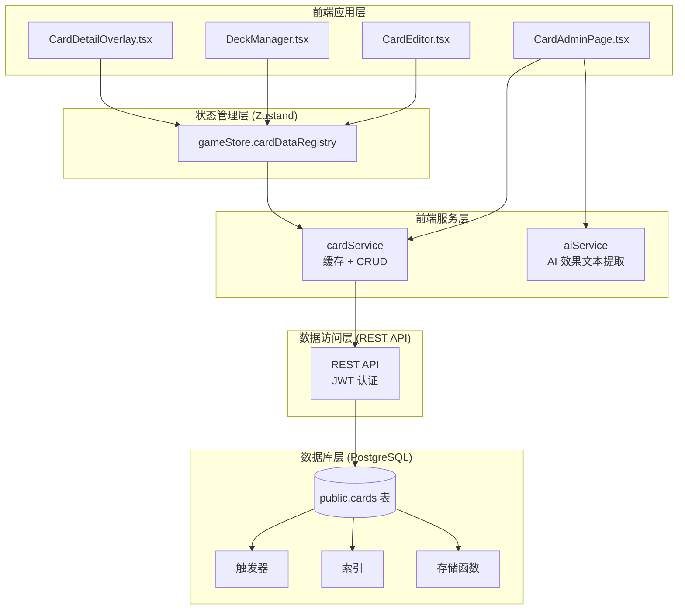
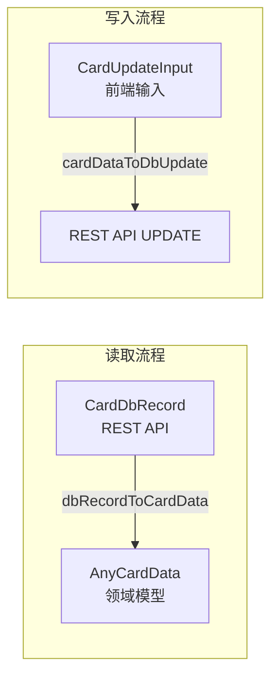
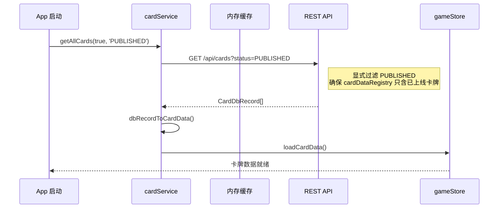
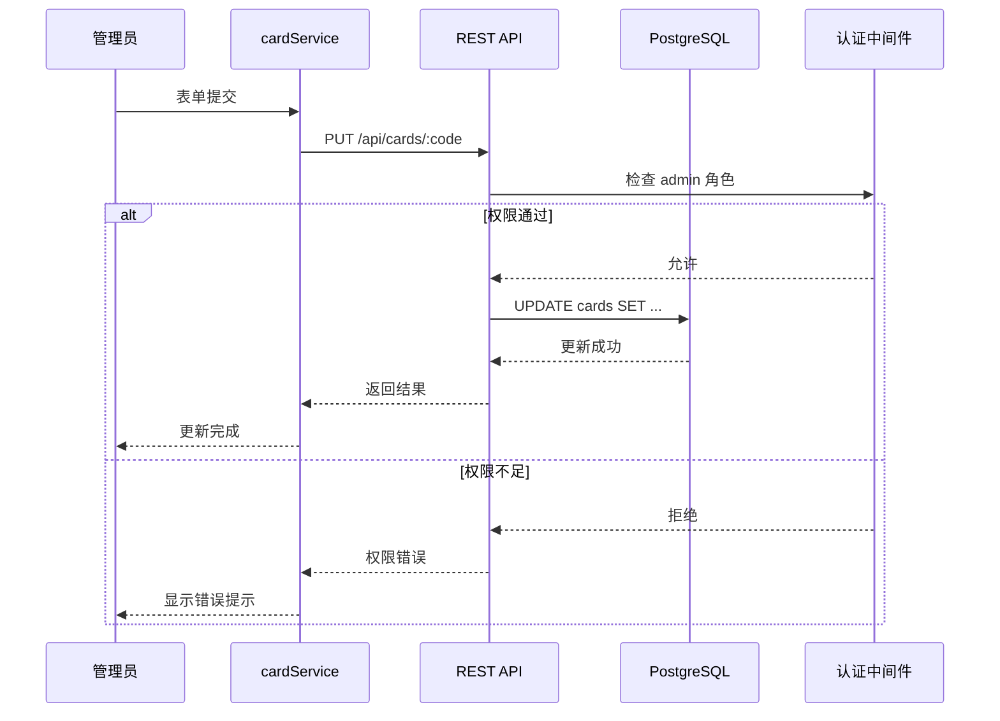
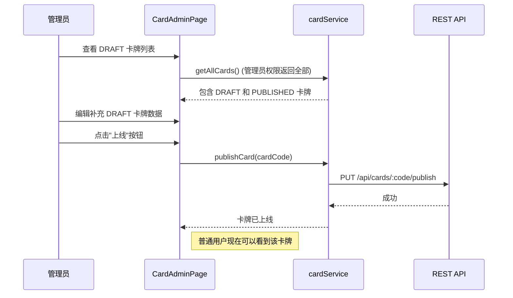

# 卡牌数据管理系统 - 设计文档

> 版本: 1.3.0
> 创建日期: 2026-03-03
> 更新日期: 2026-03-12
> 状态: 已实现

## 1. 系统架构



## 2. 数据模型

### 2.1 数据库表结构 (`cards`)

```sql
CREATE TABLE public.cards (
  id UUID PRIMARY KEY DEFAULT gen_random_uuid(),

  -- 基础信息
  card_code TEXT UNIQUE NOT NULL,        -- 卡牌唯一编号
  card_type TEXT NOT NULL,               -- MEMBER | LIVE | ENERGY
  name TEXT NOT NULL,                    -- 卡牌名称
  group_name TEXT,                       -- 组合名
  unit_name TEXT,                        -- 小组名

  -- 成员卡字段
  cost INT,                              -- 费用
  blade INT,                             -- 应援棒值
  hearts JSONB DEFAULT '[]'::jsonb,      -- 心图标 [{"color": "PINK", "count": 2}]
  blade_hearts JSONB,                    -- 应援棒心效果数组 [{"effect": "DRAW", "heartColor": "PINK"}]

  -- Live 卡字段
  score INT,                             -- 基础分数
  requirements JSONB DEFAULT '[]'::jsonb,-- 心需求 [{"color": "PINK", "count": 3}]

  -- 通用字段
  card_text TEXT,                        -- 效果描述
  image_filename TEXT,                   -- 图片文件名
  rare TEXT,                             -- 稀有度 (R, R+, P, AR, SEC 等)
  product TEXT,                          -- 收录商品名
  status TEXT NOT NULL DEFAULT 'DRAFT',  -- DRAFT | PUBLISHED

  -- 元数据
  created_at TIMESTAMPTZ NOT NULL DEFAULT now(),
  updated_at TIMESTAMPTZ NOT NULL DEFAULT now(),
  updated_by UUID REFERENCES auth.users(id)
);
```

### 2.2 TypeScript 类型定义

**数据库记录类型**

定义于 `client/src/lib/cardService.ts`：

- `CardDbRecord` — 与数据库列一一对应的 snake_case 接口
- `CardUpdateInput` — 前端编辑时提交的 camelCase 可选字段集合
- `CardCreateInput` — 继承 CardUpdateInput，额外必填 cardCode、cardType、name

> **注意**：数据库中的 `rare`（稀有度）和 `product`（收录商品）字段包含在 `CardDbRecord` 中，但前端域模型（`BaseCardData`）、`CardUpdateInput` 和 Admin UI 暂不包含这两个字段。它们目前仅由卡牌数据同步管线写入。

**领域模型类型**

定义于 `src/domain/entities/card.ts`：

```typescript
// 基础卡牌数据（共用字段）
interface BaseCardData {
  cardCode: string;
  name: string;
  cardType: CardType;
  groupName?: string;
  unitName?: string;
  cardText?: string;
  imageFilename?: string;
}

// 成员卡
interface MemberCardData extends BaseCardData {
  cardType: CardType.MEMBER;
  cost: number;
  blade: number;
  hearts: readonly HeartIcon[];
  bladeHearts?: BladeHearts;
}

// Live 卡
interface LiveCardData extends BaseCardData {
  cardType: CardType.LIVE;
  score: number;
  requirements: HeartRequirement;
  bladeHearts?: BladeHearts;
}

// 能量卡
interface EnergyCardData extends BaseCardData {
  cardType: CardType.ENERGY;
}

// 联合类型
type AnyCardData = MemberCardData | LiveCardData | EnergyCardData;
```

### 2.3 数据转换流程



## 3. 核心组件

### 3.1 cardService（前端服务）

**文件路径**: `client/src/lib/cardService.ts`

**职责**:
- 与 REST API 交互的卡牌 CRUD 操作
- 内存缓存管理（5分钟 TTL）
- 数据格式转换（snake_case ↔ camelCase）
- DRAFT/PUBLISHED 状态管理

**缓存策略**:
- 主缓存：`Map<string, AnyCardData>`，TTL 5 分钟
- 状态缓存：独立的 `Map<string, 'DRAFT' | 'PUBLISHED'>`，TTL 5 分钟
- `getAllCards(forceRefresh?, statusFilter?)` 在缓存有效时直接返回缓存数据，过期或强制刷新时从 REST API 重新拉取
- 传入 `statusFilter` 时绕过主缓存直接查询数据库，且不污染全量缓存
- 分页拉取：通过 `fetchAllRows()` 辅助函数分批拉取所有数据

**API 方法**:

| 方法 | 说明 |
|------|------|
| `getAllCards(forceRefresh?, statusFilter?)` | 获取全部卡牌，支持缓存和状态过滤 |
| `getCardByCode(cardCode)` | 按编号查询单张卡牌 |
| `createCard(input)` | 创建新卡牌 |
| `updateCard(cardCode, updates)` | 更新卡牌字段 |
| `deleteCard(cardCode)` | 删除卡牌 |
| `publishCard(cardCode)` | 将卡牌从 DRAFT 上线为 PUBLISHED |
| `unpublishCard(cardCode)` | 将卡牌从 PUBLISHED 下线为 DRAFT |
| `exportCards()` | 导出全部卡牌数据 |
| `importCards(cards)` | 批量导入卡牌，返回成功/失败统计 |
| `getCardsByType(type)` | 按卡牌类型筛选 |
| `getCardsByGroup(groupName)` | 按组合名筛选 |
| `searchCards(query)` | 按名称或编号模糊搜索 |
| `getCardStatusMap()` | 获取全部卡牌的状态映射表 |
| `clearCache()` | 手动清除缓存 |
| `getCacheStatus()` | 获取缓存诊断信息（大小、过期时间） |

### 3.2 gameStore（状态管理）

**文件路径**: `client/src/store/gameStore.ts`

**职责**:
- 存储卡牌数据注册表 (`cardDataRegistry: Map<string, AnyCardData>`)
- 提供 `getCardData(cardCode)` 查询方法
- 提供 `getCardImagePath(cardCode)` 图片路径解析（内部调用 `client/src/lib/imageService.ts` 中的 `resolveCardImagePath`）

`loadCardData(cards, imageMap?)` 方法将 `AnyCardData[]` 加载到 registry Map 中，供游戏组件按 cardCode 查询。

### 3.3 领域模型（Domain）

**文件路径**:
- `src/domain/entities/card.ts` — 卡牌实体定义（BaseCardData、各卡牌类型接口、类型守卫、工厂函数）
- `src/domain/card-data/schema.ts` — Zod Schema 定义
- `src/domain/card-data/loader.ts` — 后端数据加载器

**Zod Schema 验证**:

`AnyCardDataSchema` 为按 `cardType` 字段的 discriminatedUnion，包含 `MemberCardDataSchema`、`LiveCardDataSchema`、`EnergyCardDataSchema` 三个子 schema。

**后端数据注册表**:

`CardDataRegistry` 类提供按 cardCode、name 查询及按类型筛选的能力，`globalCardRegistry` 为全局单例。

### 3.4 CardAdminPage（管理页面）

**文件路径**: `client/src/components/admin/CardAdminPage.tsx`

**职责**:
- 卡牌列表浏览（分页、按类型/状态/关键词筛选）
- 卡牌 CRUD（创建、编辑、删除）
- DRAFT/PUBLISHED 状态管理（上线/下线）
- JSON 导出
- AI 辅助效果文本提取
- 图片上传与进度展示

**浏览与筛选**:
- 分页展示：28 卡/页（4×7 网格），带页码导航
- 类型过滤：ALL / MEMBER / LIVE / ENERGY
- 状态过滤：ALL / DRAFT / PUBLISHED
- 关键词搜索：按名称或编号的子字符串匹配
- 图片预加载：后台预加载当前页卡牌缩略图

**编辑模式**:

CardEditModal 支持两种编辑模式，通过弹窗头部的切换按钮自由切换：

1. **表单模式**（默认）— 各字段独立的输入控件，包含：
   - 心图标、心需求、应援棒心效果的可视化编辑器
   - 组合名/小组名级联下拉选择
   - 图片上传（带进度展示）
   - AI 效果文本提取按钮（需卡牌已保存且有图片）
2. **YAML 模式** — 将卡牌数据序列化为 YAML 文本，支持直接编辑。适合批量修改多个字段或复制粘贴数据

切换逻辑：
- 表单 → YAML：将当前表单数据序列化为 YAML 文本
- YAML → 表单：解析 YAML 文本并回填到表单，解析失败时显示错误提示且不切换
- 保存时：若处于 YAML 模式，先解析 YAML 再提交

### 3.5 aiService（AI 效果提取）

**文件路径**: `client/src/lib/aiService.ts`

**职责**:
- 接收卡牌图片 URL，通过多模态 AI 模型识别并提取效果文本
- 将日文效果文本转换为项目约定的中文标记格式

**集成方式**:
- 在 CardAdminPage 的编辑弹窗中通过"AI 提取"按钮触发
- 调用后端代理的 DashScope API（前端不直接持有 API Key）
- 提取结果回填到表单的 `cardText` 字段

## 4. 安全设计

### 4.1 Row Level Security (RLS) 策略

| 策略名称 | 操作 | 权限 |
|---------|------|------|
| `cards_select_published` | SELECT | 普通用户仅可读取 `status = 'PUBLISHED'` 的卡牌；管理员可读取所有卡牌（DRAFT + PUBLISHED） |
| `cards_insert_admin` | INSERT | 仅管理员 |
| `cards_update_admin` | UPDATE | 仅管理员 |
| `cards_delete_admin` | DELETE | 仅管理员 |

> `cards_select_published` 策略通过 `status = 'PUBLISHED' OR is_admin()` 条件实现读权限分级。

### 4.2 权限检查函数

`is_admin()` 函数查询 `profiles` 表判断当前用户是否为管理员，使用 `SECURITY DEFINER` 确保可以越过 RLS 访问 profiles 表。

## 5. 数据流程图

### 5.1 卡牌加载流程



### 5.2 卡牌编辑流程（管理员）



### 5.3 卡牌上线流程（管理员）



## 6. 索引设计

```sql
CREATE INDEX idx_cards_card_code ON public.cards(card_code);
CREATE INDEX idx_cards_card_type ON public.cards(card_type);
CREATE INDEX idx_cards_group_name ON public.cards(group_name);
CREATE INDEX idx_cards_name ON public.cards(name);
CREATE INDEX idx_cards_rare ON public.cards(rare);
CREATE INDEX idx_cards_status ON public.cards(status);
```

## 7. 错误处理

| 错误场景 | 处理方式 |
|---------|---------|
| 卡牌不存在 | 返回 null |
| 权限不足 | 抛出 Error，前端显示错误提示 |
| 数据格式错误 | Zod 验证失败，记录日志 |

## 8. 相关文件索引

| 文件路径 | 说明 |
|---------|------|
| `client/src/lib/cardService.ts` | 前端卡牌服务（CRUD、缓存、数据转换） |
| `client/src/lib/aiService.ts` | AI 效果文本提取服务 |
| `client/src/components/admin/CardAdminPage.tsx` | 管理页面（表单/YAML 双模式编辑） |
| `client/src/store/gameStore.ts` | 游戏状态管理（cardDataRegistry） |
| `src/domain/entities/card.ts` | 卡牌领域模型（BaseCardData、类型守卫、工厂函数） |
| `src/domain/card-data/schema.ts` | Zod Schema（AnyCardDataSchema） |
| `src/domain/card-data/loader.ts` | 后端数据加载器（CardDataRegistry） |
| `docs/migrations/003_create_cards_table.sql` | 建表迁移脚本 |
| `docs/migrations/004_add_blade_hearts.sql` | blade_hearts 字段迁移 |
| `docs/migrations/005_add_rare_product.sql` | rare/product 字段迁移 |
| `docs/migrations/006_add_card_status.sql` | status 字段及 RLS 策略迁移 |

## 9. 相关文档

- [需求文档](./requirements.md)
- [卡牌数据同步管线 - 需求文档](../card-data-sync/requirements.md)
- [卡组管理系统 - 设计文档](../deck-management/design.md)
