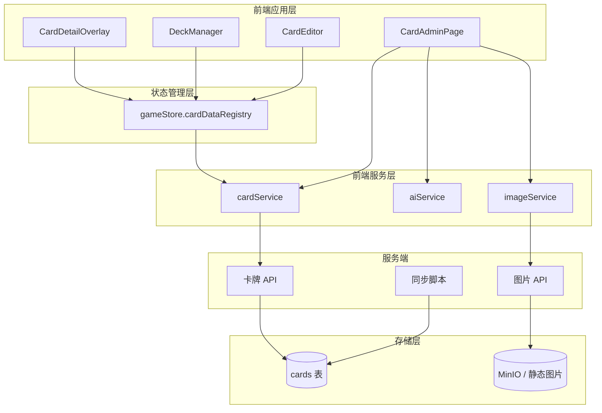

# 卡牌数据管理系统 - 设计文档

> 版本: 1.4.0
> 创建日期: 2026-03-03
> 更新日期: 2026-06-12
> 文档类型: 设计文档
> 适用范围: 卡牌数据模型、管理端、前端服务、同步脚本与图片能力
> 当前状态: 主体已实现；跨模块已知限制见 [当前实现限制](../current-limitations.md)

本文档说明卡牌数据管理系统的架构与设计边界，不维护具体 SQL、接口实现或组件内部状态。当前代码事实以相关代码路径为准。

## 1. 设计目标

- 为对局、卡组编辑、卡牌管理和同步脚本提供统一的卡牌数据来源。
- 区分管理态与玩家态：管理员可以维护 DRAFT/PUBLISHED 卡牌，普通对局与构筑只消费已上线卡牌。
- 让结构化字段服务于规则计算、筛选和展示；非规则字段不进入对局逻辑。
- 支持外部数据同步、人工修订、图片上传和 AI 辅助录入，但这些能力不改变领域模型边界。

## 2. 系统架构

## 3. 领域模型

卡牌以 `cardCode` 为稳定标识，并按 `CardType` 分为三类：

| 类型 | 主要用途 | 关键结构化字段 |
| --- | --- | --- |
| MEMBER | 成员卡、费用、应援棒与心图标规则 | cost、blade、hearts、bladeHearts、groupName、unitName |
| LIVE | Live 成功判定与分数展示 | score、requirements、bladeHearts、groupName、unitName |
| ENERGY | 能量牌组与能量区展示 | groupName、unitName、product |

通用字段包括名称、效果文本、图片文件名、稀有度、收录商品和发布状态。`rare` 与 `product` 用于管理、展示和筛选，不参与对局规则计算。

特殊点数不属于卡牌表字段，也不进入通用卡牌实体；点数规则由构筑规则模块维护，避免把构筑限制写入基础卡牌资料。

## 4. 状态与可见性

卡牌维护存在两个状态：

| 状态 | 含义 | 可见性 |
| --- | --- | --- |
| DRAFT | 未完成、待校对或暂不开放 | 仅管理员可见 |
| PUBLISHED | 可用于构筑与对局 | 普通用户与游戏流程可见 |

应用启动和卡组编辑只加载 PUBLISHED 卡牌到 `gameStore.cardDataRegistry`。管理员页面可以查看和维护全部状态。

## 5. 数据转换

系统在数据库记录、前端输入和领域模型之间保持明确转换边界：

- 数据库存储使用后端 schema 定义的持久化字段。
- 前端服务负责把持久化记录转换为 `AnyCardData` 领域对象。
- 管理端表单/YAML 编辑器负责把人工输入约束到可提交形态；服务端写入接口当前主要校验权限、基础字段和状态枚举。
- `hearts`、`blade_hearts`、`requirements` 等 JSON 结构字段当前仍以管理端转换、领域 schema、同步脚本和后续读取转换作为主要约束，API 写入层尚未形成完整结构强校验。
- 读取、导出和同步边界会对同类型、同基础编号卡牌缺失的 `blade_hearts` 做派生补全；该补全属于业务读取视图，不改变数据库持久字段和写入接口的显式值语义。
- 同步脚本只在同步边界处理外部字段名和历史字段名，不把外部数据源结构泄漏到 REST API 或领域模型。

## 6. 前端职责

| 模块 | 职责 |
| --- | --- |
| CardAdminPage | 管理员卡牌列表、筛选、创建、编辑、发布状态切换、导入导出和图片维护入口 |
| CardEditModal | 表单/YAML 双模式编辑，负责把人工输入约束到卡牌模型可接受的形态 |
| cardService | REST 访问、缓存、状态过滤和记录到领域模型的转换 |
| gameStore.cardDataRegistry | 对局和构筑时的只读卡牌资料注册表 |
| imageService | 卡牌图片 URL 解析和尺寸选择 |
| aiService | 管理端辅助提取效果文本，不参与对局或规则判定 |

## 7. 服务端职责

- 卡牌 API 负责卡牌资料的读取、创建、更新、删除、发布状态切换和批量导入导出。
- 普通读取只暴露 PUBLISHED 卡牌；管理读取可包含 DRAFT。
- 列表读取、单卡读取和管理导出返回业务读取视图；当前该视图会补全同基础编号缺失的 `blade_hearts`。
- 所有写操作要求管理员权限。
- 图片 API 只处理上传、删除与对象存储写入；图片公开读取通过 `/images/*` 路径完成。
- 服务端 schema 是持久化结构的权威来源，初始化脚本或历史迁移不应与其长期分叉。

## 8. 同步与外部数据

`llocg_db` 同步脚本是当前维护中的批量导入通道。它负责读取外部 JSON、标准化卡号、合并中文补充数据、转换结构化字段，并在写入前对已有卡牌差异进行人工审核。

同步脚本会影响卡牌基础资料和发布状态，因此属于高风险维护入口。具体字段映射与运行边界见 [卡牌数据同步需求](../card-data-sync/requirements.md) 和 [卡牌数据同步管线](../card-data-sync/design.md)。

## 9. 安全边界

- 普通用户只能读取已发布卡牌。
- 管理员可以读取和修改草稿、已发布卡牌以及批量数据。
- 前端不持有第三方 AI 或对象存储密钥。
- AI 识别和图片上传只能作为管理端辅助能力，不能绕过管理端确认与卡牌字段约束。
- 外部数据同步必须经过标准化和差异审核，避免静默覆盖人工修订。

## 10. 已知限制

- 当前卡牌列表读取以全量加载为主，尚未形成分页级别的数据访问契约。
- 卡牌写入 API 对结构化 JSON 字段仍是宽松透传；若要把字段规范作为服务端强契约，需要在写入路由补齐对应 schema 校验。
- 同步脚本以外部数据为主源，运行前需要确认是否会覆盖人工维护的 DRAFT 内容。
- 图片 URL 解析和对象存储策略依赖 MinIO 文档中定义的路径约定。
- 数据库初始化、Drizzle schema 和历史迁移之间的差异集中记录在 [当前实现限制](../current-limitations.md)。

## 11. 相关代码路径

| 路径 | 说明 |
| --- | --- |
| `client/src/lib/cardService.ts` | 前端卡牌服务、缓存与数据转换 |
| `client/src/lib/aiService.ts` | AI 效果文本提取服务 |
| `client/src/lib/imageService.ts` | 图片 URL 与尺寸解析 |
| `client/src/components/admin/CardAdminPage.tsx` | 管理页面入口 |
| `client/src/store/gameStore.ts` | `cardDataRegistry` 所在状态模块 |
| `src/domain/entities/card.ts` | 卡牌领域模型 |
| `src/domain/card-data/schema.ts` | 卡牌数据校验 schema |
| `src/domain/card-data/loader.ts` | 卡牌注册表结构与按编号/名称查找能力 |
| `src/domain/rules/deck-construction.ts` | 特殊点数与构筑点数规则 |
| `src/server/db/schema.ts` | 持久化 schema |
| `src/server/routes/cards.ts` | 卡牌 API 路由 |
| `src/server/services/card-registry-service.ts` | 后端从数据库加载并缓存 PUBLISHED 卡牌注册表 |
| `src/scripts/sync-cards-llocg.ts` | 当前卡牌同步脚本 |

## 12. 相关文档

- [需求文档](./requirements.md)
- [卡牌数据规格](./data-spec.md)
- [卡牌数据同步需求](../card-data-sync/requirements.md)
- [卡组管理系统设计](../deck-management/design.md)
