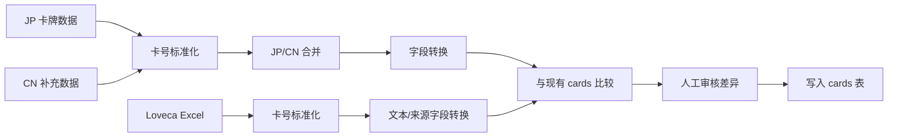

# 卡牌数据同步管线

> 更新时间: 2026-06-28
> 文档类型: 设计文档
> 适用范围: 当前卡牌同步脚本、标准化、差异审核和写入策略
> 当前状态: 以 `src/scripts/sync-cards-llocg.ts` 与 `src/scripts/sync-cards-loveca-excel.ts` 为准

本文档说明同步管线的架构和设计边界，不维护具体命令、SQL 查询、JSON 样例或终端输出格式。

## 1. 总览

当前维护两条同步管线：

- `llocg_db` 主同步：从 JP/CN JSON 读取结构化规则字段和基础展示字段，转换为项目内部卡牌模型后写入 `cards` 表。
- Loveca Excel 文本/来源同步：从 Loveca Excel 读取中日名称、中日效果文本、真实团体、真实小队和商品来源字段，写入新增的多语言与来源字段；不读取 Excel 官方 `作品名` / `参加ユニット`，也不接管费用、Heart、分数等对局规则字段。

另有一个只读调查入口 `src/scripts/audit-loveca-effect-placeholders.ts`。它不属于写库同步管线，只用于扫描 Loveca Excel 双语效果文本中的 `【...】` 与 `[...]` 占位符，辅助前端渲染映射和上游文本质量检查。

两条管线是分层关系，不是互相替代：

| 脚本 | 上游数据源 | 核心职责 | 不负责 |
| --- | --- | --- | --- |
| `src/scripts/sync-cards-llocg.ts` | `llocg_db/json/cards.json`、`llocg_db/json/cards_cn.json` | 建立或刷新卡牌主记录；负责卡牌类型、费用、Heart、BLADE、LIVE 分数、必要 Heart、图片文件名、稀有度、收录商品、作品数组和基础中日文本 | 不读取 Loveca Excel；不处理 Excel 修正后的真实团体、商品编号、云端图链来源和外部数据标识 |
| `src/scripts/sync-cards-loveca-excel.ts` | `docs/card-data-sync/sources/loveca_*.xlsx` | 在已有卡牌基础上补强中日名称、中日效果、真实团体、真实小队、商品编号、图片来源 URI 和外部来源标识 | 不插入 Excel-only 新卡；不删除 DB-only 卡；不覆盖 `card_type`、费用、Heart、BLADE、LIVE 分数、必要 Heart、`blade_hearts`、`work_names` |

推荐运行顺序是先运行 `sync-cards-llocg.ts` 建立规则字段和基础卡池，再运行 `sync-cards-loveca-excel.ts` 补齐更可靠的双语文本、真实团体、小队原文、商品和来源信息。

脚本支持 dry-run 和正式写入两种运行模式。

## 2. 设计原则

- 外部数据结构只在同步脚本内处理，不进入卡牌 API 或前端领域模型。
- 卡牌编号标准化是合并、去重和差异比较的前置步骤。
- JP 数据作为主源，CN 数据作为翻译和补充源。
- Loveca Excel 作为中日文本和来源字段的优先来源，但不覆盖结构化规则字段。
- 结构化字段必须转换为项目内部模型后再写入。
- 已存在卡牌不允许静默覆盖，必须经过差异审核。
- dry-run 不连接或写入目标数据库，只用于验证转换与统计。

## 3. 数据源合并

`llocg_db` 同步管线先标准化 JP/CN 两侧卡牌编号，再执行合并：

| 数据情况          | 处理方式                                           |
| ----------------- | -------------------------------------------------- |
| JP 与 CN 同时存在 | 使用 JP 作为基础，叠加 CN 名称和效果文本等补充信息 |
| 仅 JP 存在        | 使用 JP 数据生成记录                               |
| 仅 CN 存在        | 生成 CN-only 记录，并保留结构化字段不完整的风险    |

中文优先规则只影响展示和文本字段，不应改变卡牌类型、规则字段和卡号归属。

Loveca Excel 同步同样先标准化卡牌编号，但它只匹配数据库已有记录。Excel-only 卡号会报告并跳过，DB-only 卡不受影响；Excel 内部出现标准化重复卡号时，整组跳过并输出 warning，避免用遍历顺序决定覆盖结果。

## 4. 字段转换边界

同步脚本负责把外部字段转换为内部卡牌资料，主要覆盖：

- 基础身份：卡牌编号、卡牌类型、中日名称。
- 展示资料：中日效果文本、图片文件名、稀有度、收录商品。
- MEMBER 规则字段：费用、应援棒、心图标、BLADE 心效果。
- LIVE 规则字段：分数、需求心、BLADE 心效果。
- 归属信息：作品数组、真实团体数组、小组。其中 Excel 同步只更新修正后的真实团体和真实小队。
- 发布状态。
- 多语言与来源字段：日文名、中文名、日文效果、中文效果、真实团体数组、商品编号、外部来源标识。

`cards` 表不保留重复展示字段。数据库只存 `name_jp` / `name_cn`、`card_text_jp` / `card_text_cn`、`work_names` / `group_names` 等明确字段；运行时 `card.data.name`、`card.data.cardText`、`card.data.groupName` 由 registry / cardService 按中文优先和真实团体数组派生，不回写数据库。

未被同步覆盖的字段应由管理端或其他明确入口维护。新增卡牌字段时，需要同时评估同步脚本、卡牌管理 API 和前端转换层。

## 5. 差异审核

正式写入前，脚本需要读取现有卡牌并按标准化卡号比较同步字段：

| 比较结果                   | 处理         |
| -------------------------- | ------------ |
| 数据库不存在               | 插入新卡     |
| 数据库存在且同步字段无差异 | 跳过         |
| 数据库存在且同步字段有差异 | 加入人工审核 |

人工审核是防止外部数据覆盖人工修订的核心保护。存在待审核更新时，脚本必须要求可交互终端；不可交互环境不得直接更新已有卡牌。

## 6. 发布状态设计

当前同步记录会进入 PUBLISHED 状态。这让批量同步后的卡牌能立即被普通构筑和对局读取，但也带来风险：

- DRAFT 卡牌可能被同步更新后变成 PUBLISHED。
- 外部数据质量问题会直接影响玩家可见卡牌。
- 新卡包导入后需要额外检查管理端和构筑端的可见性。

如果未来希望同步默认进入 DRAFT，应作为需求变更处理，并同步调整卡牌管理、构筑可见性和发布流程。

## 7. 运行模式

| 模式     | 目标                     | 写入数据库 | 人工审核     |
| -------- | ------------------------ | ---------- | ------------ |
| dry-run  | 验证输入、转换和统计     | 否         | 否           |
| 正式运行 | 插入新卡并审核更新已有卡 | 是         | 有差异时需要 |

Loveca Excel 文本/来源同步不会插入 Excel-only 新卡，也不会因 Excel 缺失删除数据库已有卡。Excel 内部出现标准化重复卡号时，脚本会跳过该卡号并报告 warning，避免按行遍历顺序覆盖。

维护者应先使用 dry-run 观察数据量、CN 匹配、CN-only、能量卡和字段缺失情况，再进行正式运行。Loveca Excel 原始文件放在本地 `docs/card-data-sync/sources/`，该目录不进入仓库；需要同步时由维护者在本地提供对应 `.xlsx`。

Loveca Excel 卡效占位符调查脚本的运行命令是 `pnpm exec tsx src/scripts/audit-loveca-effect-placeholders.ts`。该脚本只读取 Excel 并输出统计，不连接数据库，不更改同步写入结果；加 `--json` 可输出机器可读摘要。当前 `loveca_20260626015115.xlsx` 的已知占位符分为时点、次数限制、站位、Heart、BLADE、费用和分数；未知 token 会保留原文输出，供修正 Excel 或扩充前端渲染映射。

## 8. 与其他模块关系

同步写入的数据会被以下模块消费：

- `cardService` 读取卡牌并转换为前端领域模型。
- `gameStore.cardDataRegistry` 提供构筑和对局可用卡牌。
- `DeckManager` 和 `CardEditor` 基于 PUBLISHED 卡牌进行构筑。
- 卡牌管理页面负责后续人工修订、下线和图片维护。

同步脚本不直接处理卡组、对局状态或图片对象迁移。

## 9. 相关代码路径

| 路径                                     | 说明                                    |
| ---------------------------------------- | --------------------------------------- |
| `src/scripts/sync-cards-llocg.ts`        | 同步脚本入口                            |
| `src/scripts/sync-cards-loveca-excel.ts` | Loveca Excel 中日文本与来源字段同步入口 |
| `src/scripts/audit-loveca-effect-placeholders.ts` | Loveca Excel 卡效占位符只读调查入口 |
| `src/shared/utils/card-code.ts`          | 卡牌编号标准化                          |
| `src/server/db/schema.ts`                | `cards` 表 schema                       |
| `src/domain/entities/card.ts`            | 内部卡牌领域模型                        |
| `client/src/lib/cardService.ts`          | 前端卡牌服务与转换                      |
| `client/src/lib/cardEffectTokens.ts`     | 前端卡效占位符解析映射                  |
| `client/src/components/card/CardEffectText.tsx` | 前端卡效文本渲染组件                    |

## 10. 相关文档

- [卡牌数据同步文档索引](./README.md)
- [卡牌数据同步需求](./requirements.md)
- [llocg_db 卡牌同步](./llocg-db-requirements.md)
- [llocg_db 与 Loveca Excel 格式差异调查](./llocg-vs-xlsx-format-audit-20260626.md)
- [卡牌数据管理设计](../card-data-management/design.md)
