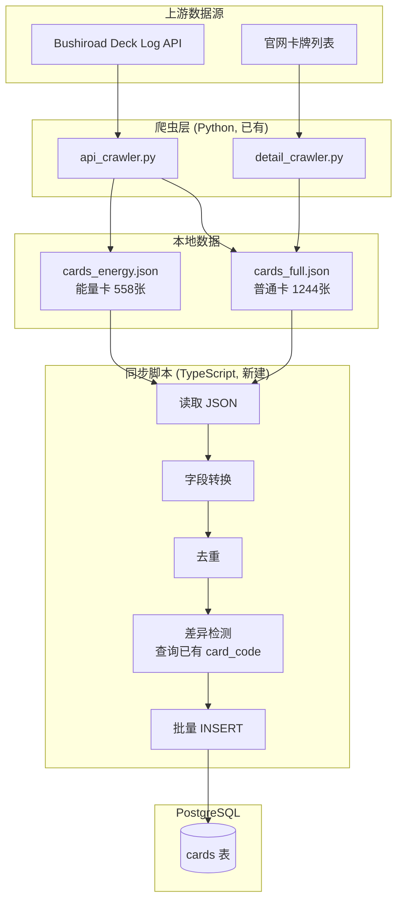
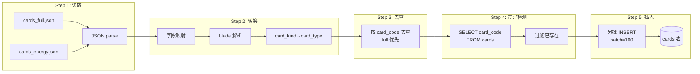

# 卡牌数据同步管线 - 设计文档

> 版本: 1.0.0
> 创建日期: 2026-03-09
> 状态: 待实现

## 1. 系统架构



## 2. 数据库变更

### 2.1 新增字段迁移

- `docs/migrations/005_add_rare_product.sql` — 新增 `rare TEXT` 和 `product TEXT`
- `docs/migrations/006_add_card_status.sql` — 新增 `status TEXT`（DRAFT/PUBLISHED），更新 RLS SELECT 策略

### 2.2 类型定义更新

`client/src/lib/cardService.ts` 中 `CardDbRecord` 接口需新增：

```typescript
rare: string | null;
product: string | null;
status: 'DRAFT' | 'PUBLISHED';
```

## 3. 同步脚本设计

### 3.1 文件路径

`src/scripts/sync-cards.ts`

### 3.2 数据流



### 3.3 字段转换规则

#### card_kind → card_type

| 爬虫值 | 数据库值 |
|-------|---------|
| `M` | `MEMBER` |
| `L` | `LIVE` |
| `E` | `ENERGY` |

#### blade 解析（字符串 → 整数）

| 爬虫值 | 数据库值 | 说明 |
|-------|---------|------|
| `""` / `"-"` | `null` | 无应援棒 |
| `"1"` ~ `"4"` | `1` ~ `4` | 直接转换 |
| `"ALL1"` | `1` | 全色应援棒 |
| 带颜色前缀如 `"桃1"` | 提取尾部数字 | 特定颜色应援棒 |
| `"[全ブレード]"` | `1` | 全色应援棒（日文表记） |
| 其他未知格式 | `null` | 记录警告日志 |

#### status 默认值

同步脚本插入的新卡牌 `status` 固定为 `'DRAFT'`，管理员审核上线后改为 `'PUBLISHED'`。

#### 不填充的字段（留空）

以下字段在插入时使用数据库默认值（null 或空数组），由管理员后续手动补充：

`cost`, `hearts`, `blade_hearts`, `score`, `requirements`, `group_name`, `unit_name`

### 3.4 去重策略

合并两个 JSON 文件时，按 `card_code` 去重：
- 如果同一 `card_code` 同时出现在 `cards_full.json` 和 `cards_energy.json` 中，优先保留 `cards_full.json` 版本（包含 `effect_text` 和 `product`）

### 3.5 同步策略

INSERT-only：
1. 查询数据库中所有已有的 `card_code`（单次 SELECT 查询）
2. 将已有的 `card_code` 构建为 Set
3. 过滤掉已存在的卡牌，仅保留新卡
4. 分批 INSERT（每批 100 条）

### 3.6 PostgreSQL 连接

使用 `pg` 库直接连接数据库，绕过 RLS 策略（管理员连接）：

```typescript
import { Pool } from 'pg';

const pool = new Pool({
  connectionString: process.env.DATABASE_URL,
});
```

### 3.7 CLI 接口

```bash
# 正式同步
npx tsx src/scripts/sync-cards.ts

# 预览模式（不写入数据库）
npx tsx src/scripts/sync-cards.ts --dry-run
```

### 3.8 错误处理

| 场景 | 处理方式 |
|-----|---------|
| 缺少 `DATABASE_URL` | 打印用法说明，退出 |
| JSON 文件不存在或解析失败 | 打印错误，退出 |
| 数据库查询失败 | 打印错误，退出 |
| 单批插入失败 | 记录错误和批次范围，继续处理下一批 |
| blade 解析遇到未知格式 | 记录警告，置为 null |

### 3.9 输出日志示例

```
Card Data Sync

Step 1: Reading JSON sources...
  cards_full.json: 1244 cards (MEMBER: 1069, LIVE: 175)
  cards_energy.json: 558 cards
  Total: 1802 cards (after dedup)

Step 2: Checking existing cards in DB...
  Found 500 existing cards

Step 3: Filtering new cards...
  New cards to insert: 1302
  Skipped (already exist): 500

Step 4: Inserting new cards...
  Batch 1/14: 100 cards... OK
  Batch 2/14: 100 cards... OK
  ...

Summary:
  Read: 1802
  Skipped: 500
  Inserted: 1302
  Failed: 0
```

## 4. 相关文件索引

| 文件路径 | 说明 |
|---------|------|
| `src/scripts/sync-cards.ts` | 同步脚本（新建） |
| `docs/migrations/005_add_rare_product.sql` | 数据库迁移 - rare/product 字段 |
| `docs/migrations/006_add_card_status.sql` | 数据库迁移 - status 字段 + RLS 更新 |
| `docs/card-data-sync/requirements.md` | 需求文档 |
| `client/src/lib/cardService.ts` | 前端卡牌服务（需更新类型） |
| `src/scripts/upload-to-minio.ts` | 图片上传脚本（参考模式） |
| `test/data/cards_full.json` | 爬虫输出 - 普通卡牌 |
| `test/data/cards_energy.json` | 爬虫输出 - 能量卡 |
| `test/crawler/api_crawler.py` | 爬虫 - API 数据抓取 |
| `test/crawler/detail_crawler.py` | 爬虫 - 官网详情补充 |

## 5. 相关文档

- [需求文档](./requirements.md)
- [爬虫项目文档](../../test/docs/crawl.md)
- [卡牌数据管理 - 设计文档](../card-data-management/design.md)
- [数据库迁移脚本](../migrations/003_create_cards_table.sql)
