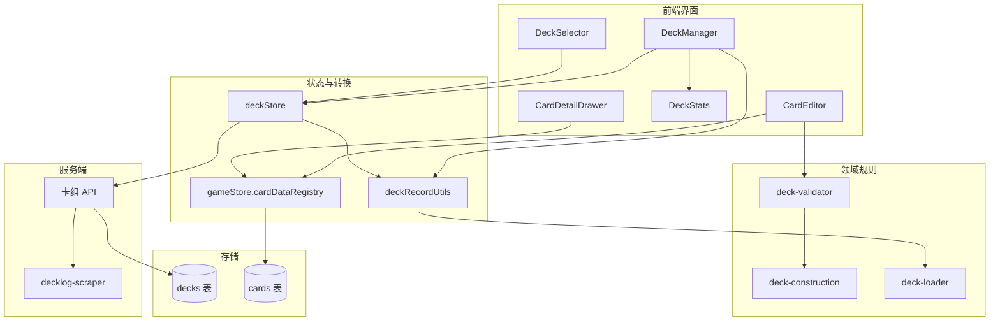
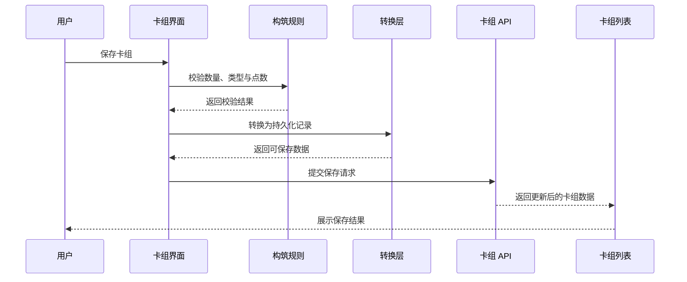
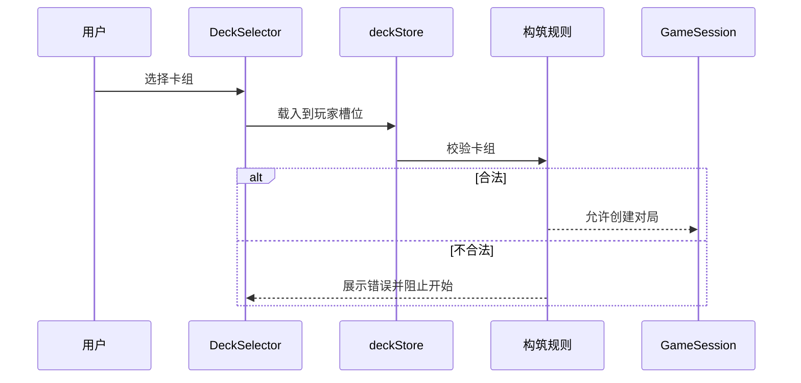

# 用户卡组管理系统 - 设计文档

> 版本: 1.4.0
> 创建日期: 2026-03-03
> 最后更新: 2026-06-12
> 文档类型: 设计文档
> 适用范围: 卡组管理 UI、deckStore、卡组 API、分享/复制与 DeckLog 导入能力
> 当前状态: 已实现；部署和 schema 差异见 [当前实现限制](../current-limitations.md)

本文档说明卡组管理系统的架构、数据边界和关键设计取舍，不维护具体 SQL、接口参数、React 状态变量或函数级实现细节。

## 1. 设计目标

- 支持玩家创建、编辑、保存、选择和删除自己的卡组。
- 保证构筑规则在保存、展示和进入游戏前得到一致校验。
- 允许卡组在本地槽位、云端记录和分享页之间转换，但不暴露数据库结构给 UI。
- 支持公开分享、复制到自己账号，以及从 DeckLog 导入卡表作为编辑起点。
- 与卡牌数据管理系统共享 PUBLISHED 卡牌资料，避免草稿卡进入普通构筑流程。

## 2. 系统架构

## 3. 数据模型

卡组在系统内有两个主要形态：

| 形态 | 使用位置 | 设计目的 |
| --- | --- | --- |
| `DeckConfig` | 构筑、游戏入口、本地槽位 | 面向领域规则，明确区分成员卡、Live 卡和能量卡 |
| `DeckRecord` | 云端持久化、分享、列表 | 面向存储与权限，包含所有者、分享状态、校验状态和更新时间 |

`DeckRecord` 与 `DeckConfig` 的转换由共享领域工具 `src/domain/card-data/deck-record-utils.ts` 维护，客户端通过 `client/src/lib/deckRecordUtils.ts` 复用该实现。转换层负责处理旧数据兼容、主卡组中 MEMBER/LIVE 的分流，以及保存时的持久化形态整理。

## 4. 构筑规则

卡组验证由领域规则模块统一维护，UI 只消费验证结果：

- 主卡组必须满足成员卡与 Live 卡的数量要求。
- 能量卡组必须满足固定张数要求。
- 同基础编号的卡牌在主卡组中合计不能超过上限，不同稀有度视为同一基础编号。
- 主卡组不能包含能量卡；能量卡组只能包含能量卡。
- 特殊点数按基础编号计算，卡组总点数不能超过规则上限。

基础编号提取由共享工具维护，确保构筑、统计和展示中的“同卡”定义一致。

## 5. 前端职责

| 模块 | 职责 |
| --- | --- |
| DeckManager | 卡组列表、创建、编辑、删除、导入导出、分享入口和 DeckLog 导入入口 |
| CardEditor | 卡牌浏览、筛选、添加/移除、卡组预览和详情查看 |
| DeckStats | 数量、点数、校验状态和更新时间等摘要展示 |
| DeckSelector | 游戏开始前选择本地或云端卡组 |
| deckStore | 云端卡组加载与保存、本地玩家槽位、当前编辑卡组状态 |
| deckRecordUtils | 云端记录与领域卡组配置之间的转换 |

卡牌浏览与构筑只使用 `gameStore.cardDataRegistry` 中的 PUBLISHED 卡牌，因此普通玩家不能把 DRAFT 卡加入卡组。

## 6. 卡牌筛选与预览

卡牌编辑器围绕高频构筑操作设计：

- 按卡牌类型分区浏览。
- 支持名称、编号、稀有度、组合、小组、费用、心颜色、BLADE 心效果、分数和收录商品等筛选维度。
- 成员卡、Live 卡和能量卡展示适合自身类型的筛选项。
- 卡组预览按类型和规则相关字段排序，帮助玩家快速检查曲线、分数和能量构成。
- 同基础编号计数在浏览区和卡组区保持一致，避免不同稀有度变体绕过数量上限。

## 7. 服务端与权限

卡组 API 以登录用户为隔离边界：

- 用户只能管理自己的卡组。
- 管理员可进行必要的维护操作；当前服务端支持按已知卡组 ID 读取、修改、删除和维护分享状态，尚未提供管理员全量列表或审核工作台。
- 公开或开启分享的卡组可以被非所有者读取。
- 分享卡组可被登录用户复制到自己的账号，复制后与原卡组独立维护。
- 卡组保存会记录校验状态和校验错误，允许未完成卡组暂存，但进入对局前仍需满足规则。
- 服务端保存、更新和复制分享卡组时会基于当前 PUBLISHED 卡池重新规范化卡组记录并计算 `is_valid` / `validation_errors`；客户端提交的派生校验字段不作为可信事实。

服务端 schema 与初始化脚本的差异不在本文重复维护，统一记录在 [当前实现限制](../current-limitations.md)。

## 8. 数据流程

### 8.1 保存流程

### 8.2 选择进入游戏流程

## 9. 分享与复制

分享能力采用“公开可读、复制后独立”的模型：

- 卡组所有者可以开启或关闭分享。
- 分享链接暴露的是只读卡组信息。
- 登录用户可以把分享卡组复制到自己的账号。
- 复制卡组保留来源信息，便于后续展示来源关系，但复制后的修改不影响原卡组。
- 关闭分享后，原分享链接不应继续作为公开入口。

## 10. DeckLog 导入

DeckLog 导入是辅助构筑入口，而不是持久化事实来源：

- 前端接收 DeckLog ID 或 URL。
- 服务端代理访问 DeckLog 并标准化卡号。
- 前端用当前卡牌注册表匹配卡牌类型。
- 可匹配卡牌进入卡组编辑器；未匹配卡牌以警告形式提示。
- 导入结果需要玩家再次检查和保存。

该能力依赖 DeckLog 的外部数据结构，稳定性低于项目内部数据。外部结构变化时，应优先修复导入服务，而不是改变卡组领域模型。

## 11. 已知限制

- DeckLog 导入依赖外部站点接口，不能视为稳定契约。
- 本地槽位、云端卡组和分享卡组之间存在转换边界，新增字段时必须同步检查转换层。
- 未完成卡组可以保存，但不能绕过进入游戏前的构筑校验。
- 图片下载 ZIP 能力当前不作为已实现能力维护；若恢复，需要重新确认权限、文件命名和失败策略。

## 12. 相关代码路径

| 路径 | 说明 |
| --- | --- |
| `client/src/components/deck/DeckManager.tsx` | 卡组管理页面 |
| `client/src/components/common/DeckStats.tsx` | 卡组统计与状态展示 |
| `client/src/components/common/DeckSelector.tsx` | 游戏开始前卡组选择 |
| `client/src/components/deck-editor/CardEditor.tsx` | 卡组编辑器 |
| `client/src/components/deck-editor/CardDetailDrawer.tsx` | 编辑器与分享页卡牌详情 |
| `client/src/store/deckStore.ts` | 卡组状态管理 |
| `client/src/lib/deckRecordUtils.ts` | 客户端复用共享卡组记录转换工具的出口 |
| `client/src/lib/apiClient.ts` | REST 客户端与卡组记录类型 |
| `src/domain/card-data/deck-record-utils.ts` | `DeckRecord` 与 `DeckConfig` 转换、旧格式规范化和服务端保存前校验 |
| `src/domain/card-data/deck-loader.ts` | `DeckConfig` 与卡组加载模型 |
| `src/domain/rules/deck-validator.ts` | 卡组基础验证规则 |
| `src/domain/rules/deck-construction.ts` | 构筑限制与点数规则 |
| `src/shared/utils/card-code.ts` | 基础卡号提取 |
| `src/server/routes/decks.ts` | 卡组 API 路由 |
| `src/server/services/deck-storage-service.ts` | 服务端卡组保存前规范化与发布卡池校验 |
| `src/server/services/decklog-scraper.ts` | DeckLog 导入服务 |
| `src/server/db/schema.ts` | 持久化 schema |
| `src/scripts/normalize-deck-records.ts` | 生产卡组记录检查与旧格式迁移脚本 |

## 13. 相关文档

- [需求文档](./requirements.md)
- [卡组分享方案](./share-plan.md)
- [卡牌数据管理系统设计](../card-data-management/design.md)
