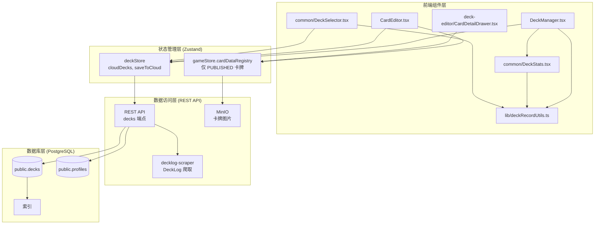
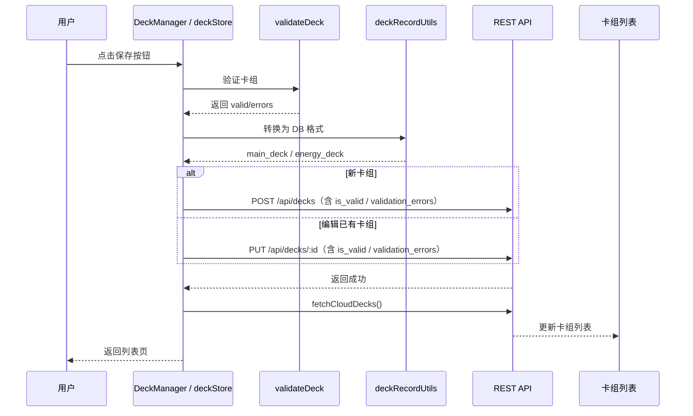
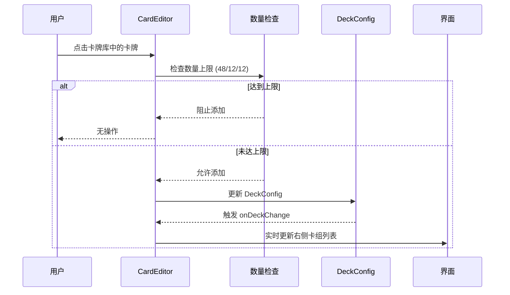
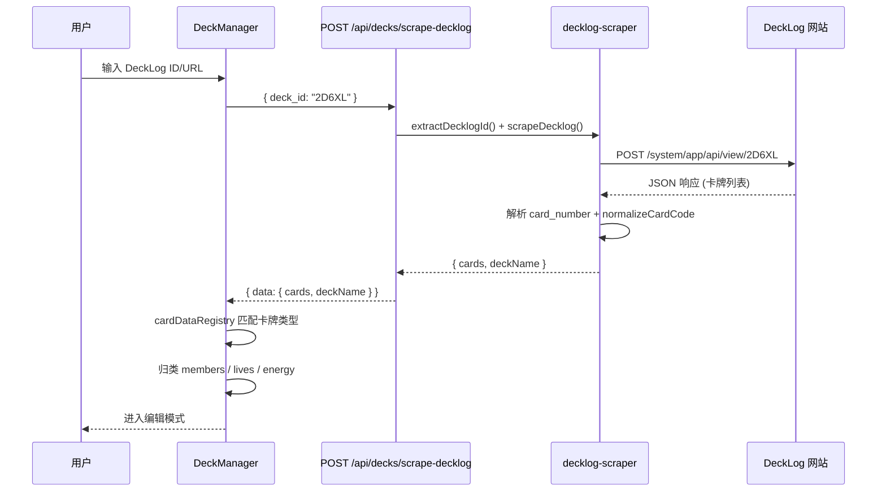

# 用户卡组管理系统 - 设计文档

> 版本: 1.3.0
> 创建日期: 2026-03-03
> 最后更新: 2026-06-11
> 状态: 已实现

## 1. 系统架构



## 2. 数据模型

### 2.1 数据库表结构 (`decks`)

```sql
CREATE TABLE public.decks (
  id UUID PRIMARY KEY DEFAULT gen_random_uuid(),
  user_id UUID NOT NULL REFERENCES public.profiles(id) ON DELETE CASCADE,

  -- 基础信息
  name TEXT NOT NULL,                    -- 卡组名称
  description TEXT,                      -- 卡组描述（nullable）

  -- 卡组数据
  main_deck JSONB NOT NULL DEFAULT '[]'::jsonb,
  energy_deck JSONB NOT NULL DEFAULT '[]'::jsonb,

  -- 验证状态
  is_valid BOOLEAN NOT NULL DEFAULT false,   -- 是否通过验证
  validation_errors JSONB DEFAULT '[]'::jsonb, -- 验证错误信息

  -- 分享设置
  is_public BOOLEAN NOT NULL DEFAULT false,  -- 是否公开分享
  share_id UUID DEFAULT gen_random_uuid() UNIQUE,
  share_enabled BOOLEAN NOT NULL DEFAULT false,
  shared_at TIMESTAMPTZ,
  forked_from_deck_id UUID REFERENCES public.decks(id) ON DELETE SET NULL,
  forked_from_share_id UUID,
  forked_at TIMESTAMPTZ,

  -- 元数据
  created_at TIMESTAMPTZ NOT NULL DEFAULT now(),
  updated_at TIMESTAMPTZ NOT NULL DEFAULT now()
);

-- main_deck JSON 格式（card_type 为可选字段，用于区分 MEMBER/LIVE）
-- [
--   {"card_code": "PL-sd1-001", "count": 4, "card_type": "MEMBER"},
--   {"card_code": "LL-bp1-001", "count": 2, "card_type": "LIVE"}
-- ]

-- energy_deck JSON 格式（不含 card_type）
-- [
--   {"card_code": "EN-sd1-001", "count": 4}
-- ]
```

### 2.2 TypeScript 类型定义

```typescript
// 数据库记录类型（定义于 client/src/lib/apiClient.ts）
interface DeckRecord {
  id: string;
  user_id: string;
  name: string;
  description: string | null;
  main_deck: { card_code: string; count: number; card_type?: 'MEMBER' | 'LIVE' }[];
  energy_deck: { card_code: string; count: number }[];
  is_valid: boolean;
  validation_errors: string[];
  is_public: boolean;
  share_id?: string | null;
  share_enabled?: boolean;
  shared_at?: string | null;
  forked_from_deck_id?: string | null;
  forked_from_share_id?: string | null;
  forked_at?: string | null;
  created_at: string;
  updated_at: string;
}

// 前端卡组配置类型（定义于 src/domain/card-data/deck-loader.ts，Zod schema 推导）
interface DeckConfig {
  player_name: string;
  description?: string;
  main_deck: {
    members: CardEntry[];
    lives: CardEntry[];
  };
  energy_deck: CardEntry[];
}

interface CardEntry {
  card_code: string;
  count: number;
}
```

### 2.3 数据转换

`DeckRecord` 与 `DeckConfig` 之间的转换逻辑集中在 `client/src/lib/deckRecordUtils.ts`，由 `deckStore`、`DeckManager`、`DeckSelector`、`DeckStats`、分享页和游戏入口复用。

**DeckRecord → DeckConfig**（加载云端卡组时）：
- 遍历 `main_deck`，根据 `card_type` 字段分流为 `members` 和 `lives`
- 向后兼容：若缺少 `card_type`，优先通过本地卡牌数据的真实 `cardType` 识别；无卡牌数据时再按历史编号规则兜底推断
- `energy_deck` 直接映射为 `CardEntry[]`

**DeckConfig → DeckRecord**（保存到云端时）：
- 将 `members` 标记 `card_type: 'MEMBER'`，`lives` 标记 `card_type: 'LIVE'`，合并为 `main_deck`
- `energy_deck` 直接映射
- 新增/更新卡组时会同时写入 `is_valid` 与 `validation_errors`；校验失败不会阻止保存，只会在列表与详情中体现未完成状态

### 2.4 点数规则

- 系统维护一份硬编码的特殊点数字典，按卡牌基础编号计算点数
- 未命中的卡牌默认 `0pt`
- 卡组总点数 = 主卡组与能量卡组全部条目的 `单卡点数 × 数量` 之和
- 合法卡组要求总点数 `<= 9pt`（DECK_POINT_LIMIT）
- 统一实现位置：`src/domain/rules/deck-construction.ts`

## 3. 核心组件

### 3.1 DeckManager（卡组管理页面）

**文件路径**: `client/src/components/deck/DeckManager.tsx`

**职责**:
- 卡组列表展示（无卡组时显示推荐预设卡组入口）
- 创建/编辑/删除卡组（支持从预设卡组快速创建）
- YAML 导入/导出
- 分享开启/关闭、复制链接、打开分享页

**状态**:
```typescript
const [viewMode, setViewMode] = useState<'list' | 'edit'>('list');
const [editingDeck, setEditingDeck] = useState<DeckConfig | null>(null);
const [editingDeckId, setEditingDeckId] = useState<string | null>(null);
const [deckName, setDeckName] = useState('');
const [deckDescription, setDeckDescription] = useState('');
const [isSaving, setIsSaving] = useState(false);
const [saveError, setSaveError] = useState<string | null>(null);
const [deleteConfirm, setDeleteConfirm] = useState<string | null>(null);
const [sharingDeckId, setSharingDeckId] = useState<string | null>(null);
```

### 3.2 CardEditor（卡牌编辑器）

**文件路径**: `client/src/components/deck-editor/CardEditor.tsx`

**职责**:
- 顶部全宽卡牌类型筛选栏（成员卡 / Live 卡 / 能量卡）
- 左侧卡牌库展示（仅显示 PUBLISHED 状态的卡牌）
- 右侧卡组预览侧边栏（响应式：≥960px 常驻，768px-959px 右侧悬浮，<768px 底部抽屉）
- 高级筛选功能
- 卡牌详情抽屉（`CardDetailDrawer`）

**卡牌数据来源**:
CardEditor 从 `gameStore.cardDataRegistry` 读取可用卡牌。应用启动时，`App.tsx` 通过 `cardService.getAllCards(true, 'PUBLISHED')` 仅加载已上线的卡牌到 registry。因此 CardEditor 天然只展示 PUBLISHED 卡牌，DRAFT 状态的卡牌不可见、不可添加到卡组中。

**筛选状态**:
```typescript
const [selectedCardType, setSelectedCardType] = useState<CardType>(CardType.MEMBER);
const [searchQuery, setSearchQuery] = useState('');
const [showAdvancedFilter, setShowAdvancedFilter] = useState(false);
const [selectedRarity, setSelectedRarity] = useState<string | null>(null);
const [selectedGroup, setSelectedGroup] = useState<string | null>(null);
const [selectedUnit, setSelectedUnit] = useState<string | null>(null);
const [selectedProduct, setSelectedProduct] = useState<string | null>(null);
const [costMin, setCostMin] = useState(COST_MIN);   // COST_MIN = 0
const [costMax, setCostMax] = useState(COST_MAX);   // COST_MAX = 22

// 心颜色、BLADE 心效果与 Live 分数筛选
const [selectedHeartColor, setSelectedHeartColor] = useState<HeartColor | null>(null); // 成员卡持有心 / Live 需求心
const [selectedBladeHeart, setSelectedBladeHeart] = useState<string | null>(null);
const [scoreMin, setScoreMin] = useState(0);         // Live 分数下限
const [scoreMax, setScoreMax] = useState(10);        // Live 分数上限
```

**详情与响应式状态**:
```typescript
const [selectedCard, setSelectedCard] = useState<AnyCardData | null>(null);
const [sidebarOpen, setSidebarOpen] = useState(true);
const [mobileFiltersOpen, setMobileFiltersOpen] = useState(false);
const isDesktop = useMediaQuery('(min-width: 960px)');
const isMobile = useMediaQuery('(max-width: 767px)');
```

**DeckSidebar 内部状态**:
```typescript
const [showAnalysis, setShowAnalysis] = useState(false);
```

**筛选联动**:
- 选择组合后，小组选项自动过滤为该组合的小组
- 能量卡类型下仅展示稀有度、作品名、收录商品等适用筛选，不展示小组、费用、心颜色、BLADE 心效果或分数筛选

**双向操作交互**:
- 左侧卡牌库（`BrowserCardCell`）：点击卡图查看详情；卡图底部常驻 `− / 数量 / +` 控制条，中央遮罩显示同基础编号总数
- 右侧卡组预览（`DeckSidebarCardCell`）：以响应式图片网格展示；点击或右键查看详情，每张卡显示数量遮罩和底部 `− / 数量 / +` 控制条

**卡组预览排序**:
- 成员卡分区按费用（`cost`）从低到高排序；费用相同时按卡牌编号（`cardCode`）字典序排序
- Live 卡分区按分数（`score`）从低到高排序；分数相同时按卡牌编号（`cardCode`）字典序排序
- 能量卡分区保持原始顺序

**同基础编号计数同步**:
左侧卡牌库的数量徽章通过 `baseCodeCountInDeck` 按基础编号聚合计算。同基础编号的不同稀有度变体卡牌显示相同的总数，帮助玩家直观了解同类卡的使用情况。添加卡牌时，系统按基础编号检查 4 张上限，达到上限后所有同基础编号的变体均无法继续添加。

### 3.3 DeckStats（卡组统计展示）

**文件路径**: `client/src/components/common/DeckStats.tsx`

**职责**:
- 计算并展示卡组的成员卡/Live卡/能量卡数量统计
- 计算并展示卡组总点数（`xx/9pt`）
- 提供相对时间格式化（如"5 分钟前"）
- `DeckStatsRow` 组件展示卡组数量、点数与更新时间
- `DeckValidityBadge` / `DeckCard` 仍作为通用展示组件导出；当前 `DeckManager` 列表页使用内联状态徽章而非直接引用它们
- `isDeckStatsValid()` / `getDeckPointTextClass()` 提供列表状态显示辅助

### 3.4 DeckSelector（卡组选择器）

**文件路径**: `client/src/components/common/DeckSelector.tsx`

**职责**:
- 为游戏开始前提供卡组选择界面
- 统一展示云端卡组与本地卡组

### 3.5 deckStore（状态管理）

**文件路径**: `client/src/store/deckStore.ts`

**核心状态**:
```typescript
interface DeckState {
  // 云端卡组
  cloudDecks: DeckRecord[];
  isLoadingCloud: boolean;
  cloudError: string | null;

  // 本地卡组槽位
  player1Deck: DeckConfig | null;
  player2Deck: DeckConfig | null;
  activePlayer: 'player1' | 'player2';
  searchQuery: string;

  // 云端操作
  fetchCloudDecks: () => Promise<void>;
  saveToCloud: (player: 'player1' | 'player2', name: string, description?: string)
    => Promise<{ success: boolean; error?: string }>;
  loadFromCloud: (deckId: string, player: 'player1' | 'player2')
    => Promise<{ success: boolean; error?: string }>;
  deleteCloudDeck: (deckId: string)
    => Promise<{ success: boolean; error?: string }>;

  // 本地操作
  init: () => void;
  loadDeck: (player: 'player1' | 'player2', yamlContent: string, overrideName?: string) => void;
  setSearchQuery: (query: string) => void;
  setActivePlayer: (player: 'player1' | 'player2') => void;
  addCard: (card: AnyCardData) => void;
  removeCard: (card: AnyCardData) => void;
  resetDeck: () => void;

  // 辅助方法
  getCurrentDeck: () => DeckConfig | null;
  getDeckYaml: (player: 'player1' | 'player2') => string;
  validateDeck: (deck: DeckConfig) => { valid: boolean; errors: string[] };
}
```

### 3.6 卡组验证器

**文件路径**: `src/domain/rules/deck-validator.ts`

**常量**:
```typescript
export const MAIN_DECK_SIZE = 60;       // 主卡组总张数（48 成员 + 12 Live）
export const ENERGY_DECK_SIZE = 12;     // 能量卡组张数
export const MAX_SAME_CODE_COUNT = 4;   // 同基础编号卡牌最大数量
```

**基础编号提取**:

不同稀有度但基础编号相同的卡牌视为"同一张卡"。基础编号通过共享的 `getBaseCardCode()` 提取：去除最后一个 `-` 及之后的稀有度后缀，保留系列前缀中的 `!`。例如 `PL!-bp3-017-N` 的基础编号为 `PL!-bp3-017`，`LL-bp1-001-N` 和 `LL-bp1-001-R+` 的基础编号均为 `LL-bp1-001`。

```typescript
// src/shared/utils/card-code.ts
export function getBaseCardCode(cardCode: string): string {
  const lastDash = cardCode.lastIndexOf('-');
  return lastDash > 0 ? cardCode.substring(0, lastDash) : cardCode;
}
```

`client/src/lib/cardUtils.ts` re-export 该共享函数以保持前端引用路径稳定；`deck-validator.ts` 也从共享模块导入同一实现。

**验证结果类型**:
```typescript
interface ValidationError {
  code: string;
  message: string;
  cardCode?: string;
}

interface DeckValidationResult {
  valid: boolean;
  errors: ValidationError[];
  warnings: ValidationError[];
  stats: {
    mainDeckSize: number;
    energyDeckSize: number;
    memberCardCount: number;
    liveCardCount: number;
    uniqueCardCodes: number;
  };
}
```

**验证函数**:
```typescript
// 完整卡组验证
export function validateDeck(
  mainDeck: AnyCardData[],
  energyDeck: AnyCardData[]
): DeckValidationResult;

// 快速有效性检查
export function isDeckValid(mainDeck: AnyCardData[], energyDeck: AnyCardData[]): boolean;

// 统计同编号卡牌数量
export function countCardCodes(cards: AnyCardData[]): Map<string, number>;

// 检查是否可添加卡牌
export function canAddCard(
  currentDeck: AnyCardData[],
  cardToAdd: AnyCardData,
  deckType: 'main' | 'energy'
): { canAdd: boolean; reason?: string };
```

**验证规则**:
- 主卡组必须正好 60 张（48 成员卡 + 12 Live 卡）
- 能量卡组必须正好 12 张
- 同**基础编号**的卡牌在主卡组中合计最多 4 张（不同稀有度视为同一张卡）
- 主卡组不能包含能量卡
- 能量卡组只能包含能量卡
- 警告（不阻止通过）：缺少 Live 卡、缺少成员卡

## 4. 安全设计

### 4.1 路由鉴权与数据隔离

当前实现使用 Express 路由和 JWT 中间件做权限控制，不依赖数据库 RLS：

| 路径/操作 | 权限边界 |
|---------|---------|
| `GET /api/decks` | 仅返回当前登录用户自己的卡组 |
| `GET /api/decks/public` | 返回公开或开启分享的卡组 |
| `GET /api/decks/:id` | 拥有者、管理员或公开/分享卡组可读 |
| `POST /api/decks` | 登录用户创建自己的卡组 |
| `PUT /api/decks/:id` | 拥有者或管理员可改 |
| `DELETE /api/decks/:id` | 拥有者或管理员可删 |
| `POST /api/decks/:id/share` / `DELETE /api/decks/:id/share` | 拥有者或管理员可开关分享 |
| `POST /api/decks/share/:shareId/fork` | 登录用户可复制公开分享卡组到自己的账号 |

### 4.2 当前数据库维护方式

- 表结构由 `src/server/db/schema.ts` 中的 Drizzle schema 描述。
- 路由层通过 SQL 显式写入分享字段；`updated_at` 目前依赖数据库默认值和现有 SQL 更新路径，不存在独立 RLS/触发器文档中的触发器实现。
- `profiles.deck_count` 字段存在于 schema，但当前卡组路由没有维护计数逻辑，不能作为强一致统计来源。

## 5. 数据流程图

### 5.1 卡组保存流程



### 5.2 卡牌添加流程



## 6. 高级筛选实现

### 6.1 筛选选项

| 筛选类型 | 数据来源 | 适用卡牌类型 |
|---------|---------|------------|
| 稀有度 | cardCode 后缀解析 | 全部 |
| 组合 | cardData.groupName | 全部 |
| 小组 | cardData.unitName | 仅 MEMBER |
| 费用区间 | cardData.cost | 仅 MEMBER |
| 收录商品 | cardData.product | 全部 |
| 心颜色 | 成员卡 `hearts[].color` / Live 卡 `requirements.colorRequirements` | MEMBER, LIVE |
| BLADE 心效果 | cardData.bladeHearts | MEMBER, LIVE |
| 分数区间 | cardData.score | 仅 LIVE |

### 6.2 筛选逻辑

筛选通过 `useMemo` 实现多条件链式过滤，按以下顺序依次应用：

1. **卡牌类型** — 按当前选中的 CardType 过滤
2. **文字搜索** — 匹配卡牌名称或编号
3. **稀有度** — 从 cardCode 后缀解析并匹配
4. **组合** — 匹配 groupName
5. **收录商品** — 去除空格后匹配 cardData.product
6. **小组**（仅成员卡）— 匹配 unitName
7. **费用区间**（仅成员卡）— 过滤 cost 在 [costMin, costMax] 范围内的卡牌
8. **心颜色**（成员卡 / Live 卡）— 成员卡检查 hearts 数组，Live 卡检查 requirements.colorRequirements
9. **BLADE 心效果**（成员卡 / Live 卡）— 匹配 bladeHearts 中的 SCORE / DRAW / HEART 颜色效果
10. **分数区间**（仅 Live 卡）— 过滤 score 在 [scoreMin, scoreMax] 范围内的卡牌

最终结果按 cardCode 字典序排序。

**代码路径**: `client/src/components/deck-editor/CardEditor.tsx`

## 7. 图片下载功能

当前 `DeckManager` 没有管理员下载卡组图片 ZIP 的入口或实现。历史设计中提到的文件名转换、浏览器侧打包和触发下载流程未落地，不能作为当前代码能力引用。

若后续恢复该能力，需要重新确认：

- 图片来源优先级：MinIO 大图、静态资源或数据库 `image_filename`。
- 文件命名规则：是否沿用 `normalizeCardCode()` / `resolveCardImagePath()`，以及是否保留稀有度后缀。
- 权限边界：仅管理员、卡组所有者可下载，还是分享页也允许下载。
- 失败策略：单张图片失败时跳过、重试还是终止整个 ZIP。

## 8. DeckLog 卡组导入

### 8.1 架构概述



### 8.2 后端爬取服务

**文件路径**: `src/server/services/decklog-scraper.ts`

**核心函数**:

```typescript
// 提取 DeckLog ID（支持纯 ID 和完整 URL）
function extractDecklogId(input: string): string | null;

// 通过 DeckLog JSON API 获取卡组数据
async function scrapeDecklog(deckId: string, timeout?: number): Promise<DecklogScrapeResult>;
```

**解析策略**:
- 调用 DeckLog 内部 JSON API：`POST https://decklog.bushiroad.com/system/app/api/view/{deckId}`（带浏览器 User-Agent 头和 Referer，15 秒超时，请求体为 `null`）
- API 返回 JSON 结构，包含 `list`（主卡组）和 `sub_list`（副卡组）两个卡牌列表
- 每个卡牌条目包含 `card_number`（卡牌编号）和 `num`（数量）
- 全角加号 `＋` 标准化为半角 `+`
- 使用 `normalizeCardCode()` 统一卡牌编号格式
- 卡组名称来自 API 返回的 `title` 字段

**返回类型**:
```typescript
interface ScrapedCard {
  card_code: string;  // 标准化后的卡牌编号
  raw_code: string;   // 原始卡牌编号（来自 DeckLog）
  count: number;      // 在卡组中的数量
}

interface DecklogScrapeResult {
  success: boolean;
  cards: ScrapedCard[];
  deckName: string;
  error?: string;
}
```

### 8.3 API 端点

**路径**: `POST /api/decks/scrape-decklog`

**请求体**: `{ deck_id: string }`

**响应**:
- `200`: `{ data: { cards: ScrapedCard[], deckName: string }, error: null }`
- `400`: 无效输入格式
- `422`: 爬取失败（页面为空、无卡牌数据等）

**注意**: 此端点定义在 `/:id` 路由之前，避免 ID 参数冲突。

### 8.4 前端匹配逻辑

**文件路径**: `client/src/components/deck/DeckManager.tsx`

`handleDecklogImport()` 函数实现：
1. 调用后端 API 获取爬取结果
2. 遍历 `cards`，在 `gameStore.cardDataRegistry` 中查找每张卡牌
3. 根据 `cardData.cardType` 归类到 `members`、`lives`、`energyDeck`
4. 未匹配的卡牌收集到 `warnings` 数组，在对话框中以警告展示
5. 构造 `DeckConfig` 并进入编辑模式

**状态管理**:
```typescript
const [showDecklogDialog, setShowDecklogDialog] = useState(false);
const [decklogInput, setDecklogInput] = useState('');
const [decklogLoading, setDecklogLoading] = useState(false);
const [decklogError, setDecklogError] = useState<string | null>(null);
const [decklogWarnings, setDecklogWarnings] = useState<string[]>([]);
```

### 8.5 已知限制

- **API 稳定性**：依赖 DeckLog 内部 JSON API（非公开接口），若 DeckLog 变更 API 结构可能导致爬取失败。
- **离线不可用**：此功能依赖后端代理请求 DeckLog，离线模式下按钮仍可见但点击会提示需要后端服务。
- **卡牌版本差异**：若本地卡牌数据未同步最新卡包，部分卡牌可能无法匹配，以警告形式提示用户。

## 9. 相关文件索引

| 文件路径 | 说明 |
|---------|------|
| `client/src/components/deck/DeckManager.tsx` | 卡组管理页面 |
| `client/src/components/common/DeckStats.tsx` | 卡组统计与展示组件 |
| `client/src/components/common/DeckSelector.tsx` | 卡组选择器 |
| `client/src/components/deck-editor/CardEditor.tsx` | 卡牌编辑器 |
| `client/src/components/deck-editor/CardDetailDrawer.tsx` | 卡组编辑与分享页卡牌详情抽屉 |
| `client/src/components/game/CardDetailOverlay.tsx` | 游戏内卡牌详情浮层；其中详情片段被 CardDetailDrawer 复用 |
| `client/src/store/deckStore.ts` | 卡组状态管理 |
| `client/src/lib/apiClient.ts` | REST API 客户端与 DeckRecord 类型定义 |
| `client/src/lib/deckRecordUtils.ts` | DeckRecord 与 DeckConfig 转换、旧格式 `card_type` 兜底识别 |
| `client/src/lib/cardUtils.ts` | 卡牌工具函数（`getBaseCardCode` 等） |
| `src/domain/rules/deck-validator.ts` | 卡组验证规则 |
| `src/domain/rules/deck-construction.ts` | 卡组构筑校验与点数计算 |
| `src/domain/card-data/deck-loader.ts` | 卡组加载器与 DeckConfig/CardEntry 类型定义 |
| `src/server/services/decklog-scraper.ts` | DeckLog 爬取服务 |
| `src/server/routes/decks.ts` | 卡组 REST API 路由（含 scrape-decklog 端点） |
| `src/server/db/schema.ts` | Drizzle 数据库 schema |

## 10. 相关文档

- [需求文档](./requirements.md)
- [卡牌数据管理系统 - 设计文档](../card-data-management/design.md)
