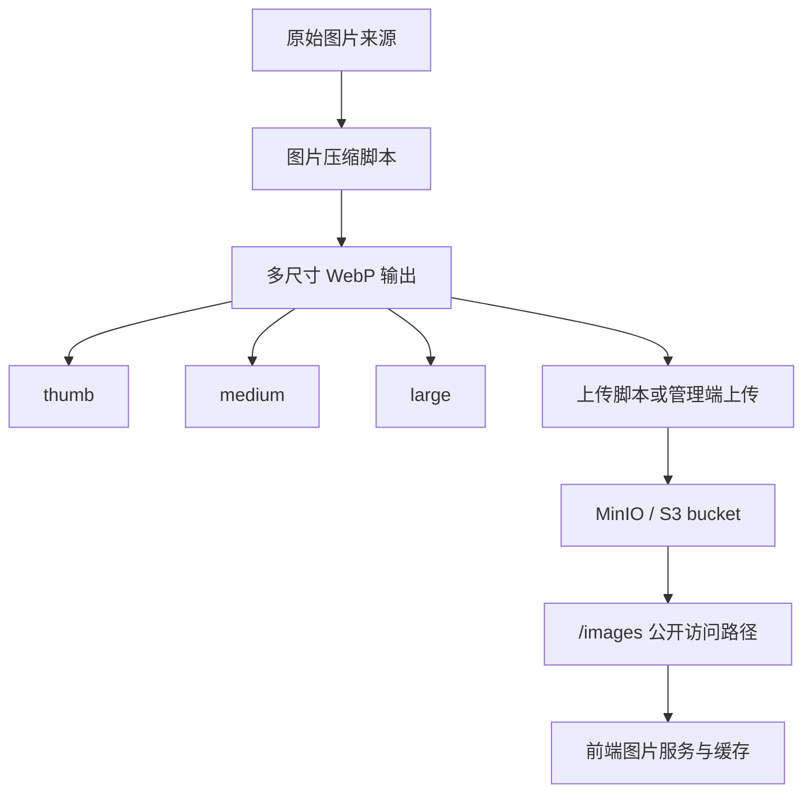

# 卡牌图片优化方案

> 版本: 2.1.0
> 创建日期: 2025-01-05
> 最后更新: 2026-06-12
> 文档类型: 专题说明
> 适用范围: 卡牌图片存储、访问 URL、前端加载和缓存策略
> 当前状态: 服务端已集成 MinIO；生产连接外部对象存储，开发可用 `docker-compose.dev.yml` 本地 MinIO

## 1. 概述

卡牌图片优化方案使用 MinIO 或兼容 S3 对象存储保存卡图，通过多尺寸 WebP、稳定访问路径和前端缓存降低图片加载成本。

本文只维护图片服务的长期边界和设计取舍。具体部署参数见 [MinIO 对象存储](minio-requirements.md)，脚本参数和当前实现细节以代码为准。

## 2. 架构

核心思路：

- 原始图片只作为输入来源，不直接作为前端主访问资源。
- 前端优先使用 `thumb`、`medium`、`large` 三种 WebP 尺寸。
- 管理端上传和批量脚本都应写入同一对象存储结构。
- 前端通过同源或配置源下的 `/images` 路径访问图片，不直接暴露对象存储内部地址。

## 3. 存储结构

| 目录 | 用途 |
| --- | --- |
| `thumb/` | 列表、网格、低成本预览 |
| `medium/` | 游戏桌与常规卡牌展示 |
| `large/` | 详情查看、放大预览 |
| `static/` | 卡背、牌堆图标、应用图标等静态资源 |

图片命名应与卡牌数据中的图片文件名保持可推导关系。管理端上传和批量同步脚本应遵循同一访问模型。

## 4. 访问 URL

卡牌图片通过稳定公开路径访问：

| 资源 | URL 形态 |
| --- | --- |
| 卡牌图片 | `{BASE_URL}/images/{size}/{imageBaseName}.webp` |
| 静态资源 | `{BASE_URL}/images/static/{assetName}` |

`imageBaseName` 来自卡牌的图片文件名去掉扩展名后的部分；缺失时可按卡牌编号推导。含特殊字符的名称需要 URL 编码。

## 5. 前端加载策略

前端图片服务负责：

- 根据卡牌编号和图片文件名生成稳定 URL。
- 按展示场景选择合适尺寸。
- 为常用卡图做内存级预加载，减少对局中突发加载。
- 生成响应式图片信息，让浏览器按布局选择尺寸。
- 保留本地静态文件兜底分支，但当前配置不会因为远程图片请求失败自动切换到本地图片。

图片访问基础路径由 API 基础路径推导。同源部署无需额外配置；跨源调试可通过前端环境变量指向 API / 图片代理源。

## 6. 缓存策略

图片资源应按较长生命周期缓存：

- Nginx 或图片代理层为 `/images/*` 设置公开缓存。
- 前端使用 Service Worker 缓存远程卡图、静态图片和历史本地兜底路径。
- 缓存名应跟随应用版本或构建标识变化，避免升级后长期命中旧资源。
- 图片替换后如果文件名不变，部署侧需要考虑缓存刷新策略。

## 7. 部署边界

- 生产 `docker-compose.yml` 不启动 MinIO，生产环境需要外部 MinIO 或兼容 S3 对象存储。
- 开发环境可使用 `docker-compose.dev.yml` 启动本地 MinIO。
- API Server 通过 `MINIO_*` 环境变量连接对象存储。
- 公开读取走 `/images/*`，写入和删除必须经过鉴权 API 或受控脚本。
- MinIO 密钥不得写入文档示例之外的真实值，也不得提交到仓库。

## 8. 已知边界

- 代码中保留本地静态图片兜底分支，但当前图片基础路径始终存在，因此不会自动按请求失败切换来源。
- 如果需要完全离线图片模式，需要重新设计图片源选择、缓存预置和本地卡牌数据来源。
- 图片压缩质量、尺寸和缓存容量属于实现参数，不在本文档重复维护。

## 9. 相关代码路径

- `src/scripts/compress-images.ts`
- `src/scripts/upload-to-minio.ts`
- `src/scripts/upload-static-assets.ts`
- `src/server/routes/images.ts`
- `src/server/services/minio-service.ts`
- `client/src/lib/imageService.ts`
- `client/vite.config.ts`
- `docs/minio-requirements.md`
