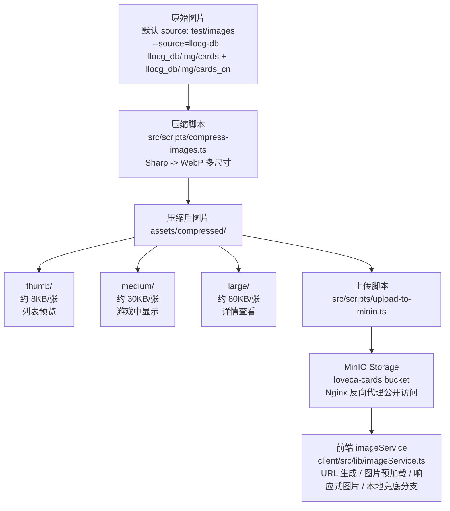

# 卡牌图片优化方案

> 版本: 2.0.0  
> 创建日期: 2025-01-05  
> 最后更新: 2026-03-15

## 概述

本方案使用 MinIO 对象存储存储卡牌图片，解决带宽问题并提供前端缓存支持。通过图片压缩和多尺寸版本，显著提升加载速度。

---

## 架构设计



---

## 文件清单

| 文件 | 说明 |
|------|------|
| `src/scripts/compress-images.ts` | 图片压缩脚本 |
| `src/scripts/upload-to-minio.ts` | 上传到 MinIO Storage |
| `client/src/lib/imageService.ts` | 前端图片服务 |
| `docs/minio-requirements.md` | MinIO 部署配置文档 |

---

## 使用指南

### 1. 压缩图片

```bash
# 安装依赖 (如果未安装)
pnpm install

# 运行压缩脚本（默认读取 test/images）
npx tsx src/scripts/compress-images.ts

# 使用 llocg_db 图片源（需要相应子模块图片目录存在）
npx tsx src/scripts/compress-images.ts --source=llocg-db
```

当前脚本输入源由 `--source` 参数决定：

| source | 输入目录 |
|--------|----------|
| 默认 / `crawler` | `test/images` |
| `llocg-db` | `llocg_db/img/cards`、`llocg_db/img/cards_cn` |

压缩输出统一写入 `assets/compressed/{thumb,medium,large}`。

**输出示例：**
```
🎴 卡牌图片压缩工具

📂 创建目录: assets/compressed
📂 创建目录: assets/compressed/thumb
📂 创建目录: assets/compressed/medium
📂 创建目录: assets/compressed/large
📁 找到 150 张图片待处理

⏳ 处理中... 150/150 (100%)

✅ 压缩完成!

📊 压缩统计:

| 尺寸 | 数量 | 原始大小 | 压缩后 | 节省 |
|------|------|----------|--------|------|
| thumb  | 150  | 115MB | 1.2MB | 99% |
| medium | 150  | 115MB | 4.5MB | 96% |
| large  | 150  | 115MB | 12MB  | 90% |

💾 总计: 345MB → 17.7MB

📋 上传清单已生成: assets/compressed/upload-manifest.json
```

### 2. 配置 MinIO Storage

详见 `docs/minio-requirements.md` 文档。

主要步骤：
1. 在独立服务器上部署 MinIO (Docker)
2. 创建 `loveca-cards` bucket
3. 设置公开读取策略
4. 记录连接信息（endpoint、access key、secret key）

### 3. 上传图片

```bash
# 设置环境变量并运行上传脚本
MINIO_ENDPOINT=10.0.0.2 \
MINIO_ACCESS_KEY=xxx \
MINIO_SECRET_KEY=xxx \
npx tsx src/scripts/upload-to-minio.ts
```

### 4. 前端配置

同源部署无需额外配置；如前端需要访问不同源的 API / 图片代理，可在 `client/.env.local` 或 `client/.env` 配置：

```env
VITE_API_BASE_URL=https://loveca.example.com
```

---

## 图片访问 URL

### MinIO Storage URL 格式

通过 Nginx 反向代理访问：

```
{BASE_URL}/images/{size}/{cardCode}.webp
```

**示例：**
- 缩略图: `https://loveca.example.com/images/thumb/PL-sd1-001.webp`
- 中等: `https://loveca.example.com/images/medium/PL-sd1-001.webp`
- 大图: `https://loveca.example.com/images/large/PL-sd1-001.webp`

### 前端 API 使用

```typescript
import { getCardImageUrl, preloadCardImages, getCardSrcSet } from '@/lib/imageService';

// 获取图片 URL
const url = getCardImageUrl('PL-sd1-001', 'medium');

// 预加载手牌图片
await preloadCardImages(['PL-sd1-001', 'PL-sd1-002'], 'medium');

// 响应式图片

```

---

## 图片 URL 与降级边界

当前 `client/src/lib/imageService.ts` 会通过 `getApiBaseUrl()` 生成图片基础路径：

```typescript
const IMAGES_BASE_URL = `${getApiBaseUrl()}/images`;
```

因此在常规构建中，卡牌图片优先访问同源或 `VITE_API_BASE_URL` 指向源下的 `/images/{size}/{name}.webp`，由 Nginx 或 Vite proxy 转发到 MinIO。

代码中仍保留了 `/card`、`/energy` 的本地静态文件兜底分支，但由于 `IMAGES_BASE_URL` 当前始终是非空字符串（相对 `/images`、当前 origin 下的 `/images` 或配置源下的 `/images`），运行时不会因为 API 请求失败自动切换到本地图片。若需要恢复完整本地降级，需要先调整 `isStorageEnabled` / 图片源配置策略。

---

## 图片尺寸规格

| 尺寸名 | 宽度 | 质量 | 用途 | 预计大小 |
|--------|------|------|------|----------|
| `thumb` | 100px | 75% | 列表/网格预览 | ~8KB |
| `medium` | 300px | 80% | 游戏中卡牌显示 | ~30KB |
| `large` | 600px | 85% | 详情查看/弹窗 | ~80KB |

---

## 缓存策略

### 浏览器缓存

Nginx 为图片设置 `Cache-Control` 头，图片会被浏览器缓存 30 天。

### 前端预加载缓存

`imageService.ts` 提供内存级预加载缓存：

```typescript
// 预加载后不会重复请求
await preloadCardImages(['PL-sd1-001'], 'medium');
```

### Service Worker 缓存 (已实现)

项目已配置 vite-plugin-pwa 实现 Service Worker 缓存，支持离线访问图片资源。

**缓存策略配置 (client/vite.config.ts):**

| 缓存名 | URL 匹配规则 | 策略 | 过期时间 | 最大条目 |
|--------|-------------|------|----------|----------|
| `remote-card-images-${cacheVersion}` | `/images/(thumb|medium|large)/*.webp` | CacheFirst | 30 天 | 1500 |
| `remote-static-assets-${cacheVersion}` | `/images/static/*` | CacheFirst | 30 天 | 50 |
| `local-card-images-${cacheVersion}` | `/card/*.(jpg|png|webp)` | CacheFirst | 30 天 | 500 |
| `energy-card-images-${cacheVersion}` | `/energy/*.(jpg|png|webp)` | CacheFirst | 30 天 | 50 |
| `compressed-card-images-${cacheVersion}` | `/compressed/*.(jpg|png|webp)` | CacheFirst | 30 天 | 1500 |

**配置代码示例:**

```typescript
import { VitePWA } from 'vite-plugin-pwa';

export default defineConfig({
  plugins: [
    VitePWA({
      registerType: 'autoUpdate',
      workbox: {
        runtimeCaching: [
          {
            urlPattern: /\/images\/(thumb|medium|large)\/.*\.webp$/,
            handler: 'CacheFirst',
            options: {
              cacheName: `remote-card-images-${cacheVersion}`,
              expiration: {
                maxEntries: 1500,
                maxAgeSeconds: 30 * 24 * 60 * 60,
              },
              cacheableResponse: {
                statuses: [0, 200],
              },
            },
          },
          // ... 其他缓存规则
        ],
        skipWaiting: true,
        clientsClaim: true,
      },
    }),
  ],
});
```

---

## 效果对比

| 指标 | 优化前 | 优化后 | 提升 |
|------|--------|--------|------|
| 单张图片大小 | 200-300KB | 30KB (medium) | ~90% |
| 首屏加载 (20张) | ~5MB | ~0.6MB | ~88% |
| Nginx 代理加速 | 无 | 本地服务器 | ✅ |
| 缓存支持 | 浏览器默认 | 多级缓存 | ✅ |
| 响应式图片 | 无 | 支持 srcSet | ✅ |

---

## 注意事项

1. **首次压缩**: 压缩 150 张图片约需 1-2 分钟
2. **上传带宽**: 上传约 18MB 数据，耗时取决于网络
3. **存储空间**: MinIO 服务器需预留足够磁盘空间
4. **环境变量**: MinIO 密钥不要提交到代码仓库

---

## 相关文档

- `docs/minio-requirements.md` — MinIO 独立服务器部署方案

---

*文档最后更新: 2026-03-15*
