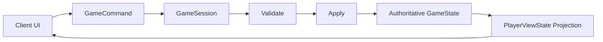
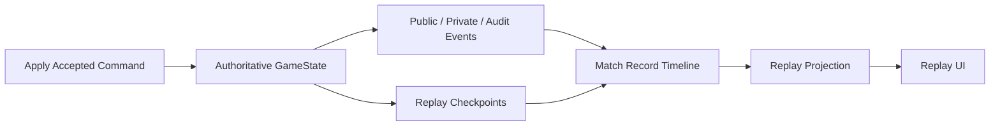
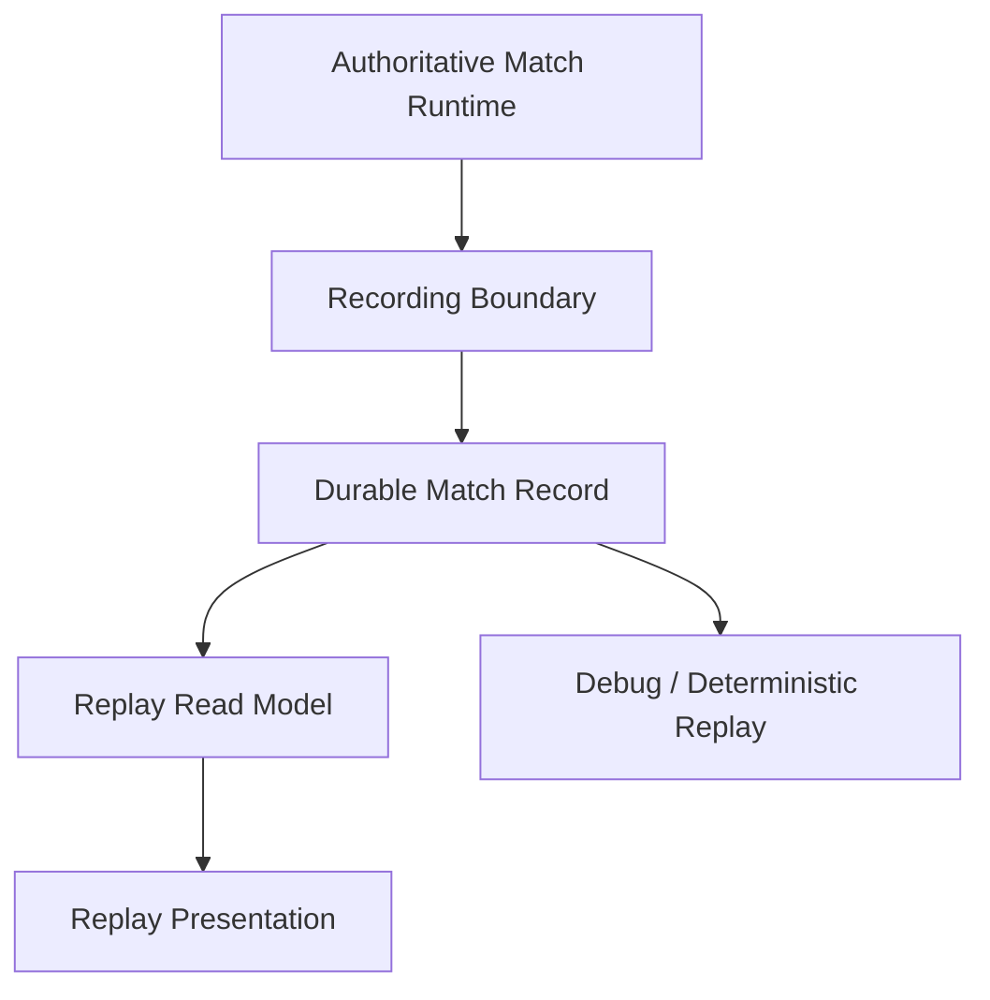

# Loveca 对局记录、复盘与可复现回放设计文档

> 文档类型：设计文档
> 适用范围：说明对局记录、复盘、卡组快照、卡效决策日志和确定性重演需求如何纳入 Loveca 当前游戏框架
> 当前状态：设计基线 v0.9；正式联机与服务端可记录对墙打的 P0-P1 已阶段性落地，稀疏 authority checkpoint 策略已接入，完整确定性重演仍为后续目标
> 最后更新：2026-07-08

## 核心概念导读

需求文档回答“我们要给用户什么能力”，本文档回答“这些能力如何接入现有 Loveca 框架”。

最终目标是：用户打完一局后，可以在历史对局中找到它，随时打开，并用自己当时的视角回看整局过程，复盘关键选择、卡效处理、Live 判定和胜负转折。

这个目标需要拆成两个层级：

1. **记录式回放**
   保存快照、事件、玩家视图、卡效选择、公共/私密/审计信息，让用户可以像看录像一样回看。这是第一阶段最应该优先实现的能力。

2. **确定性重演**
   使用初始状态、卡组快照、随机记录、命令序列和卡效决策日志，重新运行引擎并得到同样结果。这是更强的能力，但不应阻塞第一阶段的用户复盘体验。

也就是说，第一阶段先让用户“能看回去”，第二阶段再追求“能重新跑出来”。

本文档围绕以下核心概念展开：

- `Match Record`：一局历史对局的根记录，描述参与者、卡组、先后手、胜负、结束原因和回放能力。
- `Participant Record`：某个用户在该局中的座位、身份和可访问视角。
- `Deck Snapshot`：当局卡组快照，独立于用户当前卡组，保证历史对局不受后续编辑和卡牌数据更新影响。
- `Initial Match Snapshot`：对局初始权威状态，是未来确定性重演的根。
- `Timeline Entry`：统一时间线游标，将命令、事件、决策、随机和检查点串成可跳转的历史顺序。
- `Replay Checkpoint`：回放检查点，用于稳定跳转、回退和查看历史节点。
- `Decision Record`：卡效和关键选择记录，用于解释“为什么发生这次状态变化”。
- `Randomness Record`：洗牌、刷新、声援、检视顶牌等随机或顺序变化记录。
- `Replay Capability`：每局记录支持哪些能力的标记，例如摘要、玩家视角回放、公共回放、审计查看或确定性重演。
- `Debug Replay Bundle`：管理员专用的调试 / 历史高权限导出包，用于验证记录格式、回放投影和问题复现。`RUNNING_OR_RECENT` 来源表示 E0 运行中调试导出，不进入普通用户历史记录；`HISTORY_RECORD` 来源表示从正式持久化历史记录导出的 `.replay.json` 包。两者都属于高权限材料，不能通过普通用户回放接口暴露 authority payload。

回放默认不应该因为对局已经结束而变成全知视角。普通玩家应按自己当时的视角回放：自己手牌可见，对手隐藏信息不可见，公开过的牌按当时可见性展示，密封审计不进入普通回放。

Loveca 不需要另起一套独立 replay engine。现有框架已经具备基础：

- `GameSession` 是权威状态所有者。
- `GameCommand` 是玩家输入入口。
- `PlayerViewState` 已经承担视角安全投影。
- `GameState.eventLog` / `GameEvent` 已经开始表达部分规则层事件事实，服务后续 AUTO / trigger matcher。
- `PublicEvent`、`PrivateEvent` 和 `SealedAudit` 已经表达公开事实、单侧事实和服务端审计。
- 命令日志、快照历史和权威快照已经存在内存态。
- 卡效自动化已经通过 `pendingAbilities` 和 `activeEffect` 表达实时选择窗口。

因此，设计方向不是新增一套平行模型，而是：

> 把现有“内存权威会话”扩展成“可记录、可投影、可复盘、可逐步重演的权威时间线”。

第一阶段不追求纯事件源化，也不追求全卡效确定性重演。当前卡效事件边界尚未完整，若强行只依赖事件回放，会让第一阶段过于脆弱。更合适的第一阶段形态是：

> 快照 + 事件 + 决策摘要 + 审计记录。

快照保证能看，事件保证能读，决策记录保证能懂，审计记录保证能查。

需要特别区分：`GameSession` 的运行时事件、审计、命令日志和内存快照是 recorder 的事实来源，不等同于普通玩家可直接读取的历史记录。当前第一阶段已经增加持久记录边界，将运行中会话产生的权威事实写入历史对局读模型；后续重点是补齐更完整的随机、决策、手动处理原因和确定性重演语义。

实现时还要特别注意：当前运行时恢复快照的身份更接近 `publicSeq`，适合正在进行的联机恢复，但不适合作为长期回放检查点的唯一身份。历史记录层必须自己生成 `timelineSeq` 与 `checkpointSeq`，并把 `PublicEvent.seq`、`commandSeq`、`decisionId` 等作为关联字段，而不是主顺序来源。

2026-06-17 复核：最新 main 已有纯 `trigger-matcher` 模型，但它尚未接入 runner；卡效入队仍主要由 `enqueueTriggeredCardEffects` 各事件分支承担。对局记录设计应把 `GameEvent`、命令、公共/私密事件、检查点和语义化决策记录作为长期边界，不把 runner 当前的内部分支、helper 名称或 active effect 运行时形状作为持久格式。

2026-06-17 决策补充：早期可以先推进 E0 管理员调试回放包。E0 可以直接从运行中会话导出带版本的 bundle，并由管理员只读导入查看；它不写入正式历史表、不开放普通用户、不承诺长期跨版本兼容。E0 的价值是尽早验证 recorder 输出、回放读取和卡效调试价值；当前普通用户历史记录已进入 P0-P1 正式持久化链路。

2026-06-18 收束：第一阶段时间线应以 `RecordFrame` 或等价账本模型为中心。每个 frame 分配 `timelineSeq`，命令、事件、决策、随机事实和 checkpoint 通过关联字段挂到 frame 上；不要让 `PublicEvent.seq`、`commandSeq`、`checkpointSeq` 各自成为互不对齐的回放顺序。checkpoint 和 debug bundle 的 payload envelope、序列化、复水、hash 校验和权限边界以 [checkpoint / bundle 序列化与复水契约](serialization-contract.md) 为实现 review 基线。

2026-06-18 P0/P1 实施补充：P0 应拆成 schema/recorder 底座、开局写入闭环、封存闭环三个可验收小步；P1 再接入命令后追加和玩家视角读取。正式联机默认不允许无 recorder 启动；开发或本地调试若需要跳过 recorder，必须显式配置并标明该局不形成可持久回放。物理 schema 需要同步 `src/server/db/schema.ts` 与 `docker/init.sql`，并为 `matchId + timelineSeq`、`matchId + checkpointSeq`、参与者 seat/user、deck snapshot seat 建唯一约束或等价幂等键。

2026-06-19 对墙打扩展补充：可记录对墙打复用同一 recorded match / recorder / replay read model，不创建本地 replay 上传格式。记录根对象需要保存 `matchMode`、`automationGameMode`、`originKind`、`originLabel` 与 `replayLimitations`；系统对手需要在 participant 中保存 `participantKind=SYSTEM`，并用 `ownerUserId` 关联真实玩家。回放读取必须按 `automationGameMode` 调用 projector，`SOLITAIRE` 对局的第一版可用 `SOLITAIRE_AUTOMATION_COMPRESSED` 标记“对手自动流程被压缩在玩家命令后的 checkpoint 中”。

2026-06-22 当前实现补充：正式联机与服务端可记录对墙打已经接入历史根记录、卡组快照、timeline、authority checkpoint、public/private event 明细、普通玩家历史列表/详情/timeline/checkpoint 投影读取、只读 GameBoard 桌面展示，以及部分语义化 decision record。checkpoint 写入已从“每个已接受命令后完整 authority checkpoint”收束为稀疏策略：普通高频命令可以只追加 timeline/event/summary，每 5 帧或遇到关键命令、系统转移、撤销、结算/阶段类命令时写 authority checkpoint；无 checkpoint 帧用 `stateSummary` 保持 timeline 可读状态。完整随机记录、完整决策覆盖、自由拖拽/手动处理原因结构化、确定性重演、逐命令动画播放、公开分享回放和长期兼容策略仍是后续方向。

2026-06-28 管理员历史导出补充：管理员历史读取接口已可按用户 / 房间 / match id 与开始日期筛选，并可从持久化历史记录导出 `sourceMatch.exportedStatus=HISTORY_RECORD` 的 `.replay.json` 包。该包复用 `DebugReplayBundle` envelope，包含历史 timeline、authority checkpoints、public/private events 与 decision records；当前若历史记录缺少完整 command log，导出保留 `commands: []`，不伪造确定性重演输入。

对应到游戏模型，后续需要完成几类转变：

- 从“当前状态”扩展到“状态时间线”：不仅知道当前场面是什么，还要知道它如何一步步形成。
- 从“拖拽移动”扩展到“可解释调整”：同样是移动卡牌，需要区分规则流程、卡效、手动处理、桌面整理、误操作修正或系统纠偏。
- 从“卡效窗口”扩展到“卡效决策链”：不仅记录现在等玩家选择什么，还要记录为什么触发、玩家看到了什么、选择了什么、结果是什么。
- 从“当前投影”扩展到“历史投影”：实时对局通过投影保护隐藏信息，历史回放也必须遵守同一原则。

建议路线是：

- 第一阶段：记录式回放底座。当前 P0-P1 已阶段性落地：记录创建与封存、时间线与玩家视角回放读取已经形成普通用户可用闭环；P2 决策说明与能力标记、P3 回放体验增强与审计辅助仍需继续推进。
- 第二阶段：确定性重演，包括随机记录、decision log、命令重放和事件标准化。
- 第三阶段：分享和教学，包括公共视角回放、战报和关键回合剪辑。
- 第四阶段：AI 和自动分析，包括复盘建议、胜负转折点和卡组表现统计。

一句话概括：先把每局对局变成可保存、可解释、可按视角回看的历史事实，再逐步把它升级成可重演、可分析、可分享的规则资产。

## 1. 文档目的

本文档承接 [对局记录、复盘与可复现回放需求](requirements.md)，回答以下问题：

- 这类能力如何嵌入 Loveca 当前联机和游戏模型。
- 当前 `GameSession`、玩家视图、事件、审计和命令体系需要如何演进。
- 为了第一阶段落地，哪些概念必须变成稳定架构边界。
- 哪些重构属于前置基础，哪些应推迟到后续阶段。

本文档只描述架构方向、数据流和模型职责，不展开具体表结构、接口字段、迁移脚本或函数级实现。第一阶段的落地顺序、逻辑表、服务改造、API 和测试安排见 [第一阶段实施计划](phase1-implementation-plan.md)。

## 2. 设计结论

Loveca 当前框架已经具备对局记录体系的基础雏形：

- `GameSession` 是权威状态所有者。
- `PlayerViewState` 已经承担视角安全投影。
- `GameState.eventLog` / `GameEvent` 已经开始承担规则事件事实来源，但尚未完整持久化。
- `PublicEvent`、`PrivateEvent` 和 `SealedAudit` 已经表达公开事实、单侧事实和服务端审计。
- 命令日志、快照历史和权威快照已经存在内存态。
- 卡效自动化已经开始通过 `pendingAbilities`、`activeEffect` 和卡效 runner 表达选择窗口。

因此，下一阶段不需要另起一套 replay engine。更合理的方向是：

> 把现有联机对局链路从“内存权威会话”扩展为“可记录、可投影、可复盘、可逐步重演的权威时间线”。

第一阶段应优先落地“记录式回放”：

- 保存当局卡组快照和初始状态。
- 保存权威命令、公共事件、私密事件、密封审计和必要快照。
- 通过玩家视角投影提供回放。
- 让卡效和手动处理至少可解释、可定位、可审计。

正式用户功能上，P0-P1 应先形成可独立交付的用户闭环：开始即落库、结束可封存、历史列表可见、玩家视角只读回放可跳转。工程推进上，可以先做 E0 管理员调试回放包来验证 recorder 和 replay 读模型；E0 不承诺普通用户历史记录能力。P2 的决策记录、手动处理原因和能力标记应在这个闭环稳定后继续推进，不应阻塞 P0-P1 上线。

确定性重演是第二阶段目标。第一阶段要为它保留数据边界，但不应为了完整重演而阻塞用户复盘能力。

当前基础也有明确缺口：

- 运行中对局和房间仍由服务内存结构持有；服务端可记录对墙打运行态缺失时可从最新 authority checkpoint 与公共事件尾部恢复到最近保存点，正式联机进程重启后恢复运行中对局仍未落地。已封存或已写入的历史记录可以通过 replay read model 读取。
- 数据库已具备对局记录、时间线、检查点、public/private event 和部分 decision record 的长期模型；完整随机记录、完整决策覆盖、自由拖拽/手动处理原因结构化和长期兼容策略仍未完整闭环。
- 持久历史回放已经使用独立 `timelineSeq` / `checkpointSeq`，不再依赖公共事件序号作为唯一身份；checkpoint 当前采用关键节点与每 N 帧结合的稀疏策略，后续仍需继续完善压缩、采样、能力标记和兼容策略。
- 卡组快照已经作为历史记录输入落地；后续仍需随着正式 card data version 或更完整数据版本策略同步扩展。
- `GameState.eventLog` 已开始覆盖登场、离场、成员状态变化、成员槽位移动、LIVE 开始、LIVE 成功和声援等 proving path；纯 `trigger-matcher` 已落地但尚未接入 runner，因此这还不是完整 `GameEvent -> trigger matcher`，也不是持久时间线。
- 部分卡效内部动作仍只有 snapshot/audit 过渡语义，不能被描述为完整事件源化。

因此，第一阶段的“记录边界”和“回放读取模型”已经成为当前架构的一部分；现有 `GameSession`、投影和事件模型仍作为输入来源，而不是直接承担普通历史查询和长期存储职责。

## 3. 与当前框架的关系

### 3.1 当前联机链路

当前正式联机链路可以理解为：

这一链路适合实时对局，但历史复盘还需要在 `Apply` 之后形成稳定记录边界：

关键变化不是改变权威状态来源，而是把权威状态变化后的事实沉淀为长期可读取的时间线。

### 3.2 当前模型可复用部分

可复用的现有边界：

- `GameSession`：继续作为对局权威编排层。
- `GameCommand`：继续作为用户或客户端提交意图的入口。
- `PlayerViewState`：继续作为普通玩家视角回放的安全投影模型。
- `GameState.eventLog` / `GameEvent`：继续作为规则层事实和未来触发匹配的输入来源。
- `PublicEvent`：继续作为双方可见事实的记录基础。
- `PrivateEvent`：继续作为单侧可见事实的记录基础。
- `SealedAudit`：继续作为调试、争议复盘和隐藏信息审计基础。
- `DeckConfig` / 卡组锁定结果：作为卡组快照的输入来源。

需要加强的边界：

- 记录生命周期。
- 对局初始快照。
- 卡组快照。
- 随机和洗牌记录。
- 卡效决策日志。
- 手动效果与自由拖拽原因。
- 快照兼容版本和回放能力标记。

### 3.3 不应新增的平行模型

不建议新增一套与当前对局状态完全独立的 replay state。
回放应优先复用当前投影模型，否则会产生三套含义相近但不同步的系统：

- 实时游戏模型；
- 回放游戏模型；
- 调试重演模型。

更好的方向是：实时对局、记录式回放和未来确定性重演共享核心领域概念，只在读取方式、权限和时间线控制上不同。

## 4. 目标架构

### 4.1 架构分层

对局记录体系应分为五层：

各层职责：

| 层级                        | 职责                                             |
| --------------------------- | ------------------------------------------------ |
| Authoritative Match Runtime | 运行实时对局，处理命令、阶段、卡效和权威状态     |
| Recording Boundary          | 将权威状态变化转成可持久化的记录事实             |
| Durable Match Record        | 保存对局元信息、卡组快照、事件、快照、决策和审计 |
| Replay Read Model           | 按玩家视角、公共视角或审计视角读取历史时间线     |
| Replay Presentation         | 以只读方式呈现历史对局和关键节点                 |

### 4.2 第一阶段推荐形态

第一阶段应采用“快照 + 事件 + 决策摘要”的混合模型：

- 快照保证用户可以稳定跳转和回看。
- 事件保证时间线可读、可解释。
- 决策摘要保证卡效和手动处理能复盘。
- 审计记录保证开发和争议场景可以定位问题。

不建议第一阶段只存事件、不存快照。当前卡效事件边界还未完整，纯事件回放会过早依赖未完成的事件源化能力。

也不建议第一阶段只存最终状态。只存最终状态无法复盘过程，也无法定位卡效和联机问题。

第一阶段的推荐持久化内容是：

- `Match Record`：对局根记录和能力状态。
- `Participant Record`：参与者、座位和回放权限。
- `Deck Snapshot`：当局锁定卡组和卡牌展示摘要。
- `Timeline Entry`：命令、事件、决策、系统推进和检查点的统一顺序游标。
- `Replay Checkpoint`：权威状态快照或玩家视角快照，用于稳定跳转。
- `Command Record`：已接受和被拒绝的玩家命令。
- `Decision Record`：卡效、换牌、Live 设置、成功 Live、手动处理等选择上下文。
- `Randomness Record`：洗牌、刷新、声援、检视顶牌等随机或顺序变化结果。
- `Sealed Audit`：高权限审计信息。

这些是逻辑模型，不要求第一阶段拆成同名表；但实现时应保持这些职责边界，避免把所有内容塞进单一 UI 日志。

第一阶段实现时应接受“逻辑模型先清晰、物理表可合并”的策略。例如 P0 可以先用较少表保存根记录、参与者、卡组快照和检查点；但 payload 内部仍应保留 `match record`、`timeline entry`、`checkpoint`、`command` 等职责边界，避免后续无法拆分。

## 5. 核心概念模型

### 5.1 Match Record

`Match Record` 是一局历史对局的根对象。

它应表达：

- 这局是谁和谁打的；
- 这局来源于正式联机还是服务端可记录对墙打；
- 运行时使用的规则自动化策略；
- 对局来源标签，例如在线房间或对墙打；
- 使用了哪些卡组快照；
- 何时开始、何时结束；
- 谁先攻；
- 胜负和结束原因；
- 这局记录是否完整；
- 支持哪些回放能力。

它不是运行中的 `GameSession`，而是 `GameSession` 结束或过程中沉淀出的历史事实集合。

### 5.2 Participant Record

`Participant Record` 描述某个玩家在这局中的身份。

它应表达：

- 对局内座位；
- 用户身份；
- 参与者身份：真实用户或系统对手；
- 显示名；
- 使用卡组；
- 该玩家可访问哪些回放视角；
- 是否是原始参与者。

回放权限应基于参与关系和授权视角，而不是基于当前是否仍在房间内。
系统对手不能成为普通用户授权入口；普通玩家历史列表和 replay 读取只允许 `participantKind=USER` 的 viewer 命中。

### 5.3 Deck Snapshot

`Deck Snapshot` 描述对局开始时锁定的卡组。

它必须独立于用户当前卡组。
它应保留足以还原当局构筑和展示的信息，同时为未来确定性重演保留卡组构成基础。

设计重点：

- 不引用可变的当前卡组作为历史事实。
- 保留主卡组与能量卡组的边界。
- 保留卡牌身份和当局展示需要的卡牌摘要。
- 支持未来对比“当前卡牌数据”和“当局卡牌数据”。

第一阶段实现时，`Deck Snapshot` 至少应保存：

- 当局使用的 deck ID、deck name、构筑来源和锁定时间。
- 主卡组与能量卡组的卡牌编号列表或等价展开结果。
- 每个卡牌编号在当局展示所需的摘要，例如卡名、类型、费用/分数、必要 Heart、效果文本、罕度和图片引用。
- 卡牌数据版本、导入批次、数据 hash 或等价来源标记。
- 卡组合法性结论和当局采用该结论的时间。

这些字段不要求最终都拆成独立表，但不能只保存当前用户 deck 外键后在回放时动态读取当前构筑。若未来卡牌数据更新，历史回放可以提示“当前文本已更新”，但不能静默改写当局展示事实。

### 5.4 Initial Match Snapshot

`Initial Match Snapshot` 是对局开始时的权威起点。

它应能回答：

- 双方初始牌库顺序是什么；
- 起手和初始能量是什么；
- 先后手是谁；
- 对局中每张卡牌实例如何对应到卡组快照；
- 对普通玩家隐藏的信息如何按权限保护。

这是未来确定性重演的根基，也是第一阶段开发复现的重要数据。

### 5.5 Timeline Cursor

历史对局需要一个统一的时间线游标，用于表达回放位置。

它不应该只依赖前端播放时间。更稳定的游标应来自对局事实顺序，例如：

- 命令序号；
- 公共事件序号；
- 快照序号；
- 回合/阶段/子阶段；
- 关键决策点。

回放界面的前进、后退和跳转都应围绕该时间线游标。

第一阶段应把 `timelineSeq` 或等价单调游标作为持久历史记录的主顺序，而不是直接把 `PublicEvent.seq` 当作唯一位置。`PublicEvent.seq`、`commandSeq`、`decisionId`、`checkpointSeq` 都可以作为 `Timeline Entry` 的关联字段，但不应替代统一时间线。

原因是某些权威状态变化、命令拒绝、私密事件、决策窗口打开、审计记录或检查点可能没有对应的新公共事件。如果持久检查点只按公共事件序号定位，这些节点会出现无法跳转、无法解释或检查点覆盖的问题。

### 5.6 Timeline Entry

`Timeline Entry` 是第一阶段建议新增的统一顺序记录。
实现上推荐把它落成 `RecordFrame` 或等价命名的时间线账本节点，避免命令表、事件表、决策表和检查点表各自维护一套排序语义。

它用于把不同来源的事实放到同一条历史时间线上：

- 玩家命令；
- 系统自动推进；
- 公共事件；
- 私密事件；
- 卡效决策；
- 随机或洗牌结果；
- 检查点；
- 记录状态变化。

它不等同于 `PublicEvent`。某些权威状态变化可能没有新的公共事件，但仍需要在历史记录中拥有稳定位置。
因此，时间线游标应独立于前端播放时间，也不应只使用公共事件序号作为唯一节点。

建议每条 `Timeline Entry` 至少表达：

- `timelineSeq`：单局内单调递增顺序。
- `frameType` / `entryType`：命令接受、命令拒绝、系统推进、公共事件、私密事件、审计摘要、规则事件、决策打开、决策提交、随机结果、检查点写入或记录状态变化。
- `visibilityScope`：玩家视角、公共视角或审计视角。
- `relatedCommandSeq` / `relatedPublicSeq` / `relatedPrivateSeq` / `relatedPrivateSeqBySeat` / `relatedAuditSeq` / `relatedGameEventSeq` / `relatedDecisionId` / `relatedCheckpointSeq`：按需关联现有事实；普通玩家私密事件读取只使用当前 seat 的私密游标。
- `dedupeKey`：用于 recorder 重试时保持幂等。
- `turnCount`、`phase`、`subPhase` 和可选来源摘要，用于快速索引关键节点。

P1e 起，公共事件和私密事件不再只靠 timeline 游标摘要展示：`match_record_public_events` 保存 `PublicEvent` payload 并向双方参与者可见，`match_record_private_events` 按 seat 保存 `PrivateEvent` payload，普通 replay API 只读取当前用户所属 seat 的记录。sealed audit 仍只属于高权限审计边界。

### 5.7 Replay Checkpoint

`Replay Checkpoint` 是可用于恢复某个历史节点的快照。

它的职责不是替代事件，而是保证回放可用性：

- 快速跳转；
- 回退；
- 旧记录兼容；
- 事件语义不完整时仍能展示历史状态；
- 调试某一步之前的状态。

第一阶段可以偏向更多快照，换取可用性和正确性。后续事件语义稳定后，再优化存储粒度。

检查点必须有自己的稳定身份，例如 `checkpointSeq` 或 `checkpointId`。它可以关联最近的公共事件序号，但不能只用公共事件序号作为唯一键。否则同一公共事件序号下的命令拒绝、私密选择、纯状态检查点或审计节点会互相覆盖，回放也无法定位这些节点。

因此，当前 `GameSession` 中按公共事件序号保存的运行时权威快照只能作为 recorder 的输入来源或恢复辅助，不能原样升级成持久历史检查点表。持久层应为每次需要保存的历史节点分配新的 `checkpointSeq`，并在 payload 或索引字段中记录当时的 `publicSeq`、`commandSeq`、阶段和窗口状态。

实现上还要注意：如果同一 `publicSeq` 下发生多个权威状态变化，当前运行时 `authoritySnapshots` map 只能保留该 key 下的最后一个快照。第一阶段若只需要命令完成后的回放节点，可以由 recorder 保存命令后的权威状态；若要记录阶段切换、窗口打开、私密选择等中间节点，则需要 `GameSession` 提供显式 transition frame、checkpoint hook 或稳定的当前状态克隆输入，不能从现有 `authoritySnapshots` 倒推出所有中间状态。

第一阶段的检查点可以采用两类策略：

- 权威检查点：保存完整权威状态，用于审计、开发定位和未来重演对照。
- 视角检查点：保存某个玩家或公共视角的投影结果，用于普通回放快速读取。

权威检查点不能直接暴露给普通玩家；普通玩家回放应经过投影或读取已投影的视角检查点。

因此，检查点存储和读取应从设计上分层：

- `authority checkpoint`：完整权威状态，包含隐藏牌序、双方手牌、密封审计可关联信息；只供审计、开发和未来重演读取。
- `player-view checkpoint`：按某个参与玩家投影后的历史视角，可作为普通玩家回放的主读取对象。
- `public-view checkpoint`：只包含双方共同可见事实，供未来分享、观战式复盘或战报使用。

第一阶段如果为了降低实现成本只持久化权威检查点，也不能让普通接口直接返回该对象。读取层必须先调用历史投影生成对应玩家视角，再返回给客户端。后续若增加预投影检查点，只是读取性能优化，不改变权限边界。

### 5.8 Command Record

`Command Record` 记录玩家或系统提交过的对局意图。

它应区分：

- 已接受命令；
- 被拒绝命令；
- 系统自动命令或推进；
- 命令导致的公开结果；
- 命令发生时的时间线位置。

命令记录主要服务审计、调试和确定性重演，不应直接作为普通玩家看到的全部复盘内容。

需要注意，`Command Record` 不能替代 `Decision Record`。例如 `CONFIRM_EFFECT_STEP` 只能说明玩家提交了哪些 cardId、slot 或 option；它不能完整说明玩家当时看到了哪些候选、为什么进入该步骤、该步骤是否可跳过、选择前后的效果范围是什么。这些上下文必须由决策记录或检查点补足。

### 5.9 Decision Record

`Decision Record` 记录卡效、选择窗口和关键玩家决策。

它是当前框架需要新增为一等概念的部分。

它应覆盖：

- 换牌选择；
- Live 设置选择；
- 成功 Live 选择；
- 起动能力发动；
- 自动能力顺序选择；
- 可选卡效接受或跳过；
- 卡效目标选择；
- 卡效中的多选、顺序选择、选项选择；
- 手动效果处理确认。

`activeEffect` 和 `pendingAbilities` 适合继续作为实时状态，但历史复盘需要把其中的选择过程落成稳定决策记录。

最小可用的决策记录应能表达：

- 决策来源，例如命令、能力、系统流程或手动处理。
- 决策窗口，例如换牌、卡效步骤、Live 设置、成功 Live 选择。
- 决策参与者和座位。
- 玩家当时看到的候选摘要。
- 玩家最终选择、跳过或确认的结果。
- 该决策关联的事件范围或检查点范围。
- 普通玩家可见部分与高权限审计部分的边界。

第一阶段建议把决策记录拆成两个层次：

- `decision opened`：记录窗口出现时的来源、能力、步骤、等待玩家、候选摘要、选择上下限、可跳过状态和当时检查点。
- `decision submitted`：记录玩家提交的选择、跳过、确认、顺序发动或无选择继续，以及提交后关联的命令和检查点。

这能避免后续只从命令结果倒推选择窗口。对于卡效，`decision opened` 应优先从 `pendingAbilities`、`activeEffect`、能力定义和投影候选生成；`decision submitted` 应优先从 `CONFIRM_EFFECT_STEP`、`ACTIVATE_ABILITY`、换牌、Live 设置和成功 Live 选择等命令生成。

普通玩家回放只展示其当时可见的候选与选择。审计视角可以额外保存完整候选、过滤原因、隐藏牌身份和服务端校验结果。两者不能混在同一个无权限区分的 payload 中。

实现前应固定以下约束：

- `decision opened` 应在选择窗口成为权威状态的一部分后记录，至少关联打开后的检查点，避免记录了一个玩家实际上没有看到的候选窗口。
- `decision submitted` 必须关联已存在的 `decision opened`。如果历史兼容或异常路径找不到打开记录，应显式标记为 `submitted_without_open_record` 或等价状态，不能静默伪装为完整决策链。
- 候选摘要应按权限分层保存。普通玩家字段只包含当时该玩家可见的对象、选项、槽位和文案；完整候选、过滤原因、隐藏牌身份只进入审计字段。
- 对卡效确认、跳过、顺序发动、多选排序和无输入继续这几种提交形态，应使用同一提交模型表达，不要拆成互不兼容的 UI 日志。

### 5.10 Randomness Record

`Randomness Record` 记录随机、洗牌和顺序变化。

它不要求普通玩家可见，但应能服务：

- 开局洗牌复盘；
- 换牌回洗；
- 牌库刷新；
- 卡效洗牌或随机处理；
- 开发者问题复现；
- 第二阶段确定性重演。

生产对局可以继续使用安全随机。设计重点不是把生产随机变弱，而是记录足够信息使历史结果可解释、可验证。

第一阶段应优先记录随机结果，例如洗牌后的顺序、刷新后压入卡组的顺序、声援公开的卡和检视顶牌结果。第二阶段再决定是否引入可重演随机流、seed 或随机调用序号。

### 5.11 Replay Capability

每局记录都应标记自身支持的回放能力。

建议至少区分：

- 只有摘要；
- 可按玩家视角回放；
- 可公共视角回放；
- 可审计查看；
- 可导出调试记录；
- 可确定性重演；
- 部分兼容或旧版本受限。

这能避免未来版本演进后，将旧记录误认为具备所有新能力。

## 6. 游戏模型需要适应的方向

### 6.1 从“当前状态”扩展到“状态时间线”

当前游戏模型主要服务“此刻正在发生什么”。
回放要求它进一步表达“这件事如何发生”。

因此，`GameState` 仍然是权威状态，但不能独自承担历史复盘。它需要与以下时间线事实配合：

- 命令；
- 事件；
- 决策；
- 随机；
- 快照；
- 审计。

设计目标是让每次状态变化都能找到来源，而不是只看到变化后的结果。

### 6.2 从“拖拽移动”扩展到“可解释调整”

自由拖拽在实时对局中是重要体验，但在复盘中必须可解释。

同样是移动卡牌，回放中需要区分：

- 正常规则流程；
- 玩家主动操作；
- 卡效自动处理；
- 卡效手动处理；
- 桌面整理；
- 误操作修正；
- 系统规则纠偏。

这要求自由移动命令和手动处理逐步带上更明确的语义来源。
短期可以保留拖拽体验，但记录层不能只保存“从 A 到 B”。

### 6.3 从“卡效窗口”扩展到“卡效决策链”

`activeEffect` 当前能表达“系统正在等玩家选择什么”。
回放还需要表达：

- 为什么进入该效果；
- 该效果来自哪张卡；
- 前置条件是否满足；
- 玩家看到哪些候选；
- 玩家做了什么选择；
- 结果如何改变状态；
- 该效果是否自动化、半自动化或人工处理。

因此，卡效框架需要把实时 UI 状态和历史决策记录分离：

- 实时 UI 状态负责当前交互。
- 决策记录负责复盘和重演。

### 6.4 从“事件展示”扩展到“事件语义”

事件层需要区分规则事实与展示事实。

`GameState.eventLog` / `GameEvent` 是当前规则层正在收口的内部事件事实来源，适合服务 AUTO / trigger matcher、确定性重演和高权限排障；`PublicEvent` 是双方可见世界变化的展示与同步语义，适合服务玩家时间线、公共回放和分享。两者可以相互关联，但不能互相替代。

公共事件不应只是 UI 日志。
它需要逐步成为公共世界变化的稳定语义层；规则事件也不应只停留在触发 matcher 内部，进入持久记录时应能关联到命令、公共事件、决策和检查点。

优先标准化的事件类型应覆盖：

- 区域移动；
- 卡面公开；
- 能量支付；
- 成员或能量方向变化；
- 检视区进入、重排、离开；
- 解决区公开卡移动；
- Live 判定结果；
- 系统规则处理。

第一阶段允许某些卡效仍以快照和审计补足，但凡需要出现在用户复盘、观战增量或未来 AUTO 监听中的变化，都应进入稳定事件语义。已经写入 `GameState.eventLog` 但尚未形成 `PublicEvent` 的内部规则事件，应在记录层明确标注为规则事件，而不是伪装成双方可见事件。

### 6.5 从“当前投影”扩展到“历史投影”

`PlayerViewState` 当前用于实时联机显示。
回放需要同一套可见性原则作用于历史节点。

这要求投影层支持：

- 基于历史快照投影；
- 基于历史事件位置投影；
- 按参与玩家视角投影；
- 按公共视角投影；
- 按审计权限投影。

重要原则：回放不应绕过投影层直接读取权威状态。
否则会破坏当前联机可见性边界。

### 6.6 从“内存恢复”扩展到“持久恢复”

当前短恢复主要服务正在进行的联机房间。
历史回放要求记录在对局结束后仍能读取。

因此，框架需要把“运行时恢复”和“历史复盘”区分开：

- 运行时恢复关注继续当前对局；
- 历史复盘关注只读查看过去对局；
- 确定性重演关注重新运行引擎验证过程。

三者可以共享快照和事件模型，但读取权限、生命周期和用户体验不同。

## 7. 框架需要调整的主要边界

### 7.1 GameSession 的职责边界

`GameSession` 应继续负责权威对局推进，但不应直接承担全部历史查询职责。

建议职责划分：

- `GameSession` 负责产生权威事实。
- 记录边界负责把权威事实转为历史记录。
- 回放读取模型负责按视角恢复历史节点。
- 展示层负责只读浏览。

这样可以避免 `GameSession` 同时变成实时引擎、历史存储、回放播放器和调试工具。

第一阶段建议新增独立记录边界。该边界可以被理解为 `Match Recorder`，它监听或接收 `GameSession` 已提交的权威事实，并写入持久记录。它不负责决定规则结果，也不应反向修改权威状态。

推荐职责：

- 对局开始时创建 `Match Record`、参与者和卡组快照。
- 对局初始化后保存初始检查点。
- 每次命令、自动推进、卡效决策或状态变化后追加时间线事实。
- 按策略保存检查点。
- 对局结束、异常中断或清理前封存记录状态。
- 为回放读取模型提供稳定输入。

`Match Recorder` 的写入一致性需要在实现阶段明确：

- 对局创建、参与者、卡组快照和初始检查点属于 P0 硬要求；这些写入失败时，对局不应静默开始成“无历史记录”的正式对局。
- 正式联机路径应 hard fail；本地/开发环境若通过配置允许无 recorder 对局，必须在日志和调试入口标记该局不可作为用户历史记录。
- 命令、事件、检查点的持续追加可以采用同步写入或短事务写入；若某次追加失败，应把记录标记为 `INCOMPLETE` 或等价状态，并保留失败审计，不能假装完整。
- 对局过期清理、房间销毁或服务主动删除运行中 match 前，应调用封存入口，至少写入部分封存状态和最后可用检查点。
- 重复命令、重试写入和服务重启恢复都应以 `matchId + timelineSeq` 或等价键保持幂等，避免重复时间线节点。

`GameSession` 可以继续保留运行时恢复用的内存快照；长期历史记录应由记录边界负责持久化和生命周期管理。

### 7.2 GameCommand 与 GameAction 的收敛

当前项目同时存在面向联机的 `GameCommand` 和更偏应用层的 `GameAction`。
对局回放会放大这类语义分散问题。

设计方向：

- 玩家输入保留为 Command。
- 规则内部状态变化应逐步有清晰动作或事件语义。
- 历史记录不直接依赖 UI 手势。
- 公共展示依赖事件和投影。
- 审计和确定性重演依赖命令、决策和随机记录。

不需要一次性删除旧模型，但新增回放相关能力时应避免继续扩大双轨语义。

自由拖拽和手动处理需要补一层 `manual adjustment context`。它不负责改变规则结果，只负责解释“为什么允许这次调整进入历史记录”。最小字段应包括：

- `reason`：规则流程、卡效处理、桌面整理、误操作修正、双方约定修正、系统纠偏、未结构化原因。
- `sourceCardId` / `abilityId`：如果玩家声明这是某张卡或某个能力导致的处理。
- `note`：可选短说明，供手动卡效或争议场景使用。
- `visibility`：哪些字段普通玩家可见，哪些只进审计。

第一阶段可以先让现有自由移动命令通过 recorder 附加该 context；后续再决定是否把 reason 下沉到每个相关 `GameCommand`。无论采用哪种方式，回放时间线不能只留下“从 A 到 B 移动了卡”。

### 7.3 Public / Private / Sealed Audit 的分工

三类记录应继续保持清晰分工：

| 类型         | 面向对象     | 用途                               |
| ------------ | ------------ | ---------------------------------- |
| Public       | 双方可见     | 公共视角回放、事件时间线、分享基础 |
| Private      | 单侧玩家     | 玩家视角回放、当时手牌和私密提示   |
| Sealed Audit | 服务端高权限 | 争议复盘、开发调试、确定性重演辅助 |

普通玩家视角不能从 sealed audit 补信息。
审计视角也不应混入普通回放默认体验。

读取接口也应物理区分普通回放和审计回放。普通玩家 API 返回玩家视角检查点、公共事件、该玩家私密事件和可见决策字段；审计 API 才能返回权威检查点、sealed audit、完整随机记录和完整决策候选。前端隐藏字段不能作为安全边界。

### 7.4 卡组管理与对局记录的边界

卡组管理负责当前用户卡组。
对局记录负责历史卡组快照。

两者必须解耦：

- 用户修改卡组不影响历史对局。
- 卡牌数据更新不静默改写历史展示事实。
- 历史卡组快照可以引用卡牌身份，但不能只依赖当前数据库实时解析。

这要求对局开始时就形成稳定卡组快照，而不是对局结束后再读取用户当前卡组。

快照输入应在锁卡或正式开局时形成，并至少包含运行时牌组、原始 deck ID / deck name、锁定时间、卡组合法性结论、卡牌数据版本或等价来源标记，以及回放展示所需的卡牌摘要。仅保存运行时 `DeckConfig` 可以帮助重建当局牌序，但不足以保证历史文本、图片引用、费用/分数和同编号罕度展示不受后续数据变化影响。

当前卡牌数据表尚未提供独立发布版本号时，首版可以把“锁卡时的已发布卡牌摘要集合”作为来源事实：对参与卡组涉及的卡牌摘要做规范化序列化并计算 `cardDataHash`，同时保存来源标记。卡牌摘要至少应覆盖 `cardCode`、名称、类型、费用/分数、图片文件名、罕度、收录商品和必要的效果文本；后续若引入正式 card data version，该版本号应与历史摘要 hash 一起保存，而不是替代当局展示摘要。

### 7.5 卡效框架与决策记录的边界

卡效 runner 当前负责触发、入队、等待选择和结算。
回放要求它在关键点产生可复盘事实。

设计方向：

- 卡效定义继续作为能力来源。
- `pendingAbilities` 表达运行时待处理队列，但不直接作为持久记录格式。
- `activeEffect` 表达当前交互窗口，但长期记录只保存其语义化投影。
- `Decision Record` 表达历史选择。
- `Public/Private/Event/Audit` 表达结果和可见性。

这样可以避免把卡效复盘写成 UI 文本日志，也避免让卡效 runner 直接承担历史查询职责。

卡效 runner 后续还会继续拆分 resolver、trigger matcher、steps DSL 或 workflow helper。为降低 migration 负担，`Decision Record` 应保存稳定语义字段，而不是保存 runner 当前的内部对象形状：

- 来源事实：来源卡实例、卡牌编号、基础编号、控制者、来源区域、来源槽位。
- 能力事实：`abilityId`、`triggerCondition`、能力分类、sourceZone、卡面效果文本快照。
- 步骤事实：`stepId`、`stepText`、等待玩家、候选摘要、选择上下限、是否可跳过、可选项摘要。
- 提交事实：选择对象、选择槽位、选择 option、确认、跳过、顺序发动和关联命令。
- 兼容事实：`decisionSchemaVersion`、记录能力标记、是否可确定性重演、是否含未结构化过渡语义。

`abilityId` 适合作为关联键，但不应单独承担历史可读性。若未来 ability helper 重命名或 resolver 拆分，历史读模型仍可依靠卡牌编号、效果文本快照、triggerCondition、source facts 和 step facts 展示当局事实。只有当新 runner 引入必须长期查询的新事实维度时，才需要数据库 schema migration；普通 resolver 内部重构应通过 payload version 和读模型兼容处理。

### 7.6 随机模型边界

当前对局可以继续使用生产级随机。
但回放和重演要求随机过程被记录。

随机模型需要区分：

- 随机来源；
- 随机结果；
- 洗牌后的顺序；
- 哪个规则或卡效触发了随机；
- 普通玩家是否可见。

第一阶段可以偏向记录结果。
第二阶段若要确定性重演，再强化 seed、随机流和重演校验。

### 7.7 运行时恢复与历史记录边界

当前运行时恢复关注“正在进行的房间还能不能继续”。
历史回放关注“对局结束或中断后还能不能只读查看”。

两者不应混成同一生命周期：

- 运行时恢复可以有较短 TTL；服务端可记录对墙打可从最新 authority checkpoint 恢复运行态，正式联机当前仍依赖内存会话。
- 历史记录应独立于房间是否仍在内存中。
- 房间或运行中 match 被清理前，应尽量把已有时间线封存为部分记录。
- 回放读取不应依赖实时轮询接口或运行中房间存在。

## 8. 回放读取模型

### 8.1 玩家视角读取

玩家视角读取应基于：

- 参与者身份；
- 历史时间线位置；
- 当时可见性；
- 私密事件和玩家视图快照；
- 当前用户权限。

目标是让玩家看到“当时自己能看到的对局”，而不是“对局结束后的全知视角”。

### 8.2 公共视角读取

公共视角读取只使用双方共同可见事实。

它应适合：

- 未来分享；
- 战报；
- 教学；
- 低权限观战式复盘。

公共视角不应展示任一方手牌、隐藏牌库顺序或 sealed audit。

### 8.3 审计视角读取

审计视角读取应受权限控制。

它可以读取：

- 权威快照；
- 双方隐藏信息；
- 密封审计；
- 随机和洗牌记录；
- 命令拒绝原因；
- 卡效候选和完整决策上下文。

该视角主要用于开发和争议处理，不是普通产品默认体验。

### 8.4 回放模式的 UI 边界

回放 UI 应复用游戏桌理解成本，但必须是只读模式。

设计原则：

- 不允许提交正式对局命令。
- 不触发实时对局自动推进。
- 不改变历史记录。
- 时间线控制独立于实时房间同步。
- 当前节点的可见性由回放读取模型决定。

### 8.5 第一阶段读取策略

第一阶段建议以“检查点读取”为主：

- 历史列表和详情读取 `Match Record` 摘要。
- 回放打开时读取该用户有权访问的参与者视角。
- 前进、后退和跳转通过 `Timeline Entry` 定位。
- 普通玩家节点展示优先读取玩家视角检查点；如果只保存权威检查点，则必须先经过投影层。
- 事件说明从公共事件、私密事件和决策记录中按权限合成。
- 审计视角可以读取权威检查点、sealed audit、命令记录和随机记录，但必须走高权限入口。

这条读取策略允许第一阶段先稳定展示历史事实，而不是依赖事件从头重算整局。后续确定性重演可以在同一记录基础上增加 command replay 和差异报告。

普通读取模型的返回对象应尽量接近 `PlayerViewState + timeline explanation`，而不是 `GameState + hidden flags`。这样能复用现有投影边界，也能降低把隐藏信息误传到客户端的风险。

## 9. 对现有模块的适配方向

### 9.1 联机服务层

联机服务层应从“只持有运行中会话”扩展到“在合适的生命周期节点形成历史记录”。

设计重点：

- 对局开始时固定历史身份和卡组快照。
- 对局推进时持续沉淀记录事实。
- 对局结束或异常终止时标记记录状态。
- 历史记录读取不依赖房间仍在内存中。

当前关键事实：

- `src/server/services/online-room-service.ts` 负责房间、卡组锁定、先后手确认和启动 match。
- `src/server/services/online-match-service.ts` 负责运行中 match，但当前主要是内存态。
- `src/server/db/schema.ts` 当前没有历史对局记录相关模型。
- `docker/init.sql` 是自托管数据库初始化事实来源之一；新增历史记录物理表和索引时必须与 `src/server/db/schema.ts` 同步，不能只更新其中一侧。
- `GameSession` 已暴露 public/private/audit/command 的增量读取入口；`GameState.eventLog` 目前仍主要存在于权威状态中。记录层需要规则事件增量时，应新增 `GameEvent` 增量读取接口或 recorder hook，而不是把调试态权威状态 getter 作为长期采集契约。

因此，第一阶段不能只在现有 snapshot 接口上加页面；需要在服务层增加持久记录写入点。

### 9.2 对局会话层

对局会话层应继续保持权威状态和规则推进职责。

需要适应：

- 每个可观察状态变化都能连接到时间线。
- 卡效选择和系统决策能成为记录事实。
- 随机和洗牌结果不只存在于瞬时状态。
- 快照记录从调试辅助变成回放基础。

### 9.3 投影层

投影层需要从实时投影扩展到历史投影。

设计重点：

- 同一可见性规则适用于实时对局和历史回放。
- 玩家视角、公共视角和审计视角清楚分离。
- 公开对象跟踪规则在历史节点中保持一致。
- 不通过回放绕过隐藏信息保护。

### 9.4 卡效框架

卡效框架需要补足“决策可复盘”能力。

设计重点：

- 自动卡效触发、入队、选择、结算都能在时间线上解释。
- 可选效果和顺序选择有稳定记录。
- 未自动化或手动处理的效果有结构化来源。
- 未来 step pipeline 可以自然产出决策和事件。

卡效框架不应直接承担历史查询职责，但需要在关键点向记录边界提供足够上下文：

- 入队时：来源卡、能力 ID、触发时点、来源区域、来源槽位和可选性。
- 打开 `activeEffect` 时：步骤 ID、步骤文本、等待玩家、候选对象、候选槽位、候选选项和选择上下限。
- 玩家确认时：选择结果、跳过/确认状态、顺序发动标记和命令关联。
- 结算后：该步骤造成的公开事件、私密事件、审计记录和前后检查点。

如果某个卡效步骤仍只有 snapshot/audit 过渡语义，记录边界应显式标记该步骤“可记录式回放，不可完整事件源化或确定性重演”，避免未来被误认为完整自动化语义。

### 9.5 卡组系统

卡组系统需要提供对局开始时的稳定快照概念。

设计重点：

- 历史对局使用快照，不使用用户当前卡组。
- 快照保留展示和重演所需的卡牌摘要。
- 卡组合法性结论可以作为当局事实保存。
- 后续卡组修改不影响历史记录。

### 9.6 前端状态层

前端状态层需要区分实时对局状态和回放状态。

设计重点：

- 实时状态可以提交命令。
- 回放状态只能控制时间线。
- 回放不复用实时轮询语义。
- 回放中展示的操作按钮应变成事件说明或历史决策说明。

### 9.7 现有代码路径与新增边界

可作为输入来源的现有代码路径：

- 权威会话：`src/application/game-session.ts`
- 低层规则服务：`src/application/game-service.ts`
- 规则事件定义：`src/domain/events/game-events.ts`
- 联机玩家投影：`src/online/projector.ts`
- 联机事件和视图类型：`src/online/types.ts`
- 联机 match 服务：`src/server/services/online-match-service.ts`
- 联机房间服务：`src/server/services/online-room-service.ts`
- 卡效 runner：`src/application/card-effect-runner.ts`
- 当前数据库 schema：`src/server/db/schema.ts`

第一阶段建议新增或稳定的边界：

- `Match Recorder`：将运行中会话产生的事实写入持久历史记录。
- `Replay Store`：负责历史记录、时间线、检查点和审计信息的读取与保留。
- `Replay Projector`：基于历史检查点和权限生成玩家视角、公共视角或审计视角。
- `Replay UI State`：前端只读时间线状态，与实时对局 store 的命令提交状态分离。

这些名称是架构角色，不要求最终文件名完全一致。

## 10. 分阶段架构路线

### 10.1 第一阶段：记录式回放底座

目标：

- 支持历史对局列表和详情。
- 支持玩家视角回放。
- 支持卡组快照。
- 支持事件级跳转。
- 支持卡效和手动处理的可读复盘。

框架重点：

- 建立 Match Record 概念。
- 固化 Deck Snapshot。
- 将内存态命令、事件、审计和快照沉淀为历史记录边界。
- 回放读取复用投影模型。
- 标记每局记录的回放能力。

第一阶段拆分为一个管理员验证阶段和四个可验收持久化子阶段。当前 P0/P1 已阶段性进入正式链路，P2/P3 与确定性重演仍需继续推进：

0. E0：管理员专用调试回放包
   不创建正式历史对局表，不开放普通用户历史列表。管理员可以从运行中或刚结束的对局导出 `Debug Replay Bundle`，包内带 `recordSchemaVersion`、项目版本或 git commit、卡牌数据 hash、能力标记、参与者、卡组快照、权威检查点、命令、公共 / 私密 / 审计事件、可用 `GameEvent` 和已采集的决策摘要。导入时只读展示，版本不兼容时拒绝或降级为仅审计查看。E0a 若只有当前权威检查点和有限 timeline，必须标记 `SINGLE_CHECKPOINT_ONLY` / `LIMITED_TIMELINE` / `NO_DETERMINISTIC_REPLAY` 或等价限制。E0 用于验证格式和排障价值；当前普通用户历史记录已经走 P0-P1 持久模型。

1. P0：记录创建与封存
   对局开始创建 `Match Record`，保存参与者、座位、卡组快照、初始检查点和独立时间线游标；正常规则结束、异常中断或清理前写入最终状态。P0 应先拆成 schema/recorder 底座、开局写入闭环、封存闭环三个小步，避免一次性改动整个联机流程。投降状态在模型和封存 API 中预留；若当前版本已有或后续新增投降入口，该入口也必须写入最终状态。该阶段不要求完整回放 UI，但必须能确认历史根记录、卡组快照、初始检查点和结束状态已持久化。

2. P1：时间线与玩家视角回放读取
   持续追加 `Timeline Entry`、命令、公共事件、私密事件、审计摘要、随机结果摘要和检查点；历史详情页可以列出关键节点；普通玩家读取路径返回 `PlayerViewState + timeline explanation` 或等价对象，不返回权威检查点后交给前端隐藏。当前实现采用稀疏 authority checkpoint 策略：普通高频已接受命令可以只追加 timeline/event/summary，每 5 帧或遇到关键命令、系统转移、撤销、结算/阶段类命令时写 checkpoint；无 checkpoint 帧通过 `stateSummary` 保留回合、阶段和子阶段摘要。schema 和 envelope 仍必须保留压缩、采样或关键节点 checkpoint 策略入口；普通玩家 timeline 需要独立过滤，不能复用管理员调试 timeline 摘要。

3. P2：决策说明与能力标记
   将卡效选择、手动处理、自由拖拽原因和 snapshot/audit 过渡段落转成可读说明；每局记录明确标记可摘要、可玩家视角回放、可审计读取、可调试导出、是否可确定性重演。最低完成标准是：卡效决策不只保存最终 cardId 或 optionId，还要保存当时选择窗口的可见候选摘要；自由拖拽和手动处理不只保存移动结果，还要保存原因或“原因未结构化”的明确标记。

4. P3：回放体验增强与审计辅助
   完善回放 UI 的关键节点索引、事件说明、对局结束入口、部分记录提示和开发/审计导出。当前管理员历史筛选与 `.replay.json` 导出已经作为 P3 审计辅助的一部分落地；后续仍需继续补访问审计、脱敏导出和更完整的关键节点说明。该阶段可以增强产品体验和排障能力，但不改变 P0-P2 的权限边界。

E0 达成后只代表管理员调试回放可用，不代表用户历史记录已上线。P0-P1 达成后即可交付第一版用户可用回放；P2-P3 达成后，第一阶段的复盘解释能力才算完整。具体实施拆分见 [第一阶段实施计划](phase1-implementation-plan.md)。

第一阶段不追求：

- 完整事件源化；
- 全卡效确定性重演；
- 分享链接；
- AI 分析。
- E0 阶段不追求普通用户下载、长期保存或跨版本迁移。

### 10.2 第二阶段：确定性重演基础

目标：

- 从初始状态、命令、决策和随机记录重新运行引擎。
- 发现重演结果和历史记录之间的差异。
- 支撑开发回归测试。

框架重点：

- 强化随机模型。
- 强化 decision log。
- 收敛 GameCommand / GameAction / Event 语义。
- 让更多卡效 helper 产出标准事件。

### 10.3 第三阶段：公开分享与教学

目标：

- 支持公共视角分享。
- 支持关键节点剪辑。
- 支持战报和教学标注。

框架重点：

- 公共视角读取模型稳定。
- 事件说明更适合用户阅读。
- 隐私和分享权限可配置。

### 10.4 第四阶段：分析和自动化

目标：

- AI 复盘建议。
- 自动战报。
- 卡组表现统计。
- 历史对局作为模拟样本。

框架重点：

- 数据可查询。
- 事件语义稳定。
- 确定性重演覆盖足够高。

## 11. 优先重构建议

### 11.1 优先把记录边界做成一等架构

不要把历史记录当作 UI 日志导出。
它应是权威状态变化后的正式产物。

这会避免后续出现：

- UI 日志无法复盘；
- 调试日志泄露隐藏信息；
- 事件和快照来源不一致；
- 回放无法与真实对局对齐。

### 11.2 优先补卡效决策记录

卡效自动化越多，越需要记录：

- 触发原因；
- 顺序选择；
- 目标选择；
- 可选效果选择；
- 结果；
- 自动化支持状态。

如果只记录最终移动，复盘价值会很低，也难以定位卡效 bug。

### 11.3 优先标准化高频公共事件

第一阶段不必补齐全部事件，但应优先覆盖最常见、最影响复盘的事实：

- 卡牌移动；
- 公开；
- 支付；
- 方向变化；
- 检视和解决区处理；
- Live 判定；
- 成功 Live 移动。

这些事件同时服务用户回放、未来 AUTO 监听和调试。

### 11.4 暂缓完整解释器和全卡池重演

完整卡文解释器和全卡池确定性重演需要稳定的事件、决策和随机基础。

如果过早推进，会导致：

- 卡效 runner 更复杂；
- 回放基础不稳定；
- 新旧动作语义继续分叉；
- 用户仍无法获得可用复盘体验。

## 12. 风险与约束

### 12.1 存储膨胀

快照和事件都会增加存储压力。
第一阶段可以优先保证正确性和可用性，后续再优化保存粒度和压缩策略。

### 12.2 隐藏信息泄露

回放系统会长期保存隐藏信息和审计信息。
这要求权限、投影和分享边界比实时对局更严格。

### 12.3 历史兼容

未来规则、卡牌数据和卡效实现会变化。
历史记录需要能力标记和版本标记，避免旧记录被误认为可以完整重演。

### 12.4 事件边界不完整

当前部分卡效仍是 snapshot/audit 过渡语义。
第一阶段可以接受，但必须在记录中标记能力边界，并避免宣称完整事件源化。

### 12.5 动作语义分散

如果 `GameCommand`、`GameAction`、拖拽命令、卡效 helper 和事件继续分叉，回放和重演会越来越难。

对局记录体系应成为推动动作语义收敛的理由，而不是新增一条并行语义链。

### 12.6 决策上下文丢失

如果只持久化命令结果，而不记录选择窗口打开时的候选、限制和来源，回放只能看到“玩家选择了 X”，无法解释“为什么只能选这些、为什么此时要选、玩家是否跳过可选效果”。这会削弱用户复盘，也会阻塞确定性重演。

应对策略：

- 第一阶段就把 `Decision Record` 作为一等记录对象。
- 至少保存 `decision opened` 与 `decision submitted` 两类事实。
- 对候选摘要做权限分层，普通玩家只读当时可见候选，审计视角可读完整候选和过滤原因。

### 12.7 手动处理原因不足

当前自由拖拽和手动处理天然偏“信任玩家”，如果记录中只有区域移动，历史复盘无法区分规则动作、卡效手动处理、桌面整理或误操作修正。

应对策略：

- 为自由拖拽和手动处理补 `manual adjustment context`。
- 第一阶段允许原因未结构化，但必须显式标记。
- 后续逐步把高频手动处理迁入语义化命令和标准事件。

### 12.8 权威快照泄露与保留压力

权威检查点最有利于调试和未来重演，但它包含双方隐藏信息、牌库顺序和可能关联密封审计的事实。若普通回放接口直接返回权威状态，再依赖前端隐藏，会形成严重隐私风险；若无节制保存权威快照，也会造成存储压力。

应对策略：

- 普通回放读取只返回玩家视角或公共视角。
- 审计读取和调试导出走独立高权限入口。
- 权威检查点、玩家视角检查点和公共视角检查点允许不同粒度和保留周期。
- 每局记录标记检查点类型、保存粒度和回放能力。

### 12.9 记录写入失败与生命周期错位

实时对局推进和历史记录持久化处于不同生命周期：运行中 match 可能在内存中继续推进，持久记录可能写入失败、延迟或被清理逻辑遗漏。如果没有明确策略，会出现用户打完一局后没有历史记录、记录显示完整但缺中间节点，或清理房间时丢失最后状态。

应对策略：

- P0 明确“开始即创建历史记录”为正式对局启动前置。
- `Match Recorder` 记录自身追加游标、完整性状态和追加失败摘要，追加失败时显式降级为部分记录。
- 部分记录应同时有服务端可排查字段和普通玩家可展示的脱敏原因摘要，避免只能从日志判断不完整原因。
- 在线房间和 match 清理路径必须调用封存入口。
- 开发和管理入口应能看到记录追加失败原因，普通玩家只看到清晰的部分记录状态。

### 12.10 Runner 重构导致记录格式漂移

卡效 runner 正在从单体执行器逐步拆出能力定义、selector、condition、trigger matcher 和 workflow helper。如果记录层直接持久化 runner 内部结构，后续每次重构都可能带来历史记录迁移或读模型破坏。

应对策略：

- P0-P1 存储只依赖权威状态、命令、公共/私密/审计事件、可用 `GameEvent`、时间线和检查点。
- P2 决策记录使用稳定语义字段和 `decisionSchemaVersion`，不保存未版本化的 `pendingAbilities` / `activeEffect` 原始对象。
- 对需要调试的 runner 细节，可以放入高权限审计 payload，并带 `debugPayloadVersion`；普通回放读模型不依赖该 payload。
- 回放能力标记应区分“可记录式回放”“可审计读取”“可确定性重演”，避免 runner 迁移后把旧记录误判为可完整重演。
- 新增字段优先采用向后兼容的 payload 扩展；只有需要建立新索引、权限边界或跨记录查询时再做 schema migration。

## 13. 设计验收标准

该设计方向成立时，应满足：

1. 实时对局仍以 `GameSession` 权威状态为准。
2. 历史回放不绕过 `PlayerViewState` 可见性边界。
3. 对局开始时已经具备稳定卡组快照。
4. 对局过程能沉淀命令、事件、决策、审计和快照。
5. 决策记录包含选择窗口打开时的候选摘要和玩家提交结果。
6. 玩家视角回放不泄露当时不可见信息，也不通过普通接口返回权威快照。
7. 卡效自动处理和手动处理都能在时间线上解释；自由拖拽和手动处理至少有原因或过渡标记。
8. 历史记录可标记自身的回放和重演能力。
9. 第一阶段即使不能确定性重演，也能提供可用记录式回放。
10. 后续确定性重演可以复用第一阶段沉淀的数据边界。
11. 新增回放能力不会迫使项目另起一套独立游戏模型。
12. checkpoint / debug bundle 的 payload envelope、serializer、hash、压缩与复水流程可按独立契约 review，不依赖实现者口头说明。

## 14. 后续文档分工

本文档只定义架构设计方向。

后续若进入实现准备，应按专题继续拆出或维护：

- 对局记录数据设计文档；
- 回放读取与权限设计文档；
- 卡效决策日志设计文档；
- 手动处理与自由拖拽原因设计文档；
- 回放检查点粒度与保留策略设计文档；
- [checkpoint / bundle 序列化与复水契约](serialization-contract.md)；
- 随机与洗牌记录设计文档；
- [第一阶段实施计划](phase1-implementation-plan.md)。

这些文档不应重复本文档的需求和架构结论，只负责各自专题的详细设计。
