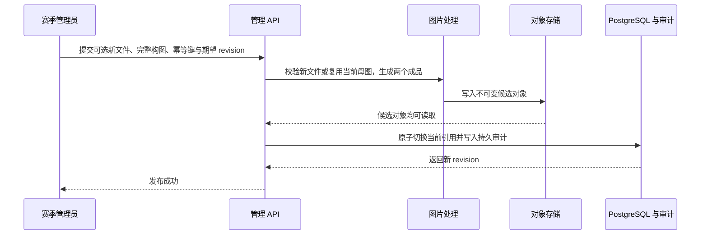

# 赛季排位与娱乐模式活动大封面需求与设计

> 文档类型：需求与设计专题
> 适用范围：赛季排位、娱乐模式（轮换主题牌桌）的玩家活动页、赛季管理后台与公共图片资源
> 当前状态：评估通过，首批实现已形成开发工作树基线；尚未完成生产迁移、孤立对象定期扫描和完整视觉／E2E 验收，不代表已上线
> 创建日期：2026-08-26
> 权威关系：排位当前事实以[赛季排位首版当前状态与上线边界](./RANKED_INITIAL_IMPLEMENTATION.md)为准，娱乐模式当前事实以[轮换主题牌桌策划与设计](./ROTATING_THEME_TABLE_DESIGN.md)为准；本文定义两类活动共用的大封面需求、当前设计与上线边界

## 0. 评估结论与首批冻结项

整体方案合理，可以实施。它把封面限制为活动展示资料，没有侵入评分、配组、候场、房间或对局事实；单母图双构图、不可变对象、乐观并发、最后一次幂等、数据库引用与审计同事务，以及默认 Hero 降级也形成了完整且可测试的失败边界。

评估后补充两项边界说明：

- 排位与娱乐模式管理接口分别校验 `season.ranked.manage` 和 `season.theme.manage`。这能防止接口按错误活动类型绕过授权，但当前角色模型中的 `season_admin` 同时拥有两项权限；因此本文所说的“不会互相越界”是接口权限域隔离，不代表已经支持把两类运营权限分别委派给不同账号。若产品需要后者，必须另行扩展角色／授权模型。
- 活动封面可以复用现有公共图片 bucket，但只写入可独立扫描的 `activity-covers/` 命名空间；不新建资产表、历史 revision 表或持久删除队列，也不复用玩家私有壁纸 bucket。

首批实现冻结为：宽屏 `16:7`、紧凑 `4:3`、`720px` 响应式切槽、`STANDARD / STRONG` 遮罩、当前配置单表、公开投影随排位／娱乐模式主数据返回、共用管理 API／Hero／双预览编辑器。后端已开始落地共享图片处理底座、`0034_add_activity_covers.sql`、不可变公共对象写入、revision／幂等／事务审计与权限边界；玩家页和两类管理页已接入首版组件。

本批不宣称生产完成。上线前仍需接入并验证超过 24 小时的孤立对象定期扫描，补齐对象失败重试、真实 MinIO／PostgreSQL 集成、日夜主题和代表素材截图、跨断点／双浏览器 E2E、LCP／体积观测及版权运营流程。停机部署顺序冻结为：停止旧版本和相关写入，备份并应用 `0034`，确认公共 bucket 的 `activity-covers/` 读写与同源 `/images/` 路由，再部署只读取新模型的应用；旧应用不写也不读取封面配置。

## 1. 背景与产品决策

赛季排位和娱乐模式都以一期活动为玩家入口，但当前页面主要依赖标题、状态、公告和内容卡片表达活动身份。随着赛季和主题轮换增多，仅依靠文字与通用页面背景难以形成清晰的视觉区分，也不便于运营在不发布前端代码的情况下更新当期主题。

首版建议新增统一的“活动大封面”能力：每个排位赛季或娱乐模式活动都可以关联一张公共封面母图，赛季管理员可上传、替换、调整宽屏与紧凑端构图，并在必要时移除。玩家进入对应活动页时，在页面顶部看到该活动的大幅视觉区域。

本文中的“活动大封面”是活动页的公共装饰性 Hero，不是：

- 覆盖整页的自由背景或壁纸；
- 玩家个人游戏桌壁纸；
- 对局桌面的背景；
- 赛季规则、竞技环境、配组算法或对局快照的一部分。

两类活动应复用同一套资源模型、图片处理、裁切预览和展示组件，只在权限与活动数据来源上区分，避免形成两套上传系统。

## 2. 目标与成功标准

### 2.1 产品目标

1. 每个排位赛季和娱乐模式活动都可选择性配置一张大封面。
2. 赛季管理员可在现有对应管理页中上传、预览、替换、调整和移除封面，不为封面另建独立运营页面。
3. 一张母图可分别调整宽屏和紧凑端构图，不要求运营准备两张素材。
4. 活动进行中更新封面不暂停候场、不改变已有对局，也不生成新的竞技或配组版本。
5. 没有封面、封面处理失败或资源加载失败时，页面稳定回退现有默认视觉。
6. 标题、活动状态、开放时间、公告和主要操作始终由真实文本表达，不依赖图片内文字。
7. 上传、替换、构图调整和移除均经过服务端权限校验，并进入赛季管理的持久审计。

### 2.2 成功标准

- 玩家能够从大封面快速辨认当前活动，但不会因图片影响状态、规则或主要操作的可读性。
- 同一活动在桌面、平板和手机上都能保持主体可见，不出现明显拉伸。
- 运营替换图片或重新调整构图后，只产生一个完整的新展示版本，不出现半张新图、旧裁切或混合版本。
- 普通玩家不能调用管理写接口；接口按活动类型分别校验排位与娱乐模式权限，不因共用资源模型而串用权限域。
- 无封面的历史活动和现有活动无需补数据即可继续展示。
- 图片上传或发布失败时，玩家继续看到同一活动、同一槽位的上一版本或默认视觉，候场和对局入口不受影响。

## 3. 首版范围

### 3.1 包含范围

- 排位赛季玩家页顶部的大封面。
- 娱乐模式活动页顶部的大封面。
- 排位与娱乐模式各自管理页中的封面设置区。
- 一张母图、宽屏构图、紧凑构图和受控遮罩强度。
- 上传、替换、重新调整、恢复默认和加载失败降级。
- 公共展示资源的服务端校验、重新编码、对象存储、缓存和清理。
- 管理操作的权限、乐观并发和持久审计。

首页或对局准备页的活动入口卡可以在后续复用同一封面生成的缩略图，但不应为此增加第二个上传槽位。是否在首版入口卡展示缩略图，作为实现前的视觉评审项，不阻塞活动页大封面本身。

### 3.2 非目标

首版不包含：

- 在对局桌面、观战、历史回放或结算页展示活动封面。
- 让玩家上传、选择或投票决定活动封面。
- 为同一活动按玩家、地区、开放窗口或卡组分配不同封面。
- GIF、动画 WebP、APNG、SVG、视频、音频、Lottie、轮播图或交互式背景。
- 从外部 URL、社交平台、第三方图床、Data URL 或 Base64 JSON 导入图片。
- 图片滤镜、文字排版、贴纸、AI 生图或通用在线设计工具。
- 把图片内文字作为活动名称、规则说明、开放时间或无障碍信息来源。
- 因封面变化修改赛季 ID、主题版本、竞技环境哈希、评分 revision、预组快照或对局记录。

## 4. 玩家展示要求

### 4.1 大封面位置与内容层级

- 大封面位于排位或娱乐模式活动页的首个主要内容区，与活动名称、状态、开放时间和简短说明共同形成活动身份 Hero。
- Hero 只负责表达活动身份和概览，不接管排位卡组选择、开始排位、加入娱乐模式、候场、配对确认或其他既有业务操作。主要操作保留在当前流程中的既有位置，可紧邻 Hero，但不要求覆盖在图片上。
- 活动名称、开放状态、当前或下一开放时间及关键公告入口必须使用页面真实文本和控件呈现。
- 封面被视为装饰性图片，不进入读屏顺序；图片缺失时不出现无意义的替代文本或破图图标。
- 图片内不得承载“仅在图中出现”的规则、日期或行动指引，避免裁切、翻译和无障碍场景丢失信息。
- 封面不覆盖页面导航、错误反馈、候场状态、配对确认或其他交互层。
- 玩家已经进入候场、配对确认或其他需要优先处理的运行状态时，页面可以隐藏或压缩 Hero；权威业务状态始终高于装饰性封面的视觉优先级。

### 4.2 响应式构图

首版使用一张规范化母图生成两个展示槽位：

| 展示槽位 | 目标构图              | 主要用途                   |
| -------- | --------------------- | -------------------------- |
| 宽屏封面 | 约 `16:7` 的横向 Hero | 桌面、笔记本和平板横向页面 |
| 紧凑封面 | 约 `4:3` 的紧凑 Hero  | 手机与现有窄屏页面布局     |

- 两个槽位分别保存归一化裁切区域与主体焦点；紧凑构图默认从宽屏构图居中派生，但管理员可单独调整。
- 正式展示按现有页面响应式布局选择槽位，不根据 User-Agent、设备品牌或图片方向另建判断。
- 非标准容器比例可以在目标裁切基础上使用主体焦点做二次 `cover`，不得拉伸图片。
- 管理预览至少覆盖标准宽屏、现有移动端断点两侧和一种较窄手机宽度。
- 后续若产品确实需要独立手机素材，应扩展为可选紧凑母图；首版不要求运营维护两套文件。

### 4.3 遮罩与可读性

- 封面上方必须使用产品固定的渐变或遮罩，保证亮图、暗图、高对比图和复杂图上的文字与按钮可读。
- 管理员可在受控枚举中选择“标准”或“加强”遮罩，不可输入任意 CSS、颜色值或把遮罩降至可读性基线以下。
- 宽屏和紧凑端使用同一遮罩级别，避免同一活动在不同设备上产生不同信息层级。
- 日间与夜间主题分别使用视觉系统冻结的遮罩 token；管理员不直接编辑主题颜色。
- 图片切换可以使用轻微淡入，但必须遵守 reduced-motion；首版不增加视差、缩放循环或滚动动画。

### 4.4 加载与降级

- 页面在封面 URL 尚未就绪、返回错误、超时或解码失败时立即使用现有默认 Hero，不阻塞活动概览、候场或任何主要操作。
- 封面容器应在图片完成前保留稳定尺寸，避免加载后推动页面产生明显布局位移。
- 新资源完成下载和解码前继续显示默认视觉，或仅保留同一活动、同一展示槽位已经加载的上一 revision，不短暂显示空白背景。
- 切换活动或切换宽屏／紧凑槽位时，不沿用另一个活动或另一个槽位的旧封面；目标资源完成解码前使用对应模式的默认 Hero。
- 玩家看到的是活动当前已发布的封面版本；无需通过 WebSocket 强制推送更新，刷新页面或下一次正常活动数据刷新后生效即可。

## 5. 活动关联与版本边界

### 5.1 共用概念模型

每个活动最多有一行当前封面配置。首版不保存可回滚的历史配置，概念上至少包含：

- 活动类型：`RANKED` 或 `THEME`；
- 活动 ID；
- 当前模式：`DEFAULT` 或 `CUSTOM`；
- 单调递增的当前封面 `revision`，同时作为乐观并发版本；
- `CUSTOM` 模式下的规范化母图引用、母图宽高与内容哈希；
- 宽屏不可变对象引用、裁切区域与主体焦点；
- 紧凑不可变对象引用、裁切区域与主体焦点；
- 遮罩级别；
- 最后更新者和时间；
- 最后一次成功写操作的幂等键与规范化请求指纹。

从未配置过封面的活动可以没有配置行，对外规范为 `DEFAULT + revision 0`。活动首次写入后保留配置行；移除封面会把该行切换为 `DEFAULT` 并增加 revision，以便继续承载并发和最后一次幂等语义。裁切和焦点均使用与源图尺寸无关的归一化数值，服务端校验范围、比例和有效像素。公开玩家投影不返回对象键、操作者、内部处理状态或审计详情。

固定输出规格、成品尺寸、对象字节数、当前配置指纹和首次创建者／时间不在当前配置表重复保存：输出规格由代码定义，对象属性由存储层持有，当前配置指纹由母图哈希、构图和遮罩即时计算，首次发布事实由持久审计记录。只有已有明确读取者且不能从权威来源即时得到的数据才进入业务表。

首版使用一张共用封面配置表，以 `activityType + activityId` 唯一约束区分 `RANKED` 与 `THEME`。为避免建立复杂的多态外键结构，服务层必须在写事务中验证目标活动存在，并由已经允许删除活动的既有业务流程在同一事务中解除对应封面配置。

### 5.2 与赛季事实分离

- 封面配置是可变的活动展示资料，不进入排位竞技环境哈希、评分配置或结算流水。
- 封面配置不进入娱乐模式的不可变预组、组合、分配算法或卡组快照。
- 封面不进入 `GameState`、权威 checkpoint、联机房间投影、对局记录或回放。
- 修改活动封面不得使排位票据或主题票据失效，也不得要求已创建房间重建。
- 历史活动页展示该活动当前保存的封面；首版不快照“玩家当时看到的封面版本”。审计日志只用于追踪运营变更摘要，不承诺恢复已清理的旧封面对象，也不由对局记录承担该责任。

### 5.3 生命周期规则

封面是非规则性展示资料。为降低运营和实现复杂度，拥有对应权限的管理员可查询及管理任意仍存在的活动，不因活动处于草稿、开放、暂停、收口或结束状态而增加不同分支：

- 活动不存在时返回不存在；
- 活动存在但未配置封面时返回明确的空配置；
- 活动任一生命周期状态均可上传、替换、调整或移除封面；
- 已结束活动的当前页面外观允许继续修改，变更保留完整审计，但不反向修改历史对局事实。

活动按其既有规则被合法删除时，封面配置随活动事务解除，资源进入异步清理；不得让封面阻止活动原有删除流程，也不得先删除仍被活动引用的对象。当前只有符合既有条件的空排位草稿支持删除，娱乐模式活动没有同等删除能力；封面功能不新增活动删除入口。

## 6. 管理端体验

### 6.1 设置入口

- 排位管理页在单个赛季编辑区域提供“活动封面”设置。
- 娱乐模式管理页在单个主题活动编辑区域提供同名设置。
- 两处复用同一封面编辑器、校验提示、宽屏／紧凑预览和保存语义。
- 未配置时展示默认 Hero 预览与“上传封面”；已配置时展示当前已发布版本、最后更新时间和编辑入口。

### 6.2 编辑流程

1. 首次上传或替换图片时，管理员选择本地 JPEG、PNG 或静态 WebP 文件；仅重新调整当前封面时直接复用服务端保留的规范化母图。
2. 新文件由客户端先做本地预览；服务端仍独立验证真实格式、大小与像素限制。
3. 编辑器分别展示宽屏和紧凑裁切，可通过拖动、键盘或可访问的位置控件调整主体。
4. 管理员选择受控遮罩级别，并核对桌面、手机及日间／夜间预览。
5. 保存时提交完整候选配置、`expectedRevision` 和幂等键；请求可以携带新文件，也可以明确复用当前母图。
6. 只有母图、两个展示成品、数据库当前引用和审计都成功后，新版本才整体生效。

未点击保存前，选择文件、裁切和遮罩调整只是本地草稿。离开存在未保存更改的页面时应提示，取消编辑应恢复当前已发布版本。

### 6.3 替换、调整与移除

- “替换图片”建立新的母图和新 revision，不能覆盖旧对象键。
- 仅调整构图或遮罩时也建立新的配置 revision；若仍保留规范化母图，不要求重新选择源文件。
- 新配置发布失败时保留旧版本，不产生部分更新。
- 过期 revision 保存返回稳定的并发冲突，界面重新读取当前版本并保留管理员尚可恢复的本地草稿。
- “移除封面”需要二次确认和非空原因；数据库先切换为空配置，玩家立即回退默认 Hero，物理对象随后异步清理。
- 与当前配置完全相同的提交作为 no-op 拒绝或返回未变化，不生成无意义 revision 和成功写审计。
- 首版不提供旧 revision 回滚；旧对象的短暂存在只用于缓存、在途请求和异步清理，不代表可恢复的业务版本。

## 7. 权限与审计

### 7.1 权限

| 操作对象         | 所需能力               | 可用角色                |
| ---------------- | ---------------------- | ----------------------- |
| 排位赛季封面     | `season.ranked.manage` | `season_admin`、`admin` |
| 娱乐模式活动封面 | `season.theme.manage`  | `season_admin`、`admin` |

- 普通玩家只能随活动公开投影读取已经发布的展示资源，不能读取管理配置或调用写接口。
- 排位权限不能写入娱乐模式封面，娱乐模式权限也不能写入排位封面。
- 浏览器隐藏按钮不是安全边界；服务端必须按具体活动类型校验权限和目标存在性。
- 封面上传不授予赛季管理员通用图片、卡图、玩家壁纸、MinIO 控制台或对象存储管理权限。

### 7.2 持久审计

上传、替换、裁切调整、遮罩调整和移除都属于赛季写操作，必须与对应活动引用的成功变更在同一权威事务中写入追加式持久审计。审计至少记录：

- 操作者、操作者角色、request ID 和时间；
- 活动类型与活动 ID；
- 操作类型；
- 旧、新封面 revision 与脱敏内容哈希；
- 裁切、焦点和遮罩的前后摘要；
- 移除操作的原因；
- 最终成功结果及其关联 request ID。

权限拒绝、输入失败、图片处理失败和 revision 冲突写入结构化安全日志，不伪装成已经提交的成功业务审计。日志和审计均不记录图片二进制、原始文件名、MinIO 密钥、完整对象键或带凭据的 URL。按照当前赛季管理员上线边界，在赛季写操作持久审计、完整负向权限矩阵与 E2E 验收完成前，不得把该能力作为可委派给真实 `season_admin` 的生产功能。

## 8. 图片输入与处理要求

### 8.1 输入限制

首版复用玩家壁纸已经审查和实现的通用图片输入与处理边界，不为活动封面另建一套上传安全参数。共享范围包括格式识别、文件和像素上限、请求体与文件数量限制、账号／来源地址限频、单位时间输入总字节、处理超时及全局并发保护。活动封面采用相同的源文件上限：

- 支持 JPEG、PNG、静态 WebP；
- 每张源文件最大 8 MB；
- 应用 EXIF 方向后每边至少 720 像素；
- 单边最大 8192 像素，解码后总像素不超过 32 MP；
- 不信任扩展名和浏览器 MIME，以服务端实际解码结果为准；
- 拒绝 SVG、GIF、APNG、动画 WebP、视频、压缩包和伪造格式。

建议源图为 2400 × 1350 或更高的横图。最终宽屏 `16:7` 裁切至少具有 1280 × 560 有效像素，紧凑 `4:3` 裁切至少具有 960 × 720 有效像素；不满足对应槽位时拒绝发布并指明问题，不能只检查源图总尺寸。

宽屏成品最大输出为 1920 × 840，紧凑成品最大输出为 960 × 720；有效裁切小于对应最大输出时不得放大。规范化母图与展示成品沿用玩家壁纸现有的静态 WebP 编码质量、最大母图边长、处理超时和并发参数，作为代码内共享基线，不增加后台配置或活动封面专属环境变量。若生产截图验证要求调整共享编码基线，应同步评估壁纸与活动封面，不在单一功能中形成漂移参数。

### 8.2 服务端处理

- 图片处理代码应从现有玩家壁纸链路抽取或复用无业务归属的通用校验、规范化、限频、并发和编码底座；活动封面只提供自身的裁切比例与输出规格，不复制第二套 Sharp 流程，也不直接依赖带玩家私有壁纸语义的存储和鉴权服务。
- 所有上传文件必须由服务端重新解码和编码，不把原文件直接作为在线资源。
- 自动应用 EXIF 方向，规范到受支持的 sRGB 表达，并移除不需要的 EXIF、ICC 隐私元数据及附加内容。
- 服务端验证裁切范围、目标比例、有效像素和焦点，不能信任客户端计算结果。
- 规范化母图和两个展示成品均使用不可变版本对象，并统一为静态 WebP；母图沿用共享高质量编码，展示成品沿用共享展示质量编码。
- 静态 Alpha 可以保留。透明区域显示对应排位或娱乐模式页面原有的默认 Hero；管理预览与玩家页面必须复用同一封面展示组件和合成顺序，不增加管理员可调透明底色。
- 原始上传文件只存在于受控处理生命周期，成功或失败后均不长期保留。
- 当前仍被活动引用的规范化母图必须保留，用于赛季管理员以后重新裁切而无需重新上传。
- 处理超时、内存上限、编码失败或任一展示成品写入失败时拒绝本次发布，不产生可见半成品。

### 8.3 内容与版权

- 管理入口应提示只能上传平台有权公开展示的图片，不得上传包含未授权版权素材、隐私信息或违法内容的文件。
- 首版不承诺用自动识别判断版权或内容合规；运营审批和下架责任必须有明确负责人。
- 平台管理员仍可按安全、版权或合规流程移除任何活动封面；该操作不得依赖赛季当前生命周期。
- 首版移除只保证活动页面立即停止展示并回退默认 Hero。由于公开不可变缓存和异步对象清理，已经知道的旧资源 URL 在缓存过期或物理清理完成前仍可能访问；首版不承诺 CDN purge、旧 URL 实时封禁或同步物理删除，运营文案不得把普通移除描述为即时全网撤回。
- 如后续接入内容审核服务，应作为上传发布前的明确状态，不允许审核中资源先对玩家公开。

## 9. 对象存储与资源生命周期

### 9.1 公共资源边界

活动封面是面向所有可查看该活动的玩家公开的运营资产，可以通过同源公共图片读取层提供，但必须与玩家私有壁纸 bucket／命名空间分离。

- 前端不获得对象存储写入凭据、可枚举对象列表或控制台权限。
- 公共接口返回稳定的同源资源 URL、封面 revision 和展示参数，不单独暴露内部对象键。
- 对象键由服务端生成，不包含活动名称、管理员身份、原始文件名、邮箱或其他个人信息。
- 新 revision 使用新对象键，配合长期不可变缓存；更新通过活动当前引用和 URL 版本切换，不能原地覆盖缓存中的旧图。

首版冻结为复用当前公开图片 bucket，并使用 `activity-covers/` 独立命名空间。不得把公共活动封面写入玩家私有壁纸 bucket，也不得扩大赛季管理员的底层存储权限；生产部署仍需显式验证该命名空间的容量、备份、读取缓存和清理权限。

### 9.2 原子发布与补偿

- 对象存储与 PostgreSQL 不共享事务。候选对象应先写入并验证，随后数据库原子切换当前引用和审计。
- 数据库提交失败或并发冲突时，旧封面保持活动状态；新产生的未引用对象进入孤立对象清理。
- 封面配置行只保存最后一次成功写入的幂等键和请求指纹。数据库已提交但响应丢失、且尚未发生后续修改时，使用同一幂等键重试返回当前成功结果，不重复生成资源或 revision；若活动已经产生后续 revision，则返回稳定的 revision 冲突，不承诺重放更早历史结果。
- 删除对象失败不回滚已经完成的封面切换；失败写入结构化日志，后续由定期 bucket 扫描收敛，不建立专用持久删除队列。

### 9.3 保留与清理

- 活动当前引用的母图与展示成品长期保留，直到被替换、移除或活动删除。
- 首版不建立独立资产表、历史 revision 表或持久删除队列。替换、移除或活动删除完成后，服务端可尽力删除已知旧对象；失败不影响新配置生效。
- 所有活动封面对象必须位于可单独扫描的专用 bucket 或命名空间。定期任务扫描超过安全期限的对象，并与封面配置表中的全部当前母图和成品引用比较；只有超过期限且不再被任何当前配置引用的对象才可删除。
- 安全期限必须长于最大上传处理时间、数据库提交时间和合理的在途请求窗口，首版默认至少 24 小时，具体值在生产运维评审中冻结。
- 上传成功但在数据库登记前进程退出形成的孤立对象，同样由上述 bucket 扫描识别和清理；清理不依赖数据库中预先存在资产记录。
- 资源物理删除不应阻塞管理页操作或玩家活动页读取。
- 对象存储备份、容量告警、失败重试和灾难恢复沿用生产对象存储运维边界。

## 10. 数据与接口要求

### 10.1 玩家读取

- 活动列表或概览投影在现有可见性规则下返回封面展示配置；隐藏草稿不会因存在公开封面对象而被普通玩家发现。
- 玩家活动页获取主数据时应同时得到当前宽屏／紧凑资源 URL、revision、焦点和遮罩级别，避免进入页面后增加阻塞首屏的串行配置查询。
- 未配置封面时返回明确的空值或 `DEFAULT`，不是 404 或接口错误。
- 玩家投影不返回母图、裁切编辑数据、内部对象键、操作者或审计信息。
- 公开展示资源不使用玩家身份作缓存键，不因不同登录用户生成不同 URL。

### 10.2 管理能力

管理接口至少支持：

- 按活动类型和活动 ID 读取当前封面编辑配置；
- 通过同一个保存接口提交完整双槽位构图，并选择携带新文件或复用当前规范化母图；
- 通过独立移除接口带原因恢复默认；
- 返回 revision、更新时间、处理结果和可行动的错误码。

查询和写入均不增加活动生命周期前置条件；权限通过活动类型决定。保存和移除都使用幂等键与 `expectedRevision`。服务端先匹配配置行保存的最后幂等键：同键且同请求指纹时返回当前成功结果，即使原请求携带的 expectedRevision 已因该次成功而过期；同键但不同指纹时返回稳定冲突。未命中最后幂等键时再校验 expectedRevision。配置不提供任意历史幂等结果查询。

### 10.3 停机迁移

- 新关联表通过停机迁移一次性加入；现有排位赛季和娱乐模式活动无需批量创建空配置行，缺少封面配置行就是正式的无封面状态。
- 部署后的运行时只读取新模型，不为试验字段、旧对象键或旧接口保留 dual-read/fallback。
- “无封面时显示现有默认 Hero”是正式产品状态，不是旧格式兼容分支。
- 应用部署回滚必须保证旧应用版本不会误读新对象引用；迁移、应用和资源初始化顺序在实现设计中单独说明。这里的部署回滚不代表提供封面 revision 回滚能力。

## 11. 性能、可访问性与可观测性

- 玩家页面只加载对应布局的展示成品，不下载规范化母图或另一布局资源。
- 新资源加载期间只能保留同一活动、同一槽位的上一 revision；活动或响应式槽位变化时先使用对应默认 Hero，并通过网络请求测试确认不会下载另一槽位成品。
- 图片响应使用内容版本、ETag 和适合公共不可变资源的缓存策略。
- 大封面作为活动页主要视觉候选时纳入 LCP 观测；不能因封面增加额外串行 API 或加载原始大图。
- 默认 Hero 与图片 Hero 使用相同尺寸约束，避免 CLS；资源失败率不计入候场或对局错误率。
- 裁切编辑器支持键盘调整、明确焦点、可读标签和错误关联，不把拖拽作为唯一操作方式。
- 记录不包含图片内容的聚合指标：上传格式与体积分布、处理耗时、失败原因、展示资源体积、加载失败率、替换与移除次数、扫描候选／删除对象数量和清理失败。
- 不采集图片视觉标签、人物识别结果或图片二进制作为默认分析数据。

## 12. 验证要求

### 12.1 服务端与数据

- 格式、MIME 欺骗、动画图片、大小、像素、裁切有效像素和解压炸弹拒绝测试。
- 排位／娱乐模式正向权限及普通玩家、交叉权限、过期权限的负向矩阵。
- 任意活动生命周期下的查询、上传、调整和移除测试。
- revision 冲突、最后一次幂等重试、后续 revision 后的旧请求冲突、对象写入失败、数据库失败、响应丢失和 bucket 孤立对象扫描测试。
- bucket 扫描测试必须覆盖安全期限、当前母图和成品白名单、上传后进程退出遗留对象及删除失败后的再次扫描，不依赖资产登记表或持久删除队列。
- 当前引用与成功审计同事务、移除原因和审计脱敏测试。
- 现有活动迁移为空配置及默认 Hero 降级测试。

### 12.2 前端与端到端

- 排位管理页和娱乐模式管理页复用编辑能力的上传、双构图调整、替换、取消和移除流程。
- 活动进行中更换封面后，玩家刷新看到新 revision，候场票据和已创建房间保持不变。
- 无封面、404、超时、解码失败和旧 revision 缓存场景均回退默认视觉。
- 切换活动或响应式槽位时不会短暂显示其他活动或其他槽位的封面；同一活动同一槽位更新时才允许保留上一 revision。
- 排位选组、开始排位、加入娱乐模式和候场／确认流程保持原有位置与操作结果；候场或确认状态下可隐藏或压缩 Hero，不让装饰性封面抢占业务状态层级。
- 桌面、平板、断点两侧和窄手机截图覆盖日间／夜间、明亮、暗色、高对比和复杂素材。
- 键盘裁切、焦点顺序、错误朗读、二次确认和 reduced-motion 验收。
- 玩家活动页结果验证以封面资源和活动操作同时可用为准，不以成功提示文案代替保存结果。

## 13. 首版验收标准

1. 排位赛季和娱乐模式活动均可独立配置封面，且共用同一产品和安全语义。
2. 赛季管理员能上传一张母图并分别调整宽屏 `16:7` 与紧凑 `4:3` 构图。
3. 已配置封面可替换、重新裁切、调整受控遮罩或带原因移除。
4. 草稿、开放、暂停、收口和结束活动使用相同管理规则，不产生生命周期特例。
5. 排位写入要求 `season.ranked.manage`，娱乐模式写入要求 `season.theme.manage`，接口按活动类型选择权限；当前 `season_admin` 同时具备两项权限，独立账号委派不属于本批能力。
6. 每次成功变更都写入持久审计；失败、冲突和 no-op 不伪装成成功审计。
7. 图片由共享处理底座完成验证、去元数据和重新编码；活动封面只维护自身布局规格，浏览器和管理员不获得对象存储写权限。
8. 新版本原子发布；任一步失败时旧版本继续有效，未引用对象可以被清理。
9. 玩家只加载当前布局成品；封面失败时默认 Hero、活动信息和主要操作仍正常，切换活动或槽位时不显示错误的旧封面。
10. 封面变化不改变评分、配组、候场、房间、对局快照、战绩或回放事实。
11. 现有无封面活动无需人工补数据即可展示和管理。
12. 桌面和移动端在代表性素材下通过可读性、响应式和无障碍验收。

## 14. 实现与上线前待确认

1. 当前开发实现使用 `720px` 切换宽屏／紧凑槽位，Hero 高度使用响应式约束；仍需通过断点两侧截图和候场状态验收决定是否微调高度。
2. 复用现有 WebP 质量参数后的单槽位体积预算和 LCP 告警阈值；若共享基线需要调整，应同时评估壁纸与活动封面，不增加封面专属运行配置。
3. 首页、对局准备页入口卡本批不复用封面缩略图；后续视觉评审通过后再接入现有成品，不增加上传槽位。
4. 公共活动封面已冻结为现有公开图片 bucket 的 `activity-covers/` 独立命名空间。
5. bucket 扫描安全期限冻结为至少 24 小时；执行频率、告警和失败后再次扫描仍需在生产运维评审中确定，首版不建立资产表或持久删除队列。
6. 上线时的版权确认文案、内部审批责任和移除流程，并明确普通移除不承诺旧 URL 实时失效。
7. 赛季写操作持久审计与真实 `season_admin` 委派门槛的统一交付批次。

## 15. 关联文档

- [赛季排位首版当前状态与上线边界](./RANKED_INITIAL_IMPLEMENTATION.md)
- [轮换主题牌桌策划与设计](./ROTATING_THEME_TABLE_DESIGN.md)
- [赛季管理员角色](../admin-center/season-admin-role.md)
- [玩家自定义游戏桌壁纸需求与安全边界](../player-wallpaper/requirements.md)
- [MinIO 对象存储需求与设计](../minio-requirements.md)
- [产品视觉系统](../ui-design/product-visual-system.md)
- [移动端适配需求](../ui-design/mobile-adaptation-requirements.md)

## 16. 关键代码路径

- `src/server/services/activity-cover-service.ts`：当前封面配置、revision、最后一次幂等、原子引用切换与持久审计。
- `src/server/services/activity-cover-image-service.ts`：活动封面双构图规格与共享静态图片处理底座的适配。
- `src/server/services/static-image-processing-service.ts`：壁纸和活动封面共用的图片校验、规范化、裁切、编码与处理并发限制。
- `src/server/routes/activity-covers.ts`：按活动类型鉴权的管理读取、发布、母图读取与移除接口。
- `src/server/services/ranked-player-service.ts`、`src/server/services/theme-table-player-service.ts`：玩家主投影中的当前封面配置。
- `client/src/components/activity-cover/ActivityCoverEditor.tsx`：排位和娱乐模式管理页共用的双构图编辑器。
- `client/src/components/activity-cover/ActivityCoverHero.tsx`：两类玩家活动页共用的响应式 Hero 与默认视觉降级。
- `drizzle/0034_add_activity_covers.sql`：当前封面配置表的停机迁移。
