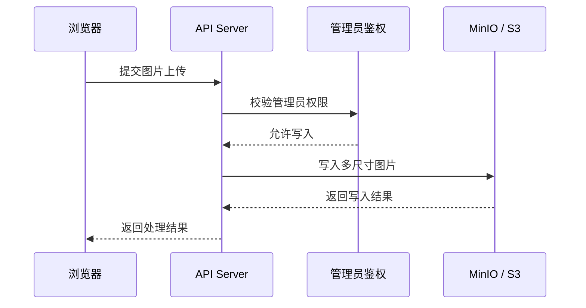
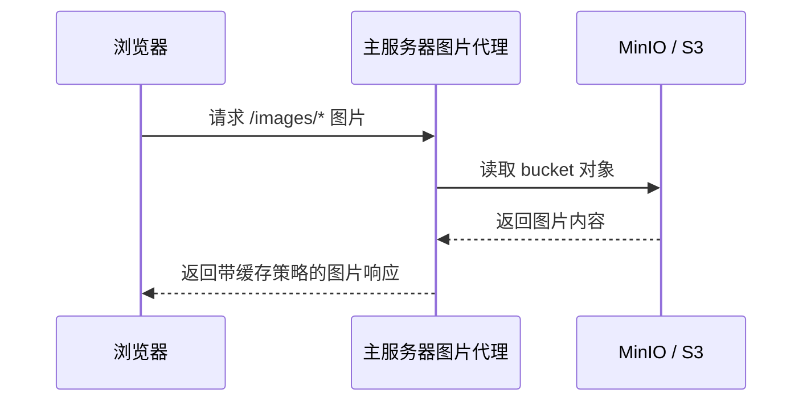

# MinIO 对象存储 - 需求与设计文档

> 版本: 1.1.0
> 创建日期: 2026-03-13
> 最后更新: 2026-06-12
> 文档类型: 设计文档
> 适用范围: 生产外部 MinIO、开发环境本地 MinIO、服务端图片上传/访问
> 当前状态: 服务端通过 `MINIO_*` 环境变量连接对象存储；生产环境不由主应用 compose 启动 MinIO，开发环境提供本地 MinIO

本文档说明 Loveca 图片对象存储的设计边界、路径约定和部署职责，不维护具体命令、脚本调用示例或 Nginx 配置片段。

## 1. 背景与目标

卡牌图片按多尺寸 WebP 存储，静态资源与卡牌图片统一通过主应用的 `/images/*` 路径读取。生产环境建议使用独立 MinIO 或兼容 S3 对象存储，本地开发环境可使用仓库提供的开发 compose。

设计目标：

- 保持图片公开读取路径稳定。
- 生产对象存储与主应用解耦，降低主应用部署复杂度。
- 图片上传、删除和批量迁移必须经过受控服务或脚本。
- 前端只关心图片 URL，不直接接触对象存储密钥。
- 开发环境尽量自动初始化 bucket 和公开读取策略。

## 2. 存储结构

Bucket 名称默认为 `loveca-cards`。对象按用途分为：

| 目录 | 内容 | 说明 |
| --- | --- | --- |
| `thumb/` | 缩略图 | 列表、网格和小尺寸预览 |
| `medium/` | 中等尺寸图片 | 常规卡牌展示 |
| `large/` | 大尺寸图片 | 详情查看、管理端预览 |
| `static/` | 主题静态资源 | 游戏桌背景、卡背、应用图标等 |

卡牌图片文件名以卡牌图片基础名为准，静态资源保持原始文件名。包含特殊字符的文件名必须由 URL 生成逻辑负责正确编码。

## 3. 部署边界

| 环境 | MinIO 来源 | 说明 |
| --- | --- | --- |
| 生产 | 主应用之外的 MinIO 或兼容 S3 服务 | 主应用只通过环境变量访问对象存储 |
| 开发 | `docker-compose.dev.yml` 中的 MinIO | 用于本地调试，包含初始化辅助服务 |

生产环境中，主应用部署只负责 API、数据库连接和图片代理配置；MinIO 的数据卷、账号、bucket 策略、防火墙和备份由对象存储服务器维护。

## 4. 访问路径

前端和浏览器统一通过主应用域名读取图片：

| 场景 | 路径形态 |
| --- | --- |
| 卡牌图片 | `/images/{size}/{name}.webp` |
| 静态资源 | `/images/static/{name}` |

应用访问入口负责把 `/images/*` 转发到对象存储，并设置适合静态资源的缓存策略。开发环境中 Express 只在 dev 模式挂载 `/images` 调试读取；生产环境 API 服务不直接提供该路径，应由 Nginx 或其他反向代理转发到对象存储。`client/src/lib/imageService.ts` 和 `client/src/lib/apiClient.ts` 负责在前端生成同源或配置源下的图片 URL。

## 5. 写入流程

图片写入只能由受控入口完成：

批量迁移脚本用于把已有压缩图片和静态资源写入对象存储。脚本入口可以在“相关代码路径”中查找，具体运行参数以当前部署环境和 README/运维记录为准。

## 6. 读取流程

图片读取是公开的，但公开范围只限 bucket 中可通过 `/images/*` 暴露的对象。写入权限不得下放给前端。

## 7. 配置项

API Server 通过 `MINIO_*` 环境变量连接对象存储：

| 变量 | 说明 |
| --- | --- |
| `MINIO_ENDPOINT` | 对象存储地址 |
| `MINIO_PORT` | S3 API 端口 |
| `MINIO_ACCESS_KEY` | 写入访问密钥 |
| `MINIO_SECRET_KEY` | 写入密钥 |
| `MINIO_BUCKET` | bucket 名称 |
| `MINIO_USE_SSL` | 是否使用 TLS |

前端跨源调试时可通过 `VITE_API_BASE_URL` 指向 API 和图片代理源。同源部署不需要额外配置。

## 8. 安全与运维原则

- 生产 MinIO 控制台不应公开暴露。
- S3 API 端口应只允许主应用服务器或可信网络访问。
- 写入密钥只配置在服务端或受控脚本环境中。
- 图片读取可公开，但 bucket 内不应混放私密对象。
- 对象存储数据需要独立备份策略。
- 迁移后应抽样验证图片可访问性、尺寸目录完整性和静态资源加载情况。

## 9. 已知限制

- 前端不会因为远程图片请求失败自动切换到本地静态兜底。
- URL 稳定性依赖 `image_filename` 与对象文件名的一致性。
- 生产 Nginx/反向代理配置不在本文维护具体片段，应由部署文档或运维配置承担。

## 10. 相关代码路径

| 路径 | 说明 |
| --- | --- |
| `client/src/lib/imageService.ts` | 图片路径和尺寸解析 |
| `client/src/lib/apiClient.ts` | API base URL 与图片源辅助 |
| `src/server/routes/images.ts` | 图片上传/删除 API |
| `src/server/services/minio-service.ts` | 对象存储访问封装 |
| `src/scripts/upload-to-minio.ts` | 批量上传卡牌图片脚本 |
| `src/scripts/upload-static-assets.ts` | 上传静态资源脚本 |
| `docker-compose.dev.yml` | 本地开发 MinIO 与初始化服务 |
| `docker-compose.yml` | 生产主应用服务边界 |
