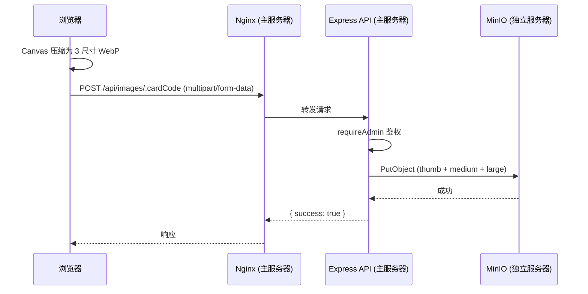
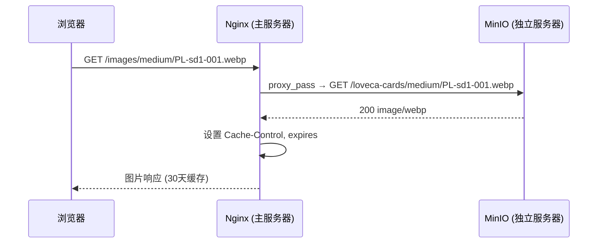

# MinIO 独立服务器 - 需求与设计文档

> 版本: 1.0.0
> 创建日期: 2026-03-13
> 最后更新: 2026-03-13

本文档描述 Loveca 项目中 MinIO 对象存储服务的独立部署方案，替代原有 Supabase Storage 服务。MinIO 部署在与主应用服务器不同的独立服务器上。

---

## 1. 背景与目标

### 1.1 迁移背景

原有图片存储使用 Supabase Storage（公开桶 `loveca-cards`），存储卡牌图片的三种尺寸（thumb/medium/large）和静态资源。当前方案改为自托管 MinIO，以摆脱对 Supabase Storage 的运行时依赖，并保持现有图片目录结构与访问方式。

### 1.2 目标

- **功能对等**：保持与 Supabase Storage 完全一致的存储结构和访问模式
- **独立部署**：MinIO 运行在单独的服务器上，与主应用服务器（PostgreSQL + API Server）分离
- **公开读取**：卡牌图片通过主服务器 Nginx 反向代理公开访问，无需认证
- **认证写入**：图片上传/删除通过 API Server 中间件鉴权后操作 MinIO

---

## 2. 存储结构

### 2.1 Bucket 配置

| 项目 | 值 |
|------|----|
| Bucket 名称 | `loveca-cards` |
| 读取策略 | 公开（anonymous GET） |
| 写入策略 | 需 access key 认证 |
| 文件大小限制 | 10MB |

### 2.2 目录结构

```
loveca-cards/
├── thumb/           # 缩略图 (100px 宽, quality 75)
│   ├── PL-sd1-001.webp
│   └── ...
├── medium/          # 中等尺寸 (300px 宽, quality 80)
│   ├── PL-sd1-001.webp
│   └── ...
├── large/           # 大尺寸 (600px 宽, quality 85)
│   ├── PL-sd1-001.webp
│   └── ...
└── static/          # 静态资源
    ├── deck.png     # 卡组封面图
    ├── back.jpg     # 卡牌背面图
    └── icon.jpg     # 应用图标
```

### 2.3 文件命名规则

- 卡牌图片：`{imageBaseName}.webp`，其中 `imageBaseName` 为 cards 表 `image_filename` 去掉目录前缀和扩展名的部分
- 含特殊字符的文件名（如 `!`, `+`）需 URL 编码后访问
- 静态资源保持原始文件名和扩展名

---

## 3. MinIO 服务器部署

### 3.1 服务器要求

| 项目 | 要求 |
|------|------|
| 操作系统 | Linux（推荐 Ubuntu 22.04 LTS） |
| 最低配置 | 1 vCPU, 1GB RAM, 20GB+ 磁盘 |
| 推荐配置 | 2 vCPU, 2GB RAM, 50GB SSD |
| 前置依赖 | Docker + Docker Compose |

### 3.2 Docker Compose 部署

在 MinIO 服务器上创建独立的 `docker-compose.yml`：

**服务配置**：

| 项目 | 值 |
|------|----|
| 镜像 | `minio/minio:latest` |
| S3 API 端口 | 9000 |
| Web Console 端口 | 9001 |
| 启动命令 | `server /data --console-address ":9001"` |
| 数据持久化 | Docker volume 挂载到 `/data` |
| 健康检查 | `curl -f http://localhost:9000/minio/health/live` |

**环境变量**：

| 变量 | 说明 |
|------|------|
| `MINIO_ROOT_USER` | 管理员用户名（不少于 3 字符） |
| `MINIO_ROOT_PASSWORD` | 管理员密码（不少于 8 字符） |

### 3.3 Bucket 初始化

MinIO 启动后需要创建 bucket 并配置公开读取策略。有两种方式：

**方式一：通过 MinIO Client (mc) 命令行**

```bash
# 设置 alias
mc alias set loveca http://localhost:9000 $MINIO_ROOT_USER $MINIO_ROOT_PASSWORD

# 创建 bucket
mc mb loveca/loveca-cards

# 设置公开读取策略
mc anonymous set download loveca/loveca-cards
```

**方式二：通过 Web Console**

访问 `http://MINIO_SERVER_IP:9001`，登录后在 Buckets 页面创建 `loveca-cards`，设置 Access Policy 为 `public`。

### 3.4 网络安全

| 端口 | 用途 | 访问限制 |
|------|------|---------|
| 9000 | S3 API | 防火墙仅允许主应用服务器 IP 访问 |
| 9001 | Web Console | 仅通过 SSH 隧道或 VPN 访问，不对外暴露 |

**防火墙配置要点**：
- 默认拒绝所有入站连接
- 仅放行 SSH（22）和来自主服务器 IP 的 9000 端口
- 9001 端口不对外开放，管理操作通过 SSH 隧道：`ssh -L 9001:localhost:9001 user@minio-server`

---

## 4. 主服务器集成

### 4.1 Nginx 反向代理

在主服务器的 `loveca.conf` 中添加图片代理，将 `/images/*` 请求转发到远程 MinIO：

**路由规则**：

| 请求路径 | 代理目标 |
|---------|---------|
| `/images/thumb/PL-sd1-001.webp` | `http://MINIO_IP:9000/loveca-cards/thumb/PL-sd1-001.webp` |
| `/images/static/deck.png` | `http://MINIO_IP:9000/loveca-cards/static/deck.png` |

**缓存策略**：
- `Cache-Control: public, immutable`
- `expires 30d`
- 可选启用 Nginx proxy_cache 在主服务器本地缓存图片

### 4.2 URL 格式变更

| 场景 | 原 URL (Supabase) | 新 URL |
|------|--------------------|--------|
| 卡牌图片 | `{SUPABASE_URL}/storage/v1/object/public/loveca-cards/{size}/{code}.webp` | `{BASE_URL}/images/{size}/{code}.webp` |
| 静态资源 | `{SUPABASE_URL}/storage/v1/object/public/loveca-cards/static/{name}` | `{BASE_URL}/images/static/{name}` |

前端通过 `VITE_API_BASE_URL` 环境变量构造图片 URL。未配置时降级到本地静态文件。

### 4.3 API Server 连接 MinIO

API Server（Express）通过 MinIO JS SDK 连接远程 MinIO 执行写操作：

**API Server 环境变量**：

| 变量 | 说明 | 示例 |
|------|------|------|
| `MINIO_ENDPOINT` | MinIO S3 API 地址（不含协议） | `10.0.0.2` 或 `minio.internal` |
| `MINIO_PORT` | S3 API 端口 | `9000` |
| `MINIO_ACCESS_KEY` | 访问密钥 | 与 `MINIO_ROOT_USER` 相同，或创建专用 access key |
| `MINIO_SECRET_KEY` | 密钥 | 与 `MINIO_ROOT_PASSWORD` 相同，或创建专用 secret key |
| `MINIO_BUCKET` | Bucket 名称 | `loveca-cards`（默认值） |
| `MINIO_USE_SSL` | 是否启用 TLS | `false`（内网通信可不加密） |

### 4.4 图片上传流程



### 4.5 图片读取流程



---

## 5. 后端脚本迁移

### 5.1 upload-to-supabase.ts → upload-to-minio.ts

批量上传压缩后的卡牌图片。改动点：
- `createClient(@supabase/supabase-js)` → MinIO JS SDK `new Minio.Client()`
- `supabase.storage.from().upload()` → `minioClient.putObject()`
- `supabase.storage.from().list()` → `minioClient.listObjects()` 或 `minioClient.statObject()`
- `supabase.storage.listBuckets()` → `minioClient.bucketExists()` + `minioClient.makeBucket()`
- 环境变量从 `SUPABASE_URL` + `SUPABASE_SERVICE_ROLE_KEY` 改为 `MINIO_*` 系列

**使用方法**：
```bash
MINIO_ENDPOINT=10.0.0.2 MINIO_PORT=9000 MINIO_ACCESS_KEY=xxx MINIO_SECRET_KEY=xxx npx tsx src/scripts/upload-to-minio.ts
```

### 5.2 upload-static-assets.ts

同样替换为 MinIO SDK，上传 `assets/deck.png`、`assets/back.jpg`、`assets/icon.jpg` 到 `static/` 目录。

---

## 6. 本地开发环境

### 6.1 docker-compose.dev.yml 中的 MinIO

本地开发时在 `docker-compose.dev.yml` 中包含 MinIO 服务，与 PostgreSQL 和 API Server 一起启动：

**本地 MinIO 配置**：

| 项目 | 值 |
|------|----|
| 端口 | 9000 (S3 API), 9001 (Console) |
| ROOT_USER | `minioadmin` |
| ROOT_PASSWORD | `minioadmin` |
| Volume | `miniodata` |

开发时 Vite 代理配置将 `/images/*` 转发到本地 MinIO：

| 代理路径 | 目标 |
|---------|------|
| `/images/*` | `http://localhost:9000/loveca-cards/*` |

### 6.2 Bucket 自动初始化

可在 docker-compose.dev.yml 中增加一个初始化容器（使用 `minio/mc` 镜像），在 MinIO 启动后自动创建 bucket 并设置公开策略，避免每次手动操作。

---

## 7. 数据迁移

### 7.1 从 Supabase Storage 导出图片

**方式一：通过 Supabase CLI / API 批量下载**

使用现有 Supabase Service Role Key 通过 Storage API 列出并下载所有文件：

```bash
# 列出所有文件
# GET {SUPABASE_URL}/storage/v1/object/list/loveca-cards

# 下载单个文件
# GET {SUPABASE_URL}/storage/v1/object/public/loveca-cards/{path}
```

**方式二：从本地压缩文件重新上传**

如果本地 `assets/compressed/` 目录仍保留了所有压缩后的图片，可直接使用迁移后的 `upload-to-minio.ts` 脚本重新上传。这是更简单的方式，前提是本地文件完整。

### 7.2 迁移验证

1. 比对 MinIO 和 Supabase Storage 中的文件数量（按 size 目录分别统计）
2. 抽样检查图片是否可通过 Nginx 代理正常访问
3. 验证静态资源（deck.png, back.jpg, icon.jpg）可正常加载

---

## 8. 监控与维护

### 8.1 磁盘空间

- 当前预估：每张卡牌 3 种尺寸（~5KB + ~15KB + ~40KB = ~60KB），按 1000 张卡计算约 60MB
- 静态资源约 1MB
- 短期内磁盘空间不是瓶颈，但应设置监控告警

### 8.2 MinIO 健康检查

- 健康端点：`GET /minio/health/live`
- Prometheus 指标：`GET /minio/v2/metrics/cluster`（需认证）

### 8.3 备份

- 定期备份 MinIO data volume
- 或使用 `mc mirror` 同步到备份位置

---

## 9. 环境变量汇总

### 9.1 MinIO 服务器

| 变量 | 说明 |
|------|------|
| `MINIO_ROOT_USER` | 管理员用户名 |
| `MINIO_ROOT_PASSWORD` | 管理员密码 |

### 9.2 主应用服务器（API Server）

| 变量 | 说明 |
|------|------|
| `MINIO_ENDPOINT` | MinIO 服务器地址（IP 或域名，不含协议和端口） |
| `MINIO_PORT` | S3 API 端口（默认 9000） |
| `MINIO_ACCESS_KEY` | 访问密钥 |
| `MINIO_SECRET_KEY` | 密钥 |
| `MINIO_BUCKET` | Bucket 名称（默认 `loveca-cards`） |
| `MINIO_USE_SSL` | 是否启用 TLS（默认 `false`） |

### 9.3 后端脚本

与 API Server 使用相同的 `MINIO_*` 环境变量。

---

## 10. 相关文档

- `docs/loveca_supabase.md` — 原有 Supabase 设计文档（迁移后归档）
- `docs/image_optimization.md` — 图片压缩和优化策略
- MinIO 官方文档：https://min.io/docs/minio/container/index.html
- MinIO JS SDK：https://min.io/docs/minio/linux/developers/javascript/minio-javascript.html
