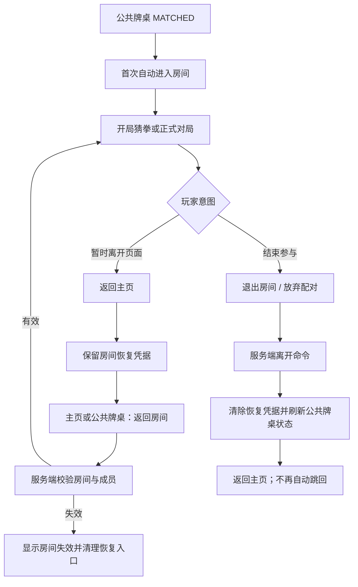

# 联机房间返回、退出与恢复设计

> 文档类型：设计文档
>
> 适用范围：正式联机房间、公共牌桌配对后的联机房间、主页与公共牌桌的房间恢复入口
>
> 当前状态：现行实现与评审基准
>
> 最后更新：2026-07-24

## 1. 文档目的

本文档统一说明玩家离开联机页面、退出房间和再次返回房间时的产品语义。它是以下事实的权威说明：

- “返回主页”“退出房间”和“放弃配对”分别意味着什么；
- 哪些操作保留房间，哪些操作会改变服务端成员或配对状态；
- 主页、公共牌桌和全局配对层如何提供房间恢复入口；
- 公共牌桌各状态必须向玩家提供什么下一步操作；
- 评审相关改动时应验证哪些行为。

公共牌桌的候场、确认、配桌与恢复限制以本文、[当前实现限制](../current-limitations.md)和已落地服务端实现为准；正式联机的权威状态、玩家视角和同步边界仍由[联机模式准备文档](preparation.md)说明。

## 2. 要解决的问题

### 2.1 一个“离开”同时表达了两种意图

玩家在房间中可能只是想回主页查看卡组、历史记录或其他入口，也可能确实想退出当前房间。旧交互只提供“离开房间”，导致同一个按钮同时承担：

- 页面导航；
- 清除客户端恢复凭据；
- 调用服务端离开命令；
- 在公共牌桌开局阶段结束整次配对。

这些后果差异很大，不能继续使用同一个动作名称。

### 2.2 公共牌桌 `MATCHED` 状态缺少下一步

公共牌桌已经完成配桌后，持久票据可能仍投影为 `MATCHED`。旧页面把所有非 `WAITING` 状态统一显示为“找到对手 / 请确认是否开始”，但只为 `WAITING` 提供按钮，因此会出现：

- 已经完成确认和房间创建，却仍提示再次确认；
- 页面只有状态说明，没有进入房间的入口；
- 客户端已经清除房间恢复凭据时，玩家无法从页面恢复。

### 2.3 全局自动引导会覆盖玩家导航

公共牌桌全局层在看到 `MATCHED` 时会把玩家带入联机房间。若同一个匹配结果在组件重渲染时被重复消费，玩家即使已经返回主页，也会再次被带回房间，形成无法离开的导航循环。

### 2.4 客户端状态与服务端状态没有及时重新对齐

真正退出公共牌桌房间后，客户端可能仍持有退出前的 `MATCHED` 视图。若公共牌桌页面不主动刷新服务端状态，就会继续展示已经失效的房间和错误操作。

## 3. 产品术语与硬性需求

### 3.1 返回主页

“返回主页”只改变当前客户端页面，不发送服务端离开命令。

必须满足：

- 保留当前房间号恢复凭据；
- 停止当前页面的轮询和桌面同步；
- 主页显示“返回房间”入口；
- 公共牌桌仍为 `MATCHED` 时，公共牌桌页面显示房间号和“返回房间”；
- 玩家再次进入后，由服务端重新确认成员身份和当前房间状态。

### 3.2 退出房间

“退出房间”表示玩家主动执行服务端离开命令，不等同于返回页面。

必须满足：

- 操作前显示后果明确的确认框；
- 成功后清除客户端房间恢复凭据；
- 成功后返回主页；
- 准备阶段按房间成员规则移除或转移房主；
- `OPENING` 或 `IN_GAME` 的普通房间按服务端生命周期保留短暂恢复能力，但客户端不再把它当作当前房间自动恢复；
- 失败时保留当前页面和恢复凭据，并显示可理解的错误。

如果玩家希望稍后继续，应优先选择“返回主页”，而不是先退出再依赖房间仍然存在。

### 3.3 放弃配对

公共牌桌房间处于 `OPENING` 时，退出行为必须命名为“放弃配对”。

必须满足：

- 确认文案明确说明这次配对会结束；
- 同时提示“如果只是暂时离开页面，请选择返回主页”；
- 成功后刷新公共牌桌状态，不能继续展示旧的 `MATCHED` 房间；
- 已经放弃并被服务端结束的公共牌桌开局不承诺恢复。

## 4. 页面与动作矩阵

| 所在场景                            | 返回主页                         | 退出/放弃                                            | 恢复入口                                               |
| ----------------------------------- | -------------------------------- | ---------------------------------------------------- | ------------------------------------------------------ |
| 正式房间准备阶段                    | 保留房间号，不调用离开接口       | 退出房间；按成员规则移除当前成员                     | 主页“返回房间”或再次输入房间号                         |
| 正式房间开局猜拳                    | 保留开局状态和房间号             | 退出房间；服务端将成员标记为离开并按生命周期保留房间 | 主页“返回房间”                                         |
| 公共牌桌开局猜拳                    | 保留配对房间和房间号             | 放弃配对；结束这次公共牌桌开局                       | 主页或公共牌桌的“返回房间”                             |
| 正式联机或公共牌桌的进行中对局      | 保留房间号，稍后重新同步玩家视角 | 退出房间；服务端按进行中房间生命周期处理             | 主页“返回房间”；恢复成功与否以服务端房间是否仍存在为准 |
| 公共牌桌已经 `MATCHED` 但不在房间页 | 不适用                           | 进入房间后再执行对应退出动作                         | 公共牌桌显示房间号和“返回房间”                         |
| 已真正退出且房间已销毁              | 不适用                           | 不适用                                               | 不显示失效入口；玩家重新创建房间或重新进入公共牌桌候场 |

## 5. 公共牌桌状态与唯一下一步

公共牌桌页面不能把所有活动状态压缩成“找到对手”。每个状态必须提供与服务端含义一致的展示和操作：

| 状态                   | 主文案       | 必须提供的操作               |
| ---------------------- | ------------ | ---------------------------- |
| `IDLE`                 | 选择卡组     | 找对手                       |
| `WAITING`              | 正在找对手   | 结束等待                     |
| `PENDING_CONFIRMATION` | 找到对手     | 确认开始、放弃               |
| `CONFIRMED`            | 已确认       | 等待对方；仍允许放弃         |
| `CREATING_ROOM`        | 正在进入房间 | 明确的加载反馈，不重复提交   |
| `MATCHED`              | 对局已准备好 | 显示房间号，并提供“返回房间” |

页面进入时必须主动读取一次服务端公共牌桌状态。真正退出公共牌桌房间后也应尽快刷新，以清除客户端残留的 `MATCHED` 视图。

## 6. 自动进入与手动恢复

### 6.1 自动进入只消费一次

公共牌桌首次进入 `MATCHED` 后，全局层可以自动把玩家带入房间。消费键由 `roomGeneration + roomCode` 组成。

同一个消费键不得因为以下原因再次触发自动导航：

- `App` 或全局层重渲染；
- 玩家从房间返回主页；
- 玩家进入卡组、历史记录或其他站内页面；
- 公共牌桌 store 写入等价的 `MATCHED` 对象。

新的配对具有新的 `roomGeneration`，仍应正常自动进入。

### 6.2 手动恢复入口

客户端使用当前标签页的 `sessionStorage` 保存房间号。该凭据只负责发现“可能需要恢复的房间”，不代表服务端一定接受恢复。

恢复入口有两处：

1. 主页：存在房间恢复凭据时，主操作显示“返回房间”；
2. 公共牌桌：服务端状态为 `MATCHED` 且包含房间号时，显示“返回房间”。

点击恢复入口后，联机页面仍须调用房间读取接口。成员身份、房间代际、房间是否存在以及对局是否仍运行，全部以服务端结果为准。

## 7. 交互流程

## 8. 状态职责

### 8.1 服务端

服务端负责：

- 房间、成员、席位、presence、房间代际和对局的权威状态；
- 公共牌桌 reservation、ticket 与房间绑定；
- 离开命令对不同房间阶段的实际影响；
- 拒绝不存在、已销毁、代际不匹配或无成员资格的恢复请求。

客户端不得仅凭保存的房间号宣称恢复成功。

### 8.2 客户端

客户端负责：

- 区分页面导航和服务端离开；
- 保存或清除当前标签页的房间恢复凭据；
- 根据公共牌桌状态显示唯一、可执行的下一步；
- 防止同一个 `MATCHED` 结果重复自动导航；
- 在退出、恢复失败或进入公共牌桌页面时重新读取服务端状态。

## 9. 当前限制

- 房间恢复凭据使用 `sessionStorage`，只在当前浏览器标签页会话中保留，不承诺跨设备或跨浏览器恢复。
- 正式联机房间和运行中 match 仍主要依赖服务端进程内状态；服务进程重启后的完整续局尚未实现。
- “返回主页”可以保留进入房间的入口，但不延长服务端房间生命周期；长时间无人在线时房间仍会按现有清理策略结束。
- 已明确执行“放弃配对”并被服务端结束的公共牌桌开局不可恢复。
- 房间号是恢复定位信息，不取代用户身份、房间代际和成员资格校验。

跨模块的长期恢复限制仍以[当前实现限制](../current-limitations.md)为准。

## 10. 关键实现路径

- 应用级页面切换：`client/src/App.tsx`
- 公共牌桌全局等待、确认与自动进入：`client/src/components/public-table/PublicTableGlobalLayer.tsx`
- 公共牌桌状态页与“返回房间”：`client/src/components/pages/PublicTablePage.tsx`
- 正式联机房间、开局、对局操作与离开确认：`client/src/components/pages/OnlineRoomPage.tsx`
- 主页房间恢复入口：`client/src/components/pages/HomePage.tsx`
- 离开确认文案：`client/src/lib/leaveConfirmCopy.ts`
- 公共牌桌客户端状态：`client/src/store/publicTableStore.ts`
- 联机房间公开 DTO：`src/online/release-types.ts`
- 房间成员与离开生命周期：`src/server/services/online-room-service.ts`
- 公共牌桌票据与房间绑定：`src/server/services/public-table-service.ts`

## 11. 验收标准

评审相关改动时至少验证：

1. 公共牌桌 `PENDING_CONFIRMATION` 页面同时有“确认开始”和“放弃”。
2. 公共牌桌 `MATCHED` 页面显示真实房间号和“返回房间”。
3. 开局猜拳页同时提供“返回主页”和“退出房间 / 放弃配对”，且文案说明后果。
4. 点击“返回主页”不会调用离开接口，不会清除房间恢复凭据。
5. 返回主页后可以从主页进入原房间。
6. 从公共牌桌进入已匹配房间时，会恢复客户端房间凭据。
7. 点击“放弃配对”后，公共牌桌不会继续显示已失效的 `MATCHED` 房间。
8. 同一个匹配结果不会在玩家返回主页后再次强制跳转。
9. 新的公共牌桌匹配仍会自动进入一次。
10. 恢复请求被服务端拒绝时，页面显示明确错误并允许清理失效入口。
11. 桌面和移动端都能看见上述关键操作，键盘焦点与禁用状态清晰。

## 12. 维护规则

以下变化必须同步更新本文档：

- “返回主页”“退出房间”或“放弃配对”的后果变化；
- 房间恢复凭据的存储方式或生命周期变化；
- 公共牌桌状态机或 `MATCHED` 自动进入策略变化；
- 正式联机进程重启恢复、跨设备恢复或持久房间恢复落地；
- 服务端离开命令对 `PREPARING`、`OPENING`、`IN_GAME` 的处理变化。

纯样式调整、组件拆分或不改变上述外部行为的重构不需要更新本文档。
