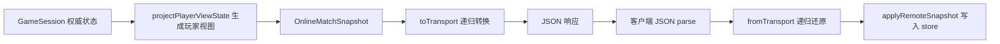
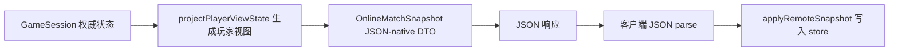

# 正式联机 transport serde 性能问题说明

> 文档类型：专题说明
> 适用范围：正式联机 snapshot、命令响应、阶段推进响应的传输格式与性能优化
> 当前状态：已实施正式联机响应侧绕过通用 transport serde；已补充 JSON-native 契约测试与性能基准
> 最后更新：2026-06-12

## 1. 问题一句话

正式联机已经不再返回完整历史，但每次真实状态变化仍会返回整份当前 `playerViewState`。此前响应体还会经过通用递归 `toTransport()` / `fromTransport()` 转换。

基准测试显示，在正式联机热路径里，通用 transport serde 的耗时曾高于服务端重新投影快照本身。因此本次修复已让正式联机响应直接使用 JSON-native DTO，移除响应侧的通用递归转换成本。

## 2. 优化前链路

优化前正式联机 snapshot 链路可以概括为：



相关代码路径：

- `src/server/services/online-match-service.ts`
- `src/server/routes/online.ts`
- `src/online/serde.ts`
- `client/src/lib/onlineClient.ts`
- `client/src/store/gameStore.ts`

其中 `toTransport()` / `fromTransport()` 的设计目标是支持通用结构，尤其是 `Map`。但正式联机的 `OnlineMatchSnapshot`、`OnlineCommandResult`、`RemoteMatchSnapshot` 当前应保持 JSON-native DTO，也就是普通 object、array、string、number、boolean 和 null。

## 3. 基准测试结果

已新增基准测试：

- `tests/performance/online-performance.bench.test.ts`

运行方式：

```bash
pnpm test:perf:online
```

可调样本数：

```bash
RUN_PERF=1 PERF_SAMPLES=500 PERF_WARMUP=50 pnpm vitest run tests/performance/online-performance.bench.test.ts
```

一次 50 样本本地结果：

| 指标                                  | 平均耗时 |     p50 |     p95 | 说明                      |
| ------------------------------------- | -------: | ------: | ------: | ------------------------- |
| snapshot unchanged short-circuit      |  0.004ms | 0.002ms | 0.013ms | `sinceSeq` 未变化短路     |
| snapshot full projection              |  0.192ms | 0.178ms | 0.293ms | 服务端生成完整玩家视图    |
| toTransport(full snapshot)            |  1.012ms | 0.902ms | 1.497ms | 服务端递归转换响应        |
| fromTransport(full snapshot)          |  0.586ms | 0.555ms | 0.804ms | 客户端递归还原响应        |
| JSON stringify + parse(full snapshot) |  0.246ms | 0.240ms | 0.270ms | JSON 编解码本身           |
| command response serde round-trip     |  0.447ms | 0.428ms | 0.501ms | 命令响应快照的 serde 往返 |

同次样本的快照规模：

| 指标                 |  数值 |
| -------------------- | ----: |
| snapshotBytes        | 26556 |
| commandResponseBytes | 26512 |
| objects              |    75 |
| zones                |    25 |

结论：

- 未变更轮询已经很轻，不是当前优先修复点。
- 完整快照投影本身不是本次样本里最重的部分。
- `toTransport(full snapshot)` 和 `fromTransport(full snapshot)` 是正式联机响应热路径上的主要额外成本。

## 4. 为什么要修

### 4.1 这是高频热路径

正式联机中，以下场景都会进入响应快照处理：

- 玩家提交命令成功。
- 阶段推进成功。
- 对手操作后，本地下一次 snapshot 轮询获取到新状态。
- 自动阶段推进或结算造成连续 `seq` 变化。

这些场景都会让客户端下载、解析、还原并应用整份当前视图。即使单次耗时是毫秒级，连续操作、弱设备、浏览器主线程繁忙和图片解码叠加后，会表现为交互卡顿。

### 4.2 当前成本没有业务价值

`toTransport()` / `fromTransport()` 的价值是让复杂结构跨进程传输，尤其是 `Map`。正式联机响应 DTO 当前不应该暴露 `Map`。如果正式联机响应始终保持 JSON-native，那么通用递归转换只是重复遍历对象树，不能提供额外语义。

### 4.3 这是比快照 diff 更低风险的第一步

长期看，正式联机可以进一步做视图缓存、增量 diff 和细粒度 store。但这些会改变同步协议和客户端应用状态的方式，影响面更大。

相比之下，正式联机响应侧绕过 transport serde：

- 不改变业务语义。
- 不改变当前 `playerViewState` 数据结构。
- 不改变 `sinceSeq` 短路逻辑。
- 不影响调试联机和恢复帧继续使用通用 transport serde。
- 可以直接降低每次真实状态变化的固定成本。

## 5. 已实施修法

第一阶段已只处理正式联机响应侧，请求侧保持保守不变。

### 5.1 服务端正式联机响应直接返回 JSON-native DTO

调整范围：

- `src/server/routes/online.ts`

已完成：

- `/api/online/matches/:matchId/snapshot` 返回 `snapshot`，不再对响应调用 `toTransport(snapshot)`。
- `/api/online/matches/:matchId/command` 返回 `result`，不再对响应调用 `toTransport(result)`。
- `/api/online/matches/:matchId/advance` 返回 `result`，不再对响应调用 `toTransport(result)`。

保留：

- 调试联机路径仍可继续使用 `toTransport()` / `fromTransport()`。
- 命令请求体可以先继续用 `fromTransport<GameCommand>()` 解析，避免一次性扩大改动范围。

### 5.2 客户端正式联机响应不再 fromTransport

调整范围：

- `client/src/lib/onlineClient.ts`

已完成：

- `fetchOnlineMatchSnapshot()` 直接把 `response.data` 视为 `OnlineMatchSnapshotResponse`。
- `executeOnlineMatchCommand()` 直接把 `response.data` 视为 `OnlineCommandResult`。
- `advanceOnlineMatchPhase()` 直接把 `response.data` 视为 `OnlineCommandResult`。

保留：

- 命令请求体可以先继续 `toTransport(command)`。
- `onlineDebugClient.ts` 暂不改，避免混淆正式联机和调试联机的协议。

### 5.3 增加 JSON-native 契约测试

已补充一类测试，防止未来把 `Map` 或其他非 JSON-native 结构塞入正式联机响应。

覆盖内容：

- 正式 `OnlineMatchSnapshot` 可直接 `JSON.stringify()` / `JSON.parse()` 后保持关键字段可用。
- 正式 `OnlineCommandResult` 可直接 JSON 往返后保持关键字段可用。
- 响应对象中不包含 `Map` 实例。
- 旧的调试联机历史响应不纳入此约束。

测试位置：

- `tests/integration/online-room-service.test.ts`

## 6. 不建议第一步做什么

### 6.1 不建议先做 snapshot diff

diff 同步最终可能需要，但它会引入新的协议语义：

- 客户端如何合并 zone/object/permission diff。
- 丢包或乱序时如何恢复。
- 私有视图变化和公共 `seq` 的版本边界如何定义。
- 调试、恢复、回放和测试如何对齐。

在 transport serde 仍占明显成本时，先做 diff 性价比不高。

### 6.2 不建议把所有 serde 都删掉

`src/online/serde.ts` 仍有价值。它适合用于：

- 调试联机历史数据。
- 恢复帧。
- 事件、审计或命令日志中可能包含 `Map` 的结构。
- 本地深拷贝工具链中已有依赖。

本次只绕过正式联机响应侧，不删除通用能力。

### 6.3 不建议只调轮询间隔

未变更轮询的短路耗时已经很低。单纯调大轮询间隔会牺牲同步响应速度，但不能解决玩家操作成功后完整响应快照的固定成本。

## 7. 修复后的当前链路

当前正式联机有变化时的响应链路为：



当前变化：

- 服务端响应侧不再支付 `toTransport(full snapshot)` 成本。
- 客户端正式联机响应侧不再支付 `fromTransport(full snapshot)` 成本。
- 响应体大小大概率小幅下降或保持接近。
- 未变更轮询行为不变。
- 调试联机行为不变。

## 8. 验证方式

运行性能基准：

```bash
PERF_SAMPLES=500 PERF_WARMUP=50 pnpm test:perf:online
```

需要重点观察：

- `toTransport(full snapshot)` 与 `fromTransport(full snapshot)` 不再作为正式响应成本统计项。
- JSON response round-trip 指标仍保持稳定。
- `snapshotBytes` 与 `commandResponseBytes` 是否没有异常增大。
- 正式联机相关集成测试仍通过。

建议同时跑：

```bash
pnpm vitest run tests/integration/online-room-service.test.ts
pnpm vitest run tests/integration/online-command-pipeline.test.ts
pnpm vitest run tests/performance/online-performance.bench.test.ts
```

其中最后一条默认应跳过，确认性能基准不会影响普通测试。

## 9. 后续优化顺序

本修复完成后，再考虑更大改造：

1. 服务端按 matchId、seat、seq 缓存 `playerViewState`，避免同一版本反复投影。
2. 客户端把 `playerViewState` 拆成 zone、object、permission 等稳定切片，减少 React render fan-out。
3. 引入独立 view revision，明确私有视图变化与公共事件 `seq` 的边界。
4. 在上述边界稳定后，再设计 snapshot diff 或事件增量同步。
5. 传输层再从 HTTP 轮询增强到 SSE 或 WebSocket。

本问题的修复目标不是一次性解决所有卡顿，而是先移除正式联机响应热路径中已经确认成本较高、且没有业务必要的通用递归转换。
