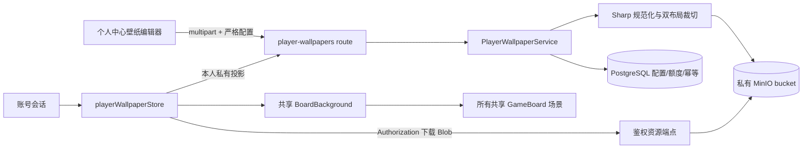

# 玩家游戏桌壁纸实现设计

> 文档类型：设计文档
> 适用范围：个人中心、共享 `GameBoard`、私有图片处理、PostgreSQL、MinIO
> 当前状态：首版实现基线；生产上线仍需完成需求文档第 18 节运维确认
> 最后更新：2026-08-14

详细产品规则与验收项见[玩家自定义游戏桌壁纸需求与安全边界](requirements.md)。本文只维护已经进入代码的架构选择、数据边界和剩余运维事项。

## 1. 已冻结的首版选择

- 玩家壁纸存入独立私有 bucket，默认名为 `loveca-user-assets`；它必须与公开卡图 bucket 不同，初始化过程不写匿名读取策略。
- 私有资源通过同源鉴权 API 读取。客户端使用内存 access token 下载 Blob，完成解码后生成页面生命周期内的 object URL；不使用 MinIO 签名 URL，也不把资源 URL 持久化到浏览器存储。
- 每张输入最大 8 MB、单边最大 8192 像素、总像素最大 32 MP。服务端使用 Sharp 解码、应用 EXIF 方向、转为 sRGB、移除元数据并重新编码静态 WebP；默认处理超时 15 秒，全局并发默认 2。
- 宽屏独立裁切至少 1280×720，紧凑独立裁切至少 720×1280。`INHERIT_PC` 的紧凑派生最低为 540×960，使推荐的 1920×1080 PC 图片可以完成纵向派生。
- 两种布局成品和配置在一次发布中统一生效；每日额度按 `Asia/Shanghai` 自然日由数据库主键约束。
- 系统 `deck.png` 继续作为同步首屏和所有失败路径的最终回退。
- 两种布局均可使用固定纯色预设；服务端只接受共享枚举标识，纯色不创建 MinIO 对象。紧凑槽位继承 PC 纯色时直接复用预设标识。
- 当前活动规范化母版保留用于重裁切；退役资源默认保留 24 小时，再由后台任务确认无活动引用后删除。
- 纯色和自定义图片固定使用比默认背景更强的最低遮罩，不向玩家提供关闭遮罩的能力；日间／夜间分别复用正式牌桌的浅色／暗色遮罩 token。

## 2. 模块与数据流

边界要求：

- `PlayerWallpaperService` 与独立偏好 store 不进入 `GameSession`、`GameService`、command、`projector`、checkpoint 或回放。
- `GameBoard` 只通过 `usePlayerTableWallpaper` 获得 `sourceUrl`、`solidColor`、`focus` 和 `isCustom`；它不读取对象键、母版、额度或保存状态。
- `BoardBackground` 是预览和真实游戏桌唯一共享的背景、遮罩与舞台光效层。
- 账号变化通过 `App` 的 layout effect 清空壁纸投影、下载失败状态和全部 object URL，下一账号不会复用上一账号的内存资源。

## 3. 数据模型

迁移入口为单一基线 `drizzle/0024_add_player_wallpapers.sql`，一次性创建最终纯色／图片配置、资源、每日额度、幂等和管理员审计结构。

| 表                                  | 责任                                                                        |
| ----------------------------------- | --------------------------------------------------------------------------- |
| `player_wallpaper_configs`          | 当前活动版本、槽位模式、母版/成品引用、裁切、焦点、活动指纹和管理员移除状态 |
| `player_wallpaper_assets`           | 私有对象键、资源类型、尺寸、字节数、SHA-256、退役与删除状态                 |
| `player_wallpaper_publication_days` | `user_id + publish_day` 唯一约束，保证北京时间同日最多一次成功发布          |
| `player_wallpaper_idempotency`      | 请求指纹、处理状态、最终响应和过期时间，处理丢响应与重复提交                |
| `player_wallpaper_admin_audit_logs` | 管理员移除账号壁纸的操作人、原因、配置版本和时间                            |

活动配置使用数据库 check constraint 锁定判别状态：

- `DEFAULT` 宽屏没有纯色预设、母版、成品、裁切或焦点。
- `SOLID` 槽位必须具有受控预设标识，且没有母版、成品、裁切或焦点。
- `CUSTOM` 宽屏必须具有母版、成品、裁切和焦点，纯色预设为空。
- `INHERIT_PC` 紧凑槽位在宽屏自定义时复用同一个母版 ID，但必须具有独立紧凑成品、裁切和焦点。
- 宽屏默认或纯色且紧凑继承时，紧凑都不保存资源或重复预设；运行时分别使用默认背景或宽屏预设。
- 紧凑 `CUSTOM` 必须具有独立母版、成品、裁切和焦点，纯色预设为空。

## 4. 服务端处理与一致性

发布顺序：

1. 严格解析 multipart 配置，限制文件数、字段数、单文件字节，并按账号与来源地址限制尝试次数和十分钟输入总字节数。
2. 预留 `userId + idempotencyKey`；同键不同指纹返回稳定冲突。
3. 纯色配置校验共享预设标识并跳过图片处理；图片配置从新上传或当前活动母版得到规范化母版，校验裁切比例、有效像素和焦点。
4. 计算目标配置指纹。与当前配置完全相同时返回 no-op，不占用每日额度。
5. 把新母版和展示成品写入私有 bucket，以 `statObject` 复核对象字节数，并保留本次对象键作为补偿集合。
6. PostgreSQL 事务取得账号级 advisory lock，重新校验版本和活动指纹，写入当日占用、资源事实、活动配置和幂等成功结果。
7. 事务失败时删除本次已上传但未引用的对象；成功后把旧引用标为退役。

恢复默认使用同一版本校验与持久幂等记录，但不写每日占用。管理员移除在同一事务中切换默认配置、退役资源并追加审计记录。

## 5. 私有读取与缓存

- `GET /api/player-wallpapers` 返回当前账号的游戏桌投影；`includeSources=true` 只供个人中心读取当前规范化母版。
- `GET /api/player-wallpapers/assets/:assetId` 只读取当前账号活动配置仍引用的资源，并校验 access token。
- 资源响应使用 `image/webp`、`Cache-Control: private`、内容 SHA-256 ETag 和 `nosniff`。
- 前端显式鉴权下载 Blob，因此 CSS、服务工作线程和公开图片代理都不会直接持有私有对象地址。
- `POST /api/player-wallpapers` 原子发布配置；`POST /api/player-wallpapers/reset` 恢复默认；管理员删除入口需要管理员角色和原因。

## 6. 前端交互

- 宽屏页面并列显示 16:9 与 9:16 预览；窄屏使用“PC / 手机”分段控件。
- 预览用不可交互 fixture 表示双方区域、三面成员和 LIVE 中轴，并复用真实 `BoardBackground`。
- 两个槽位均显示六个命名纯色预设。选中纯色会清理该槽位的图片草稿，不显示无意义的焦点滑杆。
- 预览具有独立的“日间 / 夜间”分段控件；它通过 `BoardBackground` 的局部主题属性复用正式牌桌遮罩变量，不修改页面或账号的全局主题。
- 用户通过可访问的左右/上下滑杆设置归一化焦点；客户端据源图比例计算 cover 裁切，服务端重新校验。
- 新文件在保存前只使用本地 object URL，不写 MinIO。替换 PC 图且手机继承时，手机焦点重置到中心。
- 保存前显示每日限制确认；失败保留草稿。恢复默认始终可用，不返还当天额度。
- `GameBoard` 先显示默认背景；当前断点对应的自定义成品下载和解码成功后原子替换。失败只记录本地展示错误并继续默认背景。

## 7. 上线前剩余事项

代码已经提供私有 bucket、处理并发和退役保留时长配置，但生产上线仍需由运维确认：

- 生产 MinIO 创建私有 bucket，验证没有匿名策略，并把 S3 API 限制在可信网络。
- 用实际 API 容器内存和 CPU 压测 8 MB / 32 MP 输入与 Sharp 并发；必要时下调 `PLAYER_WALLPAPER_PROCESSING_CONCURRENCY`。
- 冻结生产对象存储备份、容量告警、孤立对象扫描和删除账号保留政策。
- 完成用户内容条款、投诉入口和管理员实际运营流程。
- 当前补偿流程覆盖可捕获的对象写入/数据库失败，数据库已登记的退役资源也会异步清理；进程在对象写入后、资源事实入库前硬退出所产生的 bucket 级孤立对象扫描仍属于上线前运维任务。
- 在生产等价环境补做完整 `GameBoard` 的双账号/观战/回放隔离、767/768px 切换，以及明亮、暗色、复杂图片的全交互层截图基线；当前本地闭环已覆盖纯色、双布局生成、私有读取、跨账号拒绝、每日限制、恢复默认、日间/夜间预览与个人中心宽/窄屏截图。
