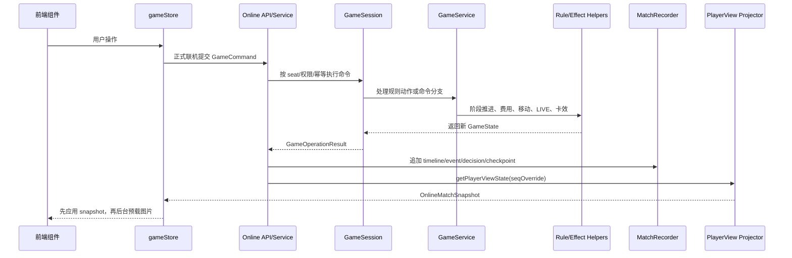
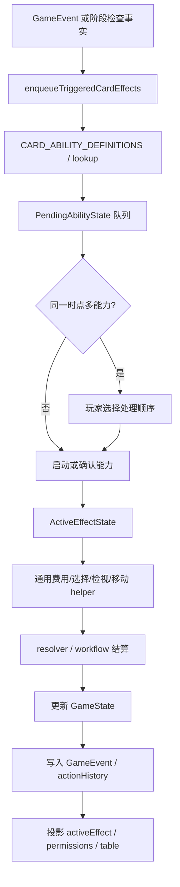
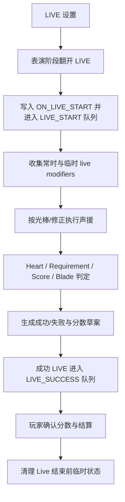
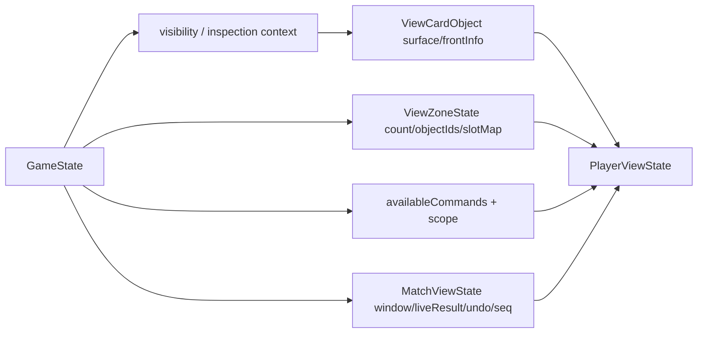
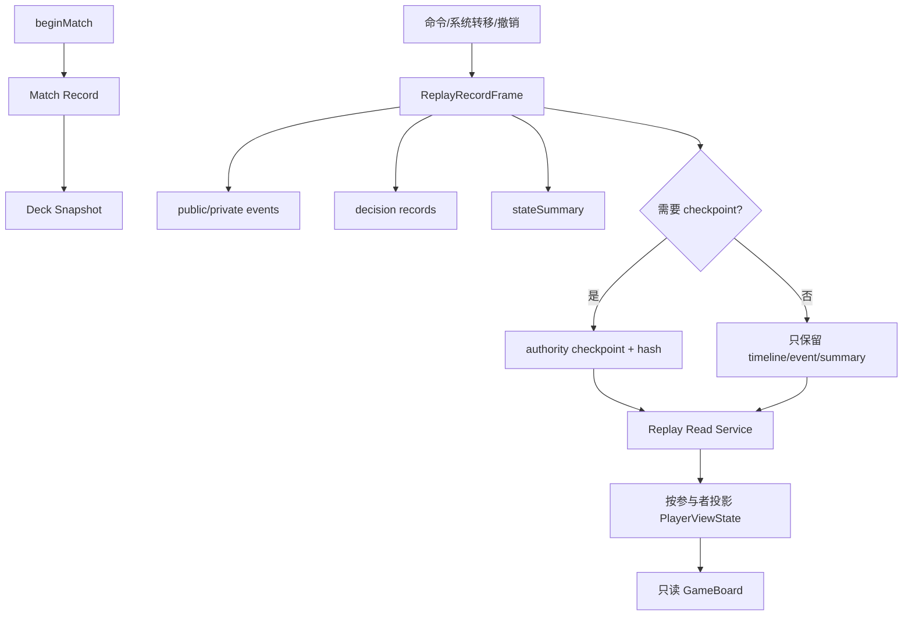

# 运行时数据结构与算法链路

> 文档类型：设计文档
> 适用范围：权威对局状态、命令处理、玩家视图投影、卡效队列、LIVE 判定、联机同步、对局记录与回放的运行时链路
> 当前状态：当前实现基线；字段级 schema 以代码类型、`src/server/db/schema.ts` 和专题文档为准
> 最后更新：2026-06-22

## 1. 文档边界

本文档回答一个问题：开发者看到某个状态、命令、卡效或回放节点时，应如何判断它从哪里来、经过哪些算法、最终影响哪里。

它不是字段大全，也不替代 [系统设计](system-design.md)。两份文档分工如下：

| 文档                         | 维护重点                                                             | 不维护内容                                              |
| ---------------------------- | -------------------------------------------------------------------- | ------------------------------------------------------- |
| [系统设计](system-design.md) | 系统全景、模块分层、状态机、前后端边界、服务端与数据库模块职责       | 逐条运行时数据流、卡效/LIVE/recorder 热路径细节         |
| 本文档                       | 运行时核心数据结构之间的关系、命令和算法链路、跨模块不变量、分析入口 | 产品需求、完整数据库字段、每张卡效果、每个 API 入参出参 |

如果要回答“系统由哪些模块组成”，先读 `docs/system-design.md`。如果要回答“这个命令为什么让前端看到这张牌、为什么 recorder 写了这个 checkpoint、为什么这个 LIVE 修正生效”，读本文档。

## 2. 核心数据结构地图

### 2.1 权威状态：`GameState`

`GameState` 是规则层唯一权威事实。它保存完整隐藏信息和完整运行时上下文，包括：

- 双方 `PlayerState`、各区域、成员槽位、卡牌实例注册表 `cardRegistry`。
- 回合、阶段、子阶段、当前先攻/主动玩家。
- 待处理能力队列 `pendingAbilities`、正在处理的 `activeEffect`、费用窗口和选择窗口。
- `resolutionZone`、`inspectionZone`、`inspectionContext`。
- LIVE 结算状态 `liveResolution`、临时 LIVE 限制、成员活跃阶段跳过标记。
- `actionHistory`、标准规则事件流 `eventLog`、undo 所需的运行时快照。

代码入口：

- `src/domain/entities/game.ts`
- `src/domain/entities/player.ts`
- `src/domain/entities/zone.ts`
- `src/domain/entities/card.ts`

关键边界：

- React 组件不直接修改 `GameState`。
- 服务端正式联机不向普通玩家返回完整 `GameState`。
- 长期回放不把 `GameState` 直接当普通玩家读模型；它只作为 recorder/checkpoint/projector 的输入。

### 2.2 命令：`GameCommand`

`GameCommand` 是玩家或系统请求改变权威状态的语义入口。它比 UI action 更接近规则意图，例如登场、移动成员、确认步骤、提交判定、发动能力、关闭检视区等。

代码入口：

- `src/application/game-commands.ts`
- `src/application/command-availability.ts`
- `src/application/game-session.ts`

关键边界：

- 正式联机和本地桌面都应尽量走同一组 `GameCommand` / `GameSession` 入口。
- 新增玩家可执行行为时，优先补语义命令和权限投影，不在前端绕开规则层改状态。
- 远程高频命令通过服务层加串行队列和 `idempotencyKey` 降低重复提交风险。

### 2.3 规则事件：`GameEvent`

`GameEvent` 是规则事实流，用来描述已经发生的规则事件，例如登场、离场、成员状态变化、槽位移动、LIVE 开始、LIVE 成功和声援。

代码入口：

- `src/domain/events/game-events.ts`
- `src/domain/entities/game.ts`
- `src/application/card-effect-runner.ts`

关键边界：

- `eventLog` 是后续 AUTO/trigger matcher 的权威事实来源。
- `actionHistory` 仍服务审计、UI 和旧路径兼容，但不应替代标准规则事件。
- `EventBus` 只作为非权威运行时/调试工具，不接入规则触发权威链路。

### 2.4 玩家视图：`PlayerViewState`

`PlayerViewState` 是普通玩家和前端读取对局的主结构。它把权威状态投影为玩家可见视图：

- `match`：回合、阶段、窗口、当前 seat、LIVE 结果、undo 状态和 `seq`。
- `table.zones`：玩家视角的区域、槽位、数量和公开对象 ID。
- `objects`：以 public object id 表示的卡牌对象；隐藏牌只暴露背面或数量。
- `permissions.availableCommands`：当前玩家能做什么，以及命令作用范围。
- `activeEffect` / `pendingCostPayment`：当前选择窗口和费用窗口的玩家可见投影。

代码入口：

- `src/online/types.ts`
- `src/online/projector.ts`
- `src/online/visibility.ts`
- `src/application/game-session.ts`

关键边界：

- 前端桌面读 `PlayerViewState`，不读权威 `GameState`。
- 隐藏信息由 projector、visibility 和 inspection context 控制。
- 只读回放也复用 `PlayerViewState`，但来源是历史 checkpoint 投影，不是运行中 match。

### 2.5 卡效运行时状态

卡效运行时主要由三层数据串起来：

- `CARD_ABILITY_DEFINITIONS`：声明能力分类、触发条件、来源区域、基础编号覆盖、次数限制、区域限制和是否已实现。
- `PendingAbilityState`：检查时机发现但尚未执行的能力，等待玩家选择顺序或确认。
- `ActiveEffectState`：正在分步处理的能力，承载当前步骤、候选、已选项、费用和展示文本。

代码入口：

- `src/application/card-effects/definitions/index.ts`
- `src/application/card-effects/definitions/lookup.ts`
- `src/application/card-effect-runner.ts`
- `src/application/effects/`
- `src/application/card-effects/workflows/`

关键边界：

- 能力定义集中登记；不要把具体卡效写进 React 组件或 action handler。
- 通用动作优先沉淀到 `src/application/effects/`，例如弃手、抽牌、检视、区域选择、能量处理、成员状态。
- 同基础编号同文本优先用 `baseCardCodes` 覆盖，运行时判断也尽量用基础编号。

### 2.6 LIVE 修正状态

LIVE 修正分两类：

- 常时修正：不写入状态，结算时由 registry 按当前场面动态收集。
- 临时修正：由卡效在 LIVE 结束前写入 `liveResolution.liveModifiers`，类型包括 `SCORE`、`HEART`、`BLADE`、`REQUIREMENT` 等。

代码入口：

- `src/domain/rules/live-modifiers.ts`
- `src/application/card-effect-runner.ts`
- `src/application/effects/conditions.ts`
- `src/domain/value-objects/heart.ts`

关键边界：

- 新增 LIVE 分数、Heart、Blade、必要 Heart 修正时，优先走 live modifier 入口。
- 旧的 `playerScoreBonuses`、`playerHeartBonuses`、`liveRequirementReductions`、`liveRequirementModifiers` 只作为兼容投影保留，不作为新增逻辑主写入路径。
- 必要 Heart 修正需要兼容指定颜色、All/无色需求、`RAINBOW` 和 `totalRequired` 两种数据形态。

### 2.7 记录与回放结构

对局记录不是运行中日志的页面化，而是独立的历史读模型：

- `Match Record`：历史根记录，保存对局元信息、模式、参与者、状态和能力标记。
- `Deck Snapshot`：开局锁定时的卡组与卡牌摘要。
- `ReplayRecordFrame`：统一排序 timeline、命令、事件、决策、summary 和 checkpoint。
- `authority checkpoint`：可复水的权威状态检查点。
- `public/private event`：按普通玩家可见性拆分的事件明细。
- `decision record`：卡效和关键选择的语义化解释材料。
- `stateSummary`：无 checkpoint 帧的回合/阶段/子阶段摘要。

代码入口：

- `src/online/replay-types.ts`
- `src/server/services/match-recorder-service.ts`
- `src/server/services/match-replay-read-service.ts`
- `src/server/services/match-decision-records.ts`
- `src/server/services/online-match-service.ts`
- `src/server/services/solitaire-match-service.ts`

关键边界：

- 历史记录有独立 `timelineSeq` 和 `checkpointSeq`；不要用公共事件序号当长期回放主顺序。
- 普通玩家读取 replay read model，不读取 sealed audit 或完整 authority checkpoint。
- 当前 checkpoint 是稀疏策略：普通高频命令可只写 timeline/event/summary，每 5 帧或关键命令、系统转移、撤销、结算/阶段类命令写 authority checkpoint。

## 3. 主命令链路

本地和正式联机最终都应落到同一个规则核心。差别在于正式联机多了房间、座位、鉴权、幂等、recorder 和玩家视图响应。

分析一条命令时按这个顺序查：

1. UI 发出的是什么 `GameCommand`。
2. `projector` 是否投影了该命令的 `availableCommands` 和 scope。
3. `GameSession.executeCommand()` 是否有语义分支、undo 边界和幂等处理。
4. 实际状态改变是在 `GameService`、action handler、effect helper 还是 card effect runner。
5. 状态改变是否写入了 `actionHistory` / `eventLog`。
6. 正式联机是否追加了 recorder frame，是否需要 checkpoint。
7. `PlayerViewState` 是否正确隐藏私密信息并暴露必要 UI 提示。

## 4. 卡效链路

卡效不是“点按钮后执行一段单卡逻辑”，而是一个触发、排队、选择、结算、投影的链路。

关键判断：

- `CONTINUOUS` 常时能力不进队列，由计算层读取。
- `ON_ENTER`、`LIVE_START`、`LIVE_SUCCESS`、`AUTO` 等诱发能力应进入对应时点队列。
- `ACTIVATED` 起动能力由玩家在合法窗口主动提交命令。
- 同一时点多能力必须让玩家决定顺序，不能在 resolver 中静默排序。
- 费用、弃手、支付能量、自送休息室、检视、区域选择、成员方向变化优先复用通用 helper。

## 5. LIVE 判定与修正链路

LIVE 链路同时读取规则状态、卡面需求、声援结果和卡效 modifier。

分析 LIVE bug 时优先确认：

- LIVE 卡是否已经进入正确 LIVE 区和当前表演窗口。
- `ON_LIVE_START` 是否写入并触发了来源正确的 pending ability。
- 修正是常时动态收集，还是临时写入 `liveResolution.liveModifiers`。
- 必要 Heart 修正是否按颜色、All/无色、`RAINBOW` 和 `totalRequired` 正确合并。
- 前端判定面板读取的是 raw card id 还是 public object id，必要时要兼容两种 key。
- LIVE 成功效果是否只在对应 Live 成功后入队。

## 6. 视图投影与隐藏信息链路

`PlayerViewState` 是前端和普通玩家回放的共同读模型。投影的核心任务是把完整权威状态转换成“这个玩家此刻应该看到什么、能做什么”。

关键边界：

- 隐藏牌通常只投影背面或数量，不给 `frontInfo`。
- 检视区由 `inspectionContext` 决定谁看正面、谁看背面。
- 公开过的牌要通过 `revealedCardIds` 等状态让双方看到正面。
- 权限提示不是最终安全边界；服务端命令执行仍要校验 seat、阶段、区域、卡种和上下文。
- 正式联机 snapshot 已保持 JSON-native DTO，不应把 `Map` 等非 JSON-native 结构放进响应。

## 7. Recorder 与 replay 链路

当前 recorder 的目标是让普通玩家能按当时视角读历史节点，同时为后续确定性重演保留扩展点。

写入策略：

- 开局写历史根记录、参与者和卡组快照。
- 每个重要运行时事实追加 `ReplayRecordFrame`。
- 普通高频命令可以不写完整 checkpoint，但必须保留 timeline 可读摘要。
- 关键命令、系统转移、撤销、结算/阶段类命令，以及每 5 帧采样点写 authority checkpoint。
- sealed audit 和完整权威状态不直接暴露给普通玩家。

读取策略：

- 历史列表和详情读 summary / participant / deck snapshot。
- timeline 读经过玩家视角过滤的 frame 摘要和事件。
- checkpoint 回放读取指定 frame 附近的 authority checkpoint，再投影成该玩家的 `PlayerViewState`。
- 只读 `GameBoard` 使用回放投影，不重新执行运行中命令。

## 8. 性能热路径

当前最容易出现交互延迟的链路是远程命令后的“服务端投影 + recorder + 客户端应用 snapshot + 图片预载”。

已落地的控制点：

- 正式联机响应绕过通用 `toTransport()` / `fromTransport()`，保持 JSON-native DTO。
- `OnlineMatchService.buildSnapshot()` 直接调用 `GameSession.getPlayerViewState(..., seqOverride)`，不为投影先 clone 完整 authority snapshot。
- 客户端远程 snapshot 先写入 store，再后台 best-effort 预载新正面卡图。
- 远程操作按 `source/matchId/seat` 串行入队，并补 `idempotencyKey`。
- recorder 使用稀疏 authority checkpoint 和 `stateSummary`，避免普通高频命令都完整序列化权威状态。
- 检视关闭使用 `FINISH_INSPECTION_WITH_ARRANGEMENT` 批量命令，不再逐张提交远程移动命令。
- 卡效定义查找通过 `definitions/lookup.ts` 索引，避免运行时线性扫描定义表。

性能分析入口：

- `docs/online-mode/transport-serde-performance.md`
- `tests/performance/online-performance.bench.test.ts`
- `tests/performance/solitaire-recording-performance.bench.test.ts`
- `tests/performance/inspection-hot-paths.bench.test.ts`

## 9. 不变量与开发检查表

改动运行时链路前，至少检查这些不变量：

- 权威状态只通过 `GameSession` / `GameService` / command 层或 effect helper 改变。
- 前端桌面读取 `PlayerViewState`，不读取完整 `GameState`。
- projector 负责隐藏信息和命令权限投影；服务端执行仍做最终校验。
- 卡效定义集中登记，具体效果不散落在 React 组件或 action handler。
- 同一触发时点多能力走 pending ability 顺序选择。
- LIVE 修正新增逻辑优先进入 live modifier 体系。
- recorder 使用独立 `timelineSeq` / `checkpointSeq`，不把公共事件序号当历史主顺序。
- 普通玩家 replay 不读取 sealed audit 或完整 authority checkpoint。
- 普通高频命令不默认写完整 authority checkpoint；如果需要提高采样，改 recorder 策略而不是在调用点散落特殊判断。
- 文档需要更新时，横向链路写本文档；模块职责和系统总览写 `docs/system-design.md`；卡效单卡完成状态写 `docs/card-effect-reuse-audit/existing_module_map.md`。
