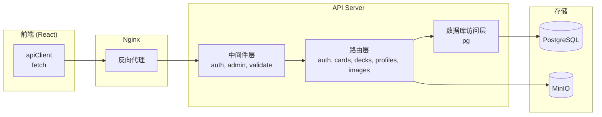
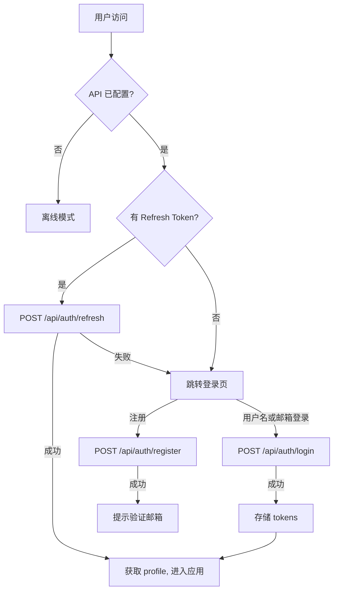
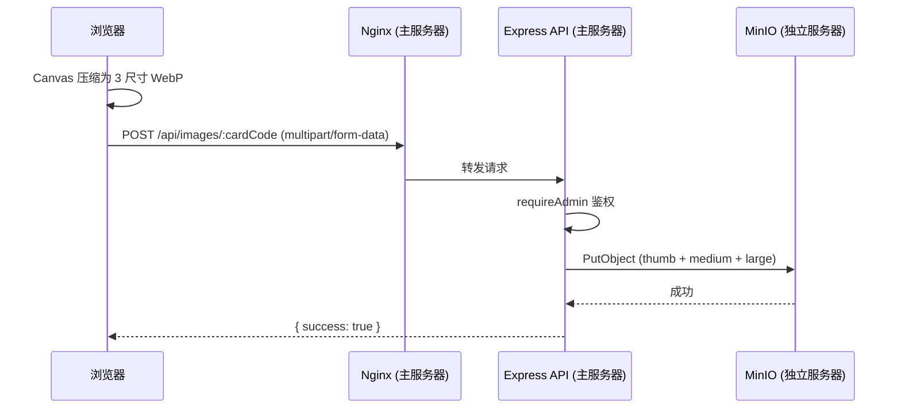
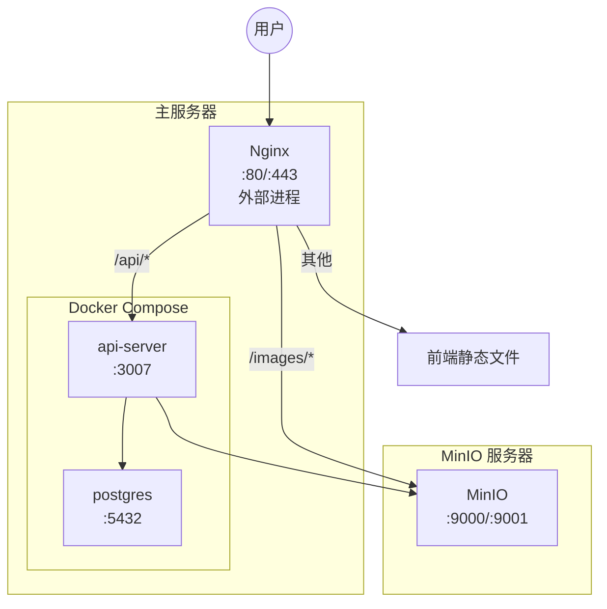

# Loveca - Supabase 迁移至自托管栈 需求与设计文档

> 版本: 2.0.0
> 创建日期: 2026-03-12
> 最后更新: 2026-03-15

本文档描述 Loveca 项目从 Supabase 托管服务迁移至自托管技术栈的完整需求与设计方案。迁移脚本和 Docker 配置文件见项目根目录。

---

## 迁移状态

**当前状态：✅ 已完成**

| 阶段 | 状态 | 说明 |
|------|------|------|
| 阶段一：基础设施搭建 | ✅ 完成 | Docker Compose、PostgreSQL、Nginx 配置 |
| 阶段二：API 服务开发 | ✅ 完成 | Express.js 认证、卡牌、卡组、图片 API |
| 阶段三：前端改造 | ✅ 完成 | apiClient、authStore、cardService 等重写 |
| 阶段四：集成测试 | ✅ 完成 | 认证流程、卡牌管理、卡组同步、图片上传 |
| 阶段五：数据迁移与上线 | ✅ 完成 | 数据导入、MinIO 图片迁移 |

**关键文件位置：**
- 数据库初始化：`docker/init.sql`
- API 服务器：`src/server/`
- 前端 API 客户端：`client/src/lib/apiClient.ts`
- Docker 配置：`docker-compose.yml`、`Dockerfile`
- MinIO 上传脚本：`src/scripts/upload-to-minio.ts`

---

## 1. 迁移背景与目标

### 1.1 迁移原因

- **延迟问题**：Supabase 服务器位于海外，国内访问延迟显著（认证初始化已需 5 秒超时保护），严重影响用户体验
- **服务限制**：免费版存在 API 请求速率限制、存储空间限制（1GB）、数据库连接数限制，随数据增长将成为瓶颈
- **可控性**：自托管后可完全控制数据库配置、存储策略、认证逻辑，不受第三方服务变更影响
- **成本**：长期运行自有 VPS 比 Supabase Pro 计划（$25/月）更经济

### 1.2 迁移目标

- **功能完全对等**：迁移后所有现有功能保持不变（认证、卡牌 CRUD、卡组管理、图片存储）
- **前端改动最小化**：构建 API 适配层，前端改动集中于数据访问层替换
- **保持离线模式**：前端在 API 不可用时仍可降级为离线模式
- **零数据丢失**：现有数据完整迁移至自托管环境

### 1.3 迁移范围

| Supabase 服务 | 自托管替代 |
|---------------|-----------|
| PostgreSQL（含 RLS） | 自托管 PostgreSQL + Express 中间件鉴权 |
| Supabase Auth | Express.js + bcrypt + jsonwebtoken |
| Supabase Storage | MinIO（S3 兼容对象存储，独立服务器部署） |
| PostgREST（自动 REST API） | Express.js 手写 RESTful API |
| RPC 函数 | Express.js API 端点 |

---

## 2. 技术栈选型

### 2.1 技术栈总览

| 层级 | 技术 | 说明 |
|------|------|------|
| 数据库 | PostgreSQL 16 | 保留现有 schema，自然迁移 |
| API 服务器 | Express.js + TypeScript | Node.js 生态，与现有后端一致 |
| 认证 | bcrypt + jsonwebtoken | 自建 JWT 认证，替代 Supabase Auth |
| 文件存储 | MinIO | S3 兼容的开源对象存储 |
| 反向代理 | Nginx | 静态文件服务、SSL 终止、请求转发 |
| 部署 | Docker Compose | 一键部署所有服务 |

### 2.2 选型理由

- **PostgreSQL**：现有 schema 已基于 PostgreSQL，包含 JSONB 字段、触发器函数，直接迁移无需格式转换
- **Express.js**：项目后端已使用 TypeScript + Node.js，Express 是最轻量的选择，无额外学习成本
- **MinIO**：完全兼容 S3 API，提供 Web 管理界面，开源免费，支持公开桶直接访问
- **Docker Compose**：单文件定义所有服务依赖和网络关系，适合单服务器部署

---

## 3. 数据库迁移

### 3.1 Schema 迁移策略

保留现有三张业务表结构（profiles、decks、cards）不变，仅做以下调整：

**需要修改的部分：**
- 移除所有 `auth.users` 的外键引用（Supabase 内置表，自托管不存在）
- 新增 `users` 表替代 `auth.users`，存储认证信息
- 移除所有 RLS 策略（权限控制移至 API 中间件）
- 移除引用 `auth.uid()` 的触发器函数，改写为不依赖 Supabase 上下文
- 保留业务触发器（`updated_at` 自动维护、`deck_count` 计数维护）

**不需要修改的部分：**
- 表字段定义、JSONB 结构、索引
- `update_deck_count()`、`update_deck_timestamp()`、`update_card_timestamp()` 触发器逻辑（去掉 `auth.uid()` 引用即可）

### 3.2 新增 users 表

替代 Supabase 的 `auth.users`，存储认证凭据：

| 字段 | 类型 | 说明 |
|------|------|------|
| id | UUID (PK) | 主键，`gen_random_uuid()` |
| email | TEXT (UNIQUE) | 邮箱，可为占位邮箱 |
| password_hash | TEXT NOT NULL | bcrypt 哈希后的密码 |
| email_verified | BOOLEAN DEFAULT false | 邮箱是否已验证 |
| created_at | TIMESTAMPTZ | 创建时间 |
| updated_at | TIMESTAMPTZ | 更新时间 |

`profiles.id` 外键改为 `REFERENCES public.users(id) ON DELETE CASCADE`。

### 3.3 新增 refresh_tokens 表

| 字段 | 类型 | 说明 |
|------|------|------|
| id | UUID (PK) | 主键 |
| user_id | UUID (FK) | 关联 users |
| token_hash | TEXT | bcrypt 哈希后的 refresh token |
| expires_at | TIMESTAMPTZ | 过期时间（7 天） |
| created_at | TIMESTAMPTZ | 创建时间 |

### 3.4 现有表调整

**profiles 表：**
- 外键从 `REFERENCES auth.users(id)` 改为 `REFERENCES public.users(id)`
- 移除 `handle_new_user()` 触发器（注册逻辑移至 API 层，在注册时同时创建 user + profile）
- 移除 `protect_profile_fields()` 中对 `request.jwt.claims` 的引用，改为 API 层控制 role 字段保护

**cards 表：**
- `updated_by` 外键从 `REFERENCES auth.users(id)` 改为 `REFERENCES public.users(id)`
- `update_card_timestamp()` 中的 `auth.uid()` 改为由 API 层传入

### 3.5 移除的数据库函数

以下 RPC 函数不再需要，其逻辑移至 API 层：

| 函数 | 替代方案 |
|------|---------|
| `get_email_by_username()` | API 层直接查询 profiles + users 表 |
| `is_admin()` | API 中间件读取 JWT 中的 role |
| `import_cards()` | `POST /api/cards/import` 端点 |
| `export_cards()` | `GET /api/cards/export` 端点 |

### 3.6 数据迁移方案

1. 通过 Supabase Dashboard 获取数据库连接字符串
2. `pg_dump` 导出 profiles、decks、cards 表数据（仅 data，不含 schema）
3. 在新数据库上先执行新 schema 创建脚本
4. 从 Supabase `auth.users` 导出用户记录，转换为新 `users` 表格式（密码哈希无法直接迁移，用户需重置密码）
5. `pg_restore` 导入业务数据

---

## 4. API 层设计

### 4.1 总体架构



### 4.2 中间件设计

| 中间件 | 功能 | 说明 |
|--------|------|------|
| `authenticate` | 解析 JWT、注入 `req.user` | 可选中间件，公开接口不需要 |
| `requireAuth` | 要求已登录 | 401 如果未认证 |
| `requireAdmin` | 要求管理员角色 | 403 如果非管理员 |
| `validate` | 请求体校验 | 使用 Zod schema 验证 |
| `errorHandler` | 统一错误处理 | 捕获异常返回标准错误格式 |

**权限控制对照表（RLS → API 中间件映射）：**

| 原 RLS 策略 | API 实现 |
|-------------|---------|
| cards: 所有人可读 PUBLISHED | `GET /api/cards` 默认过滤 `status='PUBLISHED'`，管理员可传 `?status=all` |
| cards: 仅管理员可写 | `requireAdmin` 中间件 |
| decks: 用户可读自己的 | `requireAuth` + `WHERE user_id = req.user.id` |
| decks: 所有人可读公开的 | `WHERE is_public = true`（无需认证） |
| decks: 用户只能改删自己的 | `requireAuth` + 校验 `user_id` |
| profiles: 所有人可读 | 公开读取 |
| profiles: 用户只能改自己的 | `requireAuth` + 校验 `id`，role 字段由 API 过滤 |

### 4.3 API 端点

#### 认证接口 (`/api/auth`)

| 方法 | 路径 | 替代的 Supabase 调用 | 说明 |
|------|------|---------------------|------|
| POST | `/api/auth/register` | `auth.signUp()` | 注册，同时创建 user + profile |
| POST | `/api/auth/login` | `auth.signInWithPassword()` + `rpc('get_email_by_username')` | 支持用户名/邮箱登录，返回 access + refresh token |
| POST | `/api/auth/logout` | `auth.signOut()` | 登出，删除 refresh token |
| GET | `/api/auth/session` | `auth.getSession()` | 验证当前 token，返回用户信息 |
| POST | `/api/auth/refresh` | SDK 自动处理 | 用 refresh token 换取新 access token |
| POST | `/api/auth/reset-password` | `auth.resetPasswordForEmail()` | 发送密码重置邮件 |
| PUT | `/api/auth/password` | `auth.updateUser({ password })` | 修改密码（需登录或重置 token） |
| POST | `/api/auth/resend-verification` | `auth.resend({ type: 'signup' })` | 重发验证邮件（60 秒冷却） |
| POST | `/api/auth/verify-email` | Supabase 内置 | 验证邮箱 token |

**登录流程简化**：原流程需先 RPC 查邮箱再登录，新 API 统一为 `POST /api/auth/login { usernameOrEmail, password }`，服务端内部处理用户名/邮箱查找。

#### 卡牌接口 (`/api/cards`)

| 方法 | 路径 | 权限 | 说明 |
|------|------|------|------|
| GET | `/api/cards` | 公开 | 获取全部卡牌，默认 PUBLISHED，管理员可查看全部 |
| GET | `/api/cards/:code` | 公开 | 获取单张卡牌 |
| POST | `/api/cards` | 管理员 | 创建卡牌 |
| PUT | `/api/cards/:code` | 管理员 | 更新卡牌 |
| DELETE | `/api/cards/:code` | 管理员 | 删除卡牌 |
| POST | `/api/cards/import` | 管理员 | 批量导入（替代 `rpc('import_cards')`） |
| GET | `/api/cards/export` | 公开 | 导出全部卡牌（替代 `rpc('export_cards')`） |
| PUT | `/api/cards/:code/publish` | 管理员 | 发布卡牌 |
| PUT | `/api/cards/:code/unpublish` | 管理员 | 取消发布 |
| GET | `/api/cards/status-map` | 管理员 | 获取所有卡牌的 code→status 映射 |

#### 卡组接口 (`/api/decks`)

| 方法 | 路径 | 权限 | 说明 |
|------|------|------|------|
| GET | `/api/decks` | 已登录 | 获取自己的卡组列表 |
| GET | `/api/decks/public` | 公开 | 获取公开卡组 |
| GET | `/api/decks/:id` | 已登录 | 获取单个卡组（校验归属） |
| POST | `/api/decks` | 已登录 | 创建卡组 |
| PUT | `/api/decks/:id` | 已登录 | 更新卡组（校验归属） |
| DELETE | `/api/decks/:id` | 已登录 | 删除卡组（校验归属） |

#### 用户档案接口 (`/api/profiles`)

| 方法 | 路径 | 权限 | 说明 |
|------|------|------|------|
| GET | `/api/profiles/:id` | 公开 | 获取用户公开信息 |
| PUT | `/api/profiles/:id` | 已登录 | 更新自己的档案（role 字段受保护） |

#### 图片接口 (`/api/images`)

| 方法 | 路径 | 权限 | 说明 |
|------|------|------|------|
| POST | `/api/images/:cardCode` | 管理员 | 上传卡牌图片（3 种尺寸） |
| DELETE | `/api/images/:cardCode` | 管理员 | 删除卡牌图片 |

图片读取不经过 API，由 Nginx 直接代理到 MinIO 公开桶。

### 4.4 响应格式

```json
// 成功
{ "data": { ... }, "error": null }

// 列表
{ "data": [...], "total": 100, "error": null }

// 失败
{ "data": null, "error": { "code": "UNAUTHORIZED", "message": "未登录" } }
```

---

## 5. 认证系统设计

### 5.1 认证流程



### 5.2 Token 策略

**Access Token (JWT)：**
- 有效期：15 分钟
- 内容：`{ sub: userId, role: 'user'|'admin', iat, exp }`
- 存储：前端内存（Zustand store），不持久化

**Refresh Token：**
- 有效期：7 天
- 格式：随机字符串，bcrypt 哈希后存入 `refresh_tokens` 表
- 存储：httpOnly cookie 或 localStorage
- 刷新时旧 token 失效（rotation）

### 5.3 密码重置

1. 用户请求 `POST /api/auth/reset-password { email }`
2. 服务端生成重置 token（1 小时有效），通过 SMTP 发送邮件
3. 邮件包含链接 `{FRONTEND_URL}/reset-password?token=xxx`
4. 用户提交 `PUT /api/auth/password { token, newPassword }`

邮件发送使用 nodemailer + SMTP 服务。

### 5.4 邮箱验证

1. 注册时生成验证 token 存入数据库
2. 发送验证邮件，链接 `{FRONTEND_URL}/verify-email?token=xxx`
3. 前端调用 `POST /api/auth/verify-email { token }`
4. 重发支持 60 秒冷却（与现有行为一致）

### 5.5 与 Supabase Auth 的关键差异

| 功能 | Supabase Auth | 自建认证 |
|------|---------------|---------|
| Token 刷新 | SDK 自动处理 | 前端需在 apiClient 中实现 refresh 拦截器 |
| Session 持久化 | SDK 内置 | 通过 refresh token + cookie 管理 |
| 状态监听 | `onAuthStateChange` 回调 | API 响应驱动状态更新 |
| 密码重置邮件 | Supabase 内置模板 | 需自行配置 SMTP + 邮件模板 |

---

## 6. 文件存储设计

MinIO 部署在独立服务器上，详细部署方案见 `docs/minio-requirements.md`。本节仅描述与主应用的集成要点。

### 6.1 MinIO 集成概要

- Bucket 名称：`loveca-cards`（保持不变）
- 访问策略：公开读取，写入需认证
- 目录结构不变：`thumb/`、`medium/`、`large/`、`static/`
- **部署位置**：独立服务器，主服务器通过内网 IP 连接

### 6.2 图片 URL 变更

| 场景 | 原 URL 格式 | 新 URL 格式 |
|------|-----------|-----------|
| 卡牌图片 | `{SUPABASE_URL}/storage/v1/object/public/loveca-cards/{size}/{code}.webp` | `{BASE_URL}/images/{size}/{code}.webp` |
| 静态资源 | `{SUPABASE_URL}/storage/v1/object/public/loveca-cards/static/{name}` | `{BASE_URL}/images/static/{name}` |

主服务器 Nginx 将 `/images/` 路径代理到远程 MinIO 公开桶，不经过 Express。

### 6.3 图片上传流程



### 6.4 后端脚本迁移

| 脚本 | 变更 |
|------|------|
| `upload-to-supabase.ts` → `upload-to-minio.ts` | 改为使用 MinIO JS SDK (`minio` npm 包) |
| `upload-static-assets.ts` | 同上 |
| `sync-cards.ts` | 改为直接连接 PostgreSQL（使用 `pg` 库），不再通过 Supabase Client |

---

## 7. 前端改造要点

### 7.1 改造策略

创建统一的 API 客户端（`client/src/lib/apiClient.ts`），替换所有 `supabase.*` 调用。

`apiClient.ts` 核心功能：
- 封装 `fetch`，自动附加 `Authorization: Bearer {token}` 头
- Token 过期时自动调用 refresh 端点
- 请求超时控制（15 秒，与现有一致）
- 离线检测：`VITE_API_BASE_URL` 未配置时进入离线模式
- 统一错误处理和响应解析

### 7.2 需要修改的文件

| 文件 | 改动说明 |
|------|---------|
| `client/src/lib/supabase.ts` | **删除**，替换为 `apiClient.ts` |
| `client/src/store/authStore.ts` | **全面重写**，移除 Supabase SDK，使用 apiClient 调用 `/api/auth/*` |
| `client/src/lib/cardService.ts` | `supabase.from('cards').*` → `apiClient.get/post/put('/api/cards')` |
| `client/src/lib/imageService.ts` | URL 格式从 Supabase Storage 改为 `VITE_API_BASE_URL + '/images'` |
| `client/src/lib/imageUploadService.ts` | `supabase.storage.from().upload()` → `apiClient.post('/api/images/:cardCode')` |
| `client/src/store/deckStore.ts` | `supabase.from('decks').*` → apiClient 调用 |
| `client/src/components/auth/LoginPage.tsx` | `isSupabaseConfigured` → `isApiConfigured` |
| `client/src/components/auth/RegisterPage.tsx` | 同上 |

### 7.3 离线模式

将 `isSupabaseConfigured` 替换为 `isApiConfigured`，检测 `VITE_API_BASE_URL` 环境变量。离线模式逻辑不变。

### 7.4 PWA 缓存更新

`vite.config.ts` 中 Service Worker 缓存规则需更新：
- 原规则匹配 `supabase.co/storage/` URL
- 改为匹配新的 `/images/` 路径

---

## 8. Docker Compose 架构

### 8.1 服务拓扑

Nginx 保持外部部署（使用现有 `loveca.conf`），MinIO 部署在独立服务器。Docker Compose 仅管理 PostgreSQL 和 API Server。



### 8.2 服务配置

| 服务 | 镜像 | 端口 | 说明 |
|------|------|------|------|
| postgres | `postgres:16-alpine` | 127.0.0.1:5432 | 数据持久化到 volume，仅本地访问 |
| api-server | 自建 Dockerfile | 127.0.0.1:3007 | Express.js API，仅本地访问 |

MinIO 和 Nginx 不在此 Docker Compose 中。MinIO 部署方案见 `docs/minio-requirements.md`。

### 8.3 Nginx 路由规则

在现有 `loveca.conf` 中添加以下 location 块：

| 路径 | 代理目标 | 说明 |
|------|---------|------|
| `/api/*` | `http://127.0.0.1:3007` | API 请求 |
| `/images/*` | `http://MINIO_SERVER_IP:9000/loveca-cards/*` | 图片（代理到远程 MinIO） |
| `/api/dashscope/*` | 现有配置不变 | DashScope AI 代理 |
| `/*` | 现有配置不变 | 前端静态文件（SPA） |

### 8.4 数据持久化

| Volume | 挂载路径 | 说明 |
|--------|---------|------|
| `pgdata` | `/var/lib/postgresql/data` | PostgreSQL 数据 |

### 8.5 开发环境

`docker-compose.dev.yml` 额外包含本地 MinIO 服务，用于开发时完整模拟生产环境。Vite dev server 的 proxy 配置将 `/api` 和 `/images` 分别转发到本地 API 和 MinIO。

---

## 9. 迁移计划

### 9.1 阶段划分

**阶段一：基础设施搭建**
1. 部署 MinIO 到独立服务器（见 `docs/minio-requirements.md`）
2. 编写 `docker-compose.yml`，定义 PostgreSQL + API Server 两个服务
3. 编写 PostgreSQL 初始化 SQL（基于 `docs/migrations/` 修改，移除 RLS 和 auth.users 引用）
4. 更新 `loveca.conf` 添加 `/api/*` 和 `/images/*` 代理规则
5. 验证环境可正常启动

**阶段二：API 服务开发**
1. 在 `src/server/` 下创建 Express 项目结构
2. 实现认证中间件 + JWT 工具函数
3. 实现认证端点（register、login、refresh、logout 等）
4. 实现卡牌 CRUD + import/export 端点
5. 实现卡组 CRUD 端点
6. 实现图片上传/删除端点（MinIO SDK）
7. 编写 API 测试

**阶段三：前端改造**
1. 创建 `apiClient.ts`（含 token 管理和自动刷新）
2. 重写 `authStore.ts`
3. 改造 `cardService.ts`、`imageService.ts`、`imageUploadService.ts`
4. 改造 `deckStore.ts`
5. 更新环境变量和 PWA 缓存配置

**阶段四：集成测试**
1. Docker 环境完整测试
2. 测试全部认证流程
3. 测试卡牌管理、卡组同步、图片上传
4. 测试离线模式降级

**阶段五：数据迁移与上线**
1. 从 Supabase 导出数据（pg_dump）
2. 从 Supabase Storage 下载图片，上传至 MinIO
3. 导入数据到新数据库
4. 通知用户重置密码（Supabase Auth 密码哈希不可导出）
5. DNS 切换到新服务器

---

## 10. 环境变量

### 10.1 前端

| 变量名 | 位置 | 说明 |
|--------|------|------|
| `VITE_API_BASE_URL` | `client/.env` | API 地址（如 `https://loveca.example.com`） |

替换原有的 `VITE_SUPABASE_URL` 和 `VITE_SUPABASE_ANON_KEY`。

### 10.2 API 服务器

| 变量名 | 必填 | 说明 |
|--------|------|------|
| `PORT` | 否 | API 端口（默认 3007） |
| `DATABASE_URL` | 是 | PostgreSQL 连接字符串 |
| `JWT_SECRET` | 是 | JWT 签名密钥（≥32 字符） |
| `JWT_REFRESH_SECRET` | 是 | Refresh Token 签名密钥 |
| `MINIO_ENDPOINT` | 是 | MinIO 服务器地址（IP 或域名，不含协议和端口） |
| `MINIO_PORT` | 否 | MinIO S3 API 端口（默认 9000） |
| `MINIO_ACCESS_KEY` | 是 | MinIO 访问密钥 |
| `MINIO_SECRET_KEY` | 是 | MinIO 密钥 |
| `MINIO_BUCKET` | 否 | Bucket 名称（默认 `loveca-cards`） |
| `MINIO_USE_SSL` | 否 | 是否启用 SSL（默认 false） |
| `SMTP_HOST` | 否* | 邮件服务器地址 |
| `SMTP_PORT` | 否* | 邮件服务器端口 |
| `SMTP_USER` | 否* | 邮件用户名 |
| `SMTP_PASS` | 否* | 邮件密码 |
| `FRONTEND_URL` | 是 | 前端地址（用于邮件中的链接） |

\* 仅在需要邮箱验证和密码重置功能时必填。

### 10.3 后端脚本

原有的 `SUPABASE_URL`、`SUPABASE_SERVICE_ROLE_KEY` 替换为 `DATABASE_URL` + `MINIO_*` 系列变量。

---

## 11. 相关文档

- `docs/minio-requirements.md` — MinIO 独立服务器部署方案
- `docs/loveca_supabase.md` — 原有 Supabase 设计文档（迁移后归档）
- `docs/migrations/` — 现有 Supabase SQL 迁移脚本（作为新 schema 的基础）
