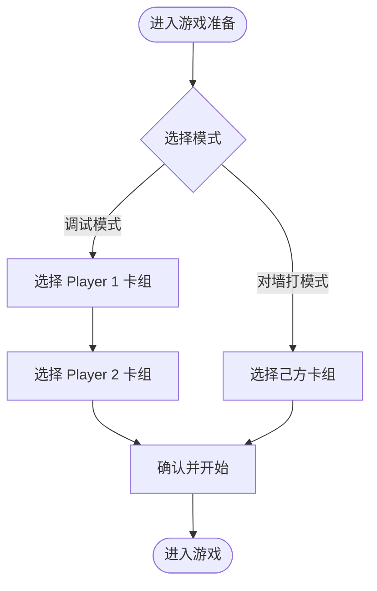
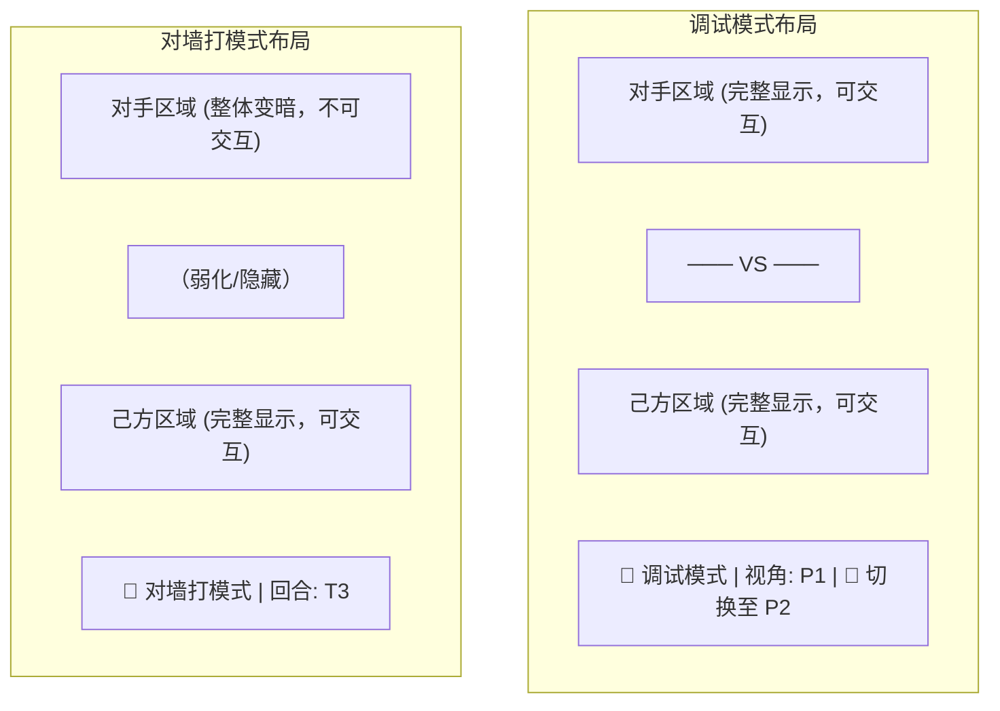
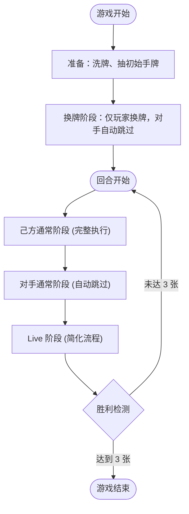

# 对墙打模式需求文档

> 文档类型：需求文档
> 适用范围：本地「调试模式 / 对墙打模式」的模式差异、准备流程、自动化边界和 UI 约束
> 当前状态：已实现，当前代码以 `GameMode.SOLITAIRE`、`src/application/mode-automation.ts`、`GameSetupPage` 和 `GameBoard` 为准
> 本文档基于 [PROJECT_REQUIREMENTS.md](./PROJECT_REQUIREMENTS.md) 中的现有游戏规则提炼差异化需求。

---

## 1. 背景与目标

### 1.1 当前状态

当前系统已经提供两种本地游戏模式：

- `GameMode.DEBUG`：双人同设备调试模式，需要手动切换视角操作双方。
- `GameMode.SOLITAIRE`：对墙打模式，玩家只选择己方卡组，系统加载默认对手卡组并自动处理对手流程。

对墙打模式用于单人测试卡组（如验证 T1 能否成功 Live、T2 能否展开等场景），减少「扮演对手」带来的重复操作。

### 1.2 目标

提供并维护「对墙打」模式，让玩家只需操作己方，系统自动处理对手流程，使玩家能够专注于测试己方卡组在各回合的表现。

### 1.3 设计原则

- **最小改动**：游戏桌布局保持不变，不重新设计界面结构
- **视觉遮蔽**：对手区域整体变暗，传达「无对手」的直观感受
- **流程简化**：对手的所有阶段自动跳过，不弹出任何对手相关的交互面板
- **规则不变**：胜利条件、卡牌效果、Heart 判定等核心规则与标准模式完全一致

### 1.4 架构决策

本模式的实现基于以下架构决策，与现有代码结构对齐：

- **模式状态存储**：`GameSession` 使用 `gameMode: GameMode` 枚举（`DEBUG | SOLITAIRE`）作为会话级别配置。不修改领域层 `GameState`，避免侵入核心实体。
- **对手阶段跳过机制**：`GameSession` 在 `dispatch()` / `executeCommand()` 成功后通过 `runPostCommitAutomation()` 先执行 `autoAdvance()`，再运行模式自动化循环。当前策略集中在 `src/application/mode-automation.ts`，通过空 `MULLIGAN`、`CONFIRM_STEP`、`END_PHASE`、分数确认、成功卡选择等既有动作完成对手流程；不存在独立的 `SKIP_LIVE_SET` 动作。
- **模式切换状态策略**：支持游戏内切换模式，切换时不重置游戏状态，接受可能的状态不一致（如对手缺少换牌记录、手牌数与正常流程不符等）。切换到调试模式后，对手从当前实际状态继续操作。

---

## 2. 模式定义

系统提供两种本地游戏模式：

| 模式 | 玩家数量 | 卡组选择 | 对手交互 | 适用场景 |
|------|----------|----------|----------|----------|
| **调试模式** | 2 人（同一设备） | 选择 2 副卡组 | 手动切换视角操作双方 | 规则验证、对局复现 |
| **对墙打模式** | 1 人 | 选择 1 副卡组 | 无，系统自动处理对手 | 卡组测试、单机练习 |

两种模式共享同一套游戏引擎和规则系统，差异仅在 UI 层和流程控制层。

---

## 3. 游戏准备阶段

### 3.1 模式选择

游戏准备流程最前面增加模式选择步骤，玩家在「调试模式」和「对墙打模式」之间选择。

### 3.2 卡组选择

- **调试模式**：保持现有流程，需选择 2 副卡组
- **对墙打模式**：仅需选择 1 副卡组，对手卡组由系统自动提供（不展示给玩家选择）

### 3.3 对手卡组

系统为对手自动生成一套满足构筑规则的默认卡组。该卡组对玩家完全不可见，仅用于满足游戏引擎的数据完整性要求。具体卡组内容无需特别设计，因为对手不会进行任何有意义的游戏行为。

---

## 4. 界面需求

### 4.1 对手区域遮蔽

对墙打模式下，对手区域（上方整个 PlayerArea）整体施加视觉遮蔽：

- 对手区域整体降低不透明度（接近全暗，仅保留极淡轮廓暗示空间存在）
- 对手区域禁止所有交互（鼠标点击、拖拽等均不响应）
- 对手手牌、成员区、能量区等所有子区域同样被遮蔽

### 4.2 VS 分隔线

VS 分隔线在对墙打模式下弱化显示或隐藏，避免传达「双方对战」的误导信息。

### 4.3 顶部控制栏

替代现有调试模式的 `DebugControl` 控制栏：

- 显示「对墙打模式」标识（而非「调试模式」）
- **移除**视角切换按钮（因为不存在切换需求）
- 回合数显示保留

### 4.4 己方区域

己方区域（下方 PlayerArea）的显示和交互与调试模式完全一致，不受模式影响。

### 4.5 界面布局对比

---

## 5. 游戏流程需求

### 5.1 总体流程

对墙打模式下，游戏的回合结构不变，但对手的所有阶段均被自动跳过。

### 5.2 换牌阶段

- 玩家正常进行换牌操作（选择 0~6 张手牌更换）
- 对手换牌由 `GameSession` 在玩家完成换牌后自动跳过：dispatch 一个不选任何卡的 `MULLIGAN` 动作（空数组），使 `mulliganCompletedPlayers` 达到 2 人，满足 phase-registry 中 `MULLIGAN_COMPLETED` 条件，自动推进到活跃阶段
- 不弹出对手换牌面板
- 玩家完成换牌后直接进入第一回合

### 5.3 通常阶段

- **己方通常阶段**：完整执行活跃 → 能量 → 抽卡 → 主要阶段，玩家可正常部署成员、发动能力
- **对手通常阶段**：由 `GameSession` 自动跳过。活跃、能量、抽卡阶段本身属于 `AUTO_ADVANCE_PHASES`，会被 `autoAdvance()` 连续推进；进入对手主要阶段后，`mode-automation.ts` 自动提交 `END_PHASE` 动作跳过。整个过程不经过对手前端交互，目标延迟 < 100ms

### 5.4 Live 阶段

Live 阶段在对墙打模式下需要特别处理，因为不存在有意义的对手 Live 行为：

#### 5.4.1 Live 设置阶段

- 玩家正常从手牌选择 0~3 张 Live 卡放置到 Live 区
- 对手 Live 设置由 `mode-automation.ts` 在 `LIVE_SET_SECOND_PLAYER` 子阶段自动提交 `CONFIRM_STEP`，使 Live 设置流程继续推进；当前实现不使用独立 `SKIP_LIVE_SET` 动作

#### 5.4.2 演出阶段

- 玩家正常执行演出流程：翻卡 → 效果窗口 → 应援 → 判定 → 成功后的效果处理（如有）
- 对手演出由 `GameSession.skipOpponentPerformance()` 自动跳过：玩家演出结束后，根据子阶段使用 `advancePhase` 或 `CONFIRM_STEP` 推进对手的演出流程（对手 Live 区为空，REVEAL/EFFECTS/JUDGMENT 及成功后效果处理均无实际操作），直到进入 Live 结算阶段

#### 5.4.3 Live 胜败判定

由于对手不放置 Live 卡，当前实现的结果处理边界如下：

- **Session 层**：双方表演都结束后进入 `LIVE_RESULT_PHASE` 的先攻/后攻成功效果窗口；没有成功 Live 的一侧自动跳过，对手需要确认的成功效果窗口由单人模式自动处理
- **判定逻辑**：不新增单人模式专用胜负算法，仍由 `executeLiveResultPhase()` 生成双方分数草案，并由 `resolveLiveWinner()` 按标准 Live 结算规则判定胜者。通常情况下对手分数为 0，玩家确认的分数大于 0 时玩家胜出；双方分数均为 0 时无胜者
- **UI 层**：当前仍复用双方分数确认与结果动画组件；对手分数通常为 0，对手确认由 `mode-automation.ts` 自动提交
- **选择成功卡**：玩家从成功判定的 Live 卡中选择 1 张移入成功区；若对手成为胜者且 Live 区有卡，自动化会选择对手 Live 区第一张卡，但常规对墙打流程下对手不会放置 Live 卡

---

## 6. 面板与弹窗需求

### 6.1 需要保留的面板

| 面板 | 调试模式 | 对墙打模式 | 说明 |
|------|----------|------------|------|
| 换牌面板 | ✓ | ✓ | 仅显示玩家换牌 |
| 效果发动窗口 | ✓ | ✓ | 仅显示玩家可发动的能力 |
| 判定面板 | ✓ | ✓ | 仅展示玩家的 Heart 汇总和判定结果 |
| 应援预览 | ✓ | ✓ | 仅展示玩家的应援卡牌 |
| 卡牌详情浮窗 | ✓ | ✓ | 不变 |
| 卡组检视面板 | ✓ | ✓ | 不变 |

### 6.2 需要简化或移除的面板

| 面板 | 调试模式 | 对墙打模式 | 变更说明 |
|------|----------|------------|----------|
| 分数确认面板 | ✓ (双方 VS 对比) | ✓ (复用双人面板) | 当前仍显示双方分数；玩家只确认己方分数，对手分数确认由自动化提交 |
| Live 结果动画 | ✓ | ✓ (复用双人动画) | 当前仍显示双方分数；对手分数通常为 0 |

### 6.3 分数确认面板简化

当前对墙打模式下的分数确认面板：

- 仍显示己方与对手两列分数
- 玩家只需要确认己方最终分数
- 对手分数由 `mode-automation.ts` 自动确认
- 不提供手动选择胜者按钮，胜者仍由标准分数规则计算
- 保留分数手动调整能力（因卡牌效果可能影响分数）
- 玩家确认后，如果自己是胜者，需要在结算阶段选择 1 张 Live 移入成功区

---

## 7. 胜利条件

与标准模式完全一致：玩家成功 Live 放置区达到 **3 张**即获胜。由于对手不会进行任何有效操作，对手成功区始终为空，不存在平局可能。

---

## 8. 调试工具

对墙打模式下，调试工具的使用方式需调整：

- **视角切换**：移除（无意义，对手区域不可见不可交互）
- **游戏日志**：当前 `GameLog` 组件只在 `GameMode.DEBUG` 下渲染；对墙打模式仍会写入 store 日志，但不显示左侧日志面板
- **阶段指示器**：保留，但对手阶段可显示为「跳过」状态，快速过渡

---

## 9. 模式切换

### 9.1 游戏内切换

支持在游戏进行中于「调试模式」和「对墙打模式」之间切换：

- 从调试模式切换到对墙打模式：立即遮蔽对手区域，后续对手阶段自动跳过
- 从对墙打模式切换到调试模式：解除对手区域遮蔽，恢复完整双人操作流程

**状态一致性策略**：切换时游戏状态不重置，仅改变 UI 展示和流程控制行为（即修改 `GameSession.gameMode` 枚举值）。这意味着从对墙打模式切换回调试模式时，对手的实际状态可能与正常流程不一致（例如：对手未执行过换牌记录、对手手牌数与正常流程不符、对手从未部署过成员等）。切换后对手从当前实际状态继续操作，不进行状态补全或修正。此策略的优先级是简单性，接受状态不一致的代价以避免复杂的补全逻辑。

### 9.2 切换入口

在顶部控制栏中提供模式切换按钮，位置与现有「切换视角」按钮同级。

---

## 10. 非功能性需求

### 10.1 性能

对手阶段自动跳过应快速完成，不应产生可感知的延迟（目标 < 100ms）。

### 10.2 一致性

切换模式时，游戏状态不发生丢失或错乱（如卡牌数据损坏、指针失效等）。但允许状态语义不一致（如对手缺少换牌记录、手牌数异常等），详见 §9.1 状态一致性策略。

### 10.3 可扩展性

模式概念应作为独立的状态维度引入，便于后续扩展更多模式（如 AI 对战模式等）。
