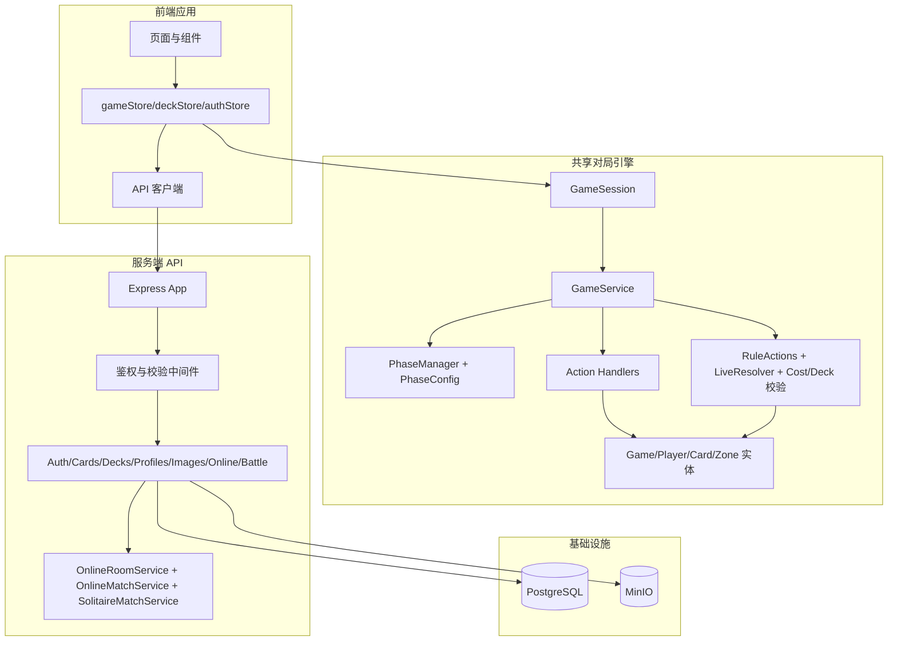
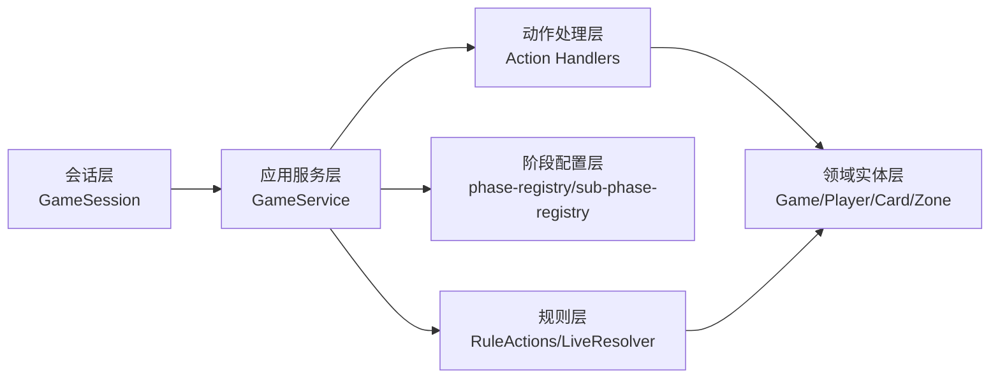
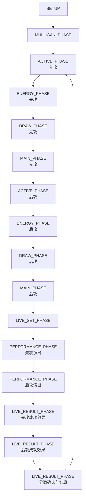
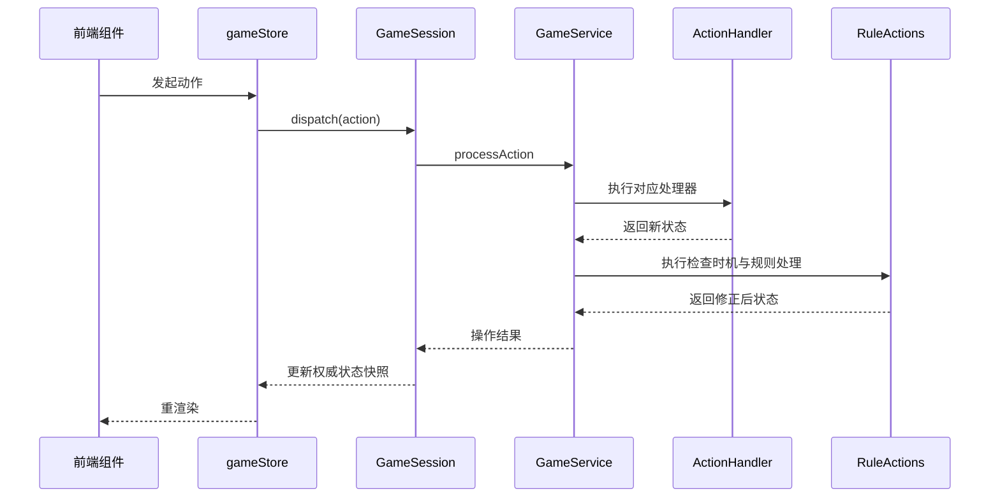
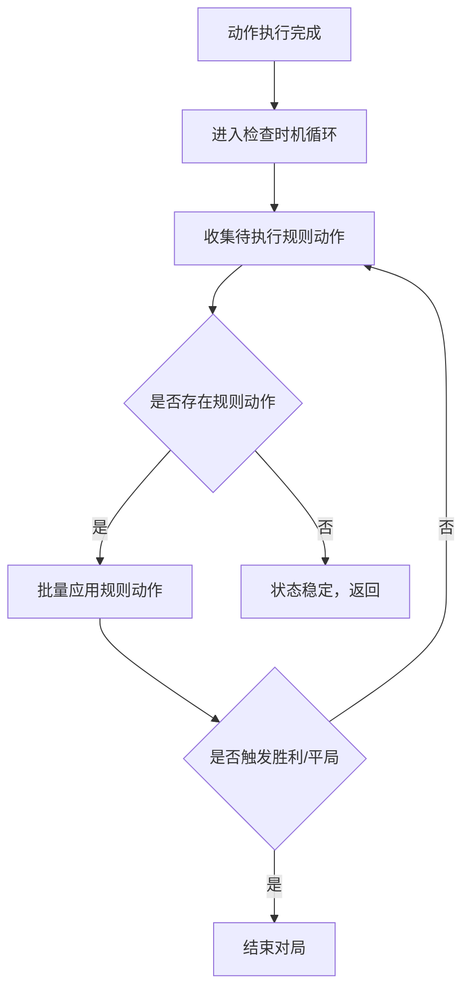
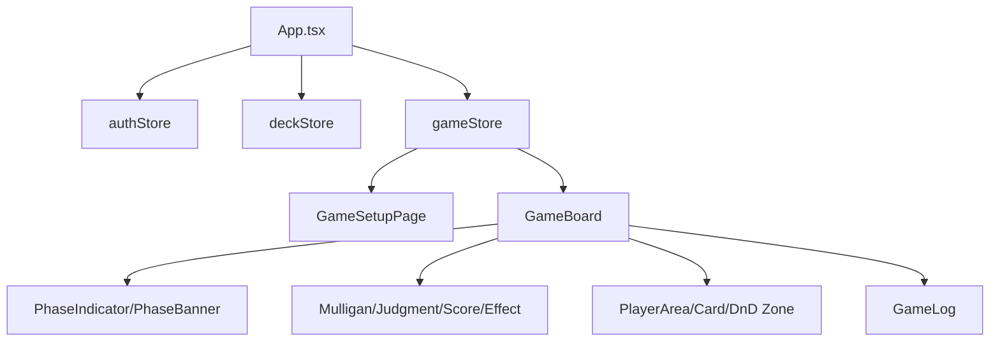
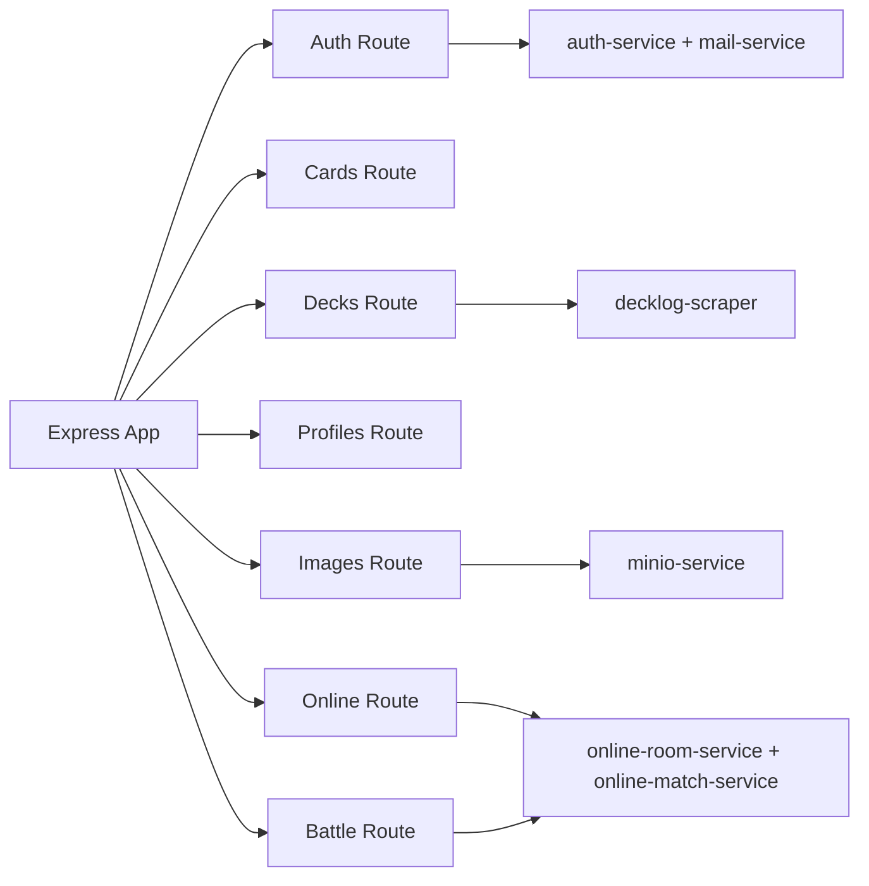
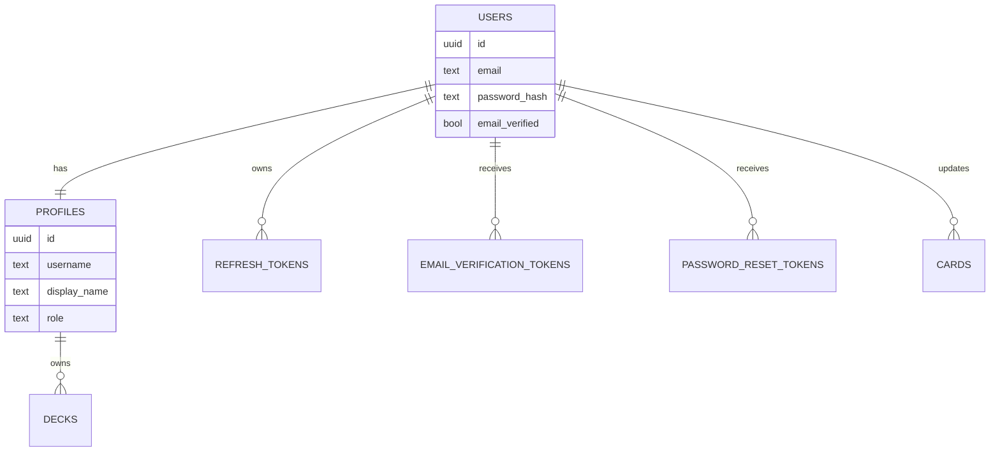
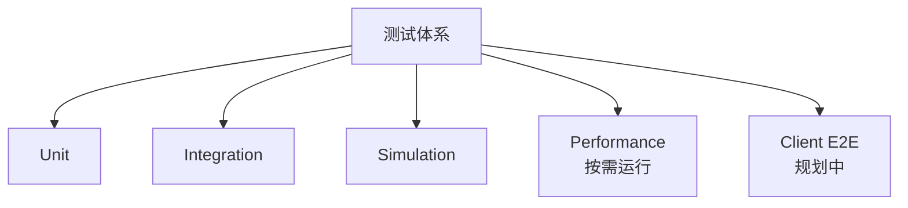

# Loveca 游戏系统设计文档

> 文档类型：设计文档  
> 适用范围：Loveca 当前代码架构与关键流程设计（基于现状实现）  
> 当前状态：现行系统设计；字段级 schema 以 `src/server/db/schema.ts` 和 `docker/init.sql` 为准
> 最后更新：2026-06-22

---

## 1. 设计目标与范围

本文档用于描述 Loveca 的系统设计方案，重点覆盖：

- 对局引擎分层与状态机设计
- 规则处理与动作执行链路
- 前后端边界与数据流
- 持久化与资源服务设计
- 已实现功能对应的代码路径

运行时数据结构、算法链路、卡效/LIVE/recorder 热路径和跨模块不变量的横向说明，见 [运行时数据结构与算法链路](runtime-data-flow-and-algorithm-chain.md)。本文档维护系统全景和模块职责，不重复维护逐条运行时链路。

不包含内容：

- 具体实现代码
- 逐行算法说明
- 逐条运行时数据结构关系和热路径分析
- 历史旧版 OOP 伪模型

---

## 2. 总体架构设计

设计原则：

- 对局规则与 UI 展示解耦
- 阶段规则配置化，减少硬编码
- 动作处理器按职责拆分，便于扩展
- 本地离线可运行，在线能力通过 API 增强

---

## 3. 对局引擎分层设计

### 3.1 会话层

职责：

- 维护权威状态
- 接收并派发玩家动作
- 处理自动推进与规则自动化策略差异（`GameMode.DEBUG` / `GameMode.SOLITAIRE`）；正式联机由服务端房间/对局服务持有会话并通过座位映射驱动同一个 `GameSession`
- 提供玩家视角状态读取接口；联机快照通过 `PlayerViewState` 投影输出，不直接暴露权威状态

代码路径：

- `src/application/game-session.ts`
- `src/online/projector.ts`
- `src/online/visibility.ts`

### 3.2 应用服务层

职责：

- 初始化对局
- 统一动作执行与结果返回
- 驱动阶段流转
- 触发检查时机与规则处理

代码路径：

- `src/application/game-service.ts`

### 3.3 阶段配置层

职责：

- 统一定义主阶段行为、转换条件、自动动作
- 统一定义子阶段顺序与是否需要用户操作
- 提供活跃玩家判定策略

代码路径：

- `src/shared/phase-config/phase-registry.ts`
- `src/shared/phase-config/sub-phase-registry.ts`
- `src/shared/phase-config/active-player.ts`
- `src/application/phase-manager.ts`

### 3.4 动作处理层

职责：

- 按动作类型分发处理器
- 落地卡牌移动、子阶段确认、分数确认、撤销、应援等动作
- 统一动作成功/失败结果语义

代码路径：

- `src/application/action-handlers/index.ts`
- `src/application/action-handlers/play-member.handler.ts`
- `src/application/action-handlers/live-set.handler.ts`
- `src/application/action-handlers/mulligan.handler.ts`
- `src/application/action-handlers/tap-member.handler.ts`
- `src/application/action-handlers/phase-ten.handler.ts`
- `src/application/action-handlers/zone-operations.ts`
- `src/application/actions.ts`

### 3.5 规则层

职责：

- 处理规则动作（刷新、胜利检测、非法状态清理）
- 提供 Live/Heart 相关领域计算能力
- 提供费用与卡组校验能力

当前实现说明：

- 运行时主链路中的检查时机由 `GameService.executeCheckTiming()` 直接驱动 `rule-actions`
- `src/domain/rules/check-timing.ts` 保留了更完整的检查时机/自动能力处理模型，但当前未接入主流程
- `src/domain/rules/live-resolver.ts` 目前主要作为领域计算模块与测试覆盖对象，未作为对局主链路唯一入口

代码路径：

- `src/domain/rules/live-resolver.ts`
- `src/domain/rules/rule-actions.ts`
- `src/domain/rules/check-timing.ts`
- `src/domain/rules/cost-calculator.ts`
- `src/domain/rules/deck-validator.ts`
- `src/domain/value-objects/heart.ts`

### 3.6 领域实体层

职责：

- 承载对局状态结构与不可变更新语义
- 管理玩家、区域、卡牌实例与历史记录

代码路径：

- `src/domain/entities/game.ts`
- `src/domain/entities/player.ts`
- `src/domain/entities/zone.ts`
- `src/domain/entities/card.ts`

---

## 4. 对局流程状态机设计

子阶段设计原则：

- 主阶段下沉到可观察子阶段，支持 UI 精细控制
- 子阶段标注是否需要玩家确认
- 自动子阶段用于抽牌、推进与清理
- Live 成功效果在双方表演完成后依次处理，顺序为先攻成功效果、后攻成功效果，再进入分数确认与结算

代码路径：

- `src/shared/types/enums.ts`
- `src/shared/phase-config/sub-phase-registry.ts`

---

## 5. 动作执行链路设计

关键设计点：

- 动作是唯一状态入口，避免绕过规则层改状态
- 规则处理在动作后统一执行，保障状态一致性
- 会话层负责自动推进，不把流程控制分散到组件层

代码路径：

- `client/src/store/gameStore.ts`
- `src/application/game-session.ts`
- `src/application/game-service.ts`
- `src/application/action-handlers/`

---

## 6. 规则校正与“信任玩家”设计

设计说明：

- 用户可在特定窗口进行自由移动与确认
- 系统负责兜底纠偏，清理非法或不完整状态
- 胜利检测由规则层统一处理
- 自动能力当前仍以玩家手动执行为主，系统尚未接入完整自动编排

代码路径：

- `src/application/game-service.ts`
- `src/domain/rules/rule-actions.ts`
- `src/domain/rules/check-timing.ts`（当前为未接线的完整模型实现）

---

## 7. 前端架构设计

职责划分：

- `gameStore`：对局状态桥接与动作封装
- `deckStore`：卡组编辑与云端卡组管理
- `authStore`：认证、会话恢复、离线模式
- `GameBoard`：拖拽与对局主交互容器

代码路径：

- `client/src/store/gameStore.ts`
- `client/src/store/deckStore.ts`
- `client/src/store/authStore.ts`
- `client/src/components/game/`
- `client/src/components/pages/GameSetupPage.tsx`

---

## 8. 服务端与数据设计

### 8.1 API 模块设计

代码路径：

- `src/server/app.ts`
- `src/server/routes/auth.ts`
- `src/server/routes/cards.ts`
- `src/server/routes/decks.ts`
- `src/server/routes/profiles.ts`
- `src/server/routes/images.ts`
- `src/server/routes/online.ts`
- `src/server/routes/battle.ts`
- `src/server/services/`

### 8.2 数据模型设计

字段级数据库定义不在本文档重复维护；当前代码侧 schema 见 `src/server/db/schema.ts`，初始化脚本和数据库函数/触发器见 `docker/init.sql`。

代码路径：

- `src/server/db/schema.ts`
- `src/server/db/drizzle.ts`
- `src/server/db/pool.ts`

---

## 9. 测试设计与覆盖结构

代码路径：

- 单元与集成：`tests/unit/`、`tests/integration/`
- 流程仿真：`tests/simulation/`
- 性能基准：`tests/performance/`
- 当前仓库未保留可运行的前端 E2E specs；历史 Playwright 输出可能存在于 `client/test-results/` 或根目录 `test-results/`，不作为现行测试入口

---

## 10. 当前落地边界（设计视角）

### 10.1 已落地

- 配置化阶段/子阶段驱动的主流程
- 动作处理器体系与规则动作校正链路
- Live 结算主流程、手动判定确认与分数确认链路
- 本地双人调试模式与对墙打模式
- 认证、卡组、卡牌、图片管理 API
- 云端卡组与离线模式并存
- 正式联机房间闭环：创建/加入、云端卡组锁定、双方准备开始、开局猜拳与胜者决定先后手、服务端权威对局、轮询同步、请求式重开、离开/短暂恢复与管理员房间观测
- 服务端可记录对墙打：`src/server/services/solitaire-match-service.ts` 复用 recorded match 链路创建 `GameMode.SOLITAIRE` 权威对局，`src/server/routes/battle.ts` 提供对墙打创建、运行中快照/命令/推进/离开，以及中性历史读取入口
- 面向联机的 `PlayerViewState` 脱敏投影、可见性策略和命令权限投影
- 对局记录与回放阶段性闭环：`src/server/services/match-recorder-service.ts` 写入历史根记录、卡组快照、timeline、authority checkpoint、public/private event 与部分 decision record；`src/server/services/match-replay-read-service.ts` 按参与者玩家视角读取正式联机与服务端可记录对墙打的历史列表、详情、timeline 与只读 checkpoint 投影；`client/src/components/pages/MatchRecordsPage.tsx` 可打开只读 `GameBoard` 回放节点

### 10.2 规划中

- WebSocket/SSE 等实时传输增强（当前正式联机使用短间隔 HTTP 轮询）
- 对局记录与回放后续增强：进程重启后恢复运行中对局、完整随机记录、完整决策覆盖、自由拖拽/手动处理原因结构化、确定性重演、逐命令动画、公开分享回放与长期兼容策略
- 更完整的自动能力编排与检查时机接线
- 更高覆盖的性能与稳定性专项测试

---

## 11. 文档维护约定

- 本文档为“设计文档”，新增已实现模块时需补充对应代码路径
- 本文档维护系统全景、分层职责、状态机和模块入口；运行时数据结构关系、命令/卡效/LIVE/recorder 链路和跨模块不变量维护在 `docs/runtime-data-flow-and-algorithm-chain.md`
- 架构和流程图统一使用 Mermaid
- 需求变更先更新需求文档，再同步更新本设计文档
- 与外部系统强耦合时，需在相关模块文档中补充原始链接
