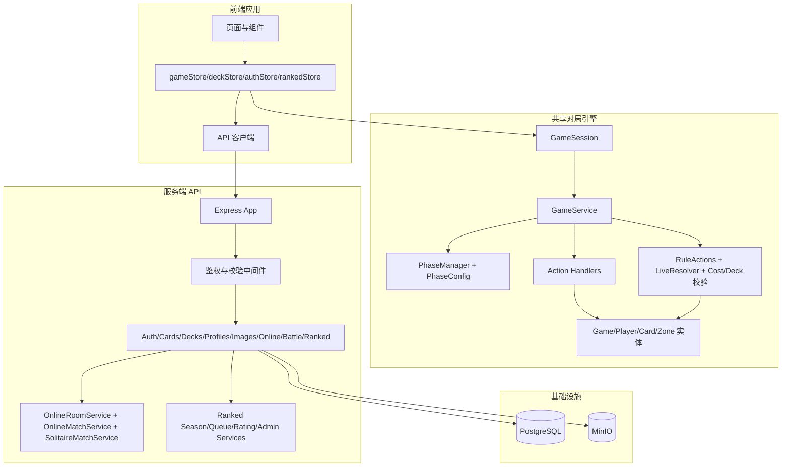
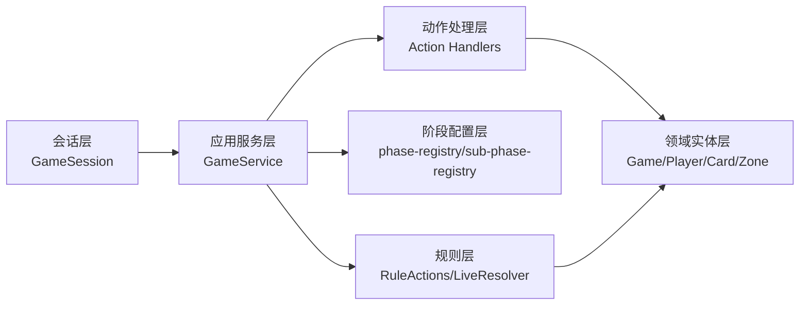
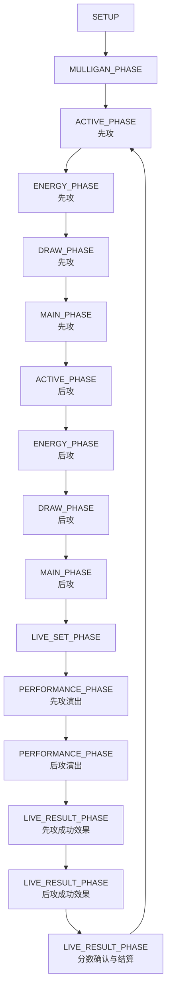
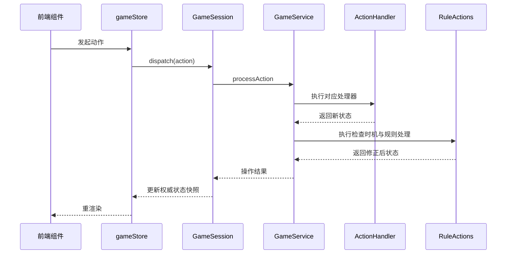
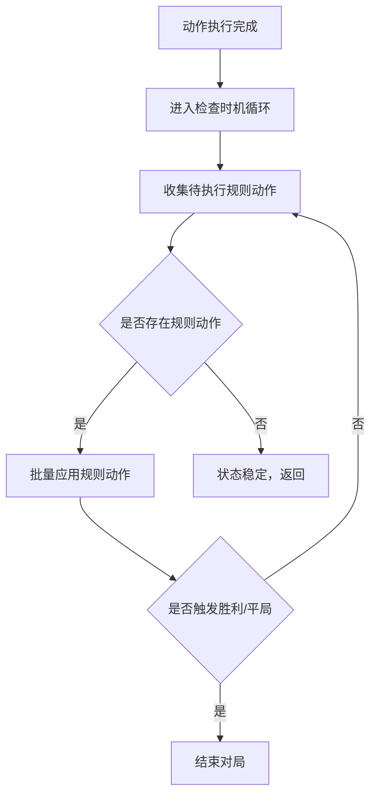
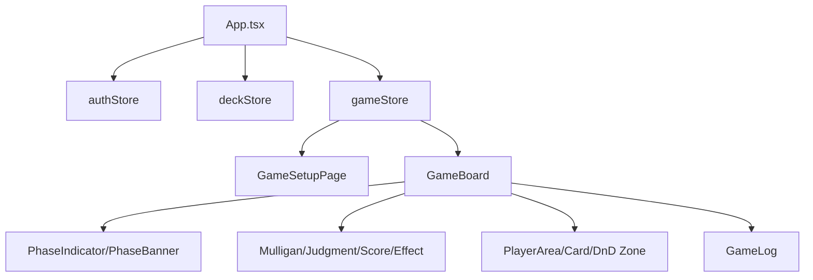
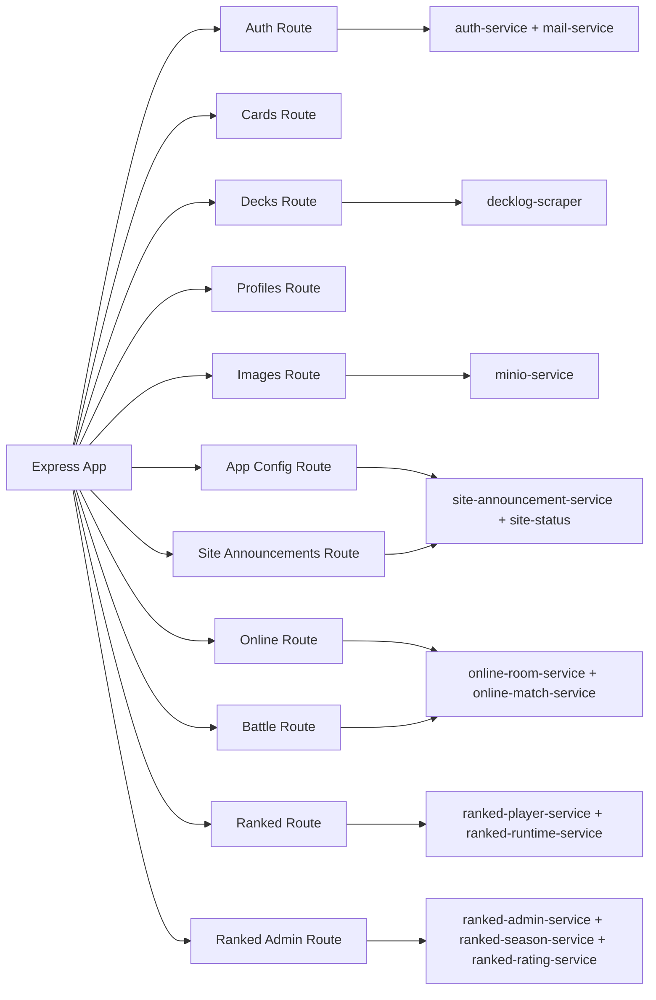
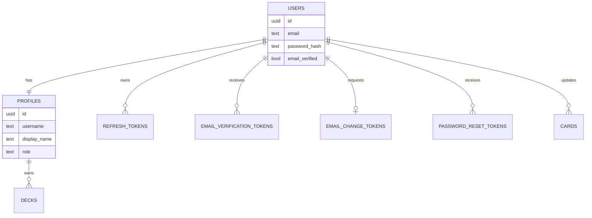
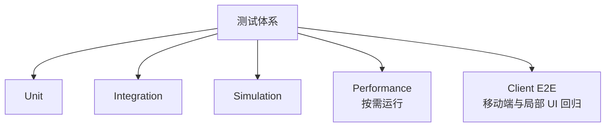

# Loveca 游戏系统设计文档

> 文档类型：设计文档  
> 适用范围：Loveca 当前代码架构与关键流程设计（基于现状实现）  
> 当前状态：现行系统设计；字段级 schema 以 `src/server/db/schema.ts` 和 `drizzle/` 增量迁移为准，初始化函数与触发器以 `docker/init.sql` 为准
> 最后更新：2026-08-06

---

## 1. 设计目标与范围

本文档用于描述 Loveca 的系统设计方案，重点覆盖：

- 对局引擎分层与状态机设计
- 规则处理与动作执行链路
- 前后端边界与数据流
- 持久化与资源服务设计
- 已实现功能对应的代码路径

运行时数据结构、算法链路、卡效/LIVE/recorder 热路径和跨模块不变量的横向说明，见 [运行时数据结构与算法链路](runtime-data-flow-and-algorithm-chain.md)。本文档维护系统全景和模块职责，不重复维护逐条运行时链路。

不包含内容：

- 具体实现代码
- 逐行算法说明
- 逐条运行时数据结构关系和热路径分析
- 历史旧版 OOP 伪模型

---

## 2. 总体架构设计

```mermaid
graph TB
    subgraph Client[前端应用]
        UI[页面与组件]
        GS[gameStore/deckStore/authStore/rankedStore]
        APIClient[API 客户端]
    end

    subgraph Engine[共享对局引擎]
        Session[GameSession]
        Service[GameService]
        Phase[PhaseManager + PhaseConfig]
        Handlers[Action Handlers]
        Rules[RuleActions + LiveResolver + Cost/Deck 校验]
        Domain[Game/Player/Card/Zone 实体]
    end

    subgraph Server[服务端 API]
        App[Express App]
        Routes[Auth/Cards/Decks/Profiles/Images/Online/Battle/Ranked]
        Middleware[鉴权与校验中间件]
        OnlineSvc[OnlineRoomService + OnlineMatchService + SolitaireMatchService]
        RankedSvc[Ranked Season/Queue/Rating/Admin Services]
    end

    subgraph Infra[基础设施]
        PG[(PostgreSQL)]
        MinIO[(MinIO)]
    end

    UI --> GS
    GS --> Session
    Session --> Service
    Service --> Phase
    Service --> Handlers
    Service --> Rules
    Handlers --> Domain
    Rules --> Domain

    GS --> APIClient
    APIClient --> App
    App --> Middleware
    Middleware --> Routes
    Routes --> OnlineSvc
    Routes --> RankedSvc
    Routes --> PG
    Routes --> MinIO
```

设计原则：

- 对局规则与 UI 展示解耦
- 阶段规则配置化，减少硬编码
- 动作处理器按职责拆分，便于扩展
- 本地离线可运行，在线能力通过 API 增强

---

## 3. 对局引擎分层设计

```mermaid
graph LR
    Session[会话层\nGameSession] --> Service[应用服务层\nGameService]
    Service --> Handlers[动作处理层\nAction Handlers]
    Service --> PhaseCfg[阶段配置层\nphase-registry/sub-phase-registry]
    Service --> RuleLayer[规则层\nRuleActions/LiveResolver]
    Handlers --> Domain[领域实体层\nGame/Player/Card/Zone]
    RuleLayer --> Domain
```

### 3.1 会话层

职责：

- 维护权威状态
- 接收并派发玩家动作
- 处理自动推进与规则自动化策略差异（`GameMode.DEBUG` / `GameMode.SOLITAIRE`）；正式联机由服务端房间/对局服务持有会话并通过座位映射驱动同一个 `GameSession`
- 提供玩家视角状态读取接口；联机快照通过 `PlayerViewState` 投影输出，不直接暴露权威状态

代码路径：

- `src/application/game-session.ts`
- `src/online/projector.ts`
- `src/online/visibility.ts`

### 3.2 应用服务层

职责：

- 初始化对局
- 统一动作执行与结果返回
- 驱动阶段流转
- 触发检查时机与规则处理

代码路径：

- `src/application/game-service.ts`

### 3.3 阶段配置层

职责：

- 统一定义主阶段行为、转换条件、自动动作
- 统一定义子阶段顺序与是否需要用户操作
- 提供活跃玩家判定策略

代码路径：

- `src/shared/phase-config/phase-registry.ts`
- `src/shared/phase-config/sub-phase-registry.ts`
- `src/shared/phase-config/active-player.ts`
- `src/application/phase-manager.ts`

### 3.4 动作处理层

职责：

- 按动作类型分发处理器
- 落地卡牌移动、子阶段确认、分数确认、撤销、应援等动作
- 统一动作成功/失败结果语义

代码路径：

- `src/application/action-handlers/index.ts`
- `src/application/action-handlers/play-member.handler.ts`
- `src/application/action-handlers/live-set.handler.ts`
- `src/application/action-handlers/mulligan.handler.ts`
- `src/application/action-handlers/tap-member.handler.ts`
- `src/application/action-handlers/phase-ten.handler.ts`
- `src/application/action-handlers/zone-operations.ts`
- `src/application/actions.ts`

### 3.5 规则层

职责：

- 处理规则动作（刷新、胜利检测、非法状态清理）
- 提供 Live/Heart 相关领域计算能力
- 提供费用与卡组校验能力

当前实现说明：

- 运行时主链路中的检查时机由 `GameService.executeCheckTiming()` 直接驱动 `rule-actions`
- `src/domain/rules/check-timing.ts` 保留了更完整的检查时机/自动能力处理模型，但当前未接入主流程
- `src/domain/rules/live-resolver.ts` 目前主要作为领域计算模块与测试覆盖对象，未作为对局主链路唯一入口

代码路径：

- `src/domain/rules/live-resolver.ts`
- `src/domain/rules/rule-actions.ts`
- `src/domain/rules/check-timing.ts`
- `src/domain/rules/cost-calculator.ts`
- `src/domain/rules/deck-validator.ts`
- `src/domain/value-objects/heart.ts`

### 3.6 领域实体层

职责：

- 承载对局状态结构与不可变更新语义
- 管理玩家、区域、卡牌实例与历史记录

代码路径：

- `src/domain/entities/game.ts`
- `src/domain/entities/player.ts`
- `src/domain/entities/zone.ts`
- `src/domain/entities/card.ts`

---

## 4. 对局流程状态机设计

```mermaid
flowchart TD
    Setup[SETUP] --> Mulligan[MULLIGAN_PHASE]
    Mulligan --> Active1[ACTIVE_PHASE\n先攻]
    Active1 --> Energy1[ENERGY_PHASE\n先攻]
    Energy1 --> Draw1[DRAW_PHASE\n先攻]
    Draw1 --> Main1[MAIN_PHASE\n先攻]

    Main1 --> Active2[ACTIVE_PHASE\n后攻]
    Active2 --> Energy2[ENERGY_PHASE\n后攻]
    Energy2 --> Draw2[DRAW_PHASE\n后攻]
    Draw2 --> Main2[MAIN_PHASE\n后攻]

    Main2 --> LiveSet[LIVE_SET_PHASE]
    LiveSet --> Performance1[PERFORMANCE_PHASE\n先攻演出]
    Performance1 --> Performance2[PERFORMANCE_PHASE\n后攻演出]
    Performance2 --> Success1[LIVE_RESULT_PHASE\n先攻成功效果]
    Success1 --> Success2[LIVE_RESULT_PHASE\n后攻成功效果]
    Success2 --> LiveResult[LIVE_RESULT_PHASE\n分数确认与结算]
    LiveResult --> Active1
```

子阶段设计原则：

- 主阶段下沉到可观察子阶段，支持 UI 精细控制
- 子阶段标注是否需要玩家确认
- 自动子阶段用于抽牌、推进与清理
- Live 成功效果在双方表演完成后依次处理，顺序为先攻成功效果、后攻成功效果，再进入分数确认与结算

代码路径：

- `src/shared/types/enums.ts`
- `src/shared/phase-config/sub-phase-registry.ts`

---

## 5. 动作执行链路设计

```mermaid
sequenceDiagram
    participant UI as 前端组件
    participant Store as gameStore
    participant Session as GameSession
    participant Service as GameService
    participant Handler as ActionHandler
    participant Rule as RuleActions

    UI->>Store: 发起动作
    Store->>Session: dispatch(action)
    Session->>Service: processAction
    Service->>Handler: 执行对应处理器
    Handler-->>Service: 返回新状态
    Service->>Rule: 执行检查时机与规则处理
    Rule-->>Service: 返回修正后状态
    Service-->>Session: 操作结果
    Session-->>Store: 更新权威状态快照
    Store-->>UI: 重渲染
```

关键设计点：

- 动作是唯一状态入口，避免绕过规则层改状态
- 规则处理在动作后统一执行，保障状态一致性
- 会话层负责自动推进，不把流程控制分散到组件层

代码路径：

- `client/src/store/gameStore.ts`
- `src/application/game-session.ts`
- `src/application/game-service.ts`
- `src/application/action-handlers/`

---

## 6. 规则校正与操作模式设计

```mermaid
flowchart TD
    ActionDone[动作执行完成] --> CheckLoop[进入检查时机循环]
    CheckLoop --> Collect[收集待执行规则动作]
    Collect --> HasPending{是否存在规则动作}
    HasPending -- 是 --> Apply[批量应用规则动作]
    Apply --> Victory{是否触发胜利/平局}
    Victory -- 是 --> End[结束对局]
    Victory -- 否 --> Collect
    HasPending -- 否 --> Stable[状态稳定，返回]
```

设计说明：

- 新对局默认 `RULES`，玩家输入先经过中央命令政策，只允许当前阶段、pending 和卡效流程明确开放的语义化命令
- `FREE` 在安全时点显式开启，保留己方区域的兼容移动与人工规则处理；正式联机开启需要对方同意，任意一方可单方恢复 `RULES`
- 系统规则处理负责客观状态纠偏，但不以“先接受非法命令、再自动清理”替代命令入口校验
- 胜利检测由规则层统一处理
- 已登记卡效进入自动能力队列；未登记或未接线卡效需要人工处理时，应先进入 `FREE`

代码路径：

- `src/application/manual-operation-mode.ts`（权威模式读取、切换安全点与命令重写）
- `src/application/player-command-policy.ts`（`RULES` / `FREE` 中央玩家命令政策）
- `src/application/game-session.ts`（权威状态、命令校验与模式切换）
- `src/application/game-service.ts`
- `src/domain/rules/rule-actions.ts`
- `src/domain/rules/check-timing.ts`（当前为未接线的完整模型实现）
- `src/online/projector.ts`（玩家视图、权限与模式投影）
- `src/server/services/online-match-service.ts`（正式联机协商、席位校验与服务端权威执行）
- `src/server/services/replay-payload-serialization.ts`（历史 authority checkpoint 的窄复水兼容边界）

---

## 7. 前端架构设计

```mermaid
graph TB
    App[App.tsx] --> Auth[authStore]
    App --> Deck[deckStore]
    App --> Game[gameStore]

    Game --> SetupPage[GameSetupPage]
    Game --> Board[GameBoard]

    Board --> PhaseUI[PhaseIndicator/PhaseBanner]
    Board --> Panels[Mulligan/Judgment/Score/Effect]
    Board --> Areas[PlayerArea/Card/DnD Zone]
    Board --> Logs[GameLog]
```

职责划分：

- `gameStore`：对局状态桥接与动作封装
- `deckStore`：卡组编辑与云端卡组管理
- `authStore`：认证、会话恢复、个人资料与凭据更新、离线模式
- `rankedStore`：赛季总览与跨页面排位候场、确认和取消状态
- `GameBoard`：拖拽与对局主交互容器

代码路径：

- `client/src/store/gameStore.ts`
- `client/src/store/deckStore.ts`
- `client/src/store/authStore.ts`
- `client/src/store/rankedStore.ts`
- `client/src/components/pages/AccountCenterPage.tsx`
- `client/src/components/game/`
- `client/src/components/pages/GameSetupPage.tsx`

---

## 8. 服务端与数据设计

### 8.1 API 模块设计

```mermaid
graph LR
    App[Express App] --> AuthR[Auth Route]
    App --> CardsR[Cards Route]
    App --> DecksR[Decks Route]
    App --> ProfilesR[Profiles Route]
    App --> ImagesR[Images Route]
    App --> ConfigR[App Config Route]
    App --> SiteAnnouncementsR[Site Announcements Route]
    App --> OnlineR[Online Route]
    App --> BattleR[Battle Route]
    App --> RankedR[Ranked Route]
    App --> RankedAdminR[Ranked Admin Route]

    AuthR --> AuthSvc[auth-service + mail-service]
    DecksR --> Scraper[decklog-scraper]
    ImagesR --> MinioSvc[minio-service]
    ConfigR --> OpsSvc[site-announcement-service + site-status]
    SiteAnnouncementsR --> OpsSvc
    OnlineR --> OnlineSvc[online-room-service + online-match-service]
    BattleR --> OnlineSvc
    RankedR --> RankedSvc[ranked-player-service + ranked-runtime-service]
    RankedAdminR --> RankedAdminSvc[ranked-admin-service + ranked-season-service + ranked-rating-service]
```

代码路径：

- `src/server/app.ts`
- `src/server/routes/auth.ts`
- `src/server/routes/cards.ts`
- `src/server/routes/decks.ts`
- `src/server/routes/profiles.ts`
- `src/server/routes/images.ts`
- `src/server/routes/app-config.ts`
- `src/server/routes/site-announcements.ts`
- `src/server/routes/online.ts`
- `src/server/routes/battle.ts`
- `src/server/routes/ranked.ts`
- `src/server/routes/ranked-admin.ts`
- `src/server/site-status.ts`
- `src/server/services/site-announcement-service.ts`
- `src/server/middleware/require-gameplay-available.ts`
- `src/server/services/`

认证与会话链路：

- 访问令牌固定使用带 issuer、audience、subject 与角色约束的 HS256 JWT；浏览器只在内存中保存访问令牌。
- 刷新令牌通过 HttpOnly Cookie 传递，Cookie 保存令牌定位符与随机 secret，数据库只保存 secret 预哈希后的 bcrypt 摘要；刷新和当前设备登出分别在数据库事务中锁定、校验并轮换或撤销目标令牌。
- 启用 `EMAIL_ENABLED` 后，注册邮箱和登录前验证成为强制门禁，服务启动时校验完整 SMTP 配置。邮箱验证、密码重置与邮箱换绑只保存带密钥摘要；邮箱换绑先校验当前密码并向新邮箱发送一次性链接，确认时在同一事务中更新邮箱、撤销刷新令牌并清理其他认证 token。邮件链接通过 URL fragment 交给前端并在页面初始化时清理。
- 认证端点统一返回不可缓存响应，并使用按 IP 与账号标识组合的有界限流；当前部署边界见 `docs/current-limitations.md`。
- 运行时只接受 v2 刷新 Cookie 和一次性 token 格式；维护窗口中的认证切换将可识别的旧 bcrypt 密码封装成显式兼容状态，成功登录后原子升级为当前 v2 预哈希格式。原始旧 Cookie 和一次性 token 统一失效；已标记重置或未知密码格式会阻断迁移，不以运行时兜底伪装为可登录账号。

认证关键代码路径：

- `src/server/config.ts`
- `src/server/middleware/authenticate.ts`
- `src/server/middleware/auth-rate-limit.ts`
- `src/server/routes/auth.ts`
- `src/server/services/auth-service.ts`
- `src/server/services/mail-service.ts`
- `client/src/lib/apiClient.ts`
- `client/src/store/authStore.ts`
- `client/src/components/pages/AccountCenterPage.tsx`
- `drizzle/data-migrations/auth-v1-to-v2-credential-cutover.ts`

### 8.2 数据模型设计

```mermaid
erDiagram
    USERS ||--|| PROFILES : has
    USERS ||--o{ REFRESH_TOKENS : owns
    USERS ||--o{ EMAIL_VERIFICATION_TOKENS : receives
    USERS ||--o| EMAIL_CHANGE_TOKENS : requests
    USERS ||--o{ PASSWORD_RESET_TOKENS : receives
    PROFILES ||--o{ DECKS : owns
    USERS ||--o{ CARDS : updates

    USERS {
      uuid id
      text email
      text password_hash
      bool email_verified
    }
    PROFILES {
      uuid id
      text username
      text display_name
      text role
    }
```

字段级数据库定义不在本文档重复维护；当前代码侧 schema 见 `src/server/db/schema.ts`，物理变更顺序见 `drizzle/` 增量迁移，基础初始化结构和数据库函数/触发器见 `docker/init.sql`。新库必须先执行初始化脚本，再执行全部增量迁移。

赛季排位在公共牌桌的持久票据/预留状态机上增加独立 `RANKED` 队列上下文，并以赛季、
排位对局、追加式评分事件、物化步骤、当前积分投影和跨赛季种子组成可审计结算模型。
候场与配对按赛季冻结的竞技环境隔离；权威对局封存后由评分服务幂等结算，迟到结果或
管理员更正按稳定顺序重建派生投影。字段、事务和更正链细节见
[赛季排位数据与结算设计](matchmaking-and-ladder/RANKED_R2_DATA_AND_SETTLEMENT_DESIGN.md)。

代码路径：

- `src/server/db/schema.ts`
- `src/server/db/drizzle.ts`
- `src/server/db/pool.ts`
- `src/server/services/ranked-season-service.ts`
- `src/server/services/ranked-player-service.ts`
- `src/server/services/ranked-rating-service.ts`
- `src/server/services/ranked-runtime-service.ts`
- `src/server/services/ranked-admin-service.ts`
- `src/server/services/ranked-v3-migration-service.ts`
- `src/server/rating/ranked-ledger.ts`
- `src/server/rating/glicko.ts`
- `scripts/migrate-ranked-season-v3.ts`
- `drizzle/0010_add_ranked_system.sql`

---

## 9. 测试设计与覆盖结构

```mermaid
graph TD
    Tests[测试体系] --> Unit[Unit]
    Tests --> Integration[Integration]
    Tests --> Simulation[Simulation]
    Tests --> Performance[Performance\n按需运行]
    Tests --> E2E[Client E2E\n移动端与局部 UI 回归]
```

代码路径：

- 单元与集成：`tests/unit/`、`tests/integration/`
- 流程仿真：`tests/simulation/`
- 性能基准：`tests/performance/`
- 前端 E2E：`client/tests/e2e/`，覆盖移动端、响应式布局、局部 UI 回归，以及排位玩家/管理员真实 API 流程；`client/test-results/` 或根目录 `test-results/` 仅为运行产物，不作为测试入口

---

## 10. 当前落地边界（设计视角）

### 10.1 已落地

- 配置化阶段/子阶段驱动的主流程
- 动作处理器体系与规则动作校正链路
- Live 结算主流程、手动判定确认与分数确认链路
- 本地双人调试模式与对墙打模式：`client/src/components/pages/GameSetupPage.tsx` 统一提供公共牌桌、赛季排位、房间联机、对墙打和双人调试入口，并保留本地模式的分步选组；`client/src/lib/debugPerspective.ts` 与 `client/src/store/gameStore.ts` 在本地双人调试的 `RULES` 模式下按玩家视图权限自动跟随当前操作方，`client/src/components/game/GameBoard.tsx` 同时为桌面和移动端保留显式视角切换与确认式重开入口
- 认证、卡组、卡牌、图片管理 API
- 版本化 PT 限制表：`src/domain/rules/deck-point-table.ts` 定义显式规则快照，`src/server/services/deck-point-table-service.ts` 以 PostgreSQL 事务维护 `DRAFT / SCHEDULED / ACTIVE / RETIRED` 状态、revision 乐观锁和审计日志。定时版本以 `Asia/Shanghai` 解析精确到秒的本地时间；排期改到当前/过去、立即发布及 ACTIVE 废弃替换都在单事务中切换，且任何成功操作提交前强制校验有且仅有一张 ACTIVE 表。`/api/deck-point-tables/current` 仅暴露玩家校验所需字段，卡组保存和对局准入始终以服务端 ACTIVE 表为权威；`client/src/store/deckPointTableStore.ts` 只将内置的已确认表用作离线/启动失败展示回退。管理员通过 `DeckPointTablesAdminPage` 完成任意状态表的编辑、差异预览、发布、取消排期、废弃/替换、删除已退役表和历史复制。
- 平台状态与公告配置：`src/server/site-status.ts` 定义公开站点状态契约，`src/server/services/site-announcement-service.ts` 组装数据库优先、环境变量兜底的维护状态和公告，`src/server/routes/site-announcements.ts` 提供管理员维护开关与公告管理 API，`src/server/routes/app-config.ts` 通过 `/api/config` 暴露公开 `siteStatus`
- 云端卡组与离线模式并存
- 正式联机房间闭环：创建/加入、云端卡组锁定、双方准备开始、开局猜拳与胜者决定先后手、服务端权威对局、轮询同步、请求式重开、主动认输、房间号只读观战、离开/短暂恢复与管理员房间观测。认输由 `GameSession` 以 `OPPONENT_SURRENDER` 结束权威对局，公开投影仅暴露终局原因与胜负席位，记录服务封存为 `SURRENDERED`；赛后离开会释放真人对局占用。普通玩家专用观战链接已完整移除。房间号观战默认开放双方玩家视角，观战会话可在当前已授权视角间切换；preferred 目标按玩家身份保存，授权 fallback 只改变 effective 目标。普通观战资格和会话绑定不可复用的房间代际，当前 match/席位只是可替换单局绑定：双方接受重开后返回结构化局间等待，新局创建后按原玩家身份重新解析席位并自动续看；房间关闭、等待期间参赛成员变化、会话过期或全部授权关闭会稳定终止旧资格。同一房间最多 10 个活跃普通观战会话，等待会话继续占名额，管理员单局观战不占公开名额且不跨局；恢复会话、快照、公开日志与视角切换共享服务端请求限流。普通观战采用请求完成后再计时的串行轮询与会话级退避，频率保护或短暂网络中断时保留最后有效桌面并自动恢复；跨局时以房间/绑定代际隔离响应，客户端等待时清空旧单局 store 与日志，新局完整投影到达后再建立桌面
- 单局文字与快捷表情通信：`src/online/chat-types.ts` 以 `TEXT | EMOTE` 判别联合维护共享条目契约和六种白名单表情 ID；`src/server/services/online-match-chat-runtime.ts` 维护按 `matchId` 隔离的有界内存消息、幂等标识、游标分页、文本校验、综合限频和表情冷却，`src/server/services/online-match-service.ts` 复用参与者身份与观战会话/代际授权，`src/server/services/online-room-service.ts` 阻止已退出成员被迟到轮询重新激活，`src/server/routes/online.ts` 提供当前房间成员读写和观战只读 REST 入口。前端由 `client/src/components/game/MatchChat.tsx` 独立轮询并渲染共同时间流，`client/src/components/game/MatchEmoteVisual.tsx` 与 `client/src/lib/matchEmotes.ts` 提供本地矢量表情，`GameBoard` / `PlayerArea` 只声明席位身份锚点。局内通信不写入 `GameState`、公共事件、数据库、历史记录或回放；重开、双方离开销毁旧对局运行态或 API 服务重启后不恢复
- 公共牌桌 Beta：`src/server/services/public-table-service.ts` 以 PostgreSQL 候场票据和配对预留实现 FIFO 候场、双方确认、锁定卡组快照与超时清理；房间创建使用带代际校验的短租约和有限重试，旧创建者不能覆盖接管后的房间。`src/server/services/gameplay-participation-service.ts` 约束用户不能同时处于候场、房间或对局；确认成功后由 `src/server/services/online-room-service.ts` 创建封闭的公共牌桌房间，双方需在 60 秒内到场才进入猜拳，超时则结束本次开局，并复用正式联机认输、观战和记录链路。`client/src/components/public-table/PublicTableGlobalLayer.tsx` 和 `client/src/components/pages/PublicTablePage.tsx` 负责跨页面候场状态、确认及单次自动进入房间，持久化 schema 由 `src/server/db/schema.ts` 与 `drizzle/0008_add_public_table_beta.sql`、`drizzle/0010_add_ranked_system.sql` 对齐
- 赛季排位首版：`src/server/services/public-table-service.ts` 复用票据/预留状态机并以 `queueKind + seasonId + competitiveEnvironmentId` 隔离休闲与排位候场；`src/server/services/online-room-service.ts` 按房间代际去重开局并补偿预留、赛季、占用和票据绑定，断线裁定以持久状态和在线代际共同防止重连竞态。`src/server/services/ranked-player-service.ts` 提供赛季总览、固定窗口准入、个人战绩和排行榜，`src/server/services/ranked-rating-service.ts` 与 `src/server/rating/ranked-ledger.ts` 负责权威结果幂等结算、迟到结果重建和追加式更正，`src/server/services/ranked-runtime-service.ts` 先排空可靠结算，再终止到期运行态并执行平台无结果收口。前端由 `client/src/store/rankedStore.ts`、`client/src/components/pages/RankedPage.tsx` 和 `client/src/components/ranked/RankedGlobalLayer.tsx` 提供跨页面候场闭环，管理员由 `client/src/components/admin/RankedAdminPage.tsx` 管理赛季、分页检索全赛季排位对局并核对胜负，以及执行带签名预览的异常结算；数据库结构由 `drizzle/0010_add_ranked_system.sql` 提供。名为 V1 的首个生产赛季已经开放，当前使用 `GLICKO1_PER_MATCH_V2`；V3 代码与同赛季停机迁移工具已实现，生产 V2→V3 迁移尚未执行，执行边界见 [活动排位赛季 V2→V3 停机迁移](matchmaking-and-ladder/RANKED_V3_ACTIVE_SEASON_MIGRATION.md)
- 维护期间新对局限制：`src/server/middleware/require-gameplay-available.ts` 会在维护或限制新开局状态下拦截新建/加入房间、准备开局、开局流程、重开接受和服务端对墙打创建/重开；进行中对局的快照、命令、观战、回放和离开入口不被主动中断
- 服务端可记录对墙打：`src/server/services/solitaire-match-service.ts` 复用 recorded match 链路创建 `GameMode.SOLITAIRE` 权威对局，并在重开时封存旧局、沿用锁定卡组快照创建新的 `matchId`；`client/src/lib/solitaireMatchRecovery.ts` 在同一浏览器标签页保存当前对墙打 matchId 并在刷新或重开后同步恢复目标，`src/server/services/solitaire-runtime-recovery-service.ts` 可在运行态缺失时从最新 authority checkpoint 和公共事件尾部恢复运行中对墙打，`src/server/routes/battle.ts` 提供对墙打创建、重开、运行中快照/命令/推进/离开、公共事件增量读取，以及中性历史读取入口
- 面向联机的 `PlayerViewState` 脱敏投影、可见性策略和命令权限投影
- 运行中对局公共日志：`src/application/game-session.ts` 维护 `PublicEvent` 序列；正式联机 `/api/online/matches/:matchId/public-events`、正式联机观战 `/api/online/spectator-links/:token/public-events` 与对墙打 `/api/battle/solitaire-matches/:matchId/public-events` 按 `afterSeq` 返回公共事件增量，单次响应受 `ONLINE_PUBLIC_EVENTS_MAX_BATCH` 保护并在截断时返回 `truncated/droppedEventCount`，运行中 snapshot 继续只承载当前玩家视图，并以 `currentPublicSeq` 暴露公共日志增量水位
- 对局记录与回放阶段性闭环：`src/server/services/match-recorder-service.ts` 写入历史根记录、卡组快照、timeline、authority checkpoint、public/private event 与部分 decision record；`src/server/services/match-replay-read-service.ts` 按参与者玩家视角读取正式联机与服务端可记录对墙打的历史列表、详情、timeline 与只读 checkpoint 投影；完整回放默认保留 10 天，`drizzle/data-migrations/purge-expired-match-replay-data.ts` 在停机维护窗口清理过期子记录和卡组明细并保留 `METADATA_ONLY` 根记录；`client/src/components/pages/MatchRecordsPage.tsx` 可打开只读 `GameBoard` 回放节点，并为已清理记录只展示元信息

### 10.2 规划中

- WebSocket/SSE 等实时传输增强（当前正式联机使用短间隔 HTTP 轮询）
- 对局记录与回放后续增强：正式联机进程重启后恢复运行中对局、对墙打恢复后的更细粒度追赶、完整随机记录、完整决策覆盖、自由拖拽/手动处理原因结构化、确定性重演、逐命令动画、公开分享回放与长期兼容策略
- 更完整的自动能力编排与检查时机接线
- 更高覆盖的性能与稳定性专项测试
- 活动赛季 V2→V3 停机迁移演练与执行、告警渠道和运营指标看板

---

## 11. 文档维护约定

- 本文档为“设计文档”，新增已实现模块时需补充对应代码路径
- 本文档维护系统全景、分层职责、状态机和模块入口；运行时数据结构关系、命令/卡效/LIVE/recorder 链路和跨模块不变量维护在 `docs/runtime-data-flow-and-algorithm-chain.md`
- 架构和流程图统一使用 Mermaid
- 需求变更先更新需求文档，再同步更新本设计文档
- 与外部系统强耦合时，需在相关模块文档中补充原始链接
