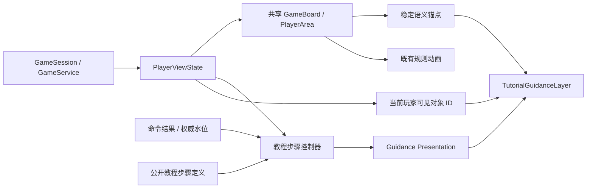

# Loveca 教程首版动画与引导层设计

> 文档类型：实现设计
> 适用范围：首版新手教程的聚焦、步骤切换、目标定位，以及与共享牌桌规则动画的协作
> 当前状态：中型教程动效基线、服务端教程会话、确定性三回合四章场景与脚本对手已经接入；仍在进行人工体验验收
> 创建日期：2026-08-26

## 1. 设计结论

首版教程动画采用独立的“教程引导层”，不扩展为第二套牌桌动画系统：

- 共享牌桌继续负责卡牌移动、翻开、横置、公开、LIVE 判定和结果演出。
- 教程引导层只负责聚焦遮罩、目标描边、说明卡片和步骤切换。
- 教程引导层只消费公开步骤展示模型、共享牌桌语义锚点和当前玩家视图中的对象 ID。
- 教程引导层不读取完整 `GameState`，不直接调用游戏命令，不持有规则完成状态。
- 动画被跳过、组件卸载或 reduced-motion 生效时，权威状态和正式操作仍然完整可用。
- 小铃视觉资产分为 `stickers` 与 `portraits` 两层：透明 Q 版贴纸只在少量欢迎、读卡和完成说明中出现，半身／竖幅场景插画用于按章节变化的牌桌准备状态、错误恢复与独立完成页；章节目录保持纯导航布局。
- 两层素材都只负责情绪与气氛，不循环运动、不参与目标或完成判定；竖幅人物不得塞进牌桌说明卡、覆盖牌桌操作区或改变说明卡定位。
- 玩家需要操作或观察共享牌桌的步骤不显示贴纸；相邻说明步骤也避免连续换表情，防止人物反馈与规则目标竞争注意力。

### 1.1 小铃素材使用表

| 层级        | 推荐尺寸       | 当前用途                                                         | 禁止用途                                       |
| ----------- | -------------- | ---------------------------------------------------------------- | ---------------------------------------------- |
| `stickers`  | 48–72 CSS px   | 欢迎、判定区来源、登场能力、回收循环与完成等少量说明步骤         | 承载规则信息、替代状态图标                     |
| `portraits` | 128–400 CSS px | 随章节变化的牌桌准备状态；错误后重试；带庆祝语和去向的独立完成页 | 章节目录、浮动说明卡、牌桌中央、移动端操作热区 |

因此，教程动画可以独立迭代和替换，不要求 `GameBoard` / `PlayerArea` 理解教程步骤，也不要求现有规则动画等待教程动画结束。`TutorialBattleSurface` 是教程页面当前使用的组合接缝：内部仍渲染共享 `GameBoard`，并把步骤控制器与引导层作为同级消费者挂载；它不是第二套牌桌。

## 2. 分层关系

规则动画和教程引导层是并列的表现消费者。教程控制器可以观察规则动画所对应的最终权威状态，但不能以“某段动画播放完毕”代替命令成功或状态里程碑。

## 3. 独立性边界

### 3.1 共享牌桌允许的改动

共享组件只暴露稳定、无行为的 DOM 语义：

- `data-battle-ui-anchor`：牌桌区域或正式交互窗口。
- `data-battle-ui-object-id`：当前投影已经允许教程引用的对象。

这些属性不改变样式、点击、拖放、合法目标、命令分发和卡牌可见性，也可供 E2E 与无障碍回归定位复用。

首版保留三个窄行为接缝：`GameBoard.resultAnimationAutoComplete` 让教程保留正式结果确认；`mulliganPanelVisible` 让区域讲解阶段暂不挂载换牌弹窗；`mulliganSelectableCardIds` 只把场景指定卡限制为可选候选，仍要求玩家使用共享面板的正式确认按钮提交 `MULLIGAN` 命令。换牌面板另通过只读选择回调让引导框在“指定卡 → 已启用的确认按钮”之间移动，但步骤完成仍只认权威命令。它们都由 `TutorialBattleSurface` 根据公开步骤语义提供，默认值保持普通对局现状，不包含规则分支。

脚本对手仍以权威状态决定是否行动，但客户端会在动作之间保留表现停顿。玩家换牌后先进入观察步骤并等待对手的正式换牌命令把权威状态推进到主要阶段；第二、第三回合的对手成员登场、换手强化、里侧 LIVE 设置、声援与自动判定也使用同一节奏。对手 LIVE 的正式设置命令完成后，观察层以投影区域数量确认一张卡已经进入 LIVE 区，不读取仍然隐藏的卡牌身份；停留结束后才探测设置确认命令并进入表演。第三回合中央换手与右侧补员必须分别停留，终局对手判定也要在进入计分前可读。计时只控制何时尝试脚本动作，不作为步骤完成条件。观察目标成立后可通过 `completionDwellMs` 保留一次纯表现停留：控制器必须先记录玩家视图条件已经成立，停留期间暂停探测下一条脚本命令，计时器才可让说明离场；绝不能反过来用计时器宣告规则完成。

### 3.2 教程层禁止的行为

- 纯步骤控制器与 `TutorialGuidanceLayer` 不导入 `gameStore`，不调用 `acceptAutomaticJudgment`、`confirmScore`、`selectSuccessCard` 等动作。只有组合表面读取共享 store 的 `PlayerViewState` 并把它原样传入控制器。
- 不渲染自动判定、分数确认、结果确认或成功 LIVE 的替代按钮。
- 不通过遮罩拦截目标控件；覆盖层除说明卡片外使用 `pointer-events: none`。
- 不从 DOM 文案或卡图反推规则步骤完成。
- 不在说明模型中携带对手手牌、牌库顺序或其他未投影信息。
- 不等待固定动画计时后自动推进动作步骤。

## 4. 首版展示模型

`TutorialGuidancePresentation` 是教程控制器和动画层之间的窄接口，包含：

- 稳定步骤 ID、章节、标题、正文和总体进度。
- `INFO`、`ACTION`、`OBSERVE` 三种步骤类型。
- 可选语义锚点或当前玩家视图中的对象 ID。
- 可选聚焦边距、说明卡片优先方位和简短状态提示。

只有 `INFO` 步骤可以由引导层显示“下一步”。`ACTION` 和 `OBSERVE` 不显示替代继续按钮：动作步骤等待正式命令和权威后置状态，观察步骤等待真实流程里程碑。

### 4.1 公开步骤协议

第二阶段新增的 `TutorialScenarioDefinition` 只包含可公开给教程玩家的内容：

- 场景 ID、版本、内容版本和 32 个稳定步骤 ID。
- 18 个信息步骤、10 个正式动作步骤和 4 个观察步骤。
- 共享牌桌语义锚点，以及 `opening-mulligan-card`、`tutorial-member-card`、`tutorial-live-card` 三个公开对象角色。
- 正式命令类型、必要参数约束和可由 `PlayerViewState` 验证的后置条件。

公开定义不包含卡号、卡组、牌序、随机决策、脚本动作或对手私密信息。对象角色必须由服务端教程会话绑定到当前玩家投影中可见的对象 ID；绑定缺失时控制器显示阻断诊断，不猜测牌面或静默跳步。

### 4.2 步骤完成与输入许可

- 信息步骤只能由引导层“下一步”推进。
- 当前步骤之前的公开说明可由“上一步”进入只读回看；回看展示不重新解析旧对象锚点，也不改变当前步骤、水位、命令许可或权威状态。
- 动作步骤必须收到当前玩家在步骤水位之后的已接受命令回执，并同时满足可选玩家视图后置条件。
- 观察步骤只读取玩家视图中的阶段、子阶段、正式命令许可和公开 LIVE 结果。
- 输入许可按 `GameCommand` 语义、对象角色、目标槽位、子阶段和必要参数判断，不依赖点击事件或 DOM 层级。
- 自动判定只放行空 `judgmentResults` 的规则计算结果；分数确认拒绝 `adjustedScore`；三个 `CONFIRM_STEP` 分别锁定 LIVE 设置、结果演出和成功结算子阶段。
- 共享“接受自动判定”按钮当前会连续提交 `SUBMIT_JUDGMENT` 与 `CONFIRM_STEP(PERFORMANCE_JUDGMENT)`，许可模型把这两个正式命令视为同一共享交互允许的命令链，但步骤完成证据仍锁定 `SUBMIT_JUDGMENT`。

当前 `TutorialBattleSurface.onCommandPolicyChange` 只提供安装接缝；在服务端教程 transport 接入并保证请求前反馈、服务端再校验之前，不能把公开步骤定义当作已经可运行的教程入口。

## 5. 首版动画语汇

| 语汇         | 用途                                   | 正常动画                           | reduced-motion             |
| ------------ | -------------------------------------- | ---------------------------------- | -------------------------- |
| 聚焦进入     | 将注意力移到区域、对象或正式控件       | 160–220ms 淡入与轻微缩放           | 80ms 淡入                  |
| 聚焦移动     | 同一步或相邻步骤切换目标               | 约 200ms 位置与尺寸过渡            | 80ms 内直接过渡            |
| 说明卡片切换 | 更新教学说明和进度                     | 约 180ms 淡入、短距离位移          | 80ms 淡入                  |
| 观察状态     | 提示脚本对手、声援或权威流程正在推进   | 稳定状态标识，不叠加全屏演出       | 保留文字状态               |
| 正式规则反馈 | 登场、支付、声援、判定、成功 LIVE 移动 | 完全复用共享牌桌已有或后续规则动画 | 由共享规则动画统一降级策略 |

教程额外动效不使用持续晃动、粒子或长链式时间线。通常规则变化本身已有明显动画时，教程只保持稳定描边和解释，不再叠加脉冲。

## 6. 语义锚点契约

首批锚点覆盖：

- 整体牌桌、己方和对方区域。
- 双方手牌、主卡组、能量卡组、能量区、休息室。
- 双方左、中、右舞台位置、LIVE 区和成功 LIVE 区。
- 阶段控制区和当前阶段主操作。
- 判定面板、Heart/LIVE 需求摘要和“接受自动判定”。
- 分数确认弹窗和“确认我的分数”。
- LIVE 结果演出和正式“继续”。
- 成功 LIVE 选择面板、候选区域和投影允许的具体候选对象。

锚点名称表达玩家相对视角，不使用 FIRST/SECOND 席位，不绑定桌面或移动端 DOM 层级。响应式布局同时渲染多个候选节点时，引导层只选择当前可见节点。

## 7. 与首版正式动作的协作

| 教学动作        | 教程引导层                                         | 共享桌面与规则层                              |
| --------------- | -------------------------------------------------- | --------------------------------------------- |
| 调整起始手牌    | 聚焦指定公开对象和换牌提交区域                     | 现有换牌面板提交正式命令                      |
| 成员登场        | 同时聚焦指定手牌对象和目标舞台位置；说明卡避让两者 | 现有点击/拖放及登场命令，既有移动动画表现结果 |
| 结束主要阶段    | 聚焦阶段主操作                                     | 现有阶段按钮提交正式命令                      |
| 设置并确认 LIVE | 聚焦指定 LIVE 对象、LIVE 区和主操作                | 现有设置与确认命令                            |
| 自动判定确认    | 解释摘要并聚焦“接受自动判定”                       | `JudgmentPanel` 提交正式自动判定确认          |
| 分数确认        | 解释规则计算值并聚焦确认按钮                       | `ScoreConfirmModal` 提交正式分数确认          |
| 结果演出确认    | 关闭计时自动继续并聚焦正式“继续”                   | `LiveResultAnimation` 提交正式结果步骤确认    |
| 选择成功 LIVE   | 聚焦正式候选面板和指定投影对象                     | 共享面板提交成功 LIVE 选择命令                |
| 确认成功结算    | 聚焦阶段主操作                                     | 现有阶段控制提交正式结算确认                  |

## 8. 响应式、可访问性与隐藏信息

- 引导层通过目标和说明卡片实测矩形选择上、下、左、右方位，并将结果限制在安全视口内。
- 窄屏无可用目标时，说明卡片停靠在底部安全区域；目标出现后重新定位。
- 监听目标尺寸、DOM 替换、滚动和视口变化，支持正式弹窗按权威状态稍后挂载。
- 说明使用 `aria-live="polite"`；共享牌桌左上角的“离开”和信息步骤继续按钮可通过键盘访问，说明卡本身不提供语义含混的关闭图标。
- 具体对象只能使用当前 `PlayerViewState` 已投影的对象 ID；锚点本身不包含卡名或私密信息。
- 引导层找不到必须目标时报告可见性变化，由教程控制器进入诊断或等待状态，不能静默跳步。

## 9. 当前实现范围

已实现：

- 独立 `TutorialGuidanceLayer` 和窄展示模型。
- 响应式聚焦矩形与说明卡片布局算法。
- 共享牌桌首批语义锚点。
- 对自动判定、分数确认、结果确认和成功 LIVE 选择的正式交互定位。
- 结果演出可由教程表面关闭计时自动继续，保留正式玩家确认。
- reduced-motion 降级和目标动态挂载监听。
- 锚点映射与布局算法的 focused tests。
- `basic-live-loop@1.1.5` 公开步骤定义，覆盖换牌、登场、结束主要阶段、三轮 LIVE 设置与正式确认、第二与第三回合对手里侧盖牌停留及双方 LIVE 对决、双方换手、自动能力、回收再登场、对手场攻按 3 → 7 → 12 连续积累、`成员 5 Heart + 4 判 = 9 场攻`的估算与判心风险、多张 LIVE 合计需求讲解，以及双方终局 LIVE 判定、分数比较与第三张成功 LIVE 胜利。
- 纯步骤控制器、场景启动前校验、动作水位、正式命令回执与玩家视图后置条件。
- 对错误对象、错误槽位、空换牌、手动改判、手动调分和错误确认子阶段的语义输入许可。
- `TutorialBattleGuidance` 与 `TutorialBattleSurface` 组合接缝；教程表面关闭结果演出自动继续，普通桌面默认行为不变。
- 公开定义、权限、水位、隐藏信息边界和诊断行为的 focused tests。
- 服务端临时会话、确定性场景、私密脚本对手、对象角色绑定与玩家命令回执。
- 教程 HTTP 路由、访客限流、客户端远程 store、产品入口、退出/重开和临时会话 TTL。
- 换牌后的权威观察步骤与脚本表现节奏；教程说明阶段隐藏换牌弹窗，单卡教学换牌仍提交正式命令。
- 判定窗按“主卡组顶声援来源 → 成员 Heart／判心与 LIVE 需求 → 正式接受自动判定”拆成两个信息步骤和一个动作步骤，并使用共享判定窗内的语义锚点。

仍需完成：

- 单局三回合真实场景的桌面、窄屏、reduced-motion、键盘和对手隐藏视角完整通关验收。

后续扩展仍不得为了演示动画而在普通对局中硬挂公开步骤或伪造命令回执。

## 10. 验证要求

每次可见变更至少验证：

1. 目标控件仍能点击或拖放，教程层不替代正式命令。
2. 动作后权威状态正确，动画结束后目标最终布局正确。
3. 1600×900 与约 390×844 下说明卡片不覆盖当前必需操作。

涉及拖放时以投放目标作为说明卡定位基准，同时为来源卡开出第二个聚焦孔；说明卡布局必须把来源与落点都作为避让区域，尤其不能在窄屏挡住费用 4「桂城 泉」或中央舞台。4. reduced-motion 下没有长时间移动，说明和正式操作仍完整。5. 自动判定、分数确认、结果确认、成功 LIVE 选择依次使用共享正式界面。6. 对手手牌与牌库对象不会因聚焦、DOM 属性或可访问名称泄漏身份。
